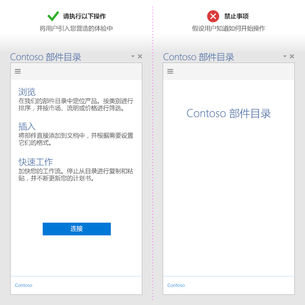
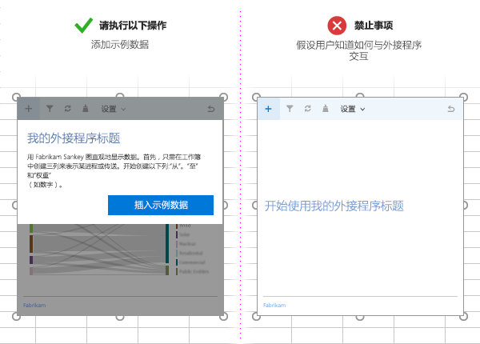

# Office 加载项开发最佳做法

有效的外接程序提供独特且极具吸引力的功能，采用具有视觉吸引力的方式扩展 Office 应用程序。若要创建出色的外接程序，需为用户提供极具吸引力的首次使用体验、设计一流的 UI 体验和优化外接程序的性能。将本文中描述的最佳实践应用于创建有助于您的用户快速有效地完成其任务的外接程序。

> [!NOTE]
> 如果计划将加载项[发布](../publish/publish.md)到 AppSource 并适用于 Office 体验，请务必遵循 [AppSource 验证策略](/office/dev/store/validation-policies)。例如，加载项必须适用于支持已定义方法的所有平台，才能通过验证（有关详细信息，请参阅[第 4.12 部分](/office/dev/store/validation-policies#4-apps-and-add-ins-behave-predictably)以及 [Office 加载项主机和可用性](../overview/office-add-in-availability.md)页面）。 

## 提供明确值

- 创建可帮助用户快速、高效地完成任务的外接程序。专注于对 Office 应用程序有用的方案。例如：
 - 使核心创作任务更快、更简单，且中断更少。
 - 在 Office 内启用新方案。
 - 在 Office 主机内嵌入补充服务。
 - 改善 Office 体验来提高工作效率。
- 通过[创建极具吸引力的首次运行体验](#create-an-engaging-first-run-experience)，确保用户能够快速明确加载项的价值。
- 创建[有效的 AppSource 一览](/office/dev/store/create-effective-office-store-listings)。在标题和说明中明确介绍加载项的优势。请勿依赖品牌来传达加载项的用途。

## 创建极具吸引力的首次运行体验

- 要用具有高可用性和直观性的首次体验吸引新用户。请注意，用户从商店下载外接程序之后，仍可决定是使用还是放弃该外接程序。

- 明确用户与您的外接程序交互所需执行的步骤。使用视频、泡沫垫、分页面板或其他资源来吸引用户。

- 在启动时强调您的外接程序的价值主张，而不只是让用户登录。

- 提供用以指导用户的教学 UI，并使您的 UI 富有个性化。

   

- 如果内容外接程序绑定到用户文档中的数据，请将那些用于向用户显示要使用的数据格式的示例数据或模板包含在内。

   

- 提供[免费试用版](/office/dev/store/decide-on-a-pricing-model)。如果加载项需要订阅，请让某些功能无需订阅也可使用。

- 让注册非常简单。预先填充某些信息（如电子邮件、显示名称），并跳过电子邮件验证。

- 避免弹出窗口。如果必须使用它们，请引导用户启用弹出窗口。

如需你在开发首次运行体验时可应用的模式，请参阅[适用于 Office 加载项的 UX 设计模式](../design/first-run-experience-patterns.md)。

## 使用加载项命令

- 使用加载项命令，为加载项提供相关 UI 入口点。有关详细信息（包括设计最佳做法），请参阅[加载项命令](../design/add-in-commands.md)。

## 应用用户体验设计原则

- 确保你的外接程序的外观和功能很好地补充了 Office 体验。使用 [Office UI Fabric](https://developer.microsoft.com/fabric)。

- 支持内容胜过支持部件版式。避免使用对用户体验毫无价值的不必要的 UI 元素。

- 保持用户处于可控状态。确保用户了解重要的决定，并且可以轻松地倒退外接程序执行的操作。

- 使用品牌唤起用户的信任感和亲切感。但不要过度使用品牌或向用户做广告推销。

- 避免滚动。优化为 1366 x 768 分辨率。

- 不包含未授权的图像。

- 在加载项中使用[简单明确的语言](../design/voice-guidelines.md)。

- 考虑辅助功能 - 方便所有用户都可以与加载项轻松交互，并提供屏幕阅读器等辅助技术。

- 针对所有平台和输入方法（包括鼠标/键盘和 [触摸](#optimize-for-touch)）的设计。确保 UI 可响应不同的外观设置。

### 触摸优化

- 使用 [Context.touchEnabled](/javascript/api/office/office.context) 属性检测运行加载项的主机应用是否已启用触控。

  > [!NOTE]
  > Outlook 不支持此属性。

- 确保所有控件都相应符合触控交互的尺寸大小。例如，按钮有足够大的触摸目标，且输入框要足够大，方便用户输入。

- 不依赖于诸如悬停或用鼠标右键单击等非触摸式输入方法。

- 确保外接程序可以在纵向和横向模式中正常工作。请注意在触控设备上，外接程序的一部分可能通过软键盘隐藏。

- 使用[旁加载](../testing/sideload-an-office-add-in-on-ipad-and-mac.md)在实际设备上测试加载项。

> [!NOTE]
> 若要对设计元素使用 [Office UI Fabric](https://github.com/OfficeDev/Office-UI-Fabric)，需要处理其中许多元素。

## 优化和监视加载项性能

- 创建快速 UI 响应的感觉。外接程序的加载时间应在 500 毫秒以内。

- 确保所有用户交互响应时长都在一秒内。

-  为长时间运行的操作提供加载指示器。

- 将 CDN 用于主机图像、资源和公用库。尽可能地从一个位置进行加载。

- 请按照标准 Web 实践来优化您的网页。在生产中，仅使用库的缩小版本。仅加载所需的资源，并优化加载资源的方式。

- 如果操作执行需要一段时间才能完成，请向用户提供反馈。请注意下表中列出的阈值。有关详细信息，请参阅 [Office 加载项的资源限制和性能优化](../concepts/resource-limits-and-performance-optimization.md)。

  |**交互类**|**目标**|**上限**|**人类感知**|
  |:-----|:-----|:-----|:-----|
  |即时|<=50 毫秒|100 毫秒|没有明显的延迟。|
  |快速|50-100 毫秒|200 毫秒|最小限度的明显延迟。不需要反馈。|
  |典型|100-300 毫秒|500 毫秒|较快，但不够快，不能称之为快速。不需要反馈。|
  |快速响应|300-500 毫秒|1 秒|不快，但仍然感觉反应灵敏。不需要反馈。|
  |连续|> 500 毫秒|5 秒|中等等待时间，不再感觉反应灵敏。可能需要反馈。|
  |受限|> 500 毫秒|10 秒|较长，但不足以执行其他操作。可能需要反馈。|
  |扩展|> 500 毫秒|> 10 秒|长到足以在等待时执行其他操作。可能需要反馈。|
  |长时间运行|> 5 秒|> 1 分钟|用户当然可以执行其他操作。|

- 监视您的服务运行状况，并使用遥测监视用户的成功。

## 加载项市场营销

- 将加载项发布到 [AppSource](/office/dev/store/submit-to-appsource-via-partner-center)，并在网站中[对它进行宣传](/office/dev/store/promote-your-office-store-solution)。创建[有效的 AppSource 一览](/office/dev/store/create-effective-office-store-listings)。

- 使用简洁且富有描述性的加载项标题。字符数不得超过 128 个。

- 为您的外接程序撰写简短且富有吸引力的描述。回答"此外接程序解决哪些问题？"这一问题。

- 在您的标题和说明中传达外接程序的价值主张。不要依赖于您的品牌。

- 创建有助于用户查找和使用加载项的网站。

## 另请参阅

- [Office 加载项平台概述](../overview/office-add-ins.md)
