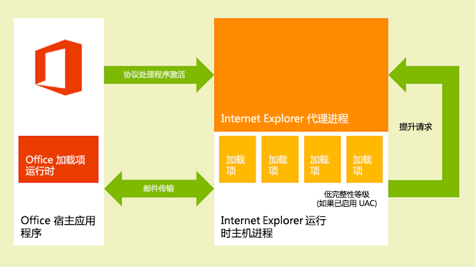
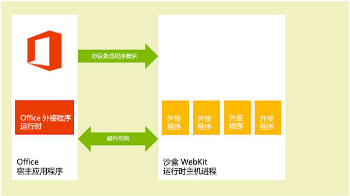
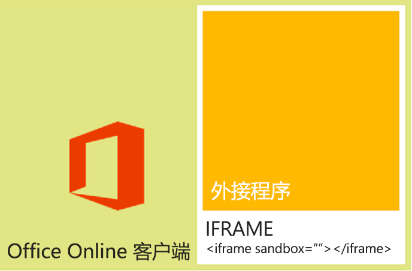

# <a name="privacy-and-security-for-office-add-ins"></a>Office 加载项的隐私和安全

## <a name="understanding-the-add-in-runtime"></a>了解加载项运行时

Office 外接程序受到外接程序运行时环境、多层权限模型和性能调控器的保护。 此框架通过以下方式保护用户的体验。

- 管理对 Office 客户端应用程序的 UI 帧的访问权限。

- 仅允许间接访问 Office 客户端应用程序的 UI 线程。

- 不允许模式交互，例如调用 JavaScript `alert`， `confirm`并且 `prompt` 不允许函数，因为它们是模式。

此外，运行时框架提供以下优势，以确保 Office 加载项不会损害用户的环境。

- 隔离运行加载项的进程。

- 不需要 .dll 或 .exe 替换项或 ActiveX 组件。

- 可以轻松安装和卸载加载项。

此外，还可以调控 Office 外接程序使用的内存、CPU 和网络资源，以确保维持良好的性能和可靠性。

以下部分简要介绍了运行时体系结构如何支持在基于 Windows 的设备、Mac OS X 设备和 Web 浏览器上的 Office 客户端中运行加载项。

### <a name="clients-on-windows-and-os-x-devices"></a>Windows 和 OS X 设备上的客户端

在支持的台式机和平板电脑设备的客户端（如 Windows 版 Excel、Windows 版 Outlook 和 Mac 版 Outlook）中，通过集成进程内组件 Office 加载项运行时来支持 Office 加载项，该组件管理加载项的生命周期，并实现加载项和客户端应用程序之间的互操作性。加载项网页本身托管在进程外。如图 1 中所示，在 Windows 台式机或平板电脑设备上，[加载项网页托管在 Internet Explorer 或 Microsoft Edge 控件内部](browsers-used-by-office-web-add-ins.md)，而 Internet Explorer 控件托管在加载项运行时进程内部，提供安全和性能隔离。

在 Windows 桌面设备上，必须为受限网站区域启用 Internet Explorer 保护模式。通常情况下，此模式默认启用。如果禁用，则会在尝试启动加载项时[看到错误消息](/office/troubleshoot/office-suite-issues/apps-for-office-not-start)。

*图 1.基于 Windows 的台式机和平板电脑客户端中的 Office 外接程序运行时环境*



如下图所示，在 Mac OS X 桌面上，外接程序网页托管在沙盒 WebKit 运行时主机进程中，这有助于提供类似的安全级别和性能保护。

*图 2.Mac OS X 客户端中的 Office 外接程序运行时环境*



Office 外接程序运行时管理进程间通信、JavaScript API 调用和事件到本机调用和事件的转换以及 UI 远程处理支持，从而使加载项能够呈现在文档内、任务窗格中或电子邮件、会议请求或约会旁边。

### <a name="web-clients"></a>Web 客户端

在支持的 Web 客户端中，Office 外接程序托管在使用 HTML5 **沙盒** 属性运行的 **iframe** 中。 不允许使用 ActiveX 组件或导航 Web 客户端主页。 通过集成适用于 Office 的 JavaScript API 在 Web 客户端中实现 Office 外接程序支持。 同理，对于桌面客户端应用程序，JavaScript API 管理加载项生命周期和加载项与 Web 客户端间的互操作性。 这种互操作性通过特殊的跨框架发布消息通信基础结构实现。 桌面客户端上使用的同一 JavaScript 库 (Office.js) 可用来与 Web 客户端交互。 下图显示了支持在浏览器中运行的 Office 中的外接程序的基础结构，以及支持这些加载项所需的 Web 客户端、 **iframe**、Office 外接程序运行时和适用于 Office) 的 JavaScript API (相关组件。

*图 3：支持 Office Web 客户端中 Office 加载项的基础结构*



## <a name="add-in-integrity-in-appsource"></a>AppSource 中的加载项完整性

若要向受众提供 Office 加载项，可以在 AppSource 中发布它们。 AppSource 强制执行以下措施来维护加载项的完整性。

- 要求 Office 加载项的主机服务器始终使用安全套接字层 (SSL) 进行通信。

- 要求开发人员在提交加载项时提供身份证明、合约协议和适合的隐私策略。

- 支持针对可用加载项的用户审阅系统以推广自我管理的社区。

## <a name="optional-connected-experiences"></a>可选连接体验

最终用户和 IT 管理员可在 Office 桌面和移动客户端中关闭[可选的已连接体验](/deployoffice/privacy/optional-connected-experiences)。 对于 Office 外接程序，禁用 **可选连接体验** 设置的影响是用户无法再通过这些客户端访问加载项或 Office 应用商店。 但是，某些被视为重要或业务关键型的 Microsoft 加载项以及组织 IT 管理员通过 [集中部署](/microsoft-365/admin/manage/centralized-deployment-of-add-ins) 部署的加载项仍将可用。 此外，无论设置的状态如何，外接程序和应用商店在Outlook 网页版中都保持可用。

有关特定于 Outlook 的行为的详细信息，请参阅 [Outlook 加载项的隐私、权限和安全性](../outlook/privacy-and-security.md#optional-connected-experiences)。

请注意，如果 IT 管理员禁 [用 Office 中的连接体验](/deployoffice/privacy/manage-privacy-controls#policy-setting-for-most-connected-experiences)，则它对加载项的影响与关闭可选连接体验的效果相同。

## <a name="addressing-end-users-privacy-concerns"></a>解决最终用户的隐私问题

此部分从客户（最终用户）的角度出发介绍了 Office 外接程序平台提供的保护，并介绍了有关如何达到用户的预期以及如何安全处理用户个人身份信息 (PII) 的指南。

### <a name="end-users-perspective"></a>从最终用户的角度出发

Office 加载项是使用浏览器控件或 **iframe** 中运行的 Web 技术而生成。因此，使用加载项与转到 Internet 或 Intranet 上的网站类似。加载项可以位于组织外部（如果从 AppSource 获取加载项的话），也可以位于组织内部（如果从 Exchange Server 加载项目录、SharePoint 应用目录或组织网络上的文件共享获取加载项的话）。加载项对网络的访问权限受限，大部分加载项都可以对活动文档或邮件项执行读取或写入操作。在用户或管理员安装或启动加载项前，加载项平台就施加了特定约束。不过，与任何扩展性模型一样，用户在启动未知加载项之前应非常谨慎。

> [!NOTE]
> 首次加载加载项时，用户可能会看到安全提示来信任域。 如果外接程序的域主机在本地或Office Online Server的 Exchange 域之外，则会发生这种情况。

外接程序平台通过以下方式解决最终用户的隐私问题。

- 与托管内容、Outlook 或任务窗格外接程序的 Web 服务器通信的数据以及外接程序与其使用的任何 Web 服务之间的通信必须使用安全套接字层 (SSL) 协议加密。

- 安装 AppSource 中的加载项前，用户可以查看相应加载项的隐私策略和要求。此外，与用户邮箱进行交互的 Outlook 加载项还指明了所需的特定权限；用户可以在安装 Outlook 加载项前，先查看使用条款、请求的权限和隐私策略。

- 在共享一个文档时，用户也会共享已插入该文档或与该文档关联的加载项。 如果用户打开包含用户以前未使用的外接程序的文档，则 Office 客户端应用程序会提示用户授予在文档中运行外接程序的权限。 在组织环境中，如果文档来自外部源，Office 客户端应用程序也会提示用户。

- 用户可启用或禁用对 AppSource 的访问。 对于内容和任务窗格加载项，用户从托管 Office 客户端上 **信任中心** 管理对受信任加载项和目录的访问权限 (从 **文件** > **选项** > **信任中心信任中心** > 设置 > **受信任的加载项目录**) 打开。 在 Outlook 中，用户可以通过选择 **“获取加载项”** 来管理加载项。

  - 在 Outlook on Windows 中，从功能区中选择 **“更多应用** ”，然后选择 **“获取加载项**”。
  - 在 Outlook on Mac 中，从功能区中选择省略号按钮 (`...`) ，然后选择 **“获取加载项**”。
  - 在Outlook 网页版中，从功能区 **中选择“获取加载项**”。

  管理员还可以 [使用组](/previous-versions/office/office-2013-resource-kit/jj219429(v=office.15)#using-group-policy-to-manage-how-users-can-install-and-use-apps-for-office)策略管理此访问权限。

- 外接程序平台的设计通过以下方式为最终用户提供安全性和性能。

  - Office 外接程序在 Web 浏览器控件中运行，该控件托管在独立于 Office 客户端应用程序的外接程序运行时环境中。 此设计提供与客户端应用程序的安全性和性能隔离。

  - 在 Web 浏览器控件中运行可允许加载项完成在浏览器中运行的常规网页可执行的所有操作，但同时将限制加载项遵守针对域隔离和安全区域的同源策略。

Outlook 外接程序通过特定的资源使用率监视提供额外安全和性能功能。有关详细信息，请参阅 [Outlook 外接程序的隐私、权限和安全性](../outlook/privacy-and-security.md)。

### <a name="developer-guidelines-to-handle-pii"></a>开发人员处理 PII 的准则

下面列出了作为 Office 外接程序开发人员的一些特定 PII 保护指南。

- [Settings](/javascript/api/office/office.settings) 对象旨在保存内容加载项或任务窗格加载项的会话之间的加载项设置和状态数据，但不会在 **Settings** 对象中存储密码和其他敏感 PII。最终用户无法查看 **Settings** 对象中的数据，但该数据存储为文档的易于访问的文件格式的一部分。你应该限制加载项对 PII 的使用，并将加载项所需的任何 PII 存储在将加载项作为用户保护的资源托管的服务器上。

- 使用某些应用程序可能会泄露 PII。请确保安全地存储用户的身份、位置、访问时间和任何其他凭据数据，以便该加载项的其他用户无法访问该数据。

- 如果加载项已在 AppSource 中发布，HTTPS 的 AppSource 要求会保护 Web 服务器与客户端计算机或设备之间传输的 PII。不过，如果将此类数据重新传输到其他服务器，请务必遵守相同级别的保护要求。

- 如果存储用户的 PII，请务必向用户提示这一点，并向用户提供检查和删除此类信息的方法。如果将加载项提交到 AppSource，可以在隐私声明中概述所收集的数据及其用途。

## <a name="developers-permission-choices-and-security-practices"></a>开发人员的权限选择和安全做法

遵循这些常规指南以支持 Office 外接程序的安全模型，并进一步了解有关每种加载项类型的更多详细信息。

### <a name="permissions-choices"></a>权限选择

加载项平台中提供了一个权限模型，供加载项用于声明实现其功能所需的对用数据的访问级别。 每个权限级别对应适用于 Office 的 JavaScript API 的子集，加载项通过这些权限级别实现其功能。 例如，内容和任务窗格外接程序的 **WriteDocument** 权限允许访问 [Document.setSelectedDataAsync](/javascript/api/office/office.document) 方法，该方法允许外接程序写入用户文档，但不允许访问任何用于从文档读取数据的方法。 此权限级别对于只需要对文档执行写入操作的加载项很有用，例如用户可以查询要插入到其文档的数据的加载项。

作为最佳做法，应该根据 *最小特权* 原则请求权限。 也就是说，应该请求仅可访问加载项正常运行所需的 API 最小子集的权限。 For example, if your add-in needs only to read data in a user's document for its features, you should request no more than the **ReadDocument** permission. (But, keep in mind that requesting insufficient permissions will result in the add-in platform blocking your add-in's use of some APIs and will generate errors at run time.)

在外接程序清单中指定权限，如以下部分中的示例所示，最终用户在决定首次安装或激活外接程序之前，可以看到外接程序的请求权限级别。 此外，请求 **ReadWriteMailbox** 权限的 Outlook 加载项需要显式管理员权限才能安装。

以下示例演示任务窗格外接程序如何在其清单中指定 **ReadDocument** 权限。 为重点关注权限，清单中的其他元素将不显示。

```xml
<?xml version="1.0" encoding="utf-8"?>
<OfficeApp xmlns="http://schemas.microsoft.com/office/appforoffice/1.0"
           xmlns:xsi="http://www.w3.org/2001/XMLSchema-instance" 
           xmlns:ver="http://schemas.microsoft.com/office/appforoffice/1.0"
           xsi:type="TaskPaneApp">

... <!-- To keep permissions as the focus, not displaying other elements. -->
  <Permissions>ReadDocument</Permissions>
...
</OfficeApp>
```

有关任务窗格和内容加载项的权限的详细信息，请参阅[在加载项中请求获取 API 使用权限](../develop/requesting-permissions-for-api-use-in-content-and-task-pane-add-ins.md)。

有关 Outlook 加载项权限的详细信息，请参阅以下主题。

- [Outlook 外接程序的隐私、权限和安全性](../outlook/privacy-and-security.md)

- [了解 Outlook 外接程序权限](../outlook/understanding-outlook-add-in-permissions.md)

### <a name="same-origin-policy"></a>同源策略

由于 Office 加载项是在 Web 浏览器控件中运行的网页，因此它们必须遵循浏览器强制实施的同源策略。 默认情况下，一个域中的网页无法对另一个域进行 [XmlHttpRequest](https://www.w3.org/TR/XMLHttpRequest/) Web 服务调用，而非托管该域的域。

克服此限制的一种方法是使用 JSON/P - 通过包含指向另一个域上托管的某个 **脚本****的 src 属性的** 脚本标记来为 Web 服务提供代理。 你可以编程方式创建 **script** 标记，动态创建 **src** 属性所指向的 URL，并通过 URI 查询参数将参数传递到 URL。 Web 服务提供程序在特定的 URL 位置创建和托管 JavaScript 代码，并根据 URI 查询参数返回不同的脚本。 这些脚本然后在插入位置执行并按照预期的方式工作。

以下是 Outlook 外接程序示例中的 JSON/P 的示例。

```js
// Dynamically create an HTML SCRIPT element that obtains the details for the specified video.
function loadVideoDetails(videoIndex) {
    // Dynamically create a new HTML SCRIPT element in the webpage.
    const script = document.createElement("script");
    // Specify the URL to retrieve the indicated video from a feed of a current list of videos,
    // as the value of the src attribute of the SCRIPT element. 
    script.setAttribute("src", "https://gdata.youtube.com/feeds/api/videos/" + 
        videos[videoIndex].Id + "?alt=json-in-script&amp;callback=videoDetailsLoaded");
    // Insert the SCRIPT element at the end of the HEAD section.
    document.getElementsByTagName('head')[0].appendChild(script);
}
```

Exchange 和 SharePoint 提供了客户端代理以实现跨域访问。通常，Intranet 上的同源策略没有 Internet 上的同源策略那样严格。有关详细信息，请参阅[同源策略第 1 部分：不准偷看](/archive/blogs/ieinternals/same-origin-policy-part-1-no-peeking)和[解决 Office 加载项中的同源策略限制](../develop/addressing-same-origin-policy-limitations.md)。

### <a name="tips-to-prevent-malicious-cross-site-scripting"></a>防止恶意跨站点脚本的提示

恶意用户可能会通过文档或加载项中的字段输入恶意脚本，以此来攻击加载项源。 开发人员应处理用户输入以避免在其域中执行恶意用户的 JavaScript。 下面是处理文档或邮件或加载项中的字段中的用户输入的一些好做法。

- 根据需要使用 [innerText](https://developer.mozilla.org/docs/Web/API/Element/innerHTML) 和 [textContent](https://developer.mozilla.org/docs/Web/API/Node/innerText) 属性，而非 DOM 属性 [innerHTML](https://developer.mozilla.org/docs/DOM/Node.textContent)。 为 Internet Explorer 和 Firefox 跨浏览器支持执行以下操作。

    ```js
     var text = x.innerText || x.textContent
    ```

    有关 **innerText** 和 **textContent** 之间的差异的信息，请参阅 [Node.textContent](https://developer.mozilla.org/docs/DOM/Node.textContent)。 有关常见浏览器间 DOM 兼容性的详细信息，请参阅 [W3C DOM 兼容性 - HTML](https://www.quirksmode.org/dom/w3c_html.html#t07)。

- 如果必须使用 **innerHTML**，请确保用户的输入不包含恶意内容，然后再将其传递给 **innerHTML**。 有关详细信息以及如何安全使用 **innerHTML** 的示例，请参阅 [innerHTML](https://developer.mozilla.org/docs/Web/API/Element/innerHTML) 属性。

- 如果要使用 jQuery，请使用 [.text()](https://api.jquery.com/text/) 方法，而非 [.html()](https://api.jquery.com/html/) 方法。

- 使用 [toStaticHTML](https://developer.mozilla.org/docs/Web/HTML/Reference) 方法可在将用户输入传递到 **innerHTML** 之前删除用户输入中的所有动态 HTML 元素和属性。

- 使用 [encodeURIComponent](https://developer.mozilla.org/docs/Web/JavaScript/Reference/Global_Objects/encodeuricomponent) 或 [encodeURI](https://developer.mozilla.org/docs/Web/JavaScript/Reference/Global_Objects/encodeuri) 函数可对应为来自用户输入或包含用户输入的 URL 的文本进行编码。

- 有关创建更安全的 Web 解决方案的更多最佳做法，请参阅[开发安全加载项](/previous-versions/windows/apps/hh849625(v=win.10))。

### <a name="tips-to-prevent-clickjacking"></a>防止“点击劫持”的提示

由于使用 Office 客户端应用程序在浏览器中运行时，Office 加载项会在 iframe 中呈现，因此请使用以下提示来最大程度地降低 [点击劫持](https://en.wikipedia.org/wiki/Clickjacking) 的风险，这是黑客用来欺骗用户泄露机密信息的方法。

首先，确定您的加载项可以执行的敏感操作。其中包括未授权的用户可能恶意使用的任何操作，如启动金融交易或发布敏感数据。例如，您的加载项可能让用户将款项发送到用户定义的接收人。

其次，对于敏感操作，你的加载项应在执行操作之前向用户确认。该确认应详细说明该操作将产生的影响。此外，如有必要，还应详细说明用户如何能够防止该操作，是通过选择标记为“不允许”的特定按钮，还是忽略确认。

第三，为了确保没有任何潜在的攻击者可以隐藏或掩盖确认，您应将其显示在加载项上下文以外（即，不在 HTML 对话框中）。

下面是有关如何获得确认的一些示例。

- 向用户发送包含确认链接的电子邮件。

- 向用户发送短信，其中包含用户可在外接程序中输入的确认码。

- 对于无法应用 iframe 的页面，在新浏览器窗口中打开确认对话框。这通常是登录页采用的模式。使用[对话框 API](../develop/dialog-api-in-office-add-ins.md) 新建对话框。

此外，请确保您用于与用户联系的地址不能由潜在的攻击者提供。例如，对于付款确认，使用经授权用户帐户的文件中的地址。

### <a name="other-security-practices"></a>其他安全实践

开发人员还应注意以下安全做法。

- 开发人员不得在 Office 加载项中使用 ActiveX 控件，因为 ActiveX 控件不支持加载项平台的跨平台特性。

- 内容和任务窗格加载项假定浏览器默认使用的相同 SSL 设置，并允许大多数内容仅由 SSL 传送。 Outlook 外接程序要求所有内容都通过 SSL 交付。 开发人员必须在外接程序清单的元素中 **\<SourceLocation\>** 指定使用 HTTPS 的 URL，以确定外接程序的 HTML 文件的位置。

  为了确保加载项不使用 HTTP 传送内容，开发人员在测试外接程序时应确保在 **控制面板** 中的 **Internet 选项** 中选择了以下设置，并且测试方案中不会显示安全警告。

  - 确保针对“Internet”区域的安全设置“显示混合内容”设置为“提示”。 为此，可在 **“Internet 选项**”中选择以下内容：在 **“安全** ”选项卡上，选择 **“Internet** ”区域，选择 **“自定义”级别**，滚动查找 **“显示混合内容**”，然后选择“ **提示** ”（如果尚未选择）。

  - 确保在“Internet 选项”对话框的“高级”选项卡中，选中了“在安全和非安全模式之间转换时发出警告”。

- 为了确保加载项不使用过多的 CPU 内核或内存资源且不导致客户端计算机上出现任何拒绝服务的情况，加载项平台建立了资源使用率限制。作为测试的一部分，开发人员应验证加载项平台是否遵循了资源使用率限制。

- 在发布加载项之前，开发人员应确保在其加载项文件中公开的任何个人身份信息是安全的。

- 开发人员不应嵌入用于从 Microsoft 和其他 (（如必应、Google 或 Facebook）访问 API 或服务的密钥，这些密钥直接在加载项的 HTML 页面中) 。 相反，他们应该创建自定义 Web 服务或安全 Web 存储的其他某些窗体中创建自定义 Web 服务，他们可以调用这些服务，将键值传递到加载项。

- 开发人员在将加载项提交到 AppSource 时应执行以下操作。

  - 在支持 SSL 的 Web 服务器上托管要提交的加载项。
  - 制定概述遵从性隐私策略的声明。
  - 准备好在提交加载项后签订合约协议。

除资源使用率规则之外，Outlook 外接程序的开发人员还应确保其外接程序遵守有关指定激活规则和使用 JavaScript API 的限制。有关详细信息，请参阅[激活限制和适用于 Outlook 外接程序的 JavaScript API](../outlook/limits-for-activation-and-javascript-api-for-outlook-add-ins.md)。

## <a name="it-administrators-control"></a>IT 管理员控制

在企业设置中，对于启用或禁用对 AppSource 和任何专用目录的访问权限，IT 管理员拥有最高权限。

Office 设置的管理和执行由组策略设置完成。 这些操作可通过 [Office 部署工具](/deployoffice/overview-of-the-office-2016-deployment-tool)和 [Office 自定义工具](/deployoffice/overview-of-the-office-customization-tool-for-click-to-run)进行配置。

| 设置名称 | 说明 |
|--------------|-------------|
| 允许不安全的 Web 加载项和目录 | 允许用户运行非安全的 Office 加载项，这些外接程序是 Office 加载项，其网页或目录位置不受 SSL 保护 (https：//) 并且不在用户的 Internet 区域中。 |
| 阻止 Web 加载项 | 允许用户运行使用 Web 技术的 Office 加载项。 |
| 阻止 Office 应用商店 |  允许你阻止用户获取或运行来自 Office 应用商店的 Office 加载项。 |

> [!IMPORTANT]
> 如果你的工作组正在使用 Office 的多个版本，则必须为每个版本配置组策略设置。 要详细了解针对 Office 2013 的组策略设置，请参阅 [Office 2013 相关应用概述](/previous-versions/office/office-2013-resource-kit/jj219429(v%3doffice.15))一文中的[使用组策略来管理用户可如何安装和使用 Office 相关应用](/previous-versions/office/office-2013-resource-kit/jj219429(v=office.15)#using-group-policy-to-manage-how-users-can-install-and-use-apps-for-office)。

## <a name="see-also"></a>另请参阅

- [在加载项中请求获取 API 使用权限](../develop/requesting-permissions-for-api-use-in-content-and-task-pane-add-ins.md)
- [Outlook 外接程序的隐私、权限和安全性](../outlook/privacy-and-security.md)
- [了解 Outlook 外接程序权限](../outlook/understanding-outlook-add-in-permissions.md)
- [Outlook 外接程序的激活和 JavaScript API 限制](../outlook/limits-for-activation-and-javascript-api-for-outlook-add-ins.md)
- [解决 Office 外接程序中的同源策略限制](../develop/addressing-same-origin-policy-limitations.md)
- [同源策略](https://www.w3.org/Security/wiki/Same_Origin_Policy)
- [同源策略第 1 部分：不准偷看](/archive/blogs/ieinternals/same-origin-policy-part-1-no-peeking)
- [针对 JavaScript 的同源策略](https://developer.mozilla.org/docs/Web/Security/Same-origin_policy)
- [IE 保护模式](/office/troubleshoot/office-suite-issues/apps-for-office-not-start)
- [Microsoft 365 应用的隐私控制](/deployoffice/privacy/overview-privacy-controls)
