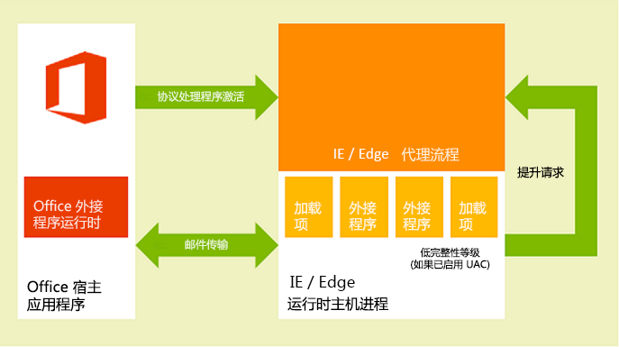

# <a name="privacy-and-security-for-office-add-ins"></a>Office ?????????

## <a name="understanding-the-add-in-runtime"></a>????????

Office ????????????????????????????????????????????????? 

- ?????????? UI ??????

- ???????????? UI ???

- ???????????????? JavaScript **alert**?**confirm** ? **prompt** ?????????????

??????? Office ?????????????????????????

- ???????????

- ??? .dll ? .exe ???? ActiveX ???

- ?????????????

???????? Office ??????????CPU ????????????????????? 

??????????? Windows ?????OS X Mac ????? Web ?? Office Online ????????????????? Office ??????????

> **??**???????? WIP ? Intune ? Office ???????????[?? WIP ? Intune ???? Office ????????????](https://docs.microsoft.com/en-us/microsoft-365-enterprise/office-add-ins-wip)?

### <a name="clients-for-windows-and-os-x-devices"></a>??? Windows ? OS X ??????

???????????????????? Excel?Outlook ???? Mac ? Outlook???????????? Office ?????????? Office ???????????????????????????????????????????????????????????? 1 ????? Windows ????????????????????? Internet Explorer ?????? Internet Explorer ???????????????????????????

? Windows ????????????????? Internet Explorer ????????????????????????????????????[??????](https://support.microsoft.com/en-us/help/2761180/apps-for-office-don-t-start-if-you-disable-protected-mode-for-the-restricted-sites-zone-in-internet-explorer)?

*? 1.?? Windows ?????????????? Office ?????????*



??????? OS X Mac ??????????????? WebKit ????????????????????????????? 

*? 2?OS X Mac ????? Office ????????*


Office ???????????????JavaScript API ?????????????????? UI ???????????????????????????????????????????

### <a name="web-clients"></a>Web ???

???? Web ????? Excel Online ? Outlook Web App???Office ???????? HTML5 **sandbox** ????? **iframe** ?????? ActiveX ????? Web ???????Web ?????????? Office ? JavaScript API??? Office ??????JavaScript API ???????????????? Web ????????????????????????????????????????????????????????????????????? JavaScript ? (Office.js) ???? Web ??????????????? Office Online ? Office ???????????????????????????????????Web ????**iframe**?Office ?????????? Office ? JavaScript API??

*? 3??? Office Web ???? Office ????????*


## <a name="add-in-integrity-in-appsource"></a>AppSource ????????

??????? Office ??????? AppSource ??????AppSource ??????????????????


- ?? Office ??????????????????? (SSL) ?????

- ?????????????????????????????????

- ?????????????????

- ???????????????????????????

## <a name="addressing-end-users-privacy-concerns"></a>???????????

???????????????????? Office ??????????????????????????????????????????? (PII) ????

### <a name="end-users-perspective"></a>??????????

Office ???????????? **iframe** ???? Web ????????????????? Internet ? Intranet ?????????????????????? AppSource ?????????????????????? Exchange Server ??????SharePoint ??????????????????????????????????????????????????????????????????????????????????????????????????????????????????????????????????

?????????????????????????

- ??????Outlook ?????????? Web ????????????????????? Web ????????????????? (SSL) ?????

- ?? AppSource ???????????????????????????????????????? Outlook ?????????????????????? Outlook ????????????????????????

- ??????????????????????????????????????????????????????????????????????????????????????????????????????? Office ?????????????

- ?????????? AppSource ????????????????????????? Office ???????????****???????**** > ????**** > ??????**** > ????????**** > ???????????****????????????????????????? Outlook ???????????????????****??????????????? Outlook for Windows ??????????**** > ???????****?? Outlook for Mac ?????????????????****???? Outlook Web App ??????????****????????>???????****?????????[?????](http://technet.microsoft.com/en-us/library/jj219429.aspx#BKMK_Managing)????????

- ?????????????????????????????

  - Office ??????????? Office ????????????????? Web ???????????????????????????????

  - ? Web ????????????????????????????????????????????????????????????????

Outlook ?????????????????????????????????????? [Outlook ??????????????](https://docs.microsoft.com/en-us/outlook/add-ins/privacy-and-security)?

### <a name="developer-guidelines-to-handle-pii"></a>?????? PII ???

????[???????????????????](http://technet.microsoft.com/en-us/library/gg447064.aspx)??? IT ???????????? PII ???????????? Office ????????????? PII ?????

- [Settings](https://dev.office.com/reference/add-ins/shared/settings) ???????????????????????????????????????? **Settings** ???????????? PII????????? **Settings** ???????????????????????????????????????? PII ?????????????? PII ????????????????????????

- ????????????? PII???????????????????????????????????????????????????

- ??????? AppSource ????HTTPS ? AppSource ????? Web ?????????????????? PII?????????????????????????????????????

- ??????? PII????????????????????????????????????????? AppSource??????????????????????

## <a name="developers-permission-choices-and-security-practices"></a>??????????????

??????????? Office ?????????????????????????????????

### <a name="permissions-choices"></a>????

????????????????????????????????????????????? ????????????????????????? Office ? JavaScript API ???? ??????????????? ** WriteDocument**  ?????? [ Document.setSelectedDataAsync](https://dev.office.com/reference/add-ins/shared/document.setselecteddataasync) ????????????????????????????????????????? ??????????????????????????????????????????????

??????????_????_???????????????????????? API ????????????????????????????????????????????**ReadDocument**???????????????????????????????????????? API ???????????

?????????????????????????????????????????????????????????????????? **ReadWriteMailbox** ??? Outlook ???????????????????

?????????????????????? **ReadDocument** ????????????????????????

```xml
<?xml version="1.0" encoding="utf-8"?>
<OfficeApp xmlns="http://schemas.microsoft.com/office/appforoffice/1.0"
           xmlns:xsi="http://www.w3.org/2001/XMLSchema-instance" 
           xmlns:ver="http://schemas.microsoft.com/office/appforoffice/1.0"
           xsi:type="TaskPaneApp">

... <!-- To keep permissions as the focus, not displaying other elements. -->
  <Permissions>ReadDocument</Permissions>
...
</OfficeApp>
```

??????????????????????[???????????????? API ????](https://docs.microsoft.com/en-us/office/dev/add-ins/develop/requesting-permissions-for-api-use-in-content-and-task-pane-add-ins)?

?????? Outlook ??????????????

- [Outlook ????????????](https://docs.microsoft.com/outlook/add-ins/privacy-and-security)

- [?? Outlook ??????](https://docs.microsoft.com/outlook/add-ins/understanding-outlook-add-in-permissions)

### <a name="same-origin-policy"></a>????

?? Office ?????? Web ?????????????????????????????????????????????????????????????? [XmlHttpRequest](http://www.w3.org/TR/XMLHttpRequest/) Web ?????

????????????? JSON/P - ?????????????????????? **src** ??? **script** ???? Web ???????????????? **script** ??????? **src** ?????? URL???? URI ?????????? URL?Web ????????????? URL ?? JavaScript ??????? URI ?????????????????????????????????????

??? Outlook ???????? JSON/P ???? 

```js
// Dynamically create an HTML SCRIPT element that obtains the details for the specified video.
function loadVideoDetails(videoIndex) {
    // Dynamically create a new HTML SCRIPT element in the webpage.
    var script = document.createElement("script");
    // Specify the URL to retrieve the indicated video from a feed of a current list of videos,
    // as the value of the src attribute of the SCRIPT element. 
    script.setAttribute("src", "https://gdata.youtube.com/feeds/api/videos/" + 
        videos[videoIndex].Id + "?alt=json-in-script&amp;callback=videoDetailsLoaded");
    // Insert the SCRIPT element at the end of the HEAD section.
    document.getElementsByTagName('head')[0].appendChild(script);
}
```

Exchange ? SharePoint ???????????????????Intranet ???????? Internet ?????????????????????[????? 1 ???????](http://blogs.msdn.com/b/ieinternals/archive/2009/08/28/explaining-same-origin-policy-part-1-deny-read.aspx)?[?? Office ???????????](../develop/addressing-same-origin-policy-limitations.md)?

### <a name="tips-to-prevent-malicious-cross-site-scripting"></a>????????????

???????????????????????????????????? ???????????????????????????JavaScript? ????????????????????????????????????


- ?????? [innerText](http://msdn.microsoft.com/en-us/library/ie/ms533897.aspx) ? [textContent](https://msdn.microsoft.com/library/ms533899.aspx) ????? DOM ?? [innerHTML](https://developer.mozilla.org/en-US/docs/DOM/Node.textContent)????????? Internet Explorer ? Firefox ???????

    ```js
     var text = x.innerText || x.textContent
    ```

    ?? **innerText** ? **textContent** ??????????? [Node.textContent](https://developer.mozilla.org/en-US/docs/DOM/Node.textContent)????????? DOM ???????????? [W3C DOM ??? - HTML](http://www.quirksmode.org/dom/w3c_html.html#t07)?

- ??????? **innerHTML**??????????? **innerHTML** ?????????????????????????????? **innerHTML** ??????? [innerHTML](http://msdn.microsoft.com/en-us/library/ie/ms533897.aspx) ???

- ????? jQuery???? [.text()](http://api.jquery.com/text/) ????? [.html()](http://api.jquery.com/html/) ???

- ?? [toStaticHTML](http://msdn.microsoft.com/en-us/library/ie/cc848922.aspx) ???????????? **innerHTML** ?????????????? HTML ??????

- ?? [encodeURIComponent](http://msdn.microsoft.com/en-us/library/8202bce6-1342-40dc-a5ef-ac6d210a7d15.aspx) ? [encodeURI](http://msdn.microsoft.com/en-us/library/17bab5a2-bcd4-46c2-8b52-b2b5a0ed98a3.aspx) ???????????????????? URL ????????

- ???????? Web ???????????????[???????](http://msdn.microsoft.com/en-us/library/windows/apps/hh849625.aspx)?

### <a name="tips-to-prevent-clickjacking"></a>???????????

?? Office ????? Office Online ????????????????? iframe ??????????????[????](http://en.wikipedia.org/wiki/Clickjacking)?????????????????????????

?????????????????????????????????????????????????????????????????????????????????????

???????????????????????????????????????????????????????????????????????????????????????????????????

??????????????????????????????????????????????? HTML ??????

???????????????

- ?????????????????

- ????????????????????????????

- ?????? iframe ???????????????????????????????????[??? API](../develop/dialog-api-in-office-add-ins.md) ??????

????????????????????????????????????????????????????????

### <a name="other-security-practices"></a>??????

???????????????


- ??????? Office ?????? ActiveX ????? ActiveX ?????????????????

- ???????????? Internet Explorer ??????? SSL ?????????????? SSL ???Outlook ???????????? SSL ???????????????? **SourceLocation** ??????? HTTPS ? URL???????? HTML ?????

    ?????????? HTTP ????????????????????? Internet Explorer ????????????????????????

    - ?????**Internet**?????????**??????**?????**??**??????? Internet Explorer ????????????????**Internet ??**??????**??**?????????**Internet**?????????**?????**???????**??????**?????**??**?????????

    - ????Internet ???****????????****????????????????????????????****?

- ????????????? CPU ????????????????????????????????????????????????????????????????????????????????

- ????????????????????????????????????????

- ????????????????? HTML ???????? API ?????? Bing?Google ? Facebook????????????????? Web ????? Web ??????????????? Web ????????????????????????

- ????????????? AppSource ????????

  - ??? SSL ? Web ??????????????
  - ???????????????
  - ?????????????????

???????????Outlook ??????????????????????????????? JavaScript API ??????????????[???????? Outlook ????? JavaScript API](http://msdn.microsoft.com/library/e0c9e3d0-517e-4333-b8bd-e169c51a07f6.aspx)?

## <a name="it-administrators-control"></a>IT ?????

??????????????? AppSource ?????????????IT ??????????

## <a name="see-also"></a>????

- [???????????????? API ????](http://msdn.microsoft.com/library/da2efadc-4ebf-45fe-be39-397ac1eb1dbd.aspx)
- [Outlook ??????????????](http://msdn.microsoft.com/library/44208fc4-05d4-42d8-ab20-faa89624de1c.aspx)
- [?? Outlook ??????](https://docs.microsoft.com/en-us/outlook/add-ins/understanding-outlook-add-in-permissions)
- [Outlook ???????? JavaScript API ??](http://msdn.microsoft.com/library/e0c9e3d0-517e-4333-b8bd-e169c51a07f6.aspx)
- [?? Office ????????????](http://msdn.microsoft.com/library/36c800ae-1dda-4ea8-a558-37c89ffb161b.aspx)
- [????](http://www.w3.org/Security/wiki/Same_Origin_Policy)
- [????? 1 ???????](http://blogs.msdn.com/b/ieinternals/archive/2009/08/28/explaining-same-origin-policy-part-1-deny-read.aspx)
- [?? JavaScript ?????](https://developer.mozilla.org/En/Same_origin_policy_for_JavaScript)
- [IE ????](https://support.microsoft.com/en-us/help/2761180/apps-for-office-don-t-start-if-you-disable-protected-mode-for-the-restricted-sites-zone-in-internet-explorer)
