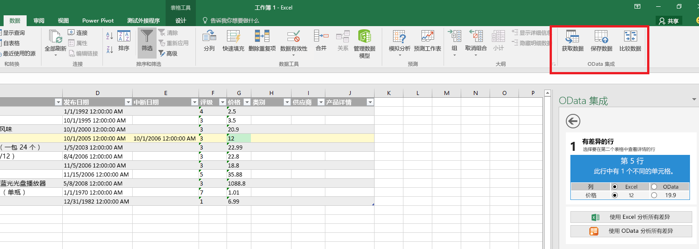
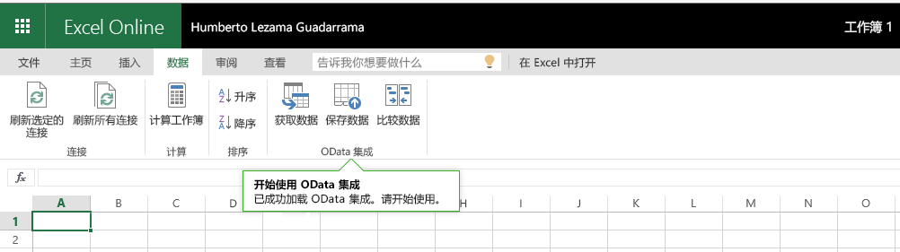
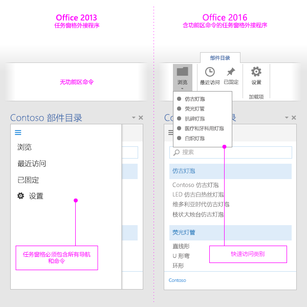

# Excel、PowerPoint 和 Word 的加载项命令

外接程序命令是 UI 元素，可扩展 Office UI，并在外接程序中启动操作。使用外接程序命令，可以在功能区上添加按钮，也可以向上下文菜单添加项。当用户选择外接程序命令时，将启动操作，如运行 JavaScript 代码或在任务窗格中显示外接程序页面。外接程序命令可帮助用户查找和使用外接程序，从而提高外接程序的采用率和重用率以及客户保留率。

有关此功能的概述，请观看视频 [Office 应用功能区中的加载项命令](https://channel9.msdn.com/events/Build/2016/P551)。

> [!NOTE]
> SharePoint 目录不支持加载项命令。可以通过[集中部署](../publish/centralized-deployment.md)或 [AppSource](/office/dev/store/submit-to-appsource-via-partner-center) 部署加载项命令，也可以使用[旁加载](../testing/create-a-network-shared-folder-catalog-for-task-pane-and-content-add-ins.md)部署加载项命令以供测试。

> [!IMPORTANT]
> Outlook 中也支持加载项命令。 有关详细信息，请参阅[适用于 Outlook 的加载项命令](../outlook/add-in-commands-for-outlook.md)。

*图 1：在 Excel Desktop 中运行命令的加载项*

*图 2：在 Excel 网页版中运行命令的加载项*

## 命令功能

目前支持下列命令功能。

> [!NOTE]
> 内容加载项暂不支持加载项命令。

### 扩展点

- 功能区选项卡 - 扩展内置选项卡或新建自定义选项卡。
- 上下文菜单 - 扩展所选上下文菜单。

### 控件类型

- 简单按钮 - 触发特定操作。
- 菜单 - 简单的下拉菜单，内含可触发操作的按钮。

### 操作

- ShowTaskpane - 显示一个或多个在其中加载自定义 HTML 页的窗格。
- ExecuteFunction - 加载一个不可见的 HTML 页，然后在其中执行一个 JavaScript 函数。若要在你的函数（例如错误、进度或其他输入）中显示 UI，你可以使用 [displayDialog](/javascript/api/office/office.ui) API。  

### 默认启用或禁用状态（预览版）

可指定在加载项启动时是启用还是禁用该命令，并以编程方式更改设置。

> [!NOTE]
> 此功能处于预览状态，并非在所有主机或方案中均受支持。 有关详细信息，请参阅[启用和禁用加载项命令](disable-add-in-commands.md)。

## 支持的平台

目前，以下平台支持加载项命令。

- Windows 版 Office（内部版本 16.0.6769 及更高版本，关联至 Microsoft 365 订阅）
- Windows 版 Office 2019
- Mac 版 Office（内部版本 15.33 及更高版本，关联至 Microsoft 365 订阅）
- Mac 版 Office 2019
- Office 网页版

> [!NOTE]
> 有关 Outlook 支持的信息，请参阅[适用于 Outlook 的加载项命令](../outlook/add-in-commands-for-outlook.md)。

## 调试

必须在 Office 网页版中运行加载项命令，才能调试命令。 有关详细信息，请参阅[在 Office 网页版中调试加载项](../testing/debug-add-ins-in-office-online.md)。

## 最佳做法

在开发外接程序命令时应用下面的最佳做法：

- 使用命令来表示会给用户带来明确具体结果的特定操作。不要在单个按钮中组合多个操作。
- 提供使您的外接程序中的常见任务执行效率更高的具体操作。尽量减少完成一个操作的步骤。
- 关于命令在 Office 应用功能区中的位置：
    - 将命令放置在现有的选项卡（插入、审阅等）上，如果提供的功能适合那个位置。例如，如果外接程序允许用户插入媒体，则将组添加到“插入”选项卡。请注意，并非所有选项卡都在所有的 Office 版本之间可用。有关详细信息，请参阅 [Office 外接程序 XML 清单](../develop/add-in-manifests.md)。
    - 如果此功能不适合其他选项卡，且顶级命令少于 6 个，请将命令置于“开始”选项卡中。此外，如果加载项需要跨 Office 版本（如 Office 网页版或 Office 桌面版）运行，且并非所有版本都有相应选项卡（例如，Office 网页版中没有“设计”选项卡），也可以将命令添加到“开始”选项卡中。  
    - 如果你拥有 6 个以上的顶级命令命令，将命令放置在自定义选项卡上。
    - 对组进行命名以与外接程序的名称相匹配。如果你拥有多个组，则基于对应组中的命令提供的功能为每个组命名。
    - 请勿添加不必要的按钮，这样会增加加载项占用的空间。

     > [!NOTE]
     > 占用过多空间的加载项可能无法通过 [AppSource 验证](/legal/marketplace/certification-policies)。

- 对于所有图标，请遵循[图标设计准则](add-in-icons.md)。
- 提供也可以在不支持命令的主机上运行的加载项的版本。 单个加载项清单可以在命令感知（带有命令）和非命令感知（作为任务窗格）的主机中工作。

   *图 3. Office 2013 中的任务窗格加载项，以及 Office 2016 中使用加载项命令的相同加载项*

   

## 后续步骤

加载项命令的最佳入门方式是参照 GitHub 上的 [Office 加载项命令示例](https://github.com/OfficeDev/Office-Add-in-Commands-Samples/)。

若要详细了解如何在清单中指定加载项命令，请参阅[在清单中创建加载项命令](../develop/create-addin-commands.md)和 [VersionOverrides](../reference/manifest/versionoverrides.md) 参考内容。
