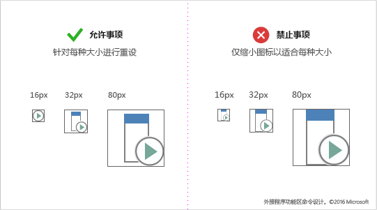
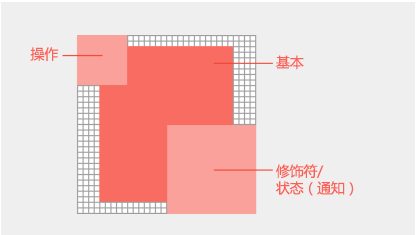

# 适用于外接程序的Office样式图标指南

2013 Office 2013 (非订阅) 版本Office Microsoft 的"全新"样式图标。 如果你希望图标与单声道样式匹配Microsoft 365，请参阅适用于加载项的单Office[图标指南](add-in-icons-monoline.md)。

## Office全新的视觉样式

"新鲜度"图标仅包含基本的通信元素。 包括透视、渐变和光源的非必需元素均被删除。 简化后的图标可支持对命令和控件的快速解析。 请遵循此样式，以最适合Office订阅客户端。

## 最佳实践

创建图标时，请遵循以下准则：

|允许事项|禁止事项|
|:---|:---|
|使视觉对象简洁明了，重点关注通信的关键元素。| 不要使用使图标显得杂乱的项目。|
|使用 Office 图标语言来表示行为或概念。|请勿对功能区或上下文菜单中的外接程序命令Office 应用 Fabric Core 字形。 Fabric Core 图标在风格上有所不同，不会匹配。|
|将画笔等公用 Office 视觉隐喻重用于格式或用于查找的放大镜。|不要对不同的命令重复使用视觉隐喻。 对不同的行为和概念使用同一图标可能会引起混淆。 |
|重绘图标，使其更大或更小。 请花时间重绘切割区、角和圆边，以最大化线条的清晰度。 |切勿通过缩小或扩大尺寸来调整图标大小。 这可能会导致视觉对象质量不佳和操作不清晰。 对于较大尺寸的复杂图标，如果不是通过重绘来使其变小，则可能会降低清晰度。 |
|为辅助功能使用白色填充。图标中的大部分对象都需使用白色背景，以使其在 Office UI 主题中以及高对比度模式下清晰可辨。  |避免依赖徽标或品牌传达外接程序命令应起到的作用。 品牌标志在较小的图标尺寸上和应用很多修饰符后并非总具有识别性。 品牌标记通常与Office 应用图标样式冲突，并且可能会吸引用户关注在饱和的环境中。 |
|使用具有透明背景的 PNG 格式。 ||
|避免在图标中使用可本地化的内容，包括印刷字符、段落标记指示和问号。 ||

## 图标大小的建议和要求

Office 桌面图标是位图图像。 根据用户的 DPI 设置和触摸模式将呈现不同的大小。 包括所有八种支持的大小，可在所有受支持的解决方案和上下文中创建最佳体验。 以下是受支持的大小 - 三种是必需的：

- 16 像素（必需）
- 20 像素
- 24 像素
- 32 像素（必需）
- 40 像素
- 48 像素
- 64 像素（建议，最适用于 Mac）
- 80 像素（必需）

> [!IMPORTANT]
> 对于作为加载项代表性图标的图像，请参阅在[AppSource](/office/dev/store/create-effective-office-store-listings#create-an-icon-for-your-add-in)和 Office内创建有效列表，了解大小和其他要求。

确保根据每个尺寸重新绘制你的图标，而非将其缩小。

## 图标分析和布局

Office图标通常由具有操作和概念修饰符的基元素组成。 操作修饰符表示诸如添加、打开、新建或关闭等的概念。 概念修饰符表示图标的状态、更改或说明。

若要创建与 Office UI 相符的命令，请遵循基本元素和修饰符的布局准则。这将确保命令看起来具有专业性，且客户将信任你的外接程序。如果出现未按这些准则进行操作的情况，则这些操作应该是有意为之。

以下图像显示 Office 图标中的基本元素和修饰符的布局。

- 将基本元素置于像素框架的中间位置，并在其周围填充空白。
- 将操作修饰符置于左上方。
- 将概念修饰符置于右下方。
- 限制图标中的元素数。 在 32 像素下，将修饰符的数量限制为最多两个。 在 16 像素下，将修饰符的数量限制为 1。

### 基准元素填充

放置与大小相一致的基本元素。 如果基本元素不能在框架居中显示，则将其对齐到左上方，并将多余的像素保留在右下方。 为了获得最佳结果，请应用下一节中的表中列出的填充准则。

### 修饰符

所有修饰符在每个元素之间都应有一个 1 像素的透明剪切线，包括背景。 元素不应直接重叠。 在规则和边缘之间创建空白空间。 修饰符在大小上可能略有不同，但会将这些尺寸作为起点使用。

|图标大小|在基本元素周围填充|修饰符大小|
|:---|:---|:---|
|16 像素|0|9 像素|
|20 像素|1px|10 像素|
|24 像素|1px|12 像素|
|32 像素|2px|14 像素|
|40 像素|2px|20 像素|
|48 像素|3px|22 像素|
|64 像素|5px|29 像素|
|80 像素|5px|38 像素|

## 图标颜色

> [!NOTE]
> 这些颜色指南适用于[外接程序命令](add-in-commands.md)中使用的功能区图标。 这些图标不是使用 Fluent UI 呈现的，并且调色板不同于 Microsoft UI Fabric | [颜色|共享](https://fluentfabric.azurewebsites.net/#/color/shared)。

Office 图标具有一个有限的调色板。使用下表中列出的颜色确保与 Office UI 无缝集成。对颜色使用应用以下准则：

- 使用颜色传达图标含义，而非只是用作修饰。图标颜色应突出显示或强调操作、状态或明确区分标记的元素。
- 如有可能，除灰色外仅使用其他一种颜色。将附加颜色限制为最多两种。
- 所有图标大小中的颜色应具有一致的外观。 Office 图标针对不同的图标大小具有略微不同的调色板。 16 像素和较小的图标比 32 像素和更大的图标略暗且更亮。 除了这些细微的调整以外，颜色的差别体现在大小上。

|颜色名称|RGB|十六进制|颜色|类别|
|:---|:---|:---|:---|:---|
|文本灰色 (80)|80、80、80|#505050|  |文本|
|文本灰色 (95)|95、95、95|#5F5F5F|  |文本|
|文本灰色 (105)|105、105、105|#696969|  |文本|
|深灰色 32|128、128、128|#808080|  |32 像素及以上|
|中灰色 32|158、158、158|#9E9E9E|  |32 像素及以上|
|浅灰色所有|179、179、179|#B3B3B3|  |所有大小|
|深灰色 16|114、114、114|#727272|  |16 像素及以下|
|中灰色 16|144、144、144|#909090|  |16 及以下|
|蓝色 32|77、130、184|#4d82B8|  |32 像素及以上|
|蓝色 16|74、125、177|#4A7DB1|  |16 像素及以下|
|黄色所有|234、194、130|#EAC282|  |所有大小|
|橙色 32|231、142、70|#E78E46|  |32 像素及以上|
|橙色 16|227、142、70|#E3751C|  |16 像素及以下|
|粉色所有|230、132、151|#E68497|  |所有大小|
|绿色 32|118、167、151|#76A797|  |32 像素及以上|
|绿色 16|104、164、144|#68A490|  |16 像素及以下|
|红色 32|216、99、68|#D86344|  |32 像素及以上|
|红色 16|214、85、50|#D65532|  |16 像素及以下|
|紫色 32|152、104、185|#9868B9|  |32 像素及以上|
|紫色 16|137、89、171|#8959AB|  |16 像素及以下|

## 高对比度模式下的图标

Office 图标设计为在高对比度模式中完美呈现。前景元素与最大化易读性和启用重新着色的背景明显不同。在高对比度模式下，Office 会使用小于 190 的红色、绿色或蓝色值直到全黑，为任何像素的图标重新着色。其他所有像素都将是白色的。换言之，每个评估的 RGB 通道中的 0-189 值表示为黑色，而 190-255 值表示为白色。其他高对比度主题则使用相同的 190 阈值但不同的规则进行重新着色。例如，高对比度白色主题会将所有大于 190 的像素重新着色为不透明，而将所有其他像素重新着色为透明。应用下面的规则以最大化高对比度设置中的可读性。

- 旨在以 190 阈值区分前景和背景元素。
- 遵循 Office 图标视觉样式。
- 使用图标调色板中的颜色。
- 避免使用渐变。
- 避免使用值相似的颜色块。

## 另请参阅

- [图标清单元素](../reference/manifest/icon.md)
- [IconUrl 清单元素](../reference/manifest/iconurl.md)
- [HighResolutionIconUrl 清单元素](../reference/manifest/highresolutioniconurl.md)
- [创建加载项图标](/office/dev/store/create-effective-office-store-listings#create-an-icon-for-your-add-in)
