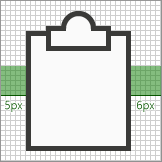
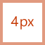
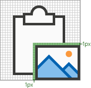
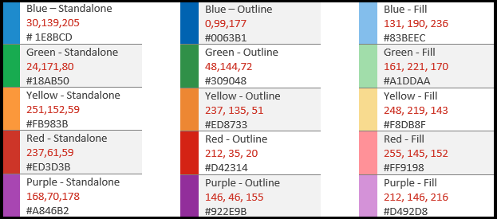

# 单声道样式图标指南Office加载项

单声道样式图标用于Office应用中。 如果你希望你的图标与非订阅 Office 2013+ 的新鲜样式匹配，请参阅适用于 Office 外接程序的新鲜样式[图标指南](add-in-icons-fresh.md)。

## Office单声道视觉样式

Monoline 样式的目标是具有一致、清晰且可访问的图标，以通过简单的视觉效果传达操作和功能，确保图标可供所有用户访问，并且具有与 Windows 中其他位置使用的样式一致的样式。

以下指南适用于第三方开发人员，他们希望为功能创建图标，这些图标与产品中已有的图标Office一致。

### 设计原则

- 简单、干净、清晰。
- 仅包含必要的元素。
- 受图标Windows启发。
- 可供所有用户访问。

#### 传达含义

- 使用描述性元素（如页面）表示文档或信封来表示邮件。
- 使用相同的元素来表示同一概念，即邮件始终由信封而不是标记表示。
- 在概念开发过程中使用核心隐喻。

#### 减少元素

- 将图标缩小到核心含义，仅使用对隐喻至关重要的元素。
- 将图标中的元素数限制为两个，无论图标大小如何。

#### 一致性

图标的大小、排列和颜色应保持一致。

#### 样式设置

##### Perspective

默认情况下，单声道图标是向前的。 允许使用需要透视和/或旋转的某些元素，如立方体，但例外应保持最少。

##### 装饰

单声道是一种简洁的样式。 所有内容都使用平面颜色，这意味着没有渐变、纹理或光源。

## 正在设计

### 大小

我们建议你生成所有这些大小的每个图标，以支持高 DPI 设备。 绝对 *必需的大小* 为 16 像素、20 像素和 32 像素，因为大小为 100%。

**16 像素、20 像素、24 像素、32 像素、40 像素、48 像素、64 像素、80 像素、96 像素**

> [!IMPORTANT]
> 对于作为加载项代表性图标的图像，请参阅在[AppSource](/office/dev/store/create-effective-office-store-listings#create-an-icon-for-your-add-in)和 Office内创建有效列表，了解大小和其他要求。

### 布局

下面是一个包含修饰符的图标布局示例。

  

#### 元素

- **基本**：图标表示的主要概念。 这通常是图标所需的唯一视觉对象，但有时可以使用辅助元素（修饰符）增强主要概念。

- **修饰符** 覆盖基本元素的任何元素;即，通常表示操作或状态的修饰符。 它通过充当添加、更改或描述符来修改基本元素。

### 建造

#### 元素放置

基元素放置在填充内图标的中心。 如果无法完全居中放置，则基数应位于右上方。 在下面的示例中，图标完全居中。

在下面的示例中，图标在左侧出错。

修饰符几乎总是放置在图标画布的右下角。 在极少数情况下，修饰符放置在不同的角。 例如，如果修改器无法识别右下角的基元素，请考虑将其放在左上角。

#### Padding

每个大小图标在图标周围都有指定数量的填充。 基本元素保留在填充内，但修饰符应向上扩展到画布边缘，在填充之外扩展到图标边框的边缘。 下图显示了用于每个图标大小的推荐填充。

|**16px**|**20px**|**24px**|**32px**|**40px**|**48px**|**64px**|**80px**|**96px**|
|:---|:---|:---|:---|:---|:---|:---|:---|:---|
||||||||||

#### 线条粗细

单声道是线条和轮廓形状的样式控制。 根据你生成图标的大小，应该使用以下行权重。

|图标大小：|16px|20px|24px|32px|40px|48px|64px|80px|96px|
|:---|:---|:---|:---|:---|:---|:---|:---|:---|:---|
|**线条粗细：**|1px|1px|1px|1px|2px|2px|2px|2px|3px|
|**示例图标：**||||||||||

#### 剪切

当图标元素放置在另一个元素的顶部时， (元素) 的剪切线用于在两个元素之间提供空间，主要用于可读性。 当修饰符放置在基元素的顶部时，通常会发生这种情况，但在某些情况下，这两个元素都不是修饰符。 这两个元素之间的这些切口有时称为"间隙"。

间隙的大小应该与用于该大小的线粗细的宽度相同。 如果制作 16 像素的图标，间隙宽度为 1px，如果是 48 像素的图标，间隙应为 2px。 以下示例显示一个 32 像素的图标，该图标的修饰符和基础基底之间的间隙为 1px。

在某些情况下，如果修饰符有对角或曲线边缘且标准间隙未提供足够的分离，则间隙可能会增加 1/2 像素。 这很可能只影响线条粗细为 1px 的图标：16 像素、20 像素、24 像素和 32 像素。

#### 背景填充

Monoline 图标集内大多数图标都需要背景填充。 但是，在某些情况下，对象自然没有填充，因此不应应用填充。 以下图标具有白色填充。

以下图标没有填充。  (包括齿轮图标，以显示中洞未填充。) 

##### 填充最佳做法

###### Dos：

- 填充具有已定义边界的任何元素，并且自然具有填充。
- 使用单独的形状创建背景填充。
- 使用 **调色板 中的** 背景 [填充](#color)。
- 保持重叠元素之间的像素分隔。
- 在多个对象之间填充。

###### 请勿：

- 不要填充无法自然填充的对象;例如，一个平剪纸。
- 不要填充方括号。
- 请勿在数字或 alpha 字符后面填充。

### 颜色

调色板专为简单和辅助功能设计。 它包含 4 种中性颜色以及蓝色、绿色、黄色、红色和紫色的两种变体。 橙色有意不包含在单声道图标调色板中。 每种颜色旨在以本节所述的特定方式使用。

#### 调色板

#### 如何使用颜色

在单声道调色板中，所有颜色都有独立、大纲和填充变体。 通常，使用填充和边框构造元素。 颜色以下列模式之一应用：

- 对于没有填充的对象，单独的独立颜色。
- 边框使用"边框"颜色，填充使用"填充"颜色。
- 边框使用独立颜色，填充使用背景填充颜色。

以下是使用颜色的示例。

最常见情况是让元素将深灰色独立版与背景填充一同使用。

使用彩色 Fill 时，它应始终具有相应的"轮廓"颜色。 例如，蓝色填充只能与蓝色边框一同使用。 但是此一般规则有两个例外：

- 背景填充可以与任何单独的颜色一同使用。
- 浅灰色填充可以与两种不同的大纲颜色一同使用：深灰色或中灰色。

#### 何时使用颜色

颜色应该用于传达图标的含义，而不是用于修饰。 它 **应突出显示给用户** 的操作。 将修饰符添加到具有颜色的基本元素时，基元素通常转换为深灰色和背景填充，以便修饰符可以是颜色元素，如以下示例，将"X"修饰符添加到下一组最左侧图标的图片基础中。

除了上面提到的"轮廓"和"填充"外，你应当将图标限制为一种其他颜色。 但是，如果它对于其隐喻至关重要，可以使用更多颜色，但除了灰色外，还有两种其他颜色。 在极少数情况下，当需要更多颜色时，会存在例外情况。 以下是仅使用一种颜色的图标的很好示例。

  

但以下图标使用的颜色过多。

  

对 **内部"** 内容"使用中灰色，如电子表格图标中的网格线。 当内容需要显示控件的行为时，会使用其他内部颜色。

#### 文本行

当文本行位于"容器"中时 (例如，文档中的文本) 中灰色。 不在容器中的文本行应为 **深灰色**。

### 文本

避免在图标中使用文本字符。 由于Office产品已全球使用，我们希望尽可能使图标保持中性语言。

## 生产

### 图标文件格式

最终图标应另存为.png文件。 将 PNG 格式与透明背景一同使用，并且具有 32 位深度。

## 另请参阅

- [图标清单元素](../reference/manifest/icon.md)
- [IconUrl 清单元素](../reference/manifest/iconurl.md)
- [HighResolutionIconUrl 清单元素](../reference/manifest/highresolutioniconurl.md)
- [创建加载项图标](/office/dev/store/create-effective-office-store-listings#create-an-icon-for-your-add-in)
