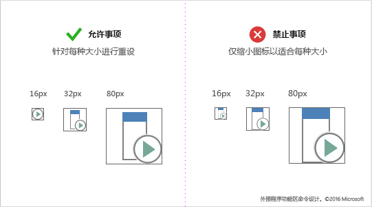
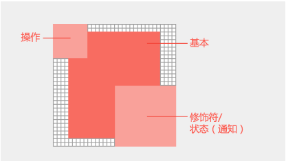

# 图标Icons
图标是行为或概念的可视化表示形式。Icons are the visual representation of a behavior or concept. 它们通常用于为控件和命令添加含义。They are often used to add meaning to controls and commands. 实际或符号化的视觉对象使用户能够以与标记帮助用户浏览其环境的相同方式浏览 UI。Visuals, either realistic or symbolic, enable the user to navigate the UI the same way signs help users navigate their environment. 这些视觉对象应简单明了，并且只包含所需的详细信息，以使客户能够快速分析他们在选择控件时将会发生的操作。They should be simple, clear, and contain only the necessary details to enable customers to quickly parse what action will occur when they choose a control.

Office 功能区界面具有标准的视觉样式。Office ribbon interfaces have a standard visual style. 这可以确保一致性并熟悉各个 Office 应用程序。This ensures consistency and familiarity across Office apps. 这些准则将有助于你为解决方案设计一组适合作为 Office 固有部分的 PNG 资产。Office ribbon interfaces have a standard visual style. If you are designing an add-in command for the Office ribbon, follow our icon guidelines. This ensures consistency and familiarity across Office apps. The guidelines will help you design a set of PNG assets for your solution that fit in as a natural part of Office.

许多 HTML 容器包含带有插图的控件。使用 Office UI Fabric 的自定义字体在外接程序中呈现 Office 样式图标。Fabric 的图标字体包含很多针对可缩放的常见 Office 隐喻、颜色和样式的字形以满足你的需要。如果你有带自己图标集的现有视觉语言，则可在 HTML 画布中随意使用。构建自己带标准图标集的品牌的连续性是任何设计语言的重要组成部分。请注意避免与 Office 隐喻产生冲突导致客户混淆。Many HTML containers contain controls with iconography. Use Office UI Fabric’s custom font to render Office styled icons in your add-in. Fabric’s icon font contains many glyphs for common Office metaphors that you can scale, color, and style to suit your needs. If you have an existing visual language with your own set of icons, feel free to use it in your HTML canvases. Building continuity with your own brand with a standard set of icons is an important part of any design language. Be careful to avoid creating confusion for customers by conflicting with Office metaphors.

# 加载项命令的设计图标Design icons for add-in commands

[外接程序命令](add-in-commands.md)添加按钮、文本和 Office UI 图标。外接程序命令按钮应提供有意义的图标和标签，以便清楚地标识用户在使用命令时执行的操作。本文提供了样式和生产准则，可帮助你设计与 Office 无缝集成的图标。[Add-in commands](add-in-commands.md) add buttons, text, and icons to the Office UI. Your add-in command buttons should provide meaningful icons and labels that clearly identify the action the user is taking when they use a command. This article provides stylistic and production guidelines that help you design icons that integrate seamlessly with Office. 

## Office 图标设计原则Office icon design principles

Office 桌面客户端的 Office 2013 版本包括刷新的图标。替代样式更改已缩减。新图标仅包括必需通信元素。包括透视、渐变和光源的非必需元素均被删除。简化后的图标可支持对命令和控件的快速解析。请按照此样式设计最适合 Office 的图标。The Office 2013 release of the Office desktop clients includes refreshed iconography. The overriding stylistic change is reduction. The new icons include only essential communicative elements. Non-essential elements including perspective, gradients, and light source are removed. The simplified icons support faster parsing of commands and controls. Follow this style to best fit with Office.

Office 图标均基于以下设计原则完成：Office icons are based on the following design principles: 

- 以现代方式阐释 Office 图标集合Modern interpretation of Office icon collection 
- 全新设计但又不陌生Fresh yet familiar  
- 简单、清楚和直接Simple, clear, and direct 

下图显示了应用现代设计原则的图标。The following image shows icons that apply the modern design principles.

## 最佳做法Best practices

创建图标时，请遵循以下准则：Follow these guidelines when you create your icons: 

|允许事项Do|禁止事项Don't|
|:---|:---|
|保持视觉对象简单明了，重点关注通信的关键要素。Keep visuals simple and clear, focusing on the key element(s) of the communication.| 不要使用会使图标看起来杂乱无章的项目。Remove artifacts that make your icon look messy.|
|使用 Office 图标语言来表示行为或概念。Use the Office icon language to represent behaviors or concepts.|请勿在 Office 功能区或关联菜单中改变外接程序命令的 Office UI Fabric 用途。Fabric 图标风格不同，不能匹配。Don’t repurpose Office UI Fabric glyphs for add-in commands in the Office ribbon or contextual menus. Fabric icons are stylistically different and will not match.|
|将画笔等公用 Office 视觉隐喻重用于格式或用于查找的放大镜。Reuse common Office visual metaphors such as paintbrush for format or magnifying glass for find.|不要对不同的命令重复使用视觉隐喻。Don't reuse visual metaphors for different commands. 对不同的行为和概念使用同一图标可能会引起混淆。Using the same icon for different behaviors and concepts can cause confusion. |
|重新绘制图标，使其变得更小或更大。Redraw your icons to make them small or larger. 请花时间重绘切割区、角和圆边，以最大化线条的清晰度。Redraw, don't resize. As you resize your icons for larger or smaller sizes, take the time to redraw cutouts, corners, and rounded edges to maximize line clarity. |不要通过缩小或扩大尺寸来调整图标大小。Don't resize your icons by shrinking or enlarging in size. 这可能会导致低质量的视觉效果和不明确的操作。This can lead to poor visual quality and unclear actions. 如果将尺寸调小而不重绘，则以较大尺寸创建的复杂图标可能会失去清晰度。Complex icons created at a larger size may lose clarity if resized to be smaller without redraw. |
|为辅助功能使用白色填充。图标中的大部分对象都需使用白色背景，以使其在 Office UI 主题中以及高对比度模式下清晰可辨。Use a white fill for accessibility. Most objects in your icons will require a white background to be legible across Office UI themes and in high-contrast modes.  ||
|使用具有透明背景的 PNG 格式。Use the PNG format with a transparent background. ||
|避免在图标中使用可本地化的内容，包括印刷字符、段落标记指示和问号。Avoid localizable content in your icons, including typographic characters, indications of paragraph rags, and question marks. ||

## 图标大小的建议和要求Icon size recommendations and requirements

Office 桌面图标是位图图像。根据用户的 DPI 设置和触摸模式将呈现不同的大小。包括所有八种支持的大小，可在所有受支持的解决方案和上下文中创建最佳体验。以下是受支持的大小 - 三种是必需的：Office 2016 desktop icons are bitmap images. Different sizes will render depending on the user's DPI setting and touch mode. Include all eight supported sizes to create the best experience in all supported resolutions and contexts. The following are the supported sizes - three are required:

- 16 像素（必需）16 px (Required)
- 20 像素20 px
- 24 像素24 px
- 32 像素（必需）32 px (Required)
- 40 像素40 px
- 48 像素48 px
- 64 像素（建议，最适用于 Mac）64 px (Recommended, best for Mac)
- 80 像素（必需）80 px (Required)  

确保根据每个尺寸重新绘制你的图标，而非将其缩小。Make sure to redraw your icons for each size rather than shrink them to fit.

<!--
The following table shows the icon sizes that render for different modes at different DPI settings.

|DPI |**Small**||**Medium**||**Large**||**Extra large**|
|:---|:---|:---|:---|:---|:---|:---|:---|
|    |**Mouse**|**Touch**|**Mouse**|**Touch**|**Mouse**|**Touch**|-|
|100%|16px|20px|24px||32px|40px|48px|
|125%|20px|24px|||40px|48px|60px|
|150%|24px|24px|36px||48px|48px|72px|
|200%|32px|40px|48px||64px|80px|96px|
|250%|40px||||80px||120px|
|300%|48px||||96px||144px

> [!NOTE]
> At DPI settings of 150% or greater, the icon does not get swapped out for a larger size when Touch mode is engaged. At DPI settings greater than 250%, Touch mode is turned off by default.

The following table lists the locations for certain icon sizes.

|Location|100% DPI|200% DPI|250% DPI|
|:-------|:-------|:-------|:-------|
|Small ribbon button|16px|32px|40px|
|Contextual menu|16px|32px|40px|
|Quick access toolbar (QAT)|16px|32px|40px|
|Large ribbon icon|32px|64px|80px|

-->

## 图标分析和布局Icon anatomy and layout

Office 图标通常是由具有操作和概念修饰符的基本元素构成的。 操作修饰符表示诸如添加、打开、新建或关闭等的概念。概念修饰符表示图标的状态、更改或说明。Office icons are typically comprised of a base element with action and conceptual modifiers overlayed. Action modifiers represent concepts such as add, open, new, or close. Conceptual modifiers represent status, alteration, or a description of the icon. 

若要创建与 Office UI 相符的命令，请遵循基本元素和修饰符的布局准则。这将确保命令看起来具有专业性，且客户将信任你的外接程序。如果出现未按这些准则进行操作的情况，则这些操作应该是有意为之。To create commands that align with the Office UI, follow layout guidelines for the base element and modifiers. This ensures that your commands look professional and that your customers will trust your add-in. If you make exceptions to these guidelines, do so intentionally.

以下图像显示 Office 图标中的基本元素和修饰符的布局。The following image shows the layout of base elements and modifiers in an Office icon.

- 将基本元素置于像素框架的中间位置，并在其周围填充空白。Center base elements in the pixel frame with empty padding all around.
- 将操作修饰符置于左上方。Place action modifiers on the top left. 
- 将概念修饰符置于右下方。Place conceptual modifiers on the bottom right.
- 限制图标中的元素数。在 32 像素中，将修饰符数限制为最多两个。在 16 像素中，将修饰符数限制为一个。Limit the number of elements in your icons. At 32px, limit the number of modifiers to a maximum of two. At 16px, limit the number of modifiers to one.

###基本元素填充Base element padding
放置与大小相一致的基本元素。如果基本元素不能在框架居中显示，则将其对齐到左上方，并将多余的像素保留在右下方。为了获得最佳效果，请应用下表中列出的填充准则。Place base elements consistently across sizes. If base elements can't be centered in the frame, align them to the top left, leaving the extra pixels on the bottom right. For best results, apply the padding guidelines listed in the following table.

###修饰符Modifiers
所有修饰符在每个元素间都应具有 1 像素的透明切割区，包括背景。元素不应直接重叠。在规则和边缘之间创建空白空间。修饰符在大小上可能略有不同，但会将这些尺寸作为起点使用。All modifiers should have a 1px transparent cutout between each element, including the background. Elements should not directly overlap. Create whitespace between rules and edges. Modifiers can vary slightly in size, but use these dimensions as a starting point.

|**图标大小****Icon size**|**在基本元素周围填充****Padding around base element**|**修饰符大小****Modifier size**|
|:---|:---|:---|
|16 像素16px|0{0}|9 像素9px|
|20 像素20px|1 像素1px|10 像素10px|
|24 像素24px|1 像素1px|12 像素12px|
|32 像素32px|2 像素2px|14 像素14px|
|40 像素40px|2 像素2px|20 像素20px|
|48 像素48px|3 像素3px|22 像素22px|
|64 像素64px|5 像素5px|29 像素29px|
|80 像素80px|5 像素5px|38 像素38px|

## 图标颜色Icon colors

Office 图标具有一个有限的调色板。使用下表中列出的颜色确保与 Office UI 无缝集成。对颜色使用应用以下准则：Office icons have a limited color palette. Use the colors listed in the following table to guarantee seamless integration with the Office UI. Apply the following guidelines to the use of color: 

- 使用颜色传达图标含义，而非只是用作修饰。图标颜色应突出显示或强调操作、状态或明确区分标记的元素。Use color to communicate meaning rather than for embellishment. It should highlight or emphasize an action, status, or an element that explicitly differentiates the mark.  
- 如有可能，除灰色外仅使用其他一种颜色。将附加颜色限制为最多两种。If possible, use only one additional color beyond gray. Limit additional colors to two at the most.
- 所有图标大小中的颜色应具有一致的外观。Office 图标针对不同的图标大小具有略微不同的调色板。16 像素和更小的图标稍暗，而与 32 像素和更大的图标相比更亮。除了这些细微的调整以外，颜色的差别体现在大小上。Colors should have a consistent appearance in all icon sizes. Office icons have slightly different color palettes for different icon sizes. 16px and smaller icons are slightly darker and more vibrant than 32px and larger icons. Without these subtle adjustments, colors appear to vary across sizes.   

|**颜色名称****Color name**|**RGB****RGB**|**十六进制****Hex**|**颜色****Color**|**类别****Category**|
|:---|:---|:---|:---|:---|
|文本灰色 (80)Text Gray (80)|80、80、8080, 80, 80|#505050#505050|  |文本Text|
|文本灰色 (95)Text Gray (95)|95、95、9595, 95, 95|#5F5F5F#5F5F5F|  |文本Text|
|文本灰色 (105)Text Gray (105)|105、105、105105, 105, 105|#696969#696969|  |文本Text|
|深灰色 32Dark Gray 32|128、128、128128, 128, 128|#808080#808080|  |32 及以上32 and above|
|中灰色 32Medium Gray 32|158、158、158158, 158, 158|#9E9E9E#9E9E9E|  |32 及以上32 and above|
|浅灰色所有Light Gray ALL|179、179、179179, 179, 179|#B3B3B3#B3B3B3|  |所有大小All sizes|
|深灰色 16Dark Gray 16|114、114、114114, 114, 114|#727272#727272|  |16 及以下16 and below|
|中灰色 16Medium Gray 16|144、144、144144, 144, 144|#909090#909090|  |16 及以下16 and below|
|蓝色 32Blue 32|77、130、18477, 130, 184|#4d82B8#4d82B8|  |32 及以上32 and above|
|蓝色 16Blue 16|74、125、17774, 125, 177|#4A7DB1#4A7DB1|  |16 及以下16 and below|
|黄色所有Yellow ALL|234、194、130234, 194, 130|#EAC282#EAC282|  |所有大小All sizes|
|橙色 32Orange 32|231、142、70231, 142, 70|#E78E46#E78E46|  |32 及以上32 and above|
|橙色 16Orange 16|227、142、70227, 142, 70|#E3751C#E3751C|  |16 及以下16 and below|
|粉色所有Pink ALL|230、132、151230, 132, 151|#E68497#E68497|  |所有大小All sizes|
|绿色 32Green 32|118、167、151118, 167, 151|#76A797#76A797|  |32 及以上32 and above|
|绿色 16Green 16|104、164、144104, 164, 144|#68A490#68A490|  |16 及以下16 and below|
|红色 32Red 32|216、99、68216, 99, 68|#D86344#D86344|  |32 及以上32 and above|
|红色 16Red 16|214、85、50214, 85, 50|#D65532#D65532|  |16 及以下16 and below|
|紫色 32Purple 32|152、104、185152, 104, 185|#9868B9#9868B9|  |32 及以上32 and above|
|紫色 16Purple 16|137、89、171137, 89, 171|#8959AB#8959AB|  |16 及以下16 and below|

## 高对比度模式下的图标Icons in high contrast modes

Office 图标设计为在高对比度模式中完美呈现。前景元素与最大化易读性和启用重新着色的背景明显不同。在高对比度模式下，Office 会使用小于 190 的红色、绿色或蓝色值直到全黑，为任何像素的图标重新着色。其他所有像素都将是白色的。换言之，每个评估的 RGB 通道中的 0-189 值表示为黑色，而 190-255 值表示为白色。其他高对比度主题则使用相同的 190 阈值但不同的规则进行重新着色。例如，高对比度白色主题会将所有大于 190 的像素重新着色为不透明，而将所有其他像素重新着色为透明。应用下面的规则以最大化高对比度设置中的可读性。Office icons are designed to render well in high contrast modes. Foreground elements are well differentiated from backgrounds to maximize legibility and enable recoloring. In high contrast modes, Office will recolor any pixel of your icon with a red, green, or blue value less than 190 to full black. All other pixels will be white. In other words, each RGB channel is assessed where 0-189 values are black and 190-255 values are white. Other high-contrast themes recolor using the same 190 value threshold but with different rules. For example, the high-contrast white theme will recolor all pixels greater than 190 opaque but all other pixels as transparent. Apply the following guidelines to maximize legibility in high-contrast settings:

- 旨在以 190 阈值区分前景和背景元素。Aim to differentiate foreground and background elements along the 190 value threshold.
- 遵循 Office 图标视觉样式。Follow Office icon visual styles.
- 使用图标调色板中的颜色。Use colors from our icon palette.
- 避免使用渐变。Avoid the use of gradients.
- 避免使用值相似的颜色块。Avoid large blocks of color with similar values.

## 另请参阅See also

- [加载项开发最佳做法Add-in development best practices](../concepts/add-in-development-best-practices.md)
- [Excel、Word 和 PowerPoint 的外接程序命令Add-in commands for Excel, Word, and PowerPoint](../design/add-in-commands.md)

- 避免依赖徽标或品牌传达外接程序命令应起到的作用。品牌标志在较小的图标尺寸上和应用很多修饰符后并非总具有识别性。品牌标志经常与 Office 功能区图标样式冲突，并可能在饱和的环境中过度吸引用户的注意力。Avoid relying on your logo or brand to communicate what an add-in command does. Brand marks aren't always recognizable at smaller icon sizes and when modifiers are applied. Brand marks often conflict with Office ribbon icon styles, and can compete for user attention in a saturated environment.

