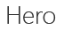

# 版式

Segoe 是 Office 的标准字样。在外接程序中使用 Segoe，以与 Office 任务窗格、对话框和内容对象保持一致。Office UI Fabric 允许你访问 Segoe。它在方便使用的 CSS 类中为 Segoe 的全型斜坡提供了许多不同的字体粗细和大小。并非所有 Office UI Fabric 大小和权重在 Office 外接程序中看上去都很理想。若要和谐适合或避免冲突，请考虑使用 Fabric 类型斜坡的一个子集。这是建议在 Office 外接程序中使用的 Fabric 的基类列表。

|示例 |类 |大小 |权重 |建议的用法 |
|------ |----- |---- |------ |----------------- |
||.ms-font-xxl |28 像素 | Segoe Light |<ul><li>此类大于 Office 中的所有其他版式元素。请谨慎使用以避免超越可视化层次结构。</li><li>避免在有限空间中的长字符串上使用。</li><li>在使用此类的文本周围提供充足的空白空间。</li><li>常用于首次运行的信息、特大元素或其他操作调用。</li></ul> |
||.ms-font-xl |21 像素 |Segoe Light | <ul><li>此类匹配 Office 应用程序的任务窗格标题。</li><li>请谨慎使用以避免出现平面版式层次结构。</li><li>通常用作对话框、页面或内容标题等顶级元素。</li></ul> |
||.ms-font-l |17 像素 |Segoe Semilight | <ul><li>此类是标题下方的第一级元素。</li><li>常用作副标题、导航元素或组标头。</li><ul> |
||.ms-font-m |14 像素 |Segoe Regular |<ul><li>通常用作加载项中的正文文本。</li><ul>|
||.ms-font-xs |11 像素 | Segoe Regular |<ul><li>通常由行、标题或字段标签用于时间戳等二级或三级文本。</li><ul>|
||.ms-font-mi |10 像素 |Segoe Semibold |<ul><li>应极少使用类型渐变中的最小步长。它仅供不需要辨别的情况使用。</li><ul>|

> [!NOTE]
> 这些基类不包含文本颜色。请对白色背景上的大多数文本使用 Fabric 的“主中性色”。
