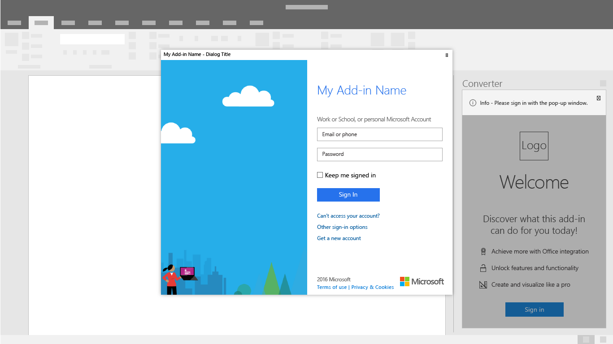

# 身份验证模式

加载项可能需要用户登录或注册才能访问特性和功能。 用户名和密码的输入框或启动第三方凭据流的按钮是身份验证体验中常见的界面控件。 获得简单高效的身份验证体验是让用户开始使用加载项的重要第一步。

## 最佳做法

|允许事项|禁止事项|
|:----|:----|
|在登录之前，无需帐户即可介绍加载项或演示功能的价值。 |希望用户无需了解加载项的价值和好处即可登录。|
|指导用户通过身份验证流程，并在每个屏幕上使用主要的高度可见的按钮。 |通过竞争按钮和号召性用语，引起对二级和三级任务的关注。|
|使用清晰的按钮标签来描述“登录”或“创建帐户”等特定任务。 |使用模糊的按钮标签，如“提交”或“入门”来指导用户完成身份验证流程。|
|使用对话框将用户的注意力集中在身份验证表单上。 |使用初次运行体验和身份验证表单塞满任务窗格。|
|在流程中寻找细处的效率，如自动对焦输入框。 |为交互添加如要求用户单击表单域等不必要的步骤。|
|为用户提供一种注销和重新进行身份验证的方法。 |强制用户卸载以切换标识。|

## 身份验证流

1. 首先运行 Placemat - 将登录按钮设置为加载项初次运行体验中的明确号召性用语。

    

1. 标识提供者选项对话框 - 显示明确的标识提供者列表，包括用户名和密码表单（如适用）。 身份验证对话框处于打开状态时，加载项 UI 可能会被阻止。

    

1. 身份提供程序登录 - 身份提供程序将拥有其自己的 UI。 Microsoft Azure Active Directory允许自定义登录和访问面板页面，以与服务保持一致的外观。 [了解更多信息](/azure/active-directory/fundamentals/customize-branding)。

    

1. 进度 - 表示设置和 UI 加载时的进度。

    

> [!NOTE]
> 使用 Microsoft 的标识服务时，你将有机会使用可定制的浅色和深色主题的品牌登录按钮。 了解详细信息。

## 单Sign-On身份验证流

> [!NOTE]
> Word、Excel、Outlook 和 PowerPoint 目前支持单一登录 API。 有关单一登录支持的信息，请参阅 [IdentityAPI 要求集](../reference/requirement-sets/identity-api-requirement-sets.md)。 如果使用的是 Outlook 加载项，请务必为 Microsoft 365 租赁启用新式验证。 若要了解如何执行此操作，请参阅 [Exchange Online: How to enable your tenant for modern authentication](https://social.technet.microsoft.com/wiki/contents/articles/32711.exchange-online-how-to-enable-your-tenant-for-modern-authentication.aspx)（如何为租户启用新式体验）。

使用单一登录实现更流畅的最终用户体验。 Microsoft 帐户或 Office (中的用户标识Microsoft 365) 登录外接程序。 因此，用户只能登录一次。 这样便使你的客户更容易上手，体验更为顺畅。

1. 在安装外接程序时，用户将看到类似于以下内容的同意窗口：

    

    > [!NOTE]
    > 加载项发布服务器将控制同意窗口中包含的徽标、字符串和权限范围。 这一 UI 由 Microsoft 预配置。

1. 加载项将在用户同意后加载。 它可以提取并显示任何必要的用户自定义信息。

    

## 另请参阅

- 详细了解如何 [开发 SSO 加载项](../develop/sso-in-office-add-ins.md)
