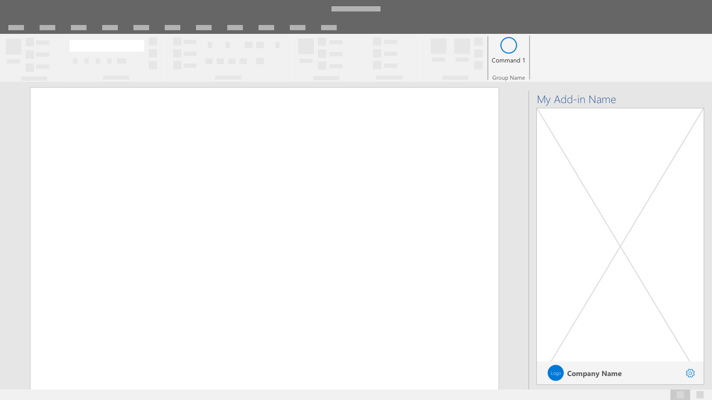
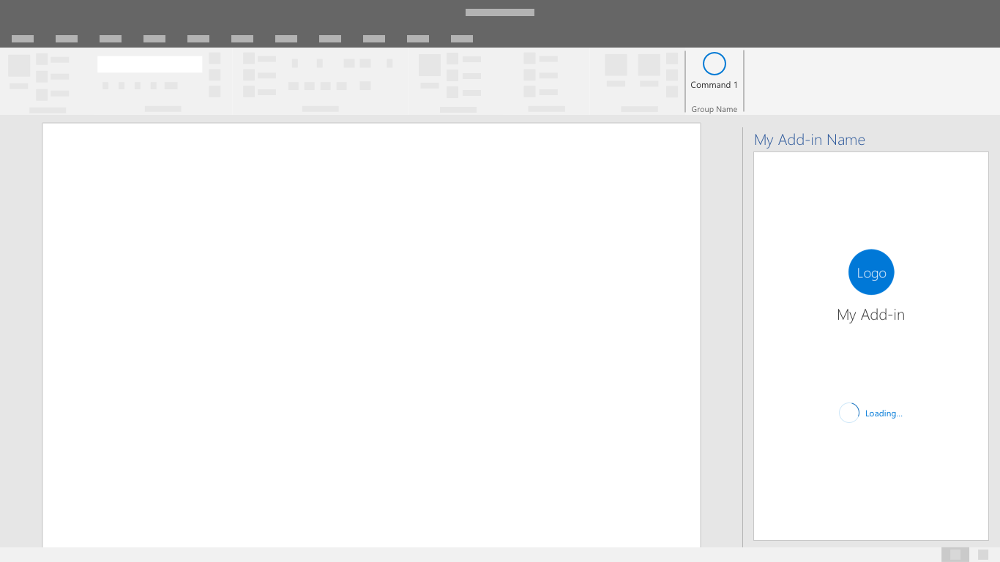

# 品牌模式Branding patterns

这些模式为您的外接程序用户提供品牌可见性和上下文。These patterns provide brand visibilty and context to your add-in users. 

## 最佳做法Best practices

|允许事项Do |禁止事项Don't|
|:---- |:----|
| 使用熟悉的用户界面组件，并应用版式和颜色等品牌元素。Use familiar UI components with applied branding accents like typography and color. | 不要发明与已建立的 Office UI 相矛盾的新 UI 组件。Don't invent new UI components that contradict established Office UI. | 
| 将外接程序品牌放置在用户界面底部的品牌栏页脚中。Place your add-in branding in a brand bar footer at the bottom of your UI. | 不要在用户界面顶部附近的品牌栏中重复任务窗格名称。Don't repeat your task pane name in an immediately adjacent brand bar at the top of your UI. |
| 谨慎使用品牌元素。Use brand elements sparingly. 您的解决方案在 Office 中起到补充作用。Fit your solution into Office such that is complementary. | 不要将过多的品牌元素插入 Office 界面，这会分散客户注意力并造成混淆。Don't insert excessively branded elements into Office UI that distract and confuse customers. |
| 让您的解决方案具有高识别度，并使用一致的视觉元素将您的屏幕连接起来。Make your solution recognizable and connect your screens together with consistent visual elements. | 不要用无法辨认和不一致的视觉元素隐藏您的解决方案。Don't hide your solution with unrecognizable and inconsistently applied visual elements. |
| 建立与父级服务或业务的连接，以确保客户了解并信任您的解决方案。Build connection with a parent service or business to ensure that customers know and trust your solution. | 如果存在有用且可以理解的关系并能够用来建立信任和价值，则不要让客户学习新的品牌概念。Don't make customers learn a new brand concept if there is a useful and understandable relationship that can be leveraged to build trust and value. |

根据适用情况应用以下模式和组件，使用户能够充分利用外接程序。Apply the following patterns and components as applicable to allow users to embrace the full utility of your add-in.

## 品牌栏Brand Bar

品牌栏在页脚中包含您的品牌名称和徽标。The brand bar is a space in the footer to include your brand name and logo. 它也可作为品牌网站和可选访问位置的链接。It also serves as a link to your brand's website and an optional access location.

## 初始屏幕Splash Screen

外接程序正在加载或在 UI 状态之间转换时，使用此屏幕显示品牌。Use this screen to display your branding while the add-in is loading or transitioning between UI states.

