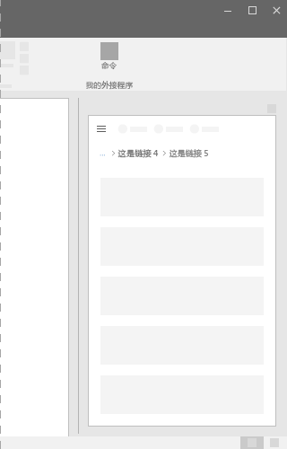
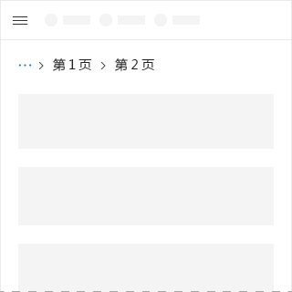
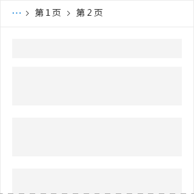

# Office UI Fabric 中的 Breadcrumb 组件

在 Office 外接程序中使用导航痕迹。 它们显示当前页在层次结构中的位置，并帮助用户了解他们相对于层次结构其余部分的位置。 此外，痕迹导航组件还方便用户一键转到层次结构中的更高级位置。
  
#### 示例：任务窗格中的痕迹导航组件

 

 

## 最佳做法

|**允许事项**|**不应做**|
|:------------|:--------------|
|应将痕迹导航组件置于加载项布局顶部、位于项列表之上或位于布局的主内容之上。   |不应将痕迹导航组件用作转到其他页面的主要方法。  |

 

## 实现

有关详细信息，请参阅[痕迹导航组件](https://dev.office.com/fabric#/components/breadcrumb)和 [Fabric React 代码示例入门](https://github.com/OfficeDev/Word-Add-in-GettingStartedFabricReact)。

## 其他资源

- [用户体验设计模式](https://github.com/OfficeDev/Office-Add-in-UX-Design-Patterns-Code)

- [Office 加载项中的 Office UI Fabric](office-ui-fabric.md)
