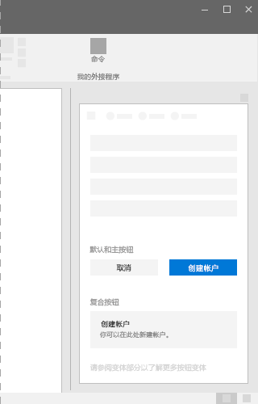
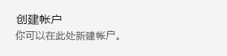

# Office UI Fabric 中的按钮组件

在 Office 外接程序中使用按钮使用户能够提交更改或完成任务中的步骤。 请确保按钮文本传达交互目的。 按钮位于任务窗格、对话框或内容窗格的 UI 容器底部。 例如，按钮可方便用户提交表单、关闭对话框或前往下一页。
  
#### 示例：任务窗格中的按钮

 

 

## 最佳做法

|**允许事项**|**禁止事项**|
|:-----|:--------|
|默认按钮应始终在加载项中执行安全操作。 |请勿将默认焦点放置在销毁数据的按钮上。而应将焦点放置在执行安全操作或取消操作的按钮上。|
|应仅在按钮标签中使用单行文本。文本尽量保持简短。|请勿在按钮中添加任何非文本内容。|
|请确保标签向用户传达按钮的明确目的。请使用简洁、具体、一目了然的标签。请考虑使用单个词。|不应将按钮用于导航，“上一步”****和“下一步”****除外。 若要进行导航，请考虑使用链接。|
|应仅向用户显示一个或两个按钮（操作），例如“接受”****和“取消”****。 如果需要显示更多操作，请考虑使用复选框或单选按钮，方便用户选择操作，并提供一个用于启动选定操作的按钮。||
|应为“提交”****、“确定”****和“应用”****按钮设置主按钮样式。 为其中一个按钮旁边显示的“重置”****或“取消”****按钮设置默认按钮样式。| |

## 变体

|**变体**|**说明**|**示例**|
|:------------|:--------------|:----------|
|**主按钮**|主按钮继承静止状态下的主题颜色。主按钮可用于突出显示主号召性用语。||
|**默认按钮**|默认按钮应始终执行安全操作，不得执行删除操作。||
|**复合按钮**|复合按钮可用于执行完成任务所需的操作或执行过渡任务。||

## 实现

有关详细信息，请参阅[按钮](https://dev.office.com/fabric#/components/button)和 [Fabric React 代码示例入门](https://github.com/OfficeDev/Word-Add-in-GettingStartedFabricReact)。

## 其他资源

- [用户体验设计模式](https://github.com/OfficeDev/Office-Add-in-UX-Design-Patterns-Code)

- [Office 加载项中的 Office UI Fabric](office-ui-fabric.md)
