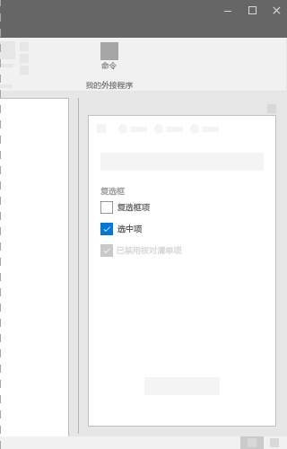
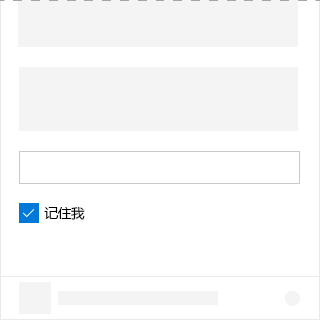
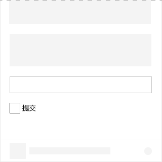

# Office UI Fabric 中的复选框组件

复选框组件是方便用户在加载项中选中或清除选项的 UI 元素。使用复选框组件，用户可以在选项之间进行选择。另外，复选框组件还可以与相关控件配合使用。当用户选中或清除复选框时，相关控件的行为也会变化。例如，相关控件可能会在可见或隐藏状态之间切换。
  
#### 示例：任务窗格中的复选框组件

## 最佳做法

|**允许事项**|**不应做**|
|:------------|:--------------|
|应使用复选框指明状态。   |不应使用复选框显示/指明操作。   |
|如果用户可以选择多个选项且选项不互斥，应使用多个复选框。|如果用户只能选择一个选项，不得使用复选框。如果是这样，应使用单选按钮。|
|如果将多个复选框组合到一起，应支持用户选择任意组合的选项。|两组复选框不得彼此相邻。应使用标签分隔两组复选框。|
|应对辅助设置使用一个复选框。 例如，“记住我?”复选框就是登录方案中使用的辅助设置。|不得使用复选框启用或禁用设置。若要在启用或禁用状态之间切换，请使用切换组件。|

## 变体

|**变体**|**说明**|**示例**|
|:------------|:--------------|:----------|
|**不受控复选框**|用作默认复选框状态。 ||
|**默认选中的不受控复选框**|当复选框示例保持自身状态时使用。 ||
|**默认选中且已禁用的不受控复选框**|状态为已禁用的复选框。 ||
|**受控复选框**|此复选框的选中状态是在 UI 中的其他位置进行决定。在这种情况下，正确值是通过 **onChange** 事件和重新呈现 UI 传递到复选框。 ||

## 实现

有关详细信息，请参阅[复选框](https://dev.office.com/fabric#/components/checkbox)和 [Fabric React 代码示例入门](https://github.com/OfficeDev/Word-Add-in-GettingStartedFabricReact)。

## 另请参阅

- [用户体验设计模式](https://github.com/OfficeDev/Office-Add-in-UX-Design-Patterns-Code)
- [Office 加载项中的 Office UI Fabric](office-ui-fabric.md)
