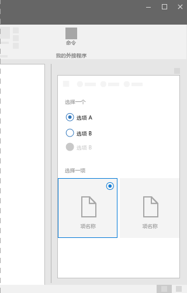
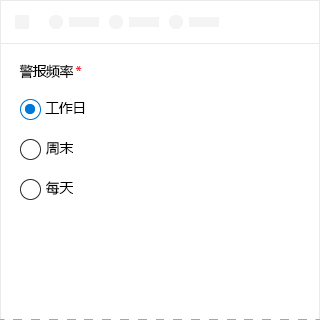
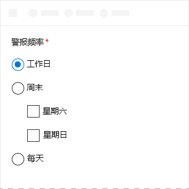

# Office UI Fabric 中的选项组组件

ChoiceGroup 组件也称为单选按钮，向用户提供两个或多个互相排斥的选项。用户可以在组中仅选择一个 ChoiceGroup 按钮。一个 ChoiceGroup 按钮表示一个选项。 
  
#### 示例：任务窗格中的 ChoiceGroup

 

## 最佳做法

|**允许事项**|**禁止事项**|
|:------------|:--------------|
|应让 ChoiceGroup 选项处于同一级。   |不应使用嵌套的 ChoiceGroup 或复选框。   |
|应使用具有 2-7 个选项的 ChoiceGroup，同时确保屏幕空间足以显示所有选项。 否则，请使用复选框或下拉组件。|如果选项是步长固定的数字（例如，10、20、30 等），不得使用选项组组件。请改用幻灯片组件。|
|如果用户可能不会选择任何选项，应考虑添加诸如“无”****或“不应用”****之类的选项。|不应将两个 ChoiceGroup 按钮用于一个二项选择。|
|如果可能，请垂直对齐 ChoiceGroup 按钮而非水平对齐。水平对齐会加大读取和本地化的难度。||
|应按逻辑顺序列出选项，例如，从用户选择可能性最大到最小的选项、从最简单操作到最复杂操作，或从风险最低到风险最高。 |不应按字母顺序，因为此顺序与语言相关。|

## 变体

|**变体**|**说明**|**示例**|
|:------------|:--------------|:----------|
|**ChoiceGroup**|当做选择不需要图像时使用。| |
|**ChoiceGroup 使用图像**|当做选择需要图像时使用。| |

## 实现

有关详细信息，请参阅[选项组](https://dev.office.com/fabric#/components/choicegroup)和 [Fabric React 代码示例入门](https://github.com/OfficeDev/Word-Add-in-GettingStartedFabricReact)。

## 另请参阅

- [用户体验设计模式](https://github.com/OfficeDev/Office-Add-in-UX-Design-Patterns-Code)
- [Office 加载项中的 Office UI Fabric](office-ui-fabric.md)
