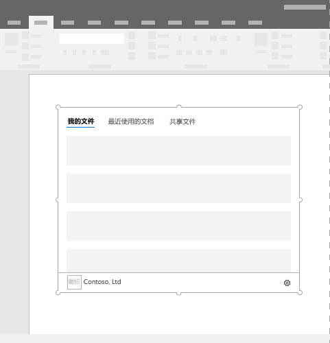

# 内容 Office 加载项

内容外接程序这种图面可被直接嵌入 Word、Excel 或 PowerPoint 文档中。内容外接程序让用户访问运行代码以修改文档或显示数据源中数据的界面控件。在你要将功能直接嵌入文档时，请使用内容加载项。  

*图 1：内容加载项的典型布局*

## 最佳做法

- 在外接程序顶部包括某些导航或命令元素，如命令栏或透视。
- 包括位于外接程序底部的品牌元素，如品牌栏（仅适用于 Word、Excel 和 PowerPoint 外接程序）。

## 变量

Office 2016 桌面和 Office 365 中的 Word、Excel 和 PowerPoint 的内容外接程序大小由用户指定。

## “个性”菜单

“个性”菜单可能会妨碍靠近外接程序右上角的导航和命令元素。以下是 Windows 和 Mac 上的“个性”菜单的当前尺寸。

对于 Windows，个性菜单尺寸为 12x32 像素，如下所示。

*图 2：Windows 上的个性菜单* 

对于 Mac，“个性”菜单尺寸为 26x26 像素，但是从右侧浮动 8 个像素，再从顶部浮动 6 个像素，能将占用空间增加至 34x32 像素，如下所示。

*图 3：Mac 上的个性菜单*

## 实现

有关实现内容加载项的示例，请参阅 GitHub 上的 [Excel 内容加载项 Humongous Insurance](https://github.com/OfficeDev/Excel-Content-Add-in-Humongous-Insurance)。

## 另请参阅

- [Office 加载项中的 Office UI Fabric](office-ui-fabric.md) 
- [适用于 Office 加载项的 UX 设计模式](ux-design-patterns.md)
