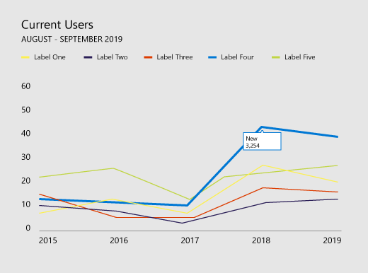
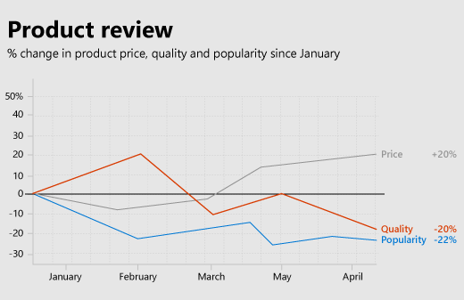

# Office 加载项的数据可视化样式指南Data visualization style guidelines for Office Add-ins

良好的数据可视化效果可帮助用户找到数据见解。他们可以使用这些见解来讲述具有说服力的故事。本文提供了准则，以帮助你在适用于 Excel 和其他 Office 应用的外接程序中设计有效的数据可视化。Good data visualizations help users find insights in their data. They can use those insights to tell stories that inform and persuade. This article provides guidelines to help you design effective data visualizations in your add-ins for Excel and other Office apps.

我们建议你使用 Fluent [UI](../design/add-in-design.md)为数据可视化创建部件版式。We recommend that you use [Fluent UI](../design/add-in-design.md) to create the chrome for your data visualizations. FluentUI 包括样式和组件，这些样式和组件与Office体验无缝集成。Fluent UI includes styles and components that integrate seamlessly with the Office look and feel.

## 数据可视化元素Data visualization elements

数据可视化共享常规框架和常见的视觉和交互式元素，包括标题、标签和数据绘图，如下图所示。Data visualizations share a general framework and common visual and interactive elements, including titles, labels, and data plots, as shown in the following figure.

### 图表标题Chart titles

请遵循图表标题的以下准则：Follow these guidelines for chart titles:

- 使图表标题便于阅读。设定其位置以创建相对于其余图表的清晰视觉对象层次结构。Make your chart titles easily readable. Position them to create a clear visual hierarchy in relation to the rest of the chart.
- 一般情况下，使用句子大写（大写第一个字词）。若要创建对比度或强化层次结构，可以全部使用大写，但应谨慎使用全部大写。In general, use sentence capitalization (capitalize the first word). To create contrast or to reinforce hierarchies, you can use all caps, but all caps should be used sparingly.
- 合并[Fluent UI 类型渐变](https://developer.microsoft.com/fluentui#/styles/web/typography)，使图表与使用 Segoe 的 Office UI 保持一致。Incorporate the [Fluent UI type ramp](https://developer.microsoft.com/fluentui#/styles/web/typography) to make your charts consistent with the Office UI, which uses Segoe. 你还可以使用不同的字样来区分图表内容和 UI。You can also use a different typeface to differentiate chart content from the UI.
- 使用带有大型计数器的 sans-serif 字样。Use sans-serif typefaces with large counters.

### 轴标签Axis labels

请确保轴标签颜色足够深，以便可以清楚地阅读，并且具有足够的文本和背景色对比度。请确保颜色不要过深，避免比数据墨迹更加突出。Make your axis labels dark enough to read clearly, with adequate contrast ratios between the text and background colors. Make sure that they are not so dark that they compete with data ink.

浅灰色轴标签效果最佳。Light grays are most effective for axis labels. 如果你正在使用中性Fluent UI，请参阅中性[颜色调色板](https://developer.microsoft.com/fluentui#/styles/web/colors/neutrals)。If you're using Fluent UI, see the [Neutral Colors palette](https://developer.microsoft.com/fluentui#/styles/web/colors/neutrals).

### 数据墨迹Data ink

表示图表中的实际数据的像素被称为数据墨迹。这应该是可视化的中心焦点。避免使用投影、过粗边框或不必要的使数据失真或影响数据显示效果的设计元素。仅当数据值与颜色值关联时使用渐变。避免使用三维图表，除非可测量的目标值绑定到第三维度。The pixels that represent the actual data in a chart are referred to as data ink. This should be the central focus of the visualization. Avoid the use of drop shadows, heavy outlines, or unnecessary design elements that distort or compete with the data. Use gradients only when data values are tied to color values. Avoid three-dimensional charts unless a measurable, objective value is bound to a third dimension.

### 颜色Color

选择遵循操作系统或应用程序主题的颜色，而不是硬编码的颜色。同时，确保所应用的颜色不会使数据失真。数据可视化中的颜色滥用可能会导致数据失真和信息读取不正确。Choose colors that follow operating system or application themes rather than hardcoded colors. At the same time, make sure that the colors you apply do not distort the data. Misuse of color in data visualizations can result in data distortion and incorrect reading of information.

有关在数据可视化中使用颜色的最佳做法，请参阅以下内容：For best practices for use of color in data visualizations, see the following:

- [为什么彩虹色不是数据可视化的最佳选择Why rainbow colors aren't the best option for data visualizations](https://www.poynter.org/2013/why-rainbow-colors-arent-always-the-best-options-for-data-visualizations/224413/)
- [Color Brewer 2.0：制图的颜色建议Color Brewer 2.0: Color Advice for Cartography](https://colorbrewer2.org/)
- [我想要的色调I Want Hue](https://tools.medialab.sciences-po.fr/iwanthue/)

### 网格线Gridlines

要准确读取图表，通常网格线是必不可少的，但应显示为辅助可视元素，用于增强数据墨迹效果，但不会影响数据显示。确保静态网格线较细且颜色较淡，除非专门将其设计用于高对比度的情况。还可以使用交互作用创建在用户与图表交互时上下文中显示的动态、实时网格线。Gridlines are often necessary for accurately reading a chart, but should be presented as a secondary visual element, enhancing the data ink, not competing with it. Make static gridlines thin and light, unless they are designed specifically for high contrast. You can also use interaction to create dynamic, just-in-time gridlines that appear in context when a user interacts with a chart.

浅灰色网格线效果最佳。Light grays are most effective for gridlines. 如果你正在使用中性Fluent UI，请参阅中性[颜色调色板](https://developer.microsoft.com/fluentui#/styles/web/colors/neutrals)。If you're using Fluent UI, see the [Neutral Colors palette](https://developer.microsoft.com/fluentui#/styles/web/colors/neutrals).

下图显示了带有网格线的数据可视化。The following image shows a data visualization with gridlines.

### 图例Legends

如果需要，请添加图例：Add legends if necessary to:

- 区分系列Distinguish between series
- 存在缩放或值的更改Present scale or value changes

请确保图例增强数据墨迹，但不会影响其显示效果。放置图例：Make sure that your legends enhance the data ink and do not compete with it. Place legends:

- 如果图表上方的所有图例项大小合适，则默认情况下会在绘图区上方左对齐。Flush left above the plot area by default, if all legend items fit above the chart.
- 在绘图区的右上角，如果图表上方的所有图例项大小均不合适，请在必要时确保其可滚动。On the upper right side of the plot area, if all legend items do not fit above the chart, and make it scrollable, if necessary.

为了优化可读性和可访问性，将图例标记映射到相关图表形状。例如，将圆形图例标记用于散点图和气泡图图例。将线段图例标记用于折线图。To optimize for readability and accessibility, map legend markers to the relevant chart shape. For example, use circle legend markers for scatter plot and bubble chart legends. Use line segment legend markers for line charts.

### 数据标签和工具提示Data labels and tooltips

确保数据标签和工具提示拥有足够的空白和类型变体。使用算法来最小化封闭和冲突。例如，默认情况下，工具提示可能出现在数据点的右侧，但如果检测到右侧边缘，则会出现在左侧。Ensure that data labels and tooltips have adequate white space and type variation. Use algorithms to minimize occlusion and collision. For example, a tooltip might surface to the right of a data point by default, but surface to the left if right edges are detected.

## 设计原则Design principles

Office Design 团队创建了以下设计原则集，我们可在为 Office 产品套件设计新的数据可视化时使用这些原则。The Office Design team created the following set of design principles, which we use when designing new data visualizations for the Office product suite.

### 视觉对象设计原则Visual design principles

- 可视化效果应忠于数据并增强数据，使其易于理解。突出显示数据，仅在需要提供上下文时添加支持元素。避免不必要的装饰（投影、边框等）、图表垃圾或数据失真。Visualizations should honor and enhance the data, making it easy to understand. Highlight the data, adding supporting elements only as needed to provide context. Avoid unnecessary embellishments (drop shadows, outlines, etc), chart junk, or data distortion.
- 可视化效果应通过提供丰富的视觉反馈吸引用户进行浏览。使用成熟的交互模式、接口控件，并清除系统反馈。Visualizations should encourage exploration by providing rich visual feedback. Use well-established interaction patterns, interface controls, and clear system feedback.
- 体现久负盛名的设计原则。使用已制定的版式和可视通信设计原则来增强表单、可读性和含义。Embody time-honored design principles. Use established typographic and visual communication design principles to enhance form, readability, and meaning.

### 交互设计原则Interaction design principles

- 设计为允许进行浏览。Design to allow for exploration.
- 允许与对象进行直接交互，以展示新见解（例如，通过拖动进行排序）。Allow for direct interactions with objects that reveal new insights (sorting via drag, for example).
- 使用简单、直接、熟悉的交互模型。Use simple, direct, familiar interaction models.

有关如何设计用户友好交互式数据可视化的详细信息，请参阅 [UI 原则和陷阱](https://uitraps.com/)。For more information about how to design user-friendly interactive data visualizations, see [UI Tenets and Traps](https://uitraps.com/).

### 动作设计原则Motion design principles

动作随刺激而产生。视觉元素应以相同的速率朝相同的方向运动。这适用于：Motion follows stimulus. Visual elements should move in the same direction at the same rate. This applies to:

- 创建图表Chart creation
- 从一种图表类型转换到另一种图表类型Transition from one chart type to another chart type
- 筛选Filtering
- 排序Sorting
- 添加或减少数据Adding or subtracting data
- 对数据进行刷新或切片Brushing or slicing data
- 重设图表大小Resizing a chart

创建因果关系感知。在暂存动画时：Create a perception of causality. When staging animations:

- 一次暂存一个。Stage one thing at a time.
- 在更改数据墨迹前，将更改暂存到轴中。Stage changes to axes before changes to data ink.
- 如果对象以相同的速度朝相同的方向移动，那么可以暂存对象并将其制作成动画组。Stage and animate objects as a group if they are moving at the same speed in the same direction.
- 在只有 4-5 个对象的组中暂存数据元素。查看器很难独立跟踪数量超过 4-5 个的对象。Stage data elements in groups of no more than 4-5 objects. Viewers have difficulty tracking more than 4-5 objects independently.

动作赋予涵义。Motion adds meaning.

- 动画可帮助用户理解对数据的更改，提供上下文，并作为非语言注释层发挥作用。Animations increase user comprehension of changes to the data, provide context, and act as a non-verbal annotation layer.
- 动作应发生在可视化效果具有含义的坐标空间中。Motion should occur in a meaningful coordinate space of the visualization.
- 为视觉对象定制动画。Tailor the animation to the visual.
- 避免不必要的动画效果。Avoid gratuitous animations.

随数据运动。Motion follows data.

- 保留数据映射。如果某个区域与度量值关联，请使该区域保持在过渡状态。Preserve data mappings. If an area is tied to a measure, maintain that area in transition.
- 保持统一的动画设计语言。如有可能，请将数据可视化动画映射到现有的 Office 动作设计语言。为类似的图表类型使用相似的动画。Maintain a consistent animation design language. Where possible, map data visualization animation to existing Office motion design language. Use similar animations for similar chart types.

## 数据可视化中的辅助功能Accessibility in data visualizations

- 请勿将颜色用作传达信息的唯一方式。色盲者将无法解读结果。在可以传达信息的前提下，除使用颜色外，还使用形状、大小和纹理。Do not use color as the only way to communicate information. People who are color blind will not be able to interpret the results. Use shape, size and texture in addition to color when possible to communicate information.
- 确保所有交互式元素（如按钮或选择列表）均可通过键盘访问。Make all interactive elements, such as push buttons or pick lists, accessible from a keyboard.
- 将辅助功能事件发送到屏幕阅读器，以通知焦点更改、工具提示等。Send accessibility events to screen readers to announce focus changes, tooltips, and so on.

## 另请参阅See also

- [构建数据可视化效果的五个最佳库The Five Best Libraries for Building Data Visualizations](https://www.fastcompany.com/3029760/the-five-best-libraries-for-building-data-vizualizations)
- [定量信息的视觉显示The Visual Display of Quantitative Information](https://www.edwardtufte.com/tufte/books_vdqi)
