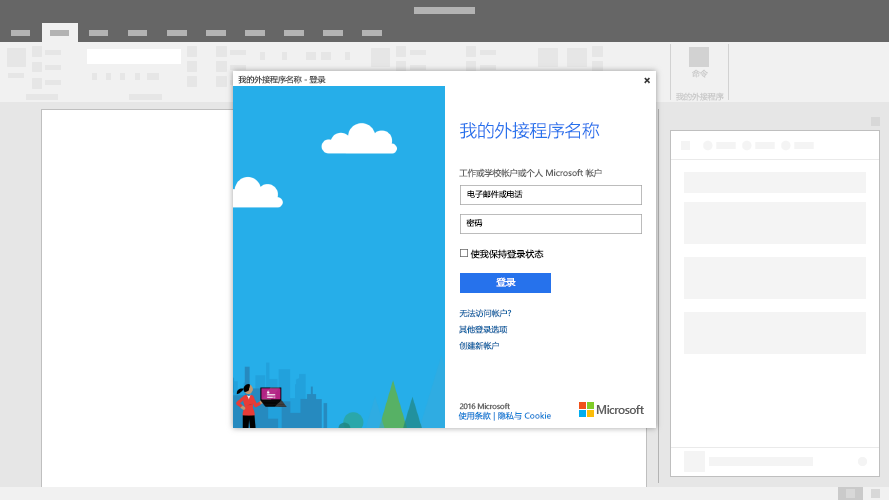

# Office 加载项中的对话框

对话框是浮动在活动的 Office 应用程序窗口之上的界面。你可以使用对话框为无法直接在任务窗格中打开的任务（例如登录页）提供额外的屏幕空间，或请求确认用户进行的操作，或显示如果局限在任务窗格中可能过小的视频。

*图 1：对话框典型布局*

## 最佳做法

|允许事项|禁止事项|
|:-----|:--------|
|<ul><li>包括包含外接程序名称以及当前任务的描述性标题。</li></ul>|<ul><li>请勿在标题中追加公司名称。</li></ul>|
||<ul><li>除非方案需要，否则请勿打开对话框。</li></ul>|

## 实现

有关实现对话框的示例，请参阅 GitHub 上的 [Office 加载项对话框 API 示例](https://github.com/OfficeDev/Office-Add-in-Dialog-API-Simple-Example)。

## 另请参阅 

- [Dialog 对象](/javascript/api/office/office.dialog)
- [适用于 Office 加载项的 UX 设计模式](../design/ux-design-pattern-templates.md)
