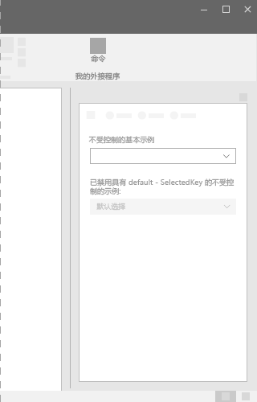
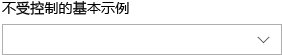
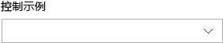

# Office UI Fabric 中的下拉组件

下拉组件是在用户单击下拉按钮后显示的选项列表。下拉列表或菜单可用于简化 UI 设计，并便于用户在 UI 内做出选择。在列表折叠后，选定项是可见的。若要更改选定项，用户可以打开列表并选择新值。
  
#### 示例：任务窗格中的下拉组件

## 最佳做法

|**允许事项**|**禁止事项**|
|:------------|:--------------|
|如果用户选择默认选定选项的可能性高于其他选项，应使用下拉组件。相比之下，选项组或单选按钮可显示所有选项，这样每个选项就同等重要。|如果用户选择每个选项的可能性都相等，不得使用下拉组件。|
|如果有多个选项可以折叠为一个字段，应使用下拉组件。另外，如果项列表很长或屏幕空间有限，也应使用下拉组件。|如果少于两个选项，不得使用下拉组件。请改用复选框。|
|在下拉组件中，应使用缩短的语句或字词。| |

## 变体

|**变体**|**说明**|**示例**|
|:------------|:--------------|:----------|
|**不受控的基本下拉组件**|当多个选项可供选择时使用。| |
|**具有 defaultSelectedKey 且已禁用的不受控下拉组件**|状态为已禁用的下拉组件。| |
|**受控下拉组件**|当默认选定项受 UI 中其他位置影响，且必须保持选定项在下拉组件中的位置时使用。| |

## 实现

有关详细信息，请参阅[下拉组件](https://dev.office.com/fabric#/components/dropdown)和 [Fabric React 代码示例入门](https://github.com/OfficeDev/Word-Add-in-GettingStartedFabricReact)。

## 另请参阅

- [用户体验设计模式](https://github.com/OfficeDev/Office-Add-in-UX-Design-Patterns-Code)
- [Office 加载项中的 Office UI Fabric](office-ui-fabric.md)
