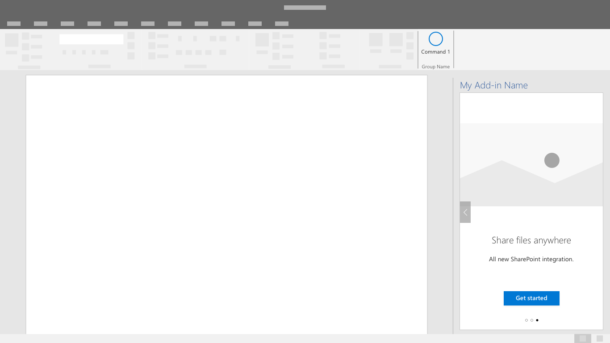
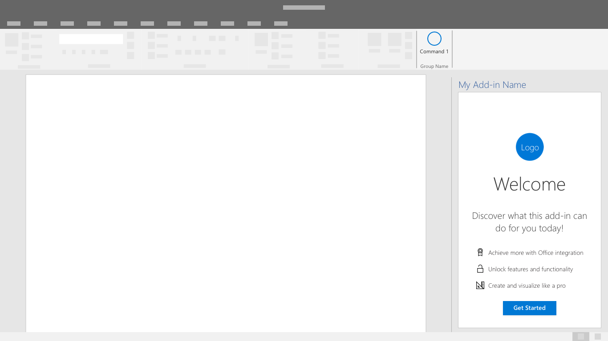

# 首次运行体验模式

首次运行体验 (FRE) 是用户对您的外接程序的介绍。 当用户第一次打开外接程序时，系统将会显示 FRE，其中提供对相应外接程序的功能、特性和/或优势的见解。 该体验有助于形成用户对外接程序的印象，对他们返回并继续使用外接程序的可能性产生强烈影响。

## 最佳做法

在制定首次运行体验时，请遵循以下最佳做法：

|允许事项|禁止事项|
|:------|:------|
|简明扼要地介绍外接程序中的主要操作。 | 不要包含与使用入门无关的信息和标注。
|让用户有机会完成一项对他们使用外接程序产生积极影响的操作。 | 不要期望用户一次了解所有内容。 专注于提供最大价值的操作。
|打造用户想要完成的有参与感的体验。 | 不要强迫用户点击首次运行体验。 为用户提供绕过首次运行体验的选项。 |

考虑是一次还是定期多次向用户显示首次运行体验是否对你的方案非常重要。 例如，如果用户仅定期使用您的外接程序，则用户可能会对外接程序不太熟悉，并且可能会受益于与首次运行体验的其他交互。

根据适用情况应用以下模式，以创建或增强外接程序的首次运行体验。

## 旋转木马

在开始使用外接程序之前，旋转木马向用户展示一系列功能或信息。

*图 1：允许用户前进或跳过旋转木马流程的开始页面。*

*图 2：仅根据有效传递信息的需要，最大限度减少您向用户展示的旋转木马屏幕数量*

*图 3：提供明确号召性用语，以退出首次运行体验。*

## 价值餐具垫

价值展示通过徽标展示位置、明确阐明的价值主张、功能亮点或摘要以及号召性用语来传达您的外接程序的价值主张。

*带有徽标的价值餐具垫、明确的价值主张，功能摘要和号召性用语。*

### 视频餐具垫

视频餐具垫在用户开始使用你的外接程序之前向其展示视频。

*图 1：首次运行餐具垫 - 屏幕包含带有播放按钮和召性用语按钮的视频静止图像。*

*图 2：视频播放器 - 用户会在对话框窗口中看到一段视频。*

