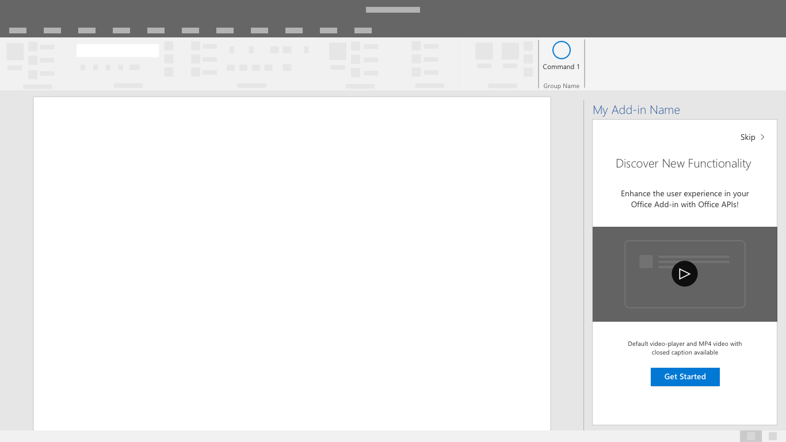

# 首次运行体验模式

首次运行体验模式 (FRE) 是对外接程序的用户介绍。 用户首次打开外接程序时，将会显示 FRE，其中提供有外接程序的函数、功能和/或权益相关的见解。 此体验有助于塑造用户对外接程序的印象，并提高用户继续使用你的外接程序的可能性。

## 最佳做法

创建首次运行体验时，请按照以下最佳做法：

|允许事项|禁止事项|
|:------|:------|
|提供了外接程序中的主要操作的简要介绍。 | 不包括与入门无关的信息和标注。
|让用户有机会完成可以积极影响其外接程序使用的操作。 | 不要期望用户可以一次性学完全部内容。 重点关注可提供最大价值的操作。
|创建用户期望完成的富有吸引力的体验。 | 不要强制用户单击使用首次运行体验。 为用户提供可绕过首次运行体验的选项。 |

向用户显示首次运行体验一次还是定期显示对你的方案来说非常重要。 例如，如果只是定期使用外接程序，则用户可能不太熟悉外接程序，因此，再次使用首次运行体验可能会有用处。

根据需要应用以下模式，以创建或提升外接程序的首次运行体验。

## 旋转式传送

旋转式传送让用户能够在开始使用外接程序之前浏览一系列功能或信息页面。

*图 1：允许用户跳过旋转式传送流的开始页面。*

*图 2：最小化向用户显示的旋转式传送屏幕的数量，仅提供其所需的信息，以有效传递信息*

*图 3：提供明确的行动号召，以退出首次运行体验。*

## 值占位图片

值占位通过徽标占位、明确的价值主张、功能亮点或汇总和行动号召传递外接程序的价值主张。

*具有徽标、明确价值主张、功能汇总和行动号召的值占位图片。*

### 视频占位图片

视频占位图片可以在用户开始使用外接程序之前向其显示视频。

*图 1：首次运行占位图片 - 该屏幕包含视频中的一个静止图像以及一个播放按钮和明确的行动号召按钮。*

*图 2：视频播放器 - 在对话窗口内向用户展示视频。*

