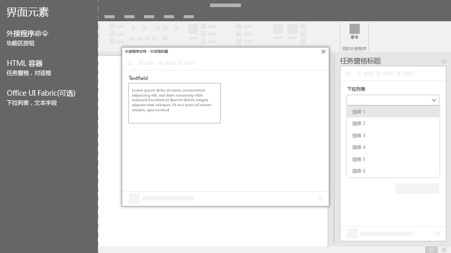

# Office 加载项的 Office UI 元素Office UI elements for Office Add-ins

可以使用几种类型的 UI 元素来扩展 Office UI，包括外接程序命令和 HTML 容器。这些 UI 元素类似于 Office 的自然扩展，并且跨平台工作。可以将基于 Web 的自定义代码插入上述任一元素。You can use several types of UI elements to extend the Office UI, including add-in commands and HTML containers. These UI elements look like a natural extension of Office and work across platforms. You can insert your custom web-based code into any of these elements.

下图显示了可以创建的 Office UI 元素的类型。The following image shows the types of Office UI elements that you can create.

## 加载项命令Add-in commands

使用[外接程序命令](add-in-commands.md)将外接程序的入口点添加到 Office 功能区。命令通过运行 JavaScript 代码，或启动 HTML 容器开始在外接程序中操作。可以创建以下两种类型的外接程序命令。Use [add-in commands](add-in-commands.md) to add entry points to your add-in to the Office ribbon. Commands start actions in your add-in either by running JavaScript code, or by launching an HTML container. You can create two types of add-in commands.

|**命令类型****Command type**|**说明****Description**|
|:---------------|:--------------|
|功能区按钮、菜单和选项卡Ribbon buttons, menus, and tabs|用于在 Office 的默认功能区中添加自定义按钮、菜单（下拉列表）或选项卡。使用 Office 中的按钮和菜单触发某一操作。使用选项卡对按钮和菜单进行分组和整理。Use to add custom buttons, menus (dropdowns), or tabs to the default ribbon in Office. Use Buttons and menus to trigger an action in Office. Use tabs to group and organize buttons and menus.|
|上下文菜单Context menus| 用于扩展默认上下文菜单。当用户用鼠标右键单击 Office 文档中的文本或 Excel 中的表时，将显示上下文菜单。Use to extend the default context menu. Context menus are displayed when users right-click text in an Office document or a table in Excel.| 

## HTML 容器HTML containers

使用 HTML 容器在 Office 客户端中嵌入基于 HTML 的 UI 代码。然后，这些网页可以引用 Office JavaScript API 以与文档中的内容进行交互。可以创建三种类型的 HTML 容器。Use HTML containers to embed HTML-based UI code within Office clients. These web pages can then reference the Office JavaScript API to interact with content in the document. You can create three types of HTML containers.

|**HTML 容器****HTML container**|**说明****Description**|
|:-----------------|:--------------|
|[任务窗格Task panes](task-pane-add-ins.md)|在 Office 文档右侧窗格中显示自定义 UI。使用任务窗格以便用户与 Office 文档并行的外接程序进行交互。Display custom UI in the right pane of the Office document. Use task panes to allow users to interact with your add-in side-by-side with the Office document.|
|[内容加载项Content add-ins](content-add-ins.md)|显示 Office 文档内嵌入的自定义 UI。使用内容外接程序以便用户直接与 Office 文档中的外接程序进行交互。例如，你可能想要显示外部内容，如其他来源的视频或数据可视化。Display custom UI embedded within Office documents. Use content add-ins to allow users to interact with your add-in directly within the Office document. For example, you might want to show external content such as videos or data visualizations from other sources. |
|[对话框Dialog boxes](dialog-boxes.md)|在覆盖 Office 文档的对话框中显示自定义 UI。对需要焦点和更多空间的交互，但不需要与文档进行并行交互的交互使用对话框。Display custom UI in a dialog box that overlays the Office document. Use a dialog box for interactions that require focus and more real estate, and do not require a side-by-side interaction with the document.|

## 另请参阅See also

- [Excel、Word 和 PowerPoint 加载项命令Add-in commands for Excel, Word, and PowerPoint](add-in-commands.md)
- [任务窗格Task panes](task-pane-add-ins.md)
- [内容外接程序Content add-ins](content-add-ins.md)
- [对话框Dialog boxes](dialog-boxes.md)
