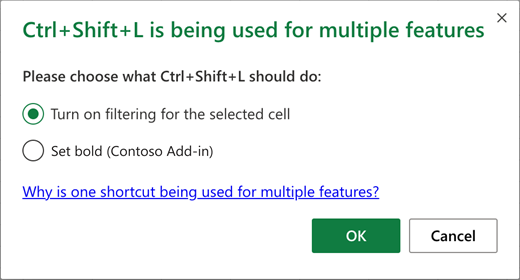
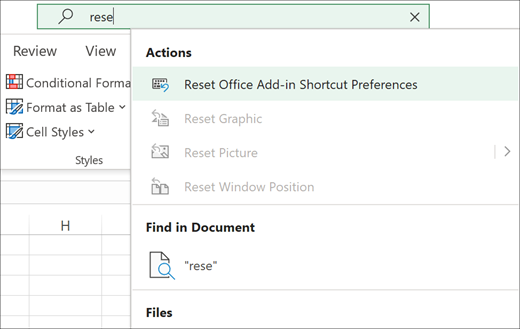

# <a name="add-custom-keyboard-shortcuts-to-your-office-add-ins"></a>将自定义键盘快捷方式添加到Office加载项

键盘快捷方式（也称为组合键）使加载项的用户能够更高效地工作。 键盘快捷方式通过提供鼠标的替代方法，还可以为残障人士改进加载项的辅助功能。

[!include[Keyboard shortcut prerequisites](../includes/keyboard-shortcuts-prerequisites.md)]

> [!NOTE]
> 若要从已启用键盘快捷方式的加载项的工作版本开始，请克隆并运行示例Excel[键盘快捷方式。](https://github.com/OfficeDev/Office-Add-in-samples/tree/main/Samples/excel-keyboard-shortcuts) 准备好向自己的加载项添加键盘快捷方式后，请继续阅读本文。

向加载项添加键盘快捷方式有三个步骤。

1. [配置加载项的清单](#configure-the-manifest)。
1. [创建或编辑快捷方式 JSON 文件](#create-or-edit-the-shortcuts-json-file) 以定义操作及其键盘快捷方式。
1. [添加](#create-a-mapping-of-actions-to-their-functions) [Office.actions.associate](/javascript/api/office/office.actions#associate) API 的一个或多个运行时调用，以将函数映射到每个操作。

## <a name="configure-the-manifest"></a>配置清单

清单有两个小更改需要进行。 一种是允许加载项使用共享运行时，另一种是指向定义键盘快捷方式的 JSON 格式文件。

### <a name="configure-the-add-in-to-use-a-shared-runtime"></a>将外接程序配置为使用共享运行时

添加自定义键盘快捷方式要求加载项使用共享运行时。 有关详细信息，请 [配置外接程序以使用共享运行时](../develop/configure-your-add-in-to-use-a-shared-runtime.md)。

### <a name="link-the-mapping-file-to-the-manifest"></a>将映射文件链接到清单

在 *紧* (不在) 元素内，添加 `<VersionOverrides>` [ExtendedOverrides](../reference/manifest/extendedoverrides.md) 元素。 将 `Url` 属性设置为项目中将在稍后步骤创建的 JSON 文件的完整 URL。

```xml
    ...
    </VersionOverrides>  
    <ExtendedOverrides Url="https://contoso.com/addin/shortcuts.json"></ExtendedOverrides>
</OfficeApp>
```

## <a name="create-or-edit-the-shortcuts-json-file"></a>创建或编辑快捷方式 JSON 文件

在项目中创建 JSON 文件。 确保文件的路径与为 `Url` [ExtendedOverrides](../reference/manifest/extendedoverrides.md) 元素的 属性指定的位置相匹配。 此文件将描述键盘快捷方式以及这些快捷方式将调用的操作。

1. 在 JSON 文件中，有两个数组。 actions 数组将包含定义要调用的操作的对象，快捷方式数组将包含将键组合映射到操作的对象。 以下是示例。
    ```json
    {
        "actions": [
            {
                "id": "SHOWTASKPANE",
                "type": "ExecuteFunction",
                "name": "Show task pane for add-in"
            },
            {
                "id": "HIDETASKPANE",
                "type": "ExecuteFunction",
                "name": "Hide task pane for add-in"
            }
        ],
        "shortcuts": [
            {
                "action": "SHOWTASKPANE",
                "key": {
                    "default": "Ctrl+Alt+Up"
                }
            },
            {
                "action": "HIDETASKPANE",
                "key": {
                    "default": "Ctrl+Alt+Down"
                }
            }
        ]
    }
    ```

    有关 JSON 对象详细信息，请参阅 [构造操作](#construct-the-action-objects) 对象和 [构造快捷方式对象](#construct-the-shortcut-objects)。 快捷方式 JSON 的完整架构位于 [extended-manifest.schema.json 中](https://developer.microsoft.com/json-schemas/office-js/extended-manifest.schema.json)。

    > [!NOTE]
    > 可以在整个文章中使用"CONTROL"来表示"Ctrl"。

    在稍后的步骤中，操作本身将映射到您编写的函数。 此示例稍后将 SHOWTASKPANE 映射到调用 方法的函数， `Office.addin.showAsTaskpane` 将 HIDETASKPANE 映射到调用 该方法 `Office.addin.hide` 的函数。

## <a name="create-a-mapping-of-actions-to-their-functions"></a>创建操作到其函数的映射

1. 在项目中，打开 元素中的 HTML 页面加载的 JavaScript `<FunctionFile>` 文件。
1. 在 JavaScript 文件中，使用[Office.actions.associate](/javascript/api/office/office.actions#associate) API 将 JSON 文件中指定的每个操作映射到 JavaScript 函数。 将以下 JavaScript 添加到文件中。 关于代码，请注意以下几点。

    - 第一个参数是 JSON 文件的操作之一。
    - 第二个参数是当用户按下映射到 JSON 文件中操作的组合键时运行的函数。

    ```javascript
    Office.actions.associate('-- action ID goes here--', function () {

    });
    ```

1. 若要继续此示例，请使用 `'SHOWTASKPANE'` 作为第一个参数。
1. 对于函数的正文，使用[Office.addin.showAsTaskpane](/javascript/api/office/office.addin#showAsTaskpane__)方法打开加载项的任务窗格。 完成后，代码应如下所示：

    ```javascript
    Office.actions.associate('SHOWTASKPANE', function () {
        return Office.addin.showAsTaskpane()
            .then(function () {
                return;
            })
            .catch(function (error) {
                return error.code;
            });
    });
    ```

1. 添加函数的第二个调用，以将操作映射到调用 `Office.actions.associate` `HIDETASKPANE` [Office.addin.hide 的函数](/javascript/api/office/office.addin#hide__)。 示例如下。

    ```javascript
    Office.actions.associate('HIDETASKPANE', function () {
        return Office.addin.hide()
            .then(function () {
                return;
            })
            .catch(function (error) {
                return error.code;
            });
    });
    ```

按照前面的步骤，加载项可通过按 **Ctrl+Alt+Up** 和 **Ctrl+Alt+Down 切换任务窗格的可见性**。 同一行为显示在 Excel[](https://github.com/OfficeDev/Office-Add-in-samples/tree/main/Samples/excel-keyboard-shortcuts)外接程序 PnP Office中的键盘快捷方式示例GitHub。

## <a name="details-and-restrictions"></a>详细信息和限制

### <a name="construct-the-action-objects"></a>构造操作对象

指定 shortcuts.json 数组中的对象时，请使用以下 `actions` 准则。

- 属性名 `id` 和 `name` 是必需的。
- `id`属性用于唯一标识使用键盘快捷方式调用的操作。
- `name`属性必须是描述操作的用户友好字符串。 它必须是字符 A - Z、a - z、0 - 9 和标点符号"-"、"_"和"+"的组合。
- 属性是可选的。 当前仅 `ExecuteFunction` 支持类型。

示例如下。

```json
    "actions": [
        {
            "id": "SHOWTASKPANE",
            "type": "ExecuteFunction",
            "name": "Show task pane for add-in"
        },
        {
            "id": "HIDETASKPANE",
            "type": "ExecuteFunction",
            "name": "Hide task pane for add-in"
        }
    ]
```

快捷方式 JSON 的完整架构位于 [extended-manifest.schema.json 中](https://developer.microsoft.com/json-schemas/office-js/extended-manifest.schema.json)。

### <a name="construct-the-shortcut-objects"></a>构造快捷方式对象

指定 shortcuts.json 数组中的对象时，请使用以下 `shortcuts` 准则。

- 属性名称 `action` 、 `key` 和 `default` 是必需的。
- 该属性的值 `action` 是一个字符串，并且必须与 action 对象 `id` 中的某个属性匹配。
- 该属性 `default` 可以是字符 A - Z、-z、0 - 9 和标点符号"-"、"_"和"+"的任意组合。  (根据惯例，这些属性中不使用小写字母。) 
- 属性 `default` 必须包含至少一个修饰符键的名称 (Alt、Ctrl、Shift) 一个其他键。
- Shift 不能用作唯一的修改键。 将 Shift 与 Alt 或 Ctrl 组合使用。
- 对于 Mac，我们还支持 Command 修饰符键。
- 对于 Mac，Alt 映射到 Option 键。 对于Windows，Command 将映射到 Ctrl 键。
- 当两个字符链接到标准键盘中的同一个物理键时，它们是 属性中的同义词;例如，Alt+a 和 Alt+A 是同一快捷方式 `default` ，Ctrl+- 和 Ctrl+ 也是，因为 \_ "-"和"_"是同一个物理键。
- "+"字符指示同时按下其任一侧的键。

示例如下。

```json
    "shortcuts": [
        {
            "action": "SHOWTASKPANE",
            "key": {
                "default": "Ctrl+Alt+Up"
            }
        },
        {
            "action": "HIDETASKPANE",
            "key": {
                "default": "Ctrl+Alt+Down"
            }
        }
    ]
```

快捷方式 JSON 的完整架构位于 [extended-manifest.schema.json 中](https://developer.microsoft.com/json-schemas/office-js/extended-manifest.schema.json)。

> [!NOTE]
> 键提示（也称为连续键快捷方式，例如用于选择填充颜色的 Excel 快捷方式 **Alt+H、H）** 在 Office 外接程序中不受支持。

## <a name="avoid-key-combinations-in-use-by-other-add-ins"></a>避免其他加载项使用组合键

有许多键盘快捷方式已被应用Office。 避免为已在使用的加载项注册键盘快捷方式，但在某些情况下，可能需要替代现有的键盘快捷方式或处理注册了相同键盘快捷方式的多个加载项之间的冲突。

如果发生冲突，用户将在第一次尝试使用冲突的键盘快捷方式时看到一个对话框。 请注意，此对话框中显示的外接程序选项文本来自 file 中的 `name` action 对象中的 `shortcuts.json` 属性。



用户可以选择键盘快捷方式将执行的操作。 做出选择后，保存首选项，供将来使用同一快捷方式。 快捷方式首选项按用户、平台保存。 如果用户希望更改其首选项，他们可以从"告诉我"搜索框中调用"重置Office外接程序快捷方式 **首选项"命令**。 调用命令可清除用户的所有加载项快捷方式首选项，并且用户下次尝试使用冲突快捷方式时，会再次看到冲突对话框提示。



为了获得最佳用户体验，我们建议您尽量减少与这些Excel冲突。

- 请仅使用以下模式的键盘快捷方式： **Ctrl+Shift+Alt+* x***，其中 *x* 是一些其他键。
- 如果您需要更多键盘快捷方式，请检查Excel[键盘](https://support.microsoft.com/office/1798d9d5-842a-42b8-9c99-9b7213f0040f)快捷方式的列表，并避免在外接程序中使用它们。
- 当键盘焦点位于加载项 UI 内时 **，Ctrl+空格** 键和 **Ctrl+Shift+F10** 将不起作用，因为这些都是基本的辅助功能快捷方式。
- 在 Windows 或 Mac 计算机上，如果"重置 Office 外接程序快捷方式首选项"命令在搜索菜单上不可用，则用户可以通过通过上下文菜单自定义功能区，将该命令手动添加到功能区。

## <a name="customize-the-keyboard-shortcuts-per-platform"></a>自定义每个平台的键盘快捷方式

可以自定义特定于平台的快捷方式。 下面是自定义以下每个平台的快捷方式的对象示例 `shortcuts` `windows` `mac` ：、、。 `web` 请注意，您仍必须具有 `default` 每个快捷方式的快捷键。

在下面的示例中， `default` 键是未指定的任何平台的回退键。 唯一未指定的平台Windows，因此 `default` 该密钥仅适用于Windows。

```json
    "shortcuts": [
        {
            "action": "SHOWTASKPANE",
            "key": {
                "default": "Ctrl+Alt+Up",
                "mac": "Command+Shift+Up",
                "web": "Ctrl+Alt+1",
            }
        },
        {
            "action": "HIDETASKPANE",
            "key": {
                "default": "Ctrl+Alt+Down",
                "mac": "Command+Shift+Down",
                "web": "Ctrl+Alt+2"
            }
        }
    ]
```

## <a name="localize-the-keyboard-shortcuts-json"></a>本地化键盘快捷方式 JSON

如果加载项支持多个区域设置，则需要本地化 `name` action 对象的 属性。 此外，如果加载项支持的任何区域设置具有不同的字母或书写系统，因此使用不同的键盘，则你可能还需要本地化快捷方式。 若要了解如何本地化键盘快捷方式 JSON，请参阅 [本地化扩展替代](../develop/localization.md#localize-extended-overrides)。

## <a name="browser-shortcuts-that-cannot-be-overridden"></a>无法重写的浏览器快捷方式

在 Web 上使用自定义键盘快捷方式时，外接程序无法覆盖浏览器所使用的某些键盘快捷方式。此列表是一项正在进行中的工作。 如果发现无法覆盖的其他组合，请使用此页面底部的反馈工具告诉我们。

- Ctrl+N
- Ctrl+Shift+N
- Ctrl+T
- Ctrl+Shift+T
- Ctrl+W
- Ctrl+PgUp/PgDn

## <a name="enable-custom-keyboard-shortcuts-for-specific-users-preview"></a>为特定用户启用自定义键盘快捷方式 (预览) 

通过外接程序，用户可以将外接程序的操作重新分配给备用键盘组合。

> [!IMPORTANT]
> 本节中所述的功能目前处于预览阶段，可能会更改。 暂不支持在生产环境中使用。 若要试用预览功能，你需要加入预览体验Office[计划](https://insider.office.com/join)。
> 试用预览版功能的好方法是使用 Microsoft 365 订阅。 如果还没有 Microsoft 365 订阅，可以通过加入[Microsoft 365 开发人员计划](https://developer.microsoft.com/office/dev-program)获取一个订阅。

> [!NOTE]
> 本节中所述的 API 需要 [KeyboardShortcuts 1.1](../reference/requirement-sets/keyboard-shortcuts-requirement-sets.md) 要求集。

使用[Office.actions.replaceShortcuts](/javascript/api/office/office.actions#replaceShortcuts)方法将用户的自定义键盘组合分配给您的外接程序操作。 方法采用类型 参数，其中 是必须在加载项扩展清单 JSON 中定义的操作 `{[actionId:string]: string|null}` `actionId` ID 的子集。 值是用户的首选组合键。 值还可以是 ，这将删除任何自定义项，并恢复为在加载项扩展清单 JSON 中定义的默认键盘 `null` `actionId` 组合。

如果用户登录到 Office，自定义组合将保存在每个平台的用户漫游设置中。 匿名用户当前不支持自定义快捷方式。

```javascript
const userCustomShortcuts = {
    SHOWTASKPANE:"CTRL+SHIFT+1", 
    HIDETASKPANE:"CTRL+SHIFT+2"
};
Office.actions.replaceShortcuts(userCustomShortcuts)
    .then(function () {
        console.log("Successfully registered.");
    })
    .catch(function (ex) {
        if (ex.code == "InvalidOperation") {
            console.log("ActionId does not exist or shortcut combination is invalid.");
        }
    });
```

若要了解用户已在使用哪些快捷方式，请调用[Office.actions.getShortcuts](/javascript/api/office/office.actions#getShortcuts)方法。 此方法返回一个类型 为 的对象，其中值表示用户必须用于调用指定 `[actionId:string]:string|null}` 操作的当前键盘组合。 这些值可能来自三个不同的源：

- 如果快捷方式存在冲突，并且用户已选择对此键盘组合使用不同的操作 (本机或其他外接程序) ，则返回的值将为 ，因为快捷方式已被覆盖，并且用户当前没有可用于调用该外接程序操作的任何键盘组合。 `null`
- 如果已使用[Office.actions.replaceShortcuts](/javascript/api/office/office.actions#replaceShortcuts)方法自定义快捷方式，则返回的值将是自定义的键盘组合。
- 如果快捷方式尚未重写或自定义，它将从外接程序的扩展清单 JSON 中返回值。

示例如下。

```javascript
Office.actions.getShortcuts()
    .then(function (userShortcuts) {
       for (const action in userShortcuts) {
           let shortcut = userShortcuts[action];
           console.log(action + ": " + shortcut);
       }
    });

```

如 [避免其他加载项](#avoid-key-combinations-in-use-by-other-add-ins)使用的键组合中所述，避免在快捷方式中发生冲突是一种好的做法。 若要发现一个或多个组合键是否已被使用，请将它们[作为字符串数组传递给 Office.actions.areShortcutsInUse](/javascript/api/office/office.actions#areShortcutsInUse)方法。 方法返回一个包含键组合的报表，这些组合键以类型 为 的对象数组的形式使用 `{shortcut: string, inUse: boolean}` 。 该属性 `shortcut` 是组合键，例如"Ctrl+Shift+1"。 如果组合已注册到另一个操作， `inUse` 则该属性设置为 `true` 。 例如，`[{shortcut: "CTRL+SHIFT+1", inUse: true}, {shortcut: "CTRL+SHIFT+2", inUse: false}]`。 以下代码段是一个示例：

```javascript
const shortcuts = ["CTRL+SHIFT+1", "CTRL+SHIFT+2"];
Office.actions.areShortcutsInUse(shortcuts)
    .then(function (inUseArray) {
        const availableShortcuts = inUseArray.filter(function (shortcut) { return !shortcut.inUse; });
        console.log(availableShortcuts);
        const usedShortcuts = inUseArray.filter(function (shortcut) { return shortcut.inUse; });
        console.log(usedShortcuts);
    });

```

## <a name="next-steps"></a>后续步骤

- 请参阅[Excel键盘快捷方式](https://github.com/OfficeDev/Office-Add-in-samples/tree/main/Samples/excel-keyboard-shortcuts)示例外接程序。
- 获取有关使用清单的扩展替代 [中的扩展覆盖的概述](../develop/extended-overrides.md)。
