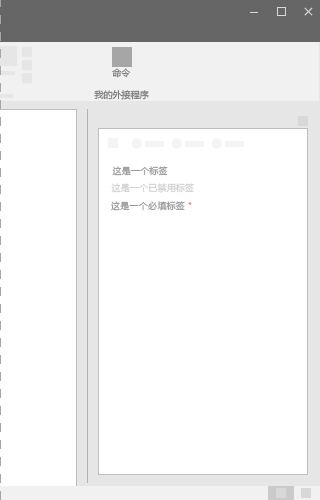
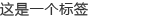
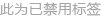
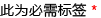

# Office UI Fabric 中的标签组件

标签可用于指定一个或多个组件的名称或标题。如果与其他一个或多个组件搭配使用，标签组件应与一个或多个相关组件非常邻近。一些组件有预定义标签，如下拉组件或切换组件。
  
#### 示例：任务窗格中的标签组件

## 最佳做法

|**允许事项**|**不应做**|
|:------------|:--------------|
|句子应区分大小写，例如“First name”。|标题不应区分大小写，例如“First Name”。|
|应简明扼要。|不应使用完整的句子或复杂的标点符号，如冒号或分号。|
|向组件添加标签时，请使用名词或简短的名词短语作为标签文本。| |

## 变体

|**变体**|**说明**|**示例**|
|:------------|:--------------|:----------|
|**默认标签**|用于标准标签。| |
|**禁用的标签**|当相关组件禁用时使用。| |
|**需要的标签**|当需要相关组件时使用。| |

## 实现

有关详细信息，请参阅[标签](https://dev.office.com/fabric#/components/label)和 [Fabric React 代码示例入门](https://github.com/OfficeDev/Word-Add-in-GettingStartedFabricReact)。

## 另请参阅

- [用户体验设计模式](https://github.com/OfficeDev/Office-Add-in-UX-Design-Patterns-Code)
- [Office 加载项中的 Office UI Fabric](office-ui-fabric.md)
