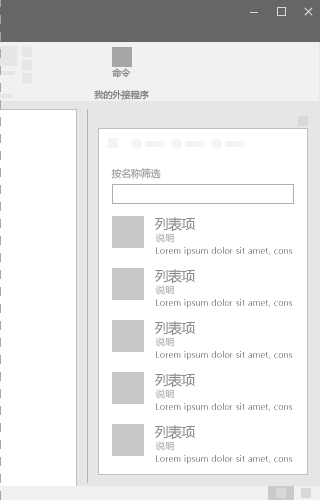
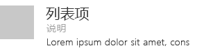

# Office UI Fabric 中的列表组件

列表可在与大型内容集合交互时提供一致的布局，即使内容拥有大量文本。列表允许用户轻松地浏览内容。 
  
#### 示例：任务窗格中的列表

## 最佳做法

- 在下列情况下，列表中的各个条目以句点结尾：
  - 所有条目都是完整句子。
  - 一个或多个条目包含段落和提供其他信息的完整句子。
  - 条目全都是引导句子或段落。
- 用标题隔开页面上的连续列表。

## 变体

|**变体**|**说明**|**示例**|
|:------------|:--------------|:----------|
|**网格列表**|当每个列表项需要详细信息时使用。| |
|**可变高度项列表**|当需要大型图像和文本时使用。| |

## 实现

有关详细信息，请参阅[列表](https://dev.office.com/fabric#/components/list)和 [Fabric React 代码示例入门](https://github.com/OfficeDev/Word-Add-in-GettingStartedFabricReact)。

## 另请参阅

- [用户体验设计模式](https://github.com/OfficeDev/Office-Add-in-UX-Design-Patterns-Code)
- [Office 加载项中的 Office UI Fabric](office-ui-fabric.md)
