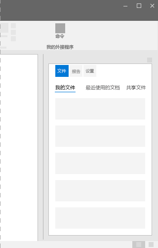

# Office UI Fabric 中的透视组件

透视组件可快速导航到经常访问的内容。使用透视组件，可以在两个或多个内容视图之间导航。文本标题指定了透视组件各部分中包含的内容。透视组件各部分中的内容可能属于不同的内容类别。在 Office 加载项中，请结合使用透视控件和选项卡样式。选项卡可以结合使用图标和文本来传达选项卡所含内容的类型。 

#### 示例：任务窗格中的透视组件

## 最佳做法

|**允许事项**|**禁止事项**|
|:------------|:--------------|
|导航标签应当简洁明了，最好仅使用一两个单词，而非一个短语。|不应使用完整句子或复杂标点符号（如冒号或分号）。|
|应在屏幕上暂留透视组件标题，即使已选择其他选项卡，也不例外。| |
|应将透视控件限制为 3 到 5 个选项卡。| |
|应将透视组件用作页面顶部附近的导航元素。不得将透视组件混入页面内容。| |
|应在需要大幅滚动且包含很多内容的页面上使用透视组件。| |

## 变体

|**变体**|**说明**|**示例**|
|:------------|:--------------|:----------|
|**基本示例**|用作默认透视组件选项。| |
|**选项卡样式链接**|当首选选项卡样式透视按钮时使用。| |

## 实现

有关详细信息，请参阅[透视](https://dev.office.com/fabric#/components/pivot)和 [Fabric React 代码示例入门](https://github.com/OfficeDev/Word-Add-in-GettingStartedFabricReact)。

## 另请参阅

- [用户体验设计模式](https://github.com/OfficeDev/Office-Add-in-UX-Design-Patterns-Code)
- [Office 加载项中的 Office UI Fabric](office-ui-fabric.md)
