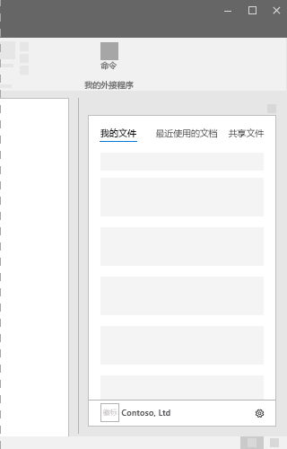

# Office 加载项中的任务窗格
 
任务窗格是接口图面，通常出现在 Word、PowerPoint、Excel 和 Outlook 中窗口的右侧。使用任务窗格，用户可以访问接口控件，以运行代码来修改文档或电子邮件，或显示数据源中的数据。如果不需要将功能直接嵌入文档，请使用任务窗格。

*图 1：典型任务窗格布局*

## 最佳做法

|**允许事项**|**禁止事项**|
|:-----|:--------|
|<ul><li>在标题中包括外接程序的名称。</li></ul>|<ul><li>请勿在标题中追加公司名称。</li></ul>|
|<ul><li>在标题中使用简短的描述性名称。</li></ul>|<ul><li>不要将字符串（例如 "外接程序"、"for Word" 或 "for Office"）追加到外接程序的标题。</li></ul>|
|<ul><li>在加载项顶部包括某些导航或命令元素，如命令栏或透视。</li></ul>||
|<ul><li>在外接程序底部包括品牌元素，如品牌栏，除非要在 Outlook 内使用外接程序。</li></ul>||

## 变量

以下图像显示了使用 Office 应用功能区的1366x768 分辨率的各种任务窗格大小。对于 Excel，需要额外的垂直空间来容纳编辑栏。  

*图 2：Office 2016 桌面任务窗格尺寸*

- Excel - 320 x 455
- PowerPoint - 320 x 531
- Word - 320 x 531
- Outlook - 348x535

 

*图3。Office 任务窗格大小*

- Excel - 350 x 378
- PowerPoint - 348x391
- Word - 329 x 445
- Outlook（网页版）- 320x570

## “个性”菜单

“个性”菜单可能会妨碍靠近外接程序右上角的导航和命令元素。以下是 Windows 和 Mac 上的“个性”菜单的当前尺寸。

对于 Windows，个性菜单尺寸为 12x32 像素，如下所示。

*图 4：Windows 上的个性菜单*

对于 Mac，“个性”菜单尺寸为 26x26 像素，但是从右侧浮动 8 个像素，再从顶部浮动 6 个像素，能将空间增加至 34x32 像素，如下所示。

*图 5：Mac 上的个性菜单*

## 实现

有关实现任务窗格的示例，请参阅 GitHub 上的 [Excel 加载项 JS WoodGrove 支出趋势](https://github.com/OfficeDev/Excel-Add-in-WoodGrove-Expense-Trends)。 

## 另请参阅

- [Office 加载项中的 Office UI Fabric](office-ui-fabric.md) 
- [适用于 Office 外接程序的 UX 设计模式](../design/ux-design-pattern-templates.md)

