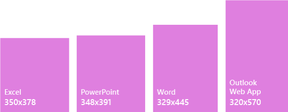

# Office ?????????Task panes in Office Add-ins
 
??????????????? Word?PowerPoint?Excel ? Outlook ???????????????????????????????????????????????????????????????????????????Task panes are interface surfaces that typically appear on the right side of the window within Word, PowerPoint, Excel, and Outlook. Task panes give users access to interface controls that run code to modify documents or emails, or display data from a data source. Use task panes when you don't need to embed functionality directly into the document.

*? 1?????????**Figure 1. Typical task pane layout*

## ????Best practices

|**????****Do**|**????****Don't**|
|:-----|:--------|
|<ul><li>??????????????Include the name of your add-in in the title.</li></ul>|<ul><li>?????????????Don't append your company name to the title.</li></ul>|
|<ul><li>???????????????Use short descriptive names in the title.</li></ul>|<ul><li>?????????????Add-in???For Word???for Office??????Don't append strings such as ?Add-in,? ?For Word,? or ?for Office? to the title of your add-in.</li></ul>|
|<ul><li>???????????????????????????Include some navigational or commanding element such as the CommandBar or Pivot at the top of your add-in.</li></ul>||
|<ul><li>??????????????????????? Outlook ????????Include a branding element such as the BrandBar at the bottom of your add-in unless your add-in is to be used within Outlook.</li></ul>||

## ??Variants

???????? 1366x768 ? Office ??????????????? Excel?????????????????The following images show the various task pane sizes with the Office ribbon at a 1366x768 resolution. For Excel, additional vertical space is required to accommodate the formula bar.  

*? 2?Office 2016 ????????**Figure 2. Office 2016 desktop task pane sizes*

- Excel - 320 x 455Excel - 320x455
- PowerPoint - 320 x 531PowerPoint - 320x531
- Word - 320 x 531Word - 320x531
- Outlook - 348x535Outlook - 348x535

 

*? 3?Office 365 ??????**Figure 3. Office 365 task pane sizes*

- Excel - 350 x 378Excel - 350x378
- PowerPoint - 348x391PowerPoint - 348x391
- Word - 329 x 445Word - 329x445
- Outlook Web ?? - 320x570Outlook Web App - 320x570

## ??????Personality menu

???????????????????????????????? Windows ? Mac ??????????????Personality menus can obstruct navigational and commanding elements located near the top right of the add-in. The following are the current dimensions of the personality menu on Windows and Mac.

?? Windows???????? 12x32 ????????For Windows, the personality menu measures 12x32 pixels, as shown.

*? 4?Windows ??????**Figure 4. Personality menu on Windows*

?? Mac?????????? 26x26 ?????????? 8 ?????????? 6 ??????????? 34x32 ????????For Mac, the personality menu measures 26x26 pixels, but floats 8 pixels in from the right and 6 pixels from the top, which increases the space to 34x32 pixels, as shown.

*? 5?Mac ??????**Figure 5. Personality menu on Mac*

## ??Implementation

??????????????? GitHub ?? [Excel ??? JS WoodGrove ????](https://github.com/OfficeDev/Excel-Add-in-WoodGrove-Expense-Trends)?For a sample that implements a task pane, see [Excel Add-in JS WoodGrove Expense Trends](https://github.com/OfficeDev/Excel-Add-in-WoodGrove-Expense-Trends) on GitHub. 

## ????See also

- [Office ????? Office UI FabricOffice UI Fabric in Office Add-ins](office-ui-fabric.md) 
- [??? Office ????? UX ????UX design patterns for Office Add-ins](https://github.com/OfficeDev/Office-Add-in-UX-Design-Patterns-Code)

