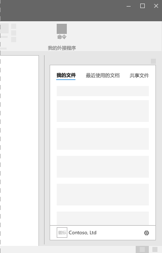

# Office 加载项中的任务窗格Task panes in Office Add-ins
 
任务窗格是接口图面，通常出现在 Word、PowerPoint、Excel 和 Outlook 中窗口的右侧。使用任务窗格，用户可以访问接口控件，以运行代码来修改文档或电子邮件，或显示数据源中的数据。如果不需要将功能直接嵌入文档，请使用任务窗格。Task panes are interface surfaces that typically appear on the right side of the window within Word, PowerPoint, Excel, and Outlook. Task panes give users access to interface controls that run code to modify documents or emails, or display data from a data source. Use task panes when you don't need to embed functionality directly into the document.

*图 1：典型任务窗格布局**Figure 1. Typical task pane layout*

## 最佳做法Best practices

|**允许事项****Do**|**禁止事项****Don't**|
|:-----|:--------|
|<ul><li>在标题中包括外接程序的名称。Include the name of your add-in in the title.</li></ul>|<ul><li>请勿在标题中追加公司名称。Don't append your company name to the title.</li></ul>|
|<ul><li>在标题中使用简短的描述性名称。Use short descriptive names in the title.</li></ul>|<ul><li>不要在外接程序标题中追加“Add-in”、“For Word”或“for Office”等字符串。Don't append strings such as “Add-in,” “For Word,” or “for Office” to the title of your add-in.</li></ul>|
|<ul><li>在外接程序顶部包括某些导航或命令元素，如命令栏或透视。Include some navigational or commanding element such as the CommandBar or Pivot at the top of your add-in.</li></ul>||
|<ul><li>在外接程序底部包括品牌元素，如品牌栏，除非要在 Outlook 内使用外接程序。Include a branding element such as the BrandBar at the bottom of your add-in unless your add-in is to be used within Outlook.</li></ul>||

## 变量Variants

下图显示分辨率为 1366x768 时 Office 功能区的各种任务窗格大小。对于 Excel，需要额外的垂直空间来容纳编辑栏。The following images show the various task pane sizes with the Office ribbon at a 1366x768 resolution. For Excel, additional vertical space is required to accommodate the formula bar.  

*图 2：Office 2016 桌面任务窗格尺寸**Figure 2. Office 2016 desktop task pane sizes*

- Excel - 320 x 455Excel - 320x455
- PowerPoint - 320 x 531PowerPoint - 320x531
- Word - 320 x 531Word - 320x531
- Outlook - 348x535Outlook - 348x535

 

*图 3：Office 365 任务窗格大小**Figure 3. Office 365 task pane sizes*

- Excel - 350 x 378Excel - 350x378
- PowerPoint - 348x391PowerPoint - 348x391
- Word - 329 x 445Word - 329x445
- Outlook Web 应用 - 320x570Outlook Web App - 320x570

## “个性”菜单Personality menu

“个性”菜单可能会妨碍靠近外接程序右上角的导航和命令元素。以下是 Windows 和 Mac 上的“个性”菜单的当前尺寸。Personality menus can obstruct navigational and commanding elements located near the top right of the add-in. The following are the current dimensions of the personality menu on Windows and Mac.

对于 Windows，个性菜单尺寸为 12x32 像素，如下所示。For Windows, the personality menu measures 12x32 pixels, as shown.

*图 4：Windows 上的个性菜单**Figure 4. Personality menu on Windows*

对于 Mac，“个性”菜单尺寸为 26x26 像素，但是从右侧浮动 8 个像素，再从顶部浮动 6 个像素，能将空间增加至 34x32 像素，如下所示。For Mac, the personality menu measures 26x26 pixels, but floats 8 pixels in from the right and 6 pixels from the top, which increases the space to 34x32 pixels, as shown.

*图 5：Mac 上的个性菜单**Figure 5. Personality menu on Mac*

## 实现Implementation

有关实现任务窗格的示例，请参阅 GitHub 上的 [Excel 加载项 JS WoodGrove 支出趋势](https://github.com/OfficeDev/Excel-Add-in-WoodGrove-Expense-Trends)。For a sample that implements a task pane, see [Excel Add-in JS WoodGrove Expense Trends](https://github.com/OfficeDev/Excel-Add-in-WoodGrove-Expense-Trends) on GitHub. 

## 另请参阅See also

- [Office 加载项中的 Office UI FabricOffice UI Fabric in Office Add-ins](office-ui-fabric.md) 
- [适用于 Office 外接程序的 UX 设计模式UX design patterns for Office Add-ins](https://github.com/OfficeDev/Office-Add-in-UX-Design-Patterns-Code)

