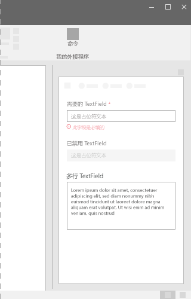
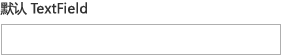
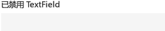
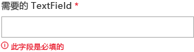
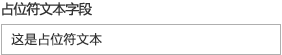
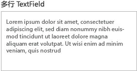

# Office UI Fabric 中的文本字段组件

使用文本字段，用户可以键入文本。它通常用于捕获单行文本，但也可以配置为捕获多行文本。文本以简单的统一格式显示在屏幕上。
  
#### 示例：任务窗格中的文本字段组件

## 最佳做法

|**允许事项**|**不应做**|
|:------------|:--------------|
|应使用文本字段接受表单或页面上的数据输入。|不应使用文本字段在页面的正文元素中呈现基本副本。|
|应用实用名称标记文本字段。|不应将文本字段用于输入日期或时间。 请改用日期/时间选取器。|
|应使用简洁的占位符文本，指定应输入哪些内容。|如果可以预定义有效的输入选项，不得使用文本字段。应改用下拉组件。|
|应提供文本字段的所有相应状态（静态、鼠标悬停、焦点、交互、不可用、错误）。||
|应明确标记必填和可选文本字段。||
|应尽量根据预期数据格式设置文本字段格式。例如，若要捕获 10 位数电话号码，应使用 3 个单独字段来存储电话号码的不同部分。||

## 变体

|**变体**|**说明**|**示例**|
|:------------|:--------------|:----------|
|**默认 TextField**|用作默认的文本字段。| |
|**已禁用 TextField**|当文本字段处于禁用状态时使用。| |
|**必填 TextField**|当必须在文本字段中输入内容时使用。| |
|**带有占位符的 TextField**|当需要占位符文本时使用。| |
|**多行的 TextField**|当需要多行文本时使用。| |

## 实现

有关详细信息，请参阅[文本字段](https://dev.office.com/fabric#/components/textfield)和 [Fabric React 代码示例入门](https://github.com/OfficeDev/Word-Add-in-GettingStartedFabricReact)。

## 另请参阅

- [用户体验设计模式](https://github.com/OfficeDev/Office-Add-in-UX-Design-Patterns-Code)
- [Office 加载项中的 Office UI Fabric](office-ui-fabric.md)
