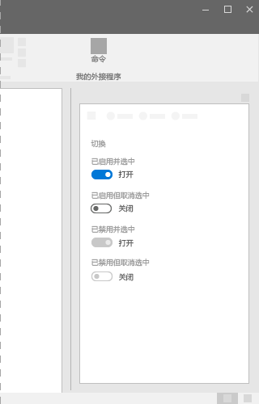
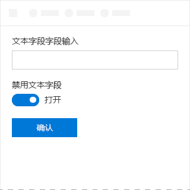

# Office UI Fabric 中的切换组件

切换组件表示用于启用或禁用功能的物理开关。切换组件可用于提供两个互斥选项（例如，开或关），选择选项后就会立即执行操作。
  
#### 示例：任务窗格中的切换组件

## 最佳做法

|**允许事项**|**不应做**|
|:------------|:--------------|
|如果更改会立即应用，应对二项设置使用切换组件。   |如果用户必须执行额外步骤，更改才能生效，不应使用切换组件。   |
|仅在设置要使用多个特定标签时，才替换“开”****和“关”****标签。应使用短（3-4 个字符）标签表示二元对立因素。| |

## 变体

|**变体**|**说明**|**示例**|
|:------------|:--------------|:----------|
|**已启用并选中**|当切换的状态处于活动时使用。| |
|**已启用但取消选中**|当切换的状态处于非活动时使用。| |
|**已禁用并选中**|不能更改活动状态时使用。| |
|**已禁用但取消选中**|无法更改非活动状态时使用。| |

## 实现

有关详细信息，请参阅[切换](https://dev.office.com/fabric#/components/toggle)和 [Fabric React 代码示例入门](https://github.com/OfficeDev/Word-Add-in-GettingStartedFabricReact)。

## 另请参阅

- [用户体验设计模式](https://github.com/OfficeDev/Office-Add-in-UX-Design-Patterns-Code)
- [Office 加载项中的 Office UI Fabric](office-ui-fabric.md)
