# Office 外接程序的交互模式

Office 外接程序可以增强创作和生产体验，以及将 Office 主机应用程序中的内容连接到基于大型 Web 的工作流。大量的常见方案适用于您可以开发的内容、任务窗格和 Outlook 外接程序。本文介绍了一些最常见的方案并为外接程序 UX 提供建议的交互模式。您可以分解、组合或混合和匹配这些交互模式，具体取决于您的独特应用场景。

 **常见的外接程序方案**

| 外接程序类型 | 常见方案 |
| ------ | ------ |
|  内容  |  可视化数据   小组件和工具  |
|  任务窗格  |  转换和处理数据   有效且高效地创作   定位内容和插入数据   向 Web 服务发布或上载内容  |
|  Outlook  |  桥接邮件内容和外部应用程序   提供邮件或约会中内容的详细信息   提供帮助您提高工作效率的信息  |

## 使用内容外接程序将数据可视化

本示例说明从电子表格数据生成图表的 Excel 内容加载项。

在此交互模式中，除非您选择应用程序并为其绑定数据以生成图表，否则加载项不会处于活动状态。因此，请务必在加载项的初始视图中传达加载项的设计意图以及激活加载项的步骤。 

**从电子表格数据生成图表的 Excel 内容外接程序**
 
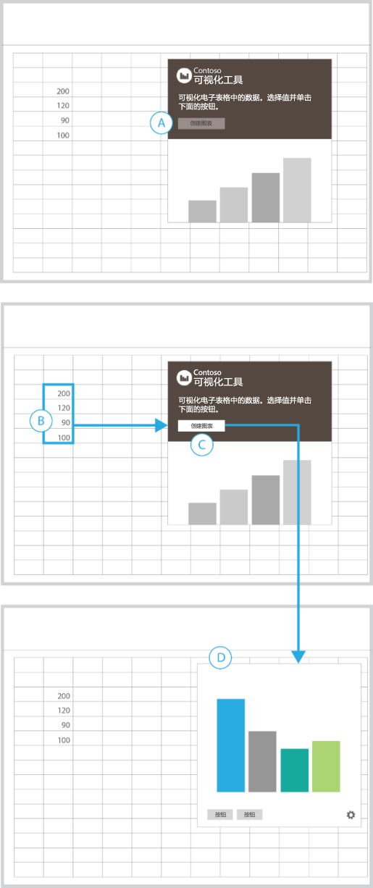
 
<ul><li>
你还务必在选择按钮之前执行相应操作，说明要与禁用的按钮 (A) 一同显示。
</li><li>
选择单元格范围后，“创建图表”按钮将变为活动状态 (B - C)。
</li><li>
将用具体数据填充容器并取代之前的视图 (D)。
</li><li>
将所有其他 UI 与设置按钮（齿轮）一起显示在加载项的底边缘处，为您提供可以重置或管理加载项的视图。
</li></ul>最适合于：
<ul><li>
在激活之前需要您选择数据的加载项。
</li></ul>

## 使用任务窗格外接程序转换内容

本示例说明将文档中的文本翻译成其他语言的任务窗格加载项。

在此交互模式中，你必须首先选择文档中想要翻译的文本。

**将文档中的文本翻译成其他语言的任务窗格外接程序**
 
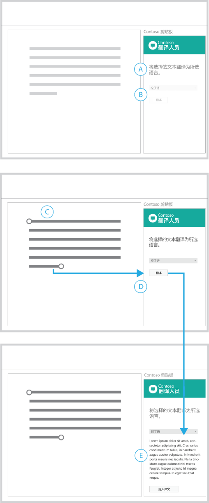
 
<ul><li>
标题传达外接程序的用途，并指示你必须首先进行选择 (A)。
</li><li>
语言菜单和“翻译”按钮均处于禁用状态，以进一步指明必须执行相应操作才能继续。选择文档中的内容后，这两个元素将处于活动状态 (D)。
</li><li>
选择“翻译”后，UI 随即展开，并显示翻译的内容和用于将其插入回文档的按钮 (E)。
</li><li>
你可以提供“清除”或“重置”按钮以返回到初始视图。
</li></ul>最适合于：
<ul><li>
在激活之前需要您选择数据的加载项。
</li><li>
执行应用场景过程中展开或显示的 UI。
</li></ul>

## 使用任务窗格外接程序处理数据

本示例说明检查 Excel 中数据的任务窗格加载项。

在此交互模式中，你必须选择电子表格中的单元格范围才能开始进行处理。

**检查 Excel 中数据的任务窗格外接程序**
 
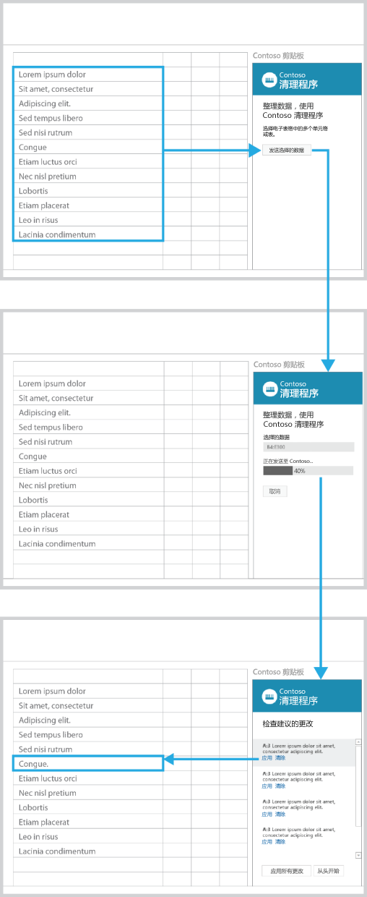
 
<ul><li>
标题中描述了该外接程序的用途。说明帮助你开始操作。
</li><li>
“发送所选数据”按钮处于禁用状态，以进一步指明必须执行相应操作才能继续 (A)。
</li><li>
选择电子表格中的单元格范围后 (B)，“发送所选数据”按钮将处于活动状态。
</li><li>
选择此按钮后，UI 由选择的单元格范围、进度栏和“取消”按钮所取代。
</li><li>
进度栏告知这一过程的状态，而“取消”按钮允许你中断此过程 (D)。
</li><li>
该过程完成后，将自动显示结果 (E)。选择列表中的某个元素时，电子表格中的相应单元格将变为活动状态。
</li></ul>最适合于：
<ul><li>
执行时间不确定的过程。
</li></ul>

## 使用任务窗格外接程序分析内容

本示例说明键入时显示单词定义的任务窗格加载项。

在此交互模式中，你必须首先选择文档中的文本才能查看结果。

**键入时显示单词定义的任务窗格外接程序**
 
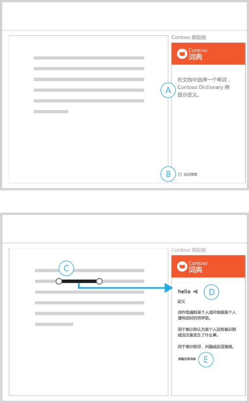
 
<ul><li>
标题说明外接程序的用途以及如何开始 (A)。
</li><li>
默认启用自动搜索功能并提供禁用选项 (B)。
</li><li>
做出选择后，加载项显示相应内容 (D)。
</li><li>
提供显示详细信息的链接 (E)。
</li></ul>最适合于：
<ul><li>
在您创作时自动返回内容的加载项。
</li><li>
在激活之前需要您选择内容的加载项。
</li></ul>

## 使用任务窗格外接程序查找内容

本示例说明用于搜索内容的任务窗格加载项。

在此交互模式中，你在搜索框中输入字符串，或从特色内容列表中选择后才可以开始查找。

**用于搜索内容的任务窗格外接程序**
 
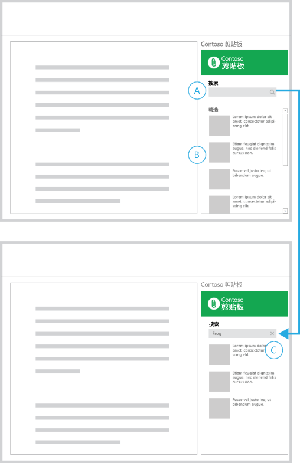
 
<ul><li>
初始视图包含“搜索”框 (A) 和特色内容列表 (B)。
</li><li>
在搜索框中输入字符串时，搜索图标由一个关闭图标 (C) 所替代。
</li><li>
选择关闭图标可返回到初始视图。
</li></ul>最适合于：
<ul><li>
在您创作时自动返回内容的加载项。
</li><li>
在激活之前需要您选择内容的加载项。
</li></ul>

## 使用任务窗格外接程序插入媒体

在此交互模式中，你可以从搜索结果中选择图像插入到文档中。

**用于插入图像的任务窗格外接程序**
 
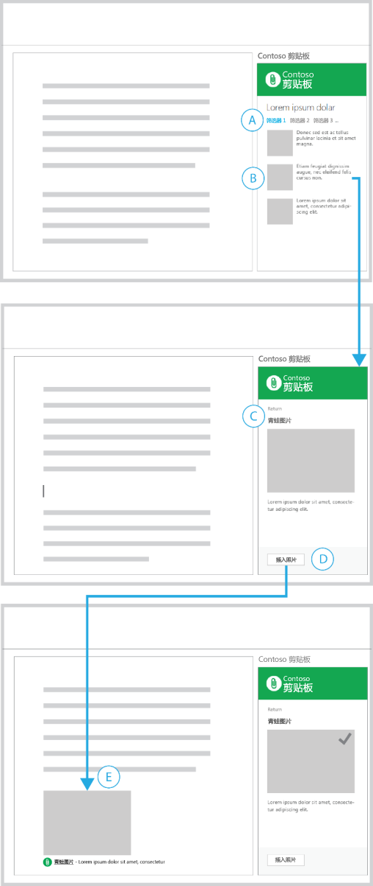
 
<ul><li>
你已对搜索返回列表 (A) 进行筛选，并选择了要插入 (B) 的内容。
</li><li>
示例中显示了所选内容的详细信息视图 (C)，并显示一个可使您返回列表的按钮。
</li><li>
“插入照片”按钮位于页脚中 (D)。选择此按钮后，该图像将插入到文档中。
</li><li>
图像来源的简短描述包括在插入内容中 (E)。 
</li><li>
该加载项中的 UI 直观地指明了操作是否成功。
</li></ul>最适合于：
<ul><li>
用于插入内容的加载项。
</li></ul>

## 使用任务窗格外接程序插入所选文本

在此交互模式中，你可以从搜索结果中选择文本插入到文档中。

**用于插入文本的任务窗格外接程序**
 
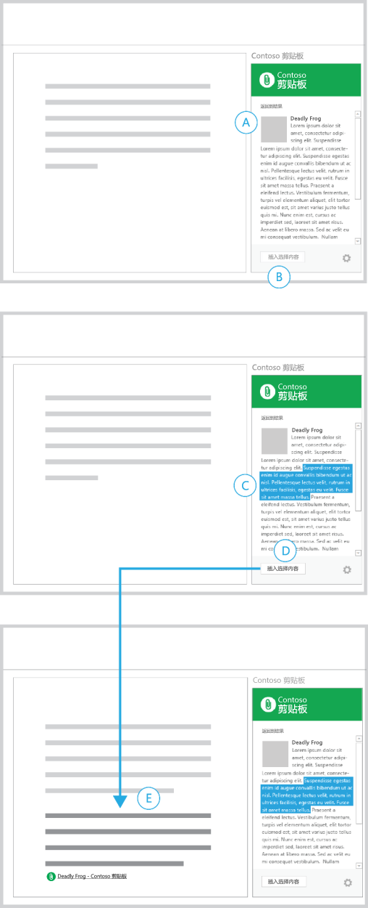
 
<ul><li>
你已找到了一则内容 (A)。
</li><li>
页脚显示一个禁用的“插入选择内容”按钮 (B)。
</li><li>
选择文本字符串后 (C)，“插入选择内容”按钮将变为活动状态。
</li><li>
选择此按钮后，加载项即会将所选文本与内容源引用一起插入文档中 (E)。
</li></ul>最适合于：
<ul><li>
执行调查和插入内容的加载项。
</li></ul>

## 使用任务窗格外接程序发布到 Web 服务

本示例说明将文档发布为博客文章的任务窗格加载项。

在此交互模式中，你已完成在文档中写入内容并希望将其发布到博客。

**将文档发布为博客文章的任务窗格外接程序**
 
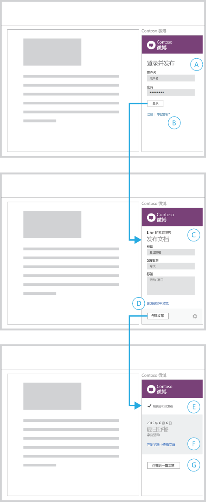
 
<ul><li>
首先显示一个登录表单，提示输入凭据 (A)。
</li><li>
示例中提供了创建帐户和处理典型登录问题的链接 (B)。选择这些链接将在浏览器中打开这些页面。
</li><li>
登录后，加载项将显示创建新博客文章的表单 (C)。
</li><li>
用于登录（和将用于发布）的帐户名称显示于加载项的顶部。加载项提供预览文章的链接 (D)。选择此链接会在浏览器中显示预览。
</li><li>
选择“创建发布”后，外接程序将显示确认文档内容已发布的视图 (E)。
</li><li>
加载项提供了在浏览器中查看文章的链接 (F)，以及创建其他发布的按钮 (G)。
</li></ul>最适合于：
<ul><li>
将内容输出、发布或共享到社交网络、博客网站和 Web 服务的加载项。
</li><li>
要求您登录到服务的加载项。
</li></ul>

## 使用 Outlook 外接程序获取有关人员的详细信息

 **示例 1**

**结果和详细信息页面**
 

 
最适合于：
<ul><li>
如果您有可用于展示的大型数据集，则公开全部内容。
</li><li>
使用加载项容器完整大小的详细信息页
</li><li>
受益于"往返式"工作流的导航模式。
</li></ul>
 **示例 2**

**具有持久性导航的详细信息页面**
 
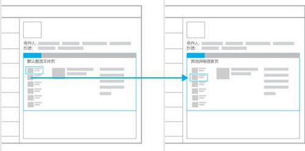
 
最适合于：
<ul><li>
默认情况下，显示数据集的第一个结果。
</li><li>
像选项卡一样运行的导航结构（单级线性导航）。
</li><li>
通过一直保持导航的可用性来减少选择操作。
</li><li>
提供空间一直显示导航。
</li></ul>

## 使用 Outlook 外接程序获取有关内容的详细信息

 **示例 1**

**结果和详细信息页面**
 
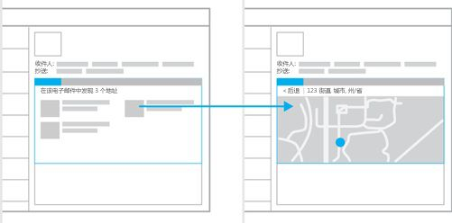
 
最适合于：
<ul><li>
如果您有可用于显示的大型数据集，则公开全部内容。
</li><li>
要求您做出选择才能显示更多详细信息。
</li><li>
使用加载项容器完整大小的详细信息页。
</li><li>
受益于"往返式"工作流的导航模式。
</li></ul>
 **示例 2**

**具有辅助内容的详细信息页面**
 
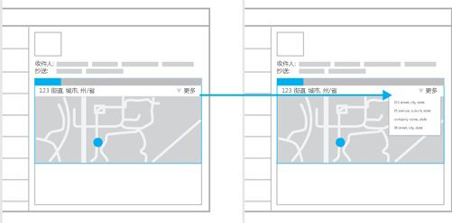
 
最适合于：
<ul><li>
想要突出某则内容的情况。
</li><li>
在无用户干预的情况下公开您的内容。
</li><li>
持久性导航（可以添加到此模型以实现导航的简单性和便易性）。
</li></ul>

## 连接到联机服务并呈现数据

本示例说明从联机服务获取数据和内容的交互模式。这些交互模式可用于所有三种外接程序类型：内容外接程序、任务窗格外接程序和 Outlook 外接程序。

 **示例 1**

**旋转式传送**
 
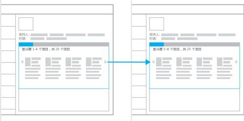
 
最适合于：
<ul><li>
可以一次一个或者成组公开的少量数据。
</li><li>
以库格式公开内容，例如幻灯片或图像库。
</li><li>
当下一个/上一个导航模型正常运行时。
</li></ul>
 **示例 2**

**向导**
 
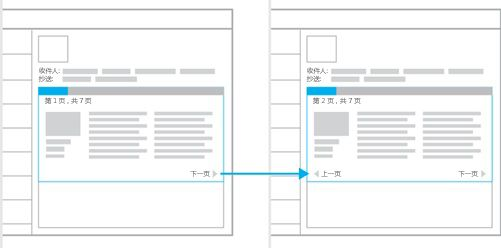
 
最适合于：
<ul><li>
需要以特定顺序展示的内容。
</li><li>
最好通过一系列小片段使用的大量内容。
</li><li>
类似于书籍的使用体验。
</li><li>
当需要执行一系列步骤或操作才能完成任务时。
</li></ul>
 **示例 3**

**表单、结果和详细信息**
 
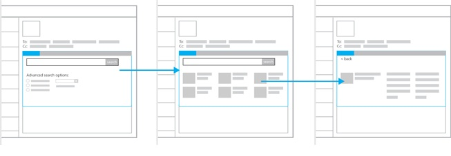
 
最适合于：
<ul><li>
要求输入数据的加载项。
</li><li>
结果和详细信息模式的入口点。
</li></ul>

## 其他资源

- [Office 外接程序的设计准则](../add-in-design.md)
    
