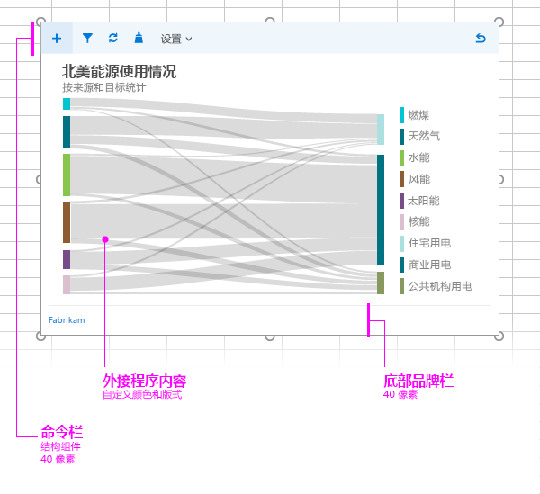

# 内容加载项的布局

使用建议的设计布局为内容外接程序创建一致的外观和风格。内容外接程序的建议布局包括以下元素： 

- 命令栏（可选）- 包括用户的图标或导航，可与外接程序内容重叠。最大高度为 80 像素。
- 外接程序内容
- 品牌元素（可选）

你还可以向内容外接程序添加[基于 HTML 的自定义 UI](ui-elements.md#custom-html-based-ui)。

有关展示了如何在 Office 加载项中使用 Office UI Fabric 的示例，请参阅 [Office 加载项 Fabric UI 示例](https://github.com/OfficeDev/Office-Add-in-Fabric-UI-Sample)。

<!-- Add sample template for content add-in and individual building blocks - Command Bar, Input, layout components. -->

## 另请参阅

- [Office 加载项设计指南](../add-in-design.md)