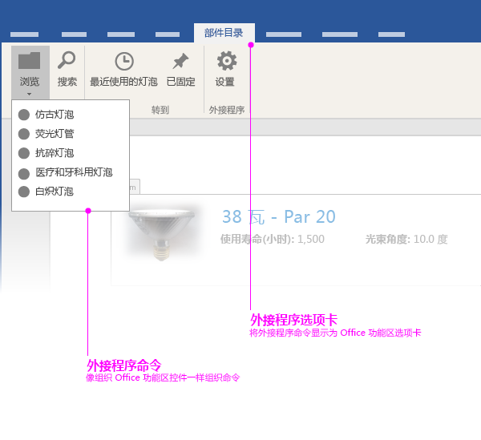
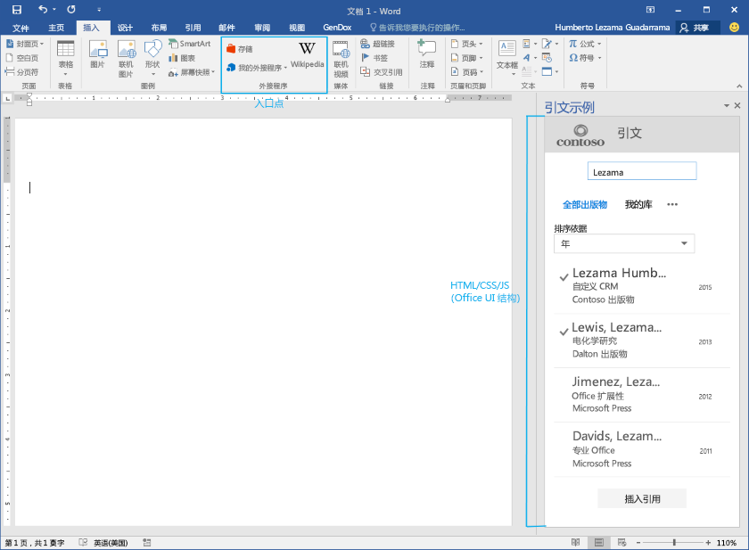

# Office 外接程序 UI 元素

您可以在 Office 外接程序中使用两种类型的 UI 元素： 

- 外接程序命令 
- 基于 HTML 的自定义界面

## 外接程序命令
命令在[外接程序 XML 清单](../../../docs/develop/define-add-in-commands.md)中定义，并作为本机 UX 扩展向 Office UI 呈现。例如，您可以使用外接程序命令将按钮添加到 Office 功能区。 

目前，仅邮件外接程序支持外接程序命令。有关详细信息，请参阅[邮件外接程序命令](../../outlook/add-in-commands-for-outlook.md)。 

Excel、PowerPoint 和 Word 已在 Office 功能区的“插入”选项卡上预定义了任务窗格和内容外接程序的入口点。内容和任务窗格外接程序的自定义命令功能将很快提供。 

## 基于 HTML 的自定义 UI
外接程序可以在 Office 客户端内嵌入基于 HTML 的自定义 UI。可用于显示 UI 的容器因外接程序类型而异。例如，任务窗格外接程序在文档的右窗格中显示基于 HTML 的自定义 UI，内容外接程序直接在 Office 文档内显示自定义 UI。

不论您创建的外接程序类型如何，您都可以使用通用构建块来创建基于 HTML 的自定义 UI。我们建议您对这些 UI 元素使用 [Office UI Fabric](https://github.com/OfficeDev/Office-UI-Fabric)，使您的外接程序可以与 Office 外观集成。我们也欢迎您使用自己的 UI 元素展示您自己的品牌。

Office UI Fabric 提供下列 UI 元素：

- 版式
- 颜色
- 图标
- 动画
- 输入组件
- 版式
- 导航元素

您可以下载 [Github 中的 Office UI Fabric](https://github.com/OfficeDev/Office-UI-Fabric)。

有关演示如何在外接程序中使用 Office UI Fabric 的示例，请参见 [Office 外接程序 Fabric  UI 示例](https://github.com/OfficeDev/Office-Add-in-Fabric-UI-Sample)。

**备注：**如果您决定使用自己的字体和图标集，请确保它们不会与 Office 冲突。例如，请勿使用与 Office 中相同或相似的图标，而应在您的外接程序中呈现不同的图标。 

### 创建自定义调色板
如果您决定使用自己的调色板，请牢记以下事项： 
 
- 使用颜色向用户传达您的品牌价值，并在您的外接程序用户体验中增加情感和快乐。
- 在外接程序中使用有意义且一致的颜色。例如，选择一种颜色作为强调文字颜色，使您的外接程序具有一致的视觉主题。
- 避免对交互和非交互元素使用相同的颜色。如果您使用某种颜色指示用户可以交互的项目，例如导航、链接和按钮，请勿对静态项目使用相同的颜色。
- 当在彩色背景上对文本或白文本使用颜色时，确保颜色具有足够的对比度以满足辅助功能准则（4.5:1 对比率）。
- 关注色盲群体—不只是使用颜色来指示交互性。

### 主题 
无论您决定采用 Office 配色方案还是使用您自己的方案，我们都建议您使用我们的主题 API。属于 Office 主题体验的外接程序与 Office 的集成程度更高。

- 对于邮件和任务窗格外接程序，请使用 [Context.officeTheme](http://dev.office.com/reference/add-ins/shared/office.context.officetheme) 元素匹配 Office 应用程序的主题。此 API 当前仅在 Office 2016 中可用。  
- 对于 PowerPoint 内容外接程序，请参阅[在 PowerPoint 外接程序中使用 Office 主题](../../powerpoint/use-document-themes-in-your-powerpoint-add-ins.md)。

<!-- Link to theming API docs and Humberto's seed sample. Add screenshot of themed add-in. -->

