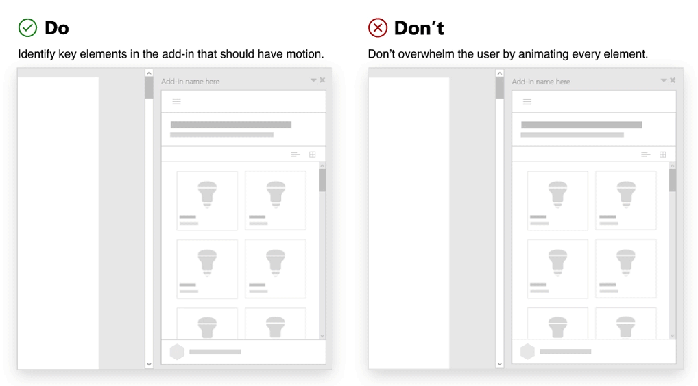

# 在 Office 加载项中使用动作

设计 Office 加载项时，可以使用动作来提升用户体验。 UI 元素、控件和组件通常都有需要使用转换、动作或动画的交互行为。 UI 界面元素之间运动的共同特征定义设计语言的动画方面。

Office 的重点是工作效率，因此 Office 动画语言支持帮助客户完成工作的目标。 力求在高性能响应、可靠编排和细节带来的喜悦之间实现平衡。 Office 中嵌入的加载项不超出现有动画语言范围。 鉴于此，在应用动作时，请务必注意遵循以下几项指南。

## 创建有明确用途的动作

动作应具有明确用途，让用户感受到更有价值。 选择动画时，请考虑内容的基调和用途。 关键消息的处理方式不同于探索导航。

加载项中使用的标准元素可以纳入动作，不仅有助于用户集中注意力、呈现元素之间的关系，还有助于验证用户操作。 将元素编排为加强层次结构和心理模型。

### 最佳做法

|允许事项|禁止事项|
|:-----|:-----|
|确定加载项中应包含动作的关键元素。 加载项中的常见动画元素包括面板、叠加层、模式、工具提示、菜单和教导标注。| 不得为每个元素都添加动画效果，否则用户会感到不知所措。 避免应用多个动作，以试图让用户一次关注多个元素。 |
|应使用行为符合预期的简单精细动作。请考虑触发元素的起源。使用动作可以在操作和生成的 UI 之间创建关联。 | 不得创建有等待时间的动作。 加载项中的动作不得妨碍任务完成。|

## 使用符合预期的动作

建议使用 [Office UI Fabric](https://developer.microsoft.com/fabric) 直观连接到 Office 平台，还建议使用 [Fabric 动画](https://developer.microsoft.com/fabric#/styles/web/motion)创建与 Fabric 动作语言一致的动作。

它可用于在 Office 中无缝集成。它有助于创建更侧重用户感受（而不是外观）的体验。动画 CSS 类提供方向、进入/退出和持续时间（强化 Office 心理模型），并为客户提供了解如何与加载项交互的机会。

### 最佳做法

|允许事项|禁止事项|
|:-----|:-----|
|应使用与 Fabric 行为一致的动作。| 不得创建干扰 Office 中常见动作模式或与其冲突的动作。
|确保在 like 元素中有一致的运动应用程序。| 不得使用不同动作为同一组件或对象添加动画效果。|
|应确保动画方向的使用一致。 例如，从右侧打开的面板应向右侧关闭。|不得使用多个方向为元素添加动画效果。

## 避免对元素使用不符合预期的动作

实现动作时，请考虑 HTML 画布（任务窗格、对话框或内容加载项）的尺寸。 避免在受限空间中重载。 一个或多个移动元素应与 Office 协调一致。 加载项动作应可靠、流畅且高性能。 动作旨在提供指示和指导，而不是降低工作效率。

### 最佳做法

|允许事项|禁止事项|
|:-----|:-----|
| 应使用[建议的动作持续时间](https://developer.microsoft.com/fabric#/styles/web/motion)。 | 不得使用夸张的动画。 避免打造会分散客户注意力的花哨体验。
| 请遵循[建议的缓和曲线](/windows/uwp/design/motion/timing-and-easing#easing-in-fluent-motion)。  |不得用不连贯的方式移动元素。 避免占先、退回、橡皮筋或其他模拟自然世界物理学的效果。|

## 另请参阅

* [Fabric 动画指南](https://developer.microsoft.com/fabric#/styles/web/motion)
* [通用 Windows 平台应用动作](/windows/uwp/design/motion)
