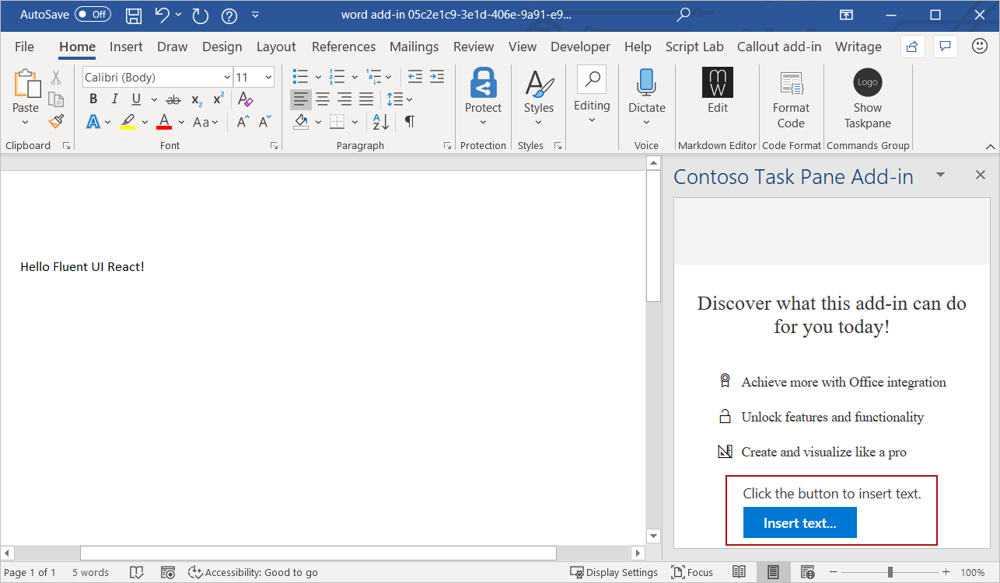

# <a name="use-fluent-ui-react-in-office-add-ins"></a>在Fluent外接程序React UI Office UI

FluentUI React 是官方开源 JavaScript 前端框架，旨在构建无缝适用于各种 Microsoft 产品（包括 Office）的体验。 它提供了可靠、最新、可访问的基于反应的组件，这些组件可以使用 CSS-in-JS 进行高度定制。

> [!NOTE]
> 本文介绍了在加载项Fluent React UI Office的使用。但它还用于各种应用Microsoft 365扩展。 有关详细信息，请参阅 ui Fluent [ui React](https://developer.microsoft.com/fluentui#/get-started/web#fluent-ui-react)和 UI Web Fluent[存储库](https://github.com/microsoft/fluentui)。

本文介绍如何创建使用 React 构建的外接程序，Fluent UI React组件。

## <a name="create-an-add-in-project"></a>创建加载项项目

将使用 Office 加载项的 Yeoman 生成器创建使用 React 的加载项项目。

### <a name="install-the-prerequisites"></a>安装必备组件

[!include[Yeoman generator prerequisites](../includes/quickstart-yo-prerequisites.md)]

### <a name="create-the-project"></a>创建项目

[!include[Yeoman generator create project guidance](../includes/yo-office-command-guidance.md)]

- **选择项目类型:** `Office Add-in Task Pane project using React framework`
- **选择脚本类型:** `TypeScript`
- **要如何命名加载项?** `My Office Add-in`
- **要支持哪一个 Office 客户端应用程序?** `Word`


完成此向导后，生成器会创建项目，并安装支持的 Node 组件。

[!include[Yeoman generator next steps](../includes/yo-office-next-steps.md)]

### <a name="try-it-out"></a>试用

1. 导航到项目的根文件夹。

    ```command&nbsp;line
    cd "My Office Add-in"
    ```

2. 完成以下步骤，以启动本地 Web 服务器并旁加载你的加载项。

    > [!NOTE]
    > Office 加载项应使用 HTTPS，而不是 HTTP（即便是在开发时也是如此）。 如果系统在运行以下命令之一后提示你安装证书，请接受提示以安装 Yeoman 生成器提供的证书。 你可能还必须以管理员身份运行命令提示符或终端才能进行更改。

    > [!TIP]
    > 如果在 Mac 上测试加载项，请先运行以下命令，然后再继续。 运行此命令时，本地 Web 服务器将启动。
    >
    > ```command&nbsp;line
    > npm run dev-server
    > ```

    - 若要在 Word 中测试加载项，请在项目的根目录中运行以下命令。 这将启动本地的 Web 服务器（如果尚未运行的话），并使用加载的加载项打开 Word。

        ```command&nbsp;line
        npm start
        ```

    - 若要在浏览器版 Word 中测试加载项，请在项目的根目录中运行以下命令。 如果你运行此命令，本地 Web 服务器将启动（如果尚未运行的话）。

        ```command&nbsp;line
        npm run start:web
        ```

        若要使用加载项，请在 Word 网页版中打开新的文档，并按照[在 Office 网页版中旁加载 Office 加载项](../testing/sideload-office-add-ins-for-testing.md#sideload-an-office-add-in-in-office-on-the-web)中的说明操作，以旁加载你的加载项。

3. 若要打开加载项任务窗格，在"开始 **"选项卡上** ，选择" **显示任务窗格"** 按钮。 请注意任务窗格底部的“默认文本”和 "**运行**" 按钮。 在此演练的其余部分中，你将通过创建一个 React 组件来重新定义此文本和按钮，该组件使用来自 UI Fluent UX React。

    

## <a name="create-a-react-component-that-uses-fluent-ui-react"></a>创建React UI Fluent的React

此时, 你已经创建了一个使用 React 构建的非常基本的任务窗格加载项。 接下来，完成以下步骤，在加载项项目中创建新的 React 组件 (`ButtonPrimaryExample`)。 该组件使用 UI Fluent 中的 和 `Label` `PrimaryButton` React。

1. 打开 Yeoman 生成器创建的项目文件夹，并转到 **src\taskpane\components**。
2. 在该文件夹中，创建一个名为“**Button.tsx**”的新文件。
3. 在 **Button.tsx** 中，输入以下代码以定义`ButtonPrimaryExample`组件。

```typescript
import * as React from 'react';
import { PrimaryButton, IButtonProps } from 'office-ui-fabric-react/lib/Button';
import { Label } from 'office-ui-fabric-react/lib/Label';

export class ButtonPrimaryExample extends React.Component<IButtonProps, {}> {
  public constructor(props) {
    super(props);
  }

  insertText = async () => {
    // In the click event, write text to the document.
    await Word.run(async (context) => {
      let body = context.document.body;
      body.insertParagraph('Hello Fluent UI React!', Word.InsertLocation.end);
      await context.sync();
    });
  }

  public render() {
    let { disabled } = this.props;
    return (
      <div className='ms-BasicButtonsExample'>
        <Label>Click the button to insert text.</Label>
        <PrimaryButton
          data-automation-id='test'
          disabled={ disabled }
          text='Insert text...'
          onClick={ this.insertText } />
      </div>
    );
  }
}
```

此代码将执行以下操作：

- 引用使用 `import * as React from 'react';` 的 React 库。
- 引用Fluent UI React、 (、) 创建 `PrimaryButton` `IButtonProps` `Label` 的组件 `ButtonPrimaryExample` 。
- 声明新的 `ButtonPrimaryExample` 组件使用 `export class ButtonPrimaryExample extends React.Component`。
- 声明 `insertText` 将处理按钮 `onClick` 事件的函数。
- 定义 `render` 函数中 React 组件的 UI。 HTML 标记使用 UI 元素中的 和 Fluent 组件React并指定当事件触发时 `Label` `PrimaryButton` `onClick` `insertText` ，函数将运行。

## <a name="add-the-react-component-to-your-add-in"></a>将 React 组件添加到加载项

通过打开 **src\components\App.tsx** 并完成下列步骤，将组件 `ButtonPrimaryExample` 添加到加载项：

1. 添加下面导入语句，以`ButtonPrimaryExample`从 **Button.tsx** 中引用。

    ```typescript
    import {ButtonPrimaryExample} from './Button';
    ```

2. 删除以下两个导入语句。

    ```typescript
    import { Button, ButtonType } from 'office-ui-fabric-react';
    ...
    import Progress from './Progress';
    ```

3. 将默认 `render()` 函数替换为以下使用 `ButtonPrimaryExample` 的代码。

    ```typescript
    render() {
      return (
        <div className="ms-welcome">
        <Header logo="assets/logo-filled.png" title={this.props.title} message="Welcome" />
        <HeroList message="Discover what this add-in can do for you today!" items={this.state.listItems} >
          <ButtonPrimaryExample />
        </HeroList>
        </div>
      );
    }
    ```

4. 将所做的更改保存到 **App.tsx**。

## <a name="see-the-result"></a>查看结果

在 Word 中, 当你保存对 **App.tsx** 的更改时，加载项任务窗格会自动更新。 任务窗格底部的默认文本和按钮现在显示由该`ButtonPrimaryExample`组件定义的 UI。 选择 **插入文本……** 按钮将文本插入到文档中。



恭喜！你已成功使用 ui 加载项和 ui React Fluent创建React！

## <a name="see-also"></a>另请参阅

- [Word 外接程序 GettingStartedFabricReact](https://github.com/OfficeDev/Word-Add-in-GettingStartedFabricReact)
- [Office 加载项中的 Fabric Core](fabric-core.md)
- [适用于 Office 加载项的 UX 设计模式](ux-design-pattern-templates.md)
