# 适用于 Office 外接程序的 UX 设计模式模板 

 [适用于 Office 外接程序的 UX 设计模式项目](https://github.com/OfficeDev/Office-Add-in-UX-Design-Patterns-Code "适用于 Office 外接程序的 UX 设计模式项目")(#适用于-office-外接程序的-ux-设计模式项目) 包括 HTML、JavaScript 和 CSS 文件，你可以使用这些文件创建外接程序的 UX。   

UX 设计模式项目用于：

* 将解决方案应用于常见的客户方案。
* 应用设计最佳实践。
* 纳入“[Office UI Fabric](https://dev.office.com/fabric#/get-started)”组件和样式。
* 构建以可视方式与默认 Office UI 集成的外接程序。  

## 使用 UX 设计模式

设计自己的 Office 加载项时，可以将 [UX 设计模式规范](https://github.com/OfficeDev/Office-Add-in-UX-Design-Patterns)用作指南，或者直接将[源代码](https://github.com/OfficeDev/Office-Add-in-UX-Design-Patterns-Code/tree/master/templates)添加到项目。

使用此规范构建自己的加载项 UI 的模型：

1. 下载设计资产文件并开始设计自己的 UI：
    * [Office 加载项 UX 设计组件](https://github.com/OfficeDev/Office-Add-in-UX-Design-Patterns/blob/master/assets/addin_ux_design_components.ai)（Adobe Illustrator 文件）
    * [Office 加载项 UX 设计模式](https://github.com/OfficeDev/Office-Add-in-UX-Design-Patterns/blob/master/assets/addin_ux_design_patterns.ai)（Adobe Illustrator 文件）或
    * [Office 加载项 UX 设计原型](https://github.com/OfficeDev/Office-Add-in-UX-Design-Patterns/blob/master/assets/addin_ux_design_prototype.xd)（Adobe 体验设计文件）
2. 请参阅以下文章，获取相关指南：
    * [UX 设计模式](https://github.com/OfficeDev/Office-Add-in-UX-Design-Patterns/blob/master/README.md)
    * [设计 Office 加载项](https://dev.office.com/docs/add-ins/design/add-in-design)的最佳实践
    * [Office UI Fabric 工具包](https://developer.microsoft.com/zh-CN/fabric#/resources)

添加源代码：

1. 克隆 [适用于 Office 外接程序的 UX 设计模式项目存储库](https://github.com/OfficeDev/Office-Add-in-UX-Design-Patterns-Code "适用于 Office 外接程序的 UX 设计模式项目")。 
2. 将[资产文件夹](https://github.com/OfficeDev/Office-Add-in-UX-Design-Pattern-Code/tree/master/assets)和所选的个人模式的代码文件夹复制到加载项项目。  
3. 将个人模式纳入到外接程序中。例如：
    - 编辑清单中的源位置或外接程序命令 URL。
    - 将 UX 设计模式用作其他页面的模板。
    - 链接 UX 设计模式。

> **注意：**某些 UX 模式规范与源代码不一致。 我们正努力使所有的资产保持一致。 另请注意，某些规范以存档的形式呈现。 我们正在评估这些已存档的规范对平台的价值。 每个模式均用于表示唯一的模板和交互模式。 模式不应相互重叠，且应不同于 Office Fabric UI 组件。

## UX 设计模式的类型
### 常规页面

常规页面模板可以应用于外接程序中的任何页面，没有特殊用途。特殊用途页面的示例是任何首次运行模式。下面的列表描述了可用常规页面：

* **登陆页** - 一个标准的加载项页，例如经过首次运行体验或登录过程后用户登陆的页面。 
    * 了解有关在加载项中采用 [Office 设计语言](https://dev.office.com/docs/add-ins/design/add-in-design-language)的准则。
    * [登陆页代码](https://github.com/OfficeDev/Office-Add-in-UX-Design-Patterns-Code/tree/master/templates/generic/landing-page)
* **品牌栏中的品牌形象** - 页脚中带有图像的登录页，代表你的品牌。 
    * [品牌栏规范](https://github.com/OfficeDev/Office-Add-in-UX-Design-Patterns/blob/master/patterns/brand-bar.md)
    * [品牌栏代码](https://github.com/OfficeDev/Office-Add-in-UX-Design-Patterns-Code/tree/master/templates/generic/brand-bar)

<table>
 <tr><th>登录</th><th>品牌栏</th></tr>
 <tr><td><A href="https://github.com/OfficeDev/Office-Add-in-UX-Design-Patterns-Code/tree/master/templates/generic/landing-page">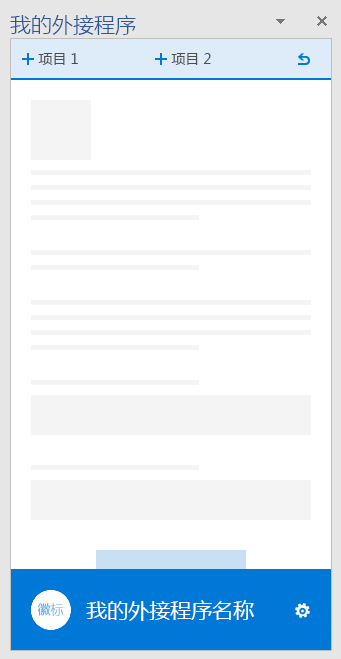</A></td>
<td><A href="https://github.com/OfficeDev/Office-Add-in-UX-Design-Patterns-Code/tree/master/templates/generic/brand-bar">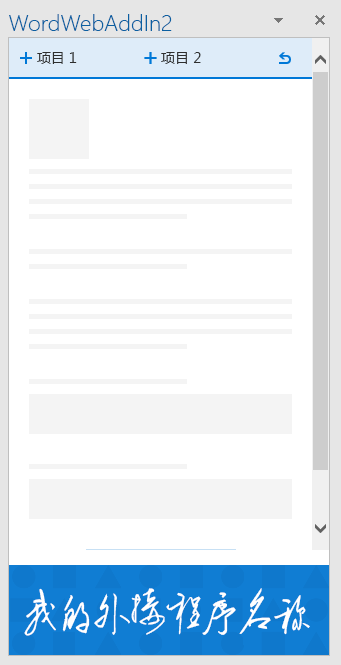</A></td></tr>
 </table>
 
### 首次运行体验

首次运行体验是用户第一次打开你的外接程序时获得的体验。提供了以下的首次运行设计模式模板： 

* **开始步骤** - 为用户提供执行步骤的排序列表以开始使用你的外接程序。 
    * [启动规范的步骤](https://github.com/OfficeDev/Office-Add-in-UX-Design-Patterns/blob/master/assets/archived-patterns/fre_stepsToStart.pdf)
        * 此 UX 设计模式已存档。 在我们评估其价值期间，另请参阅[首次运行值规范](https://github.com/OfficeDev/Office-Add-in-UX-Design-Patterns/blob/master/patterns/value-placemat.md)  
    * [启动代码的步骤](https://github.com/OfficeDev/Office-Add-in-UX-Design-Patterns-Code/tree/master/templates/first-run/instruction-step)
* **值** - 传达你的外接程序的价值主张。
    * [值规范](https://github.com/OfficeDev/Office-Add-in-UX-Design-Patterns/blob/master/patterns/value-placemat.md)
    * [值代码](https://github.com/OfficeDev/Office-Add-in-UX-Design-Patterns-Code/tree/master/templates/first-run/value-placemat)
* **视频** - 在用户开始使用你的外接程序之前向其展示视频。
    * [视频规范](https://github.com/OfficeDev/Office-Add-in-UX-Design-Patterns/blob/master/patterns/video-placemat.md)
    * [视频代码](https://github.com/OfficeDev/Office-Add-in-UX-Design-Patterns-Code/tree/master/templates/first-run/video-placemat)
* **演练** - 让用户在开始使用加载项之前熟悉一系列的功能或信息。
    * [Carousel 规范](https://github.com/OfficeDev/Office-Add-in-UX-Design-Patterns/blob/master/patterns/carousel.md)
        * 注意：此 UX 设计模式已经重命名为“Carousel”。 以前的规范将其称为“分页面板”。 代码资产将其称为“首次运行演练”。 
    * [演练代码](https://github.com/OfficeDev/Office-Add-in-UX-Design-Patterns-Code/tree/master/templates/first-run/walkthrough)

[Office 应用商店](https://msdn.microsoft.com/zh-CN/library/office/jj220033.aspx)具有管理外接程序试用版的系统，但是如果你想要控制外接程序试用体验的 UI，请使用以下模式：

* **试用版** - 演示用户如何开始使用外接程序的试用版。
    * [试用版规范](https://github.com/OfficeDev/Office-Add-in-UX-Design-Patterns/blob/master/assets/archived-patterns/fre_trialVersion.pdf)
        * 此 UX 设计模式已存档。 在我们评估其价值期间，请参阅 PDF。
    * [试用版代码](https://github.com/OfficeDev/Office-Add-in-UX-Design-Patterns-Code/tree/master/templates/first-run/trial-placemat)
* **试用版功能** - 提醒用户尝试使用的功能在外接程序试用版中不可用。 或者，如果你的外接程序是免费的，但是其中的一项功能需要订阅，则应考虑使用此模式。 也可以在试用结束后使用此模式提供降级体验。
    * [试用版功能规范](https://github.com/OfficeDev/Office-Add-in-UX-Design-Patterns/blob/master/assets/archived-patterns/fre_trialFeature.pdf)
        * 此 UX 设计模式已存档。 在我们评估其价值期间，请参阅以上 PDF。
    * [试用版功能代码](https://github.com/OfficeDev/Office-Add-in-UX-Design-Patterns-Code/tree/master/templates/first-run/trial-placemat-feature)

> **重要说明：**如果你决定管理你自己的试用版，而不是使用 Office 应用商店对其进行管理，请确保将“**可能需要额外购买**”标记包括在卖家面板中的测试说明中。

考虑一次或多次向用户显示首次运行体验是否对你的方案非常重要。例如，如果用户定期使用你的外接程序，他们可能会忘记如何使用外接程序，多次查看首次运行体验很有帮助。 

 <table>
 <tr><th>启动的步骤</th><th>值</th><th>视频</th></tr>
 <tr>
<td><A href="https://github.com/OfficeDev/Office-Add-in-UX-Design-Patterns-Code/tree/master/templates/first-run/instruction-step">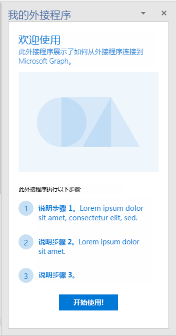</A></td>
<td><A href="https://github.com/OfficeDev/Office-Add-in-UX-Design-Patterns-Code/tree/master/templates/first-run/value-placemat">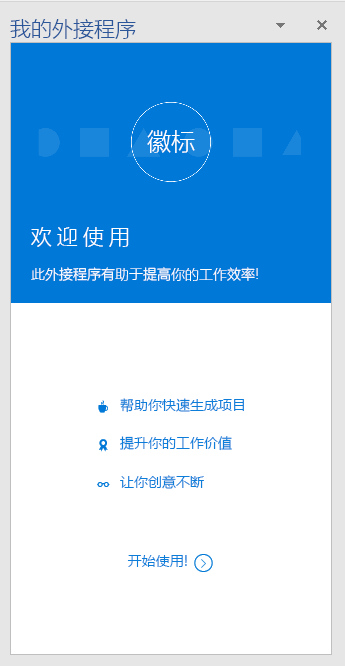</A></td>
<td><A href="https://github.com/OfficeDev/Office-Add-in-UX-Design-Patterns-Code/tree/master/templates/first-run/video-placemat">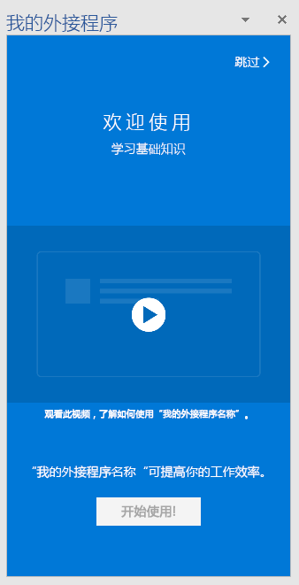</A></td></tr>
 </table>

 <table>
 <tr><th>演练第一页</th><th>试用</th><th>试用版功能</th></tr>
 <tr>
<td><A href="https://github.com/OfficeDev/Office-Add-in-UX-Design-Patterns-Code/tree/master/templates/first-run/walkthrough">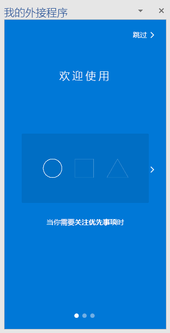</A></td>
<td><A href="https://github.com/OfficeDev/Office-Add-in-UX-Design-Patterns-Code/tree/master/templates/first-run/trial-placemat">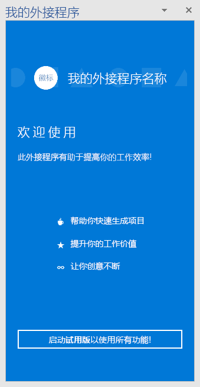</A></td>
<td><A href="https://github.com/OfficeDev/Office-Add-in-UX-Design-Patterns-Code/tree/master/templates/first-run/trial-placemat-feature">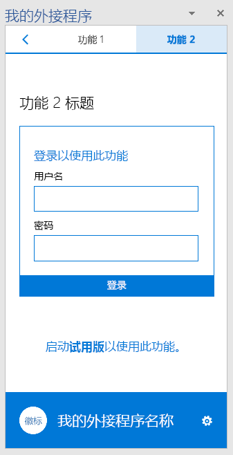</A></td></tr>
 </table> 

### 导航

用户需要在不同外接程序的页面之间导航。以下导航模板显示可用于在外接程序中组织页面和命令的不同选项。

* **返回按钮和下一页** - 显示带有“返回”和“下一页”按钮的任务窗格。 使用此模式来确保用户遵循一系列有序的步骤。
    * [“返回”按钮和“下一页”规范](https://github.com/OfficeDev/Office-Add-in-UX-Design-Patterns/blob/master/patterns/back-button.md)
    * [“返回按钮”和“下一页”代码](https://github.com/OfficeDev/Office-Add-in-UX-Design-Patterns-Code/tree/master/templates/navigation/back-button) 
* **导航** - 显示一个菜单（通常称为汉堡菜单）及任务窗格中的页面菜单项。 
    * [导航规范](https://github.com/OfficeDev/Office-Add-in-UX-Design-Patterns/blob/master/patterns/contextual-menu.md)
    * [导航代码](https://github.com/OfficeDev/Office-Add-in-UX-Design-Patterns-Code/tree/master/templates/navigation/navigation) 
* **导航（具有命令）** - 显示汉堡菜单，在任务窗格中具有命令（或操作）按钮。 在想要同时提供导航和命令选项时，使用此模式。 
    * [导航（具有命令）规范](https://github.com/OfficeDev/Office-Add-in-UX-Design-Patterns/blob/master/patterns/command-bar.md)
    * [导航（具有命令）代码](https://github.com/OfficeDev/Office-Add-in-UX-Design-Patterns-Code/tree/master/templates/navigation/navigation-commands)
* **透视** - 显示任务窗格中的透视导航。 使用透视导航以允许用户在不同内容间导航。
    * [透视规范](https://github.com/OfficeDev/Office-Add-in-UX-Design-Patterns/blob/master/patterns/pivot.md)
    * [透视代码](https://github.com/OfficeDev/Office-Add-in-UX-Design-Patterns-Code/tree/master/templates/navigation/pivot)
* **选项卡栏** - 显示使用按钮（具有垂直堆叠文本和图标）的导航。 使用选项卡栏提供导航（使用简短的描述性标题的选项卡）。
    * [选项卡栏规范](https://github.com/OfficeDev/Office-Add-in-UX-Design-Patterns/blob/master/patterns/tab-bar.md)
    * [选项卡栏代码](https://github.com/OfficeDev/Office-Add-in-UX-Design-Patterns-Code/tree/master/templates/navigation/tab-bar) 

<table>
<tr><th>返回按钮</th><th>导航</th><th>导航（具有命令）</th></tr>
<tr>
    <td>
        <A href="https://github.com/OfficeDev/Office-Add-in-UX-Design-Patterns-Code/tree/master/templates/navigation/back-button">
        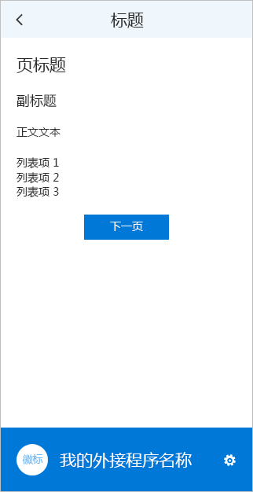</A>
    </td>
    <td>
        <A href="https://github.com/OfficeDev/Office-Add-in-UX-Design-Patterns-Code/tree/master/templates/navigation/navigation">
        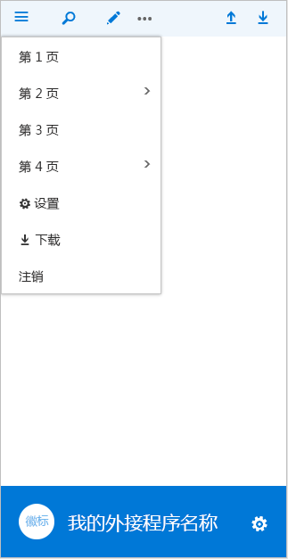</A>
    </td>
    <td>
        
    </td>
</tr>
 </table>

<table>
<tr><th>透视</th><th>选项卡栏</th></tr>
<tr><td><A href="https://github.com/OfficeDev/Office-Add-in-UX-Design-Patterns-Code/tree/master/templates/navigation/pivot">
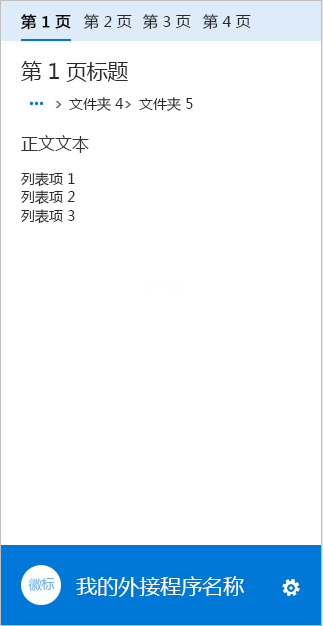</A></td>
<td><A href="https://github.com/OfficeDev/Office-Add-in-UX-Design-Patterns-Code/tree/master/templates/navigation/tab-bar">
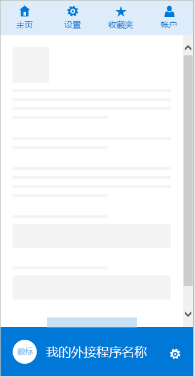</A></td>
</tr>
 </table>

### 通知

外接程序可以通过多个方法向用户通知事件，如错误或进度。可以使用下列通知模板： 

* **嵌入式对话框** - 显示在任务窗格中使用按钮或其他控件提供信息和互动体验（可选）的对话框。 请考虑使用其中之一提示用户确认操作。 当你想要在任务窗格中保留用户体验时，请使用嵌入式对话框模式。
    * [嵌入式对话框规范](https://github.com/OfficeDev/Office-Add-in-UX-Design-Patterns/blob/master/patterns/embedded-dialog.md)
    * [嵌入式对话框代码](https://github.com/OfficeDev/Office-Add-in-UX-Design-Patterns-Code/tree/master/templates/notifications/embedded-dialog)
* **内联消息** - 表示错误、成功或信息，它可以出现在任务窗格中的指定位置。 例如，如果用户在文本框中输入格式不正确的电子邮件地址，文本框下方将出现一条错误消息。 
    * [内联消息规范](https://github.com/OfficeDev/Office-Add-in-UX-Design-Patterns/blob/master/assets/archived-patterns/notification_inlineMessage.pdf)
        * 此 UX 设计模式已存档。 在我们评估其价值期间，请参阅以上 PDF。
    * [内联消息代码](https://github.com/OfficeDev/Office-Add-in-UX-Design-Patterns-Code/tree/master/templates/notifications/inline-message)
* **消息横幅** - 在可折叠为一行、扩展到多行或解除的横幅中提供信息或简单调用操作。 使用消息横幅来在外接程序启动时报告服务更新或有用的提示。 
    * [消息横幅规范](https://github.com/OfficeDev/Office-Add-in-UX-Design-Patterns/blob/master/assets/archived-patterns/message_bar.pdf)
        * 此 UX 设计模式已存档。 在我们评估其价值期间，请参阅以上 PDF。
    * [消息横幅代码](https://github.com/OfficeDev/Office-Add-in-UX-Design-Patterns-Code/tree/master/templates/notifications/message-banner)
* **进度栏** - 表示长期运行的同步过程（例如，用户在执行任何进一步操作前必须完成的配置任务）的进度。 这是一个加强外接程序品牌的单独间隙页面。 在过程可发送返回到外接程序的进度的定期度量值时，使用进度栏。
    * [进度栏规范](https://github.com/OfficeDev/Office-Add-in-UX-Design-Patterns/blob/master/patterns/progress-indicator.md)
    * [进度栏代码](https://github.com/OfficeDev/Office-Add-in-UX-Design-Patterns-Code/tree/master/templates/notifications/progress-bar)
* **微调框** - 表示一个长时间运行的同步过程正在进行，但不提供这一过程的进度。 这是一个加强外接程序品牌的单独间隙页面。 在外接程序无法知晓某一过程的可靠进度时，使用微调框。 
    * [微调框规范](https://github.com/OfficeDev/Office-Add-in-UX-Design-Patterns/blob/master/patterns/spinner.md)
    * [微调框代码](https://github.com/OfficeDev/Office-Add-in-UX-Design-Patterns-Code/tree/master/templates/notifications/spinner)
* **Toast** - 提供一个会在几秒钟后消失的简短消息。 由于用户可能看不到该消息，toast 仅用作非基本信息。 在远程系统中，这是通知用户某个事件的理想选择，如收到一封电子邮件。
    * [Toast 规范](https://github.com/OfficeDev/Office-Add-in-UX-Design-Patterns/blob/master/patterns/toast.md)
    * [Toast 代码](https://github.com/OfficeDev/Office-Add-in-UX-Design-Patterns-Code/tree/master/templates/notifications/toast)

 <table>
 <tr><th>嵌入式对话框</th><th>内联消息</th><th>消息横幅</th></tr>
 <tr><td><A href="https://github.com/OfficeDev/Office-Add-in-UX-Design-Patterns-Code/tree/master/templates/notifications/embedded-dialog">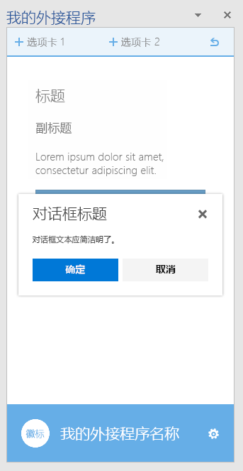</A></td>
<td><A href="https://github.com/OfficeDev/Office-Add-in-UX-Design-Patterns-Code/tree/master/templates/notifications/inline-message">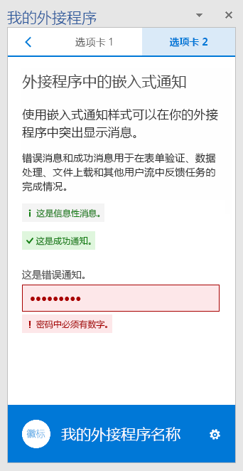</A></td>
<td><A href="https://github.com/OfficeDev/Office-Add-in-UX-Design-Patterns-Code/tree/master/templates/notifications/message-banner">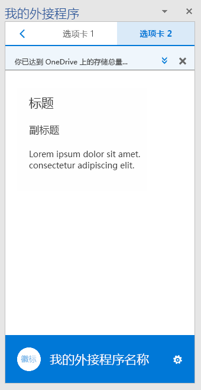</A></td></tr>
 </table>

 <table>
 <tr><th>进度栏</th><th>微调框</th><th>Toast</th></tr>
 <tr><td><A href="https://github.com/OfficeDev/Office-Add-in-UX-Design-Patterns-Code/tree/master/templates/notifications/progress-bar">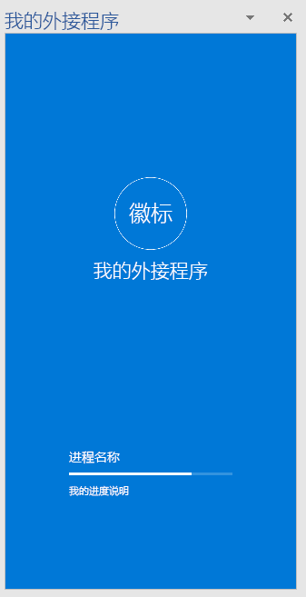</A></td>
<td><A href="https://github.com/OfficeDev/Office-Add-in-UX-Design-Patterns-Code/tree/master/templates/notifications/spinner">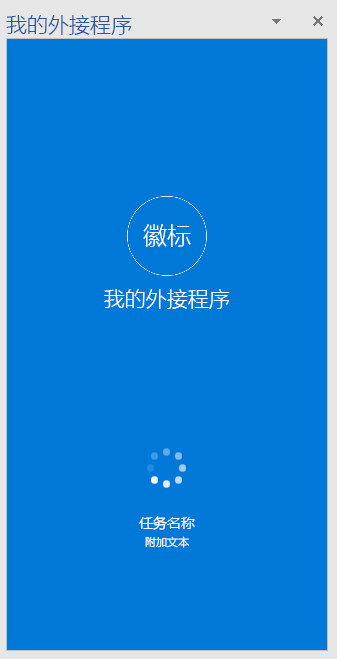</A></td>
<td><A href="https://github.com/OfficeDev/Office-Add-in-UX-Design-Patterns-Code/tree/master/templates/notifications/toast">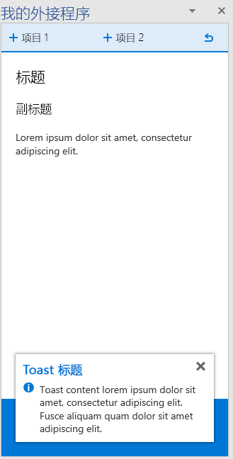</A></td></tr>
 </table>
 

### 常规组件

以下是你可以在各种方案中的外接程序中所使用的常规组件。  

#### 客户端对话框

客户端对话框为用户提供了在任务窗格外部使用外接程序的另一种方法。可以使用下列对话框模板：

* **Typeramp 对话框** - 显示具有文本内容的对话框。 使用 typeramp 对话框向用户显示详细信息。 
    * 了解有关设计 [Office 加载项中的对话框](https://dev.office.com/docs/add-ins/design/dialog-boxes)的信息。另请参阅有关 [Office 加载项中的版式](https://dev.office.com/docs/add-ins/design/add-in-design-language#typography)的准则。
    * [Typeramp 对话框代码](https://github.com/OfficeDev/Office-Add-in-UX-Design-Patterns-Code/tree/master/templates/dialog/typeramp)
* **警报对话框** - 向用户显示具有重要信息（如错误或通知）的警告框。  
    * [警报对话框规范](https://github.com/OfficeDev/Office-Add-in-UX-Design-Patterns/blob/master/assets/archived-patterns/notification_alert.pdf)
        * 此 UX 设计模式已存档。 在我们评估其价值期间，请参阅以上 PDF。
    * [警报对话框代码](https://github.com/OfficeDev/Office-Add-in-UX-Design-Patterns-Code/tree/master/templates/dialog/alert)
* **导航对话框** - 显示具有导航的对话框。 使用导航对话框允许用户在不同内容间导航。 
    * 了解有关设计 [Office 加载项中的对话框](https://dev.office.com/docs/add-ins/design/dialog-boxes)的信息。另请参阅有关[在 Office 加载项中使用 Office UI Fabric 透视组件](https://dev.office.com/docs/add-ins/design/pivot)的信息。
    * [导航对话框代码](https://github.com/OfficeDev/Office-Add-in-UX-Design-Patterns-Code/tree/master/templates/dialog/navigation)

<table>
 <tr><th>Typeramp 对话框</th><th>警报对话框</th></tr>
<tr>
<td><A href="https://github.com/OfficeDev/Office-Add-in-UX-Design-Patterns-Code/tree/master/templates/dialog/typeramp">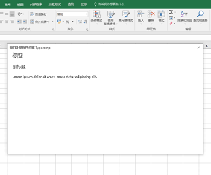</A></td>
<td><A href="https://github.com/OfficeDev/Office-Add-in-UX-Design-Patterns-Code/tree/master/templates/dialog/alert">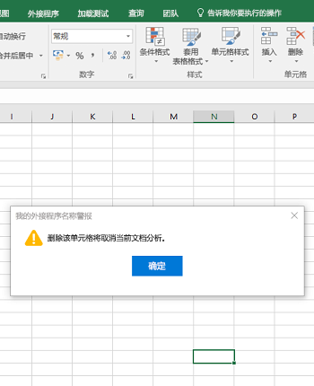</A></td>
</tr></tr>
 </table>
 
 <table>
 <tr><th>导航对话框</th></tr>
<tr><td><A href="https://github.com/OfficeDev/Office-Add-in-UX-Design-Patterns-Code/tree/master/templates/dialog/navigation">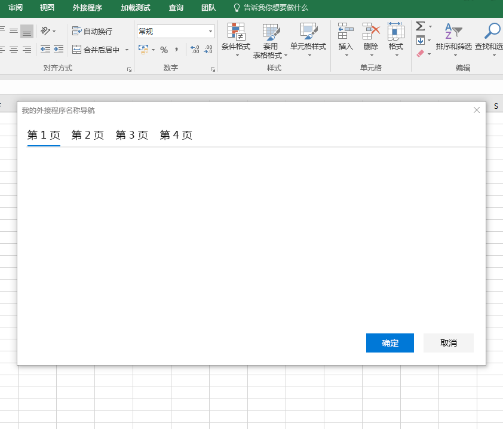</A></td></tr>
</tr>
 </table>

#### 反馈和评级

为了提高你的外接程序的可见性和采用率，在 Office 应用商店中为用户提供对你的外接程序进行评级和评价的功能会很有帮助。这种模式显示从外接程序中提供反馈和评级的两种方法：

- 用户启动的反馈 - 用户通过使用导航菜单或页脚上的图标选择发送反馈（例如，使用**发送反馈**链接）。
- 系统启动的反馈 - 外接程序运行三次后，通过消息横幅提示用户提供反馈。

这两种方法均将打开一个对话框，其中包含外接程序的 Office 应用商店页。

* [反馈和评级规范](https://github.com/OfficeDev/Office-Add-in-UX-Design-Patterns/blob/master/assets/archived-patterns/notification_feedback.pdf)
    * 此 UX 设计模式已存档。 在我们评估其价值期间，请参阅以上 PDF。
* [反馈和评级代码](https://github.com/OfficeDev/Office-Add-in-UX-Design-Patterns-Code/tree/master/templates/feedback/office-store)

>**重要说明：**这种模式目前指向 Office 应用商店主页。 请务必更新此 URL 到 Office 应用商店外接程序页的 URL。

 <table>
 <tr><th>反馈和评级</th></tr>
<tr><td><A href="https://github.com/OfficeDev/Office-Add-in-UX-Design-Patterns-Code/tree/master/templates/feedback/office-store">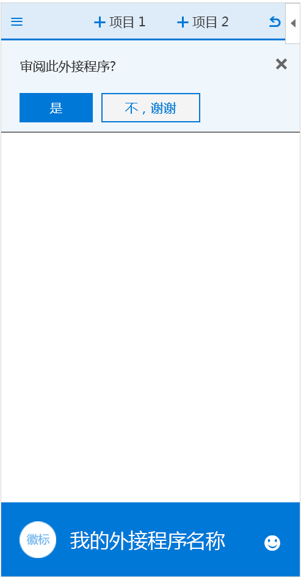</A></td></tr>
</tr>
 </table>

#### 设置和隐私

外接程序可能需要设置页，以允许用户配置设置来控制外接程序的行为。此外，可能需要为用户提供外接程序符合的隐私策略。 

* **设置** - 显示带有配置组件（用于控制加载项的行为）的任务窗格。 设置页提供用户选择的选项。
    * [设置规范](https://github.com/OfficeDev/Office-Add-in-UX-Design-Patterns/blob/master/patterns/settings.md)
    * [设置代码](https://github.com/OfficeDev/Office-Add-in-UX-Design-Patterns-Code/tree/master/templates/settings)
* **隐私策略** - 显示具有隐私策略相关重要信息的任务窗格。 
    * [隐私策略规范](https://github.com/OfficeDev/Office-Add-in-UX-Design-Patterns/blob/master/assets/archived-patterns/general_multiSection.pdf)
        * 此 UX 设计模式已存档。 在我们评估其价值期间，请参阅以上 PDF。
    * [隐私策略代码](https://github.com/OfficeDev/Office-Add-in-UX-Design-Patterns-Code/tree/master/templates/settings)

<table>
 <tr><th>设置</th><th>隐私策略</th></tr>
<tr>
<td><A href="https://github.com/OfficeDev/Office-Add-in-UX-Design-Patterns-Code/tree/master/templates/settings">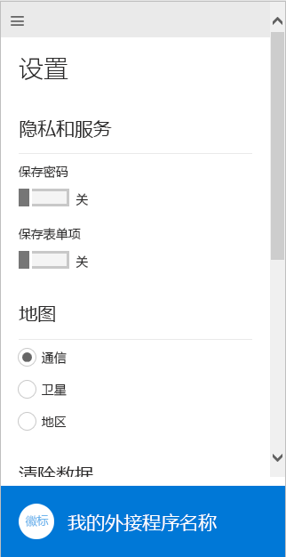</A></td>
<td><A href="https://github.com/OfficeDev/Office-Add-in-UX-Design-Patterns-Code/tree/master/templates/settings">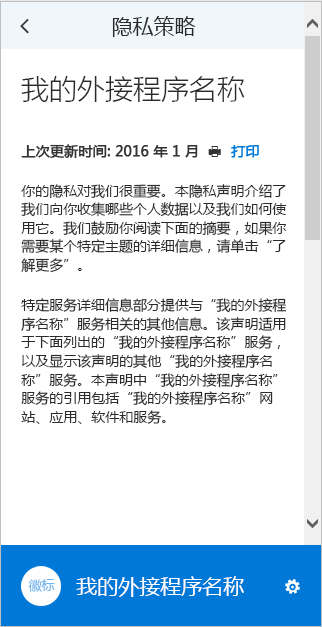</A></td>
</tr></tr>
 </table>

## 其他资源

* [开发 Office 外接程序的最佳做法](https://dev.office.com/docs/add-ins/overview/add-in-development-best-practices)
* [Office UI Fabric](http://dev.office.com/fabric/)
