# Office ??????????????UX design pattern templates for Office Add-ins

[??? Office ????? UX ??????](https://github.com/OfficeDev/Office-Add-in-UX-Design-Patterns-Code "??? Office ????? UX ??????")(#???-office-?????-ux-??????) ?? HTML?JavaScript ? CSS ??????????????????? UX?The [UX design patterns for Office Add-ins project](https://github.com/OfficeDev/Office-Add-in-UX-Design-Patterns-Code "UX design patterns for Office Add-ins project") includes HTML, JavaScript, and CSS files that you can use to create the UX for your add-in.   

UX ?????????Use the UX design patterns project to:

* ????????????????Apply solutions to common customer scenarios.
* ?????????Apply design best practices.
* ???[Office UI Fabric](https://dev.office.com/fabric#/get-started)???????Incorporate [Office UI Fabric](https://dev.office.com/fabric#/get-started) components and styles.
* ?????????? Office UI ????????Build add-ins that visually integrate with the default Office UI.  

## ?? UX ????Using the UX design patterns

???? [Office ?????????](https://aka.ms/addins_toolkit) ? [???????](https://aka.ms/fabric-toolkit) ???????????? Office ?????????You can use the [Office Add-ins Design Toolkit](https://aka.ms/addins_toolkit) together with the [Fabric Design Toolkit](https://aka.ms/fabric-toolkit) as a guide when you design your own Office Add-in. ??????? [???](https://github.com/OfficeDev/Office-Add-in-UX-Design-Patterns-Code/tree/master/templates) ????????You can also add the [source code](https://github.com/OfficeDev/Office-Add-in-UX-Design-Patterns-Code/tree/master/templates) directly to your project.

?????????????? UI ???To use the specifications to build a mock-up of your own add-in UI:

1. ???????????????? UI?Download design assets files and begin designing your own UI:
    * [Office ?????????Office Add-ins Design Toolkit](https://aka.ms/addins_toolkit)
    * [???????Fabric Design Toolkit](https://aka.ms/fabric-toolkit)

2. ???????????????Refer to the following articles for guidance:
    * [?? Office ????](add-in-design.md) ?????Best practices for [Designing your Office Add-ins](add-in-design.md)
    * [Office UI Fabric ???Office UI Fabric Toolkits](https://developer.microsoft.com/en-us/fabric#/resources)

> [!NOTE]
> ????????????? UX ???????? UX ????????Some UX patterns in the Add-ins Design Toolkit do not match the UX design patterns detailed below. ????????????????????????We're planning to release updated documentation that will align with the toolkit.

??????To add the source code:

1. ?? [??? Office ????? UX ?????????](https://github.com/OfficeDev/Office-Add-in-UX-Design-Patterns-Code "??? Office ????? UX ??????")?Clone the [UX design patterns for Office Add-ins project repo](https://github.com/OfficeDev/Office-Add-in-UX-Design-Patterns-Code "UX design patterns for Office Add-ins project").
2. ? [assets ???](https://github.com/OfficeDev/Office-Add-in-UX-Design-Pattern-Code/tree/master/assets)(#assets-???) ????????????????????????Copy the [assets folder](https://github.com/OfficeDev/Office-Add-in-UX-Design-Pattern-Code/tree/master/assets), and the code folder for the individual pattern you choose to your add-in project.  
3. ?????????????????Incorporate the individual pattern into your add-in. For example:
    - ???????????????? URL?Edit the source location or add-in command URL in the manifest.
    - ? UX ??????????????Use the UX design pattern as a template for other pages.
    - ??????????????????????Link to or from the UX design pattern.

> [!NOTE]
> ??????????????????Some UX pattern specifications do not match the source code. ????????????????We're working hard to bring all assets into alignment. ??????????????????Also notice that some specifications are presented as archived. ?????????????????????We're assessing these archived specifications for value to the platform. ????????????????????Each pattern aims to represent a unique template and pattern of interaction. ?????????????? Office Fabric UI ???The patterns should not overlap with each other and should be well differentiated from Office Fabric UI components.

## UX ???????Types of UX design patterns
### ????Generic pages

???????????????????????????????????????????????????????????????Generic page templates can be applied to any page in your add-in and don't have a special purpose. An example of a special purpose page, would be any of the first-run patterns. The following list describes the generic pages available:

* **???** - ??????????????????????????????????**Landing page** - A standard add-in page, for example the page a user lands on after a first-run experience or sign-in process. 
    * ??????????? [Office ????](add-in-design-language.md)????Learn about guidelines for adopting the [Office design language](add-in-design-language.md) in your add-in.
    * [?????Landing page code](https://github.com/OfficeDev/Office-Add-in-UX-Design-Patterns-Code/tree/master/templates/generic/landing-page)
* **?????????** - ???????????????????**Brand image in brand bar** - The landing page with an image in the footer that represents your brand. 
    * [?????Brand bar specification](https://github.com/OfficeDev/Office-Add-in-UX-Design-Patterns/blob/master/patterns/brand-bar.md)
    * [?????Brand bar code](https://github.com/OfficeDev/Office-Add-in-UX-Design-Patterns-Code/tree/master/templates/generic/brand-bar)

<table>
 <tr><th>??Landing</th><th>???Brand Bar</th></tr>
 <tr><td><A href="https://github.com/OfficeDev/Office-Add-in-UX-Design-Patterns-Code/tree/master/templates/generic/landing-page">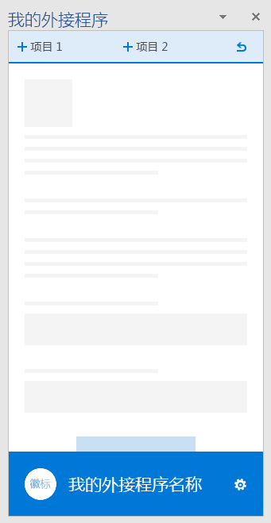</A></td>
<td><A href="https://github.com/OfficeDev/Office-Add-in-UX-Design-Patterns-Code/tree/master/templates/generic/brand-bar">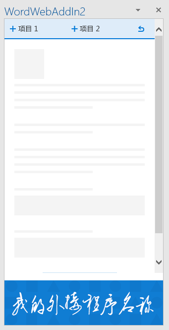</A></td></tr>
 </table>
 
### ??????First-run experience

????????????????????????????????????????????A first-run experience is the experience a user has when they open your add-in for the first time. The following first-run design pattern templates are available: 

* **????** - ??????????????????????????**Steps to start** - Provides users with an ordered list of steps to perform to get started using your add-in. 
    * [??????](https://github.com/OfficeDev/Office-Add-in-UX-Design-Patterns/blob/master/assets/archived-patterns/fre_stepsToStart.pdf)??????????????[Steps to start specification](https://github.com/OfficeDev/Office-Add-in-UX-Design-Patterns/blob/master/assets/archived-patterns/fre_stepsToStart.pdf) (This UX design pattern has been archived. ??????????????[???????](https://github.com/OfficeDev/Office-Add-in-UX-Design-Patterns/blob/master/patterns/value-placemat.md)??As we assess its value, see [First-Run Value specification](https://github.com/OfficeDev/Office-Add-in-UX-Design-Patterns/blob/master/patterns/value-placemat.md).)  
    * [??????Steps to start code](https://github.com/OfficeDev/Office-Add-in-UX-Design-Patterns-Code/tree/master/templates/first-run/instruction-step)
* **?** - ??????????????**Value** - Communicates your add-in's value proposition.
    * [???Value specification](https://github.com/OfficeDev/Office-Add-in-UX-Design-Patterns/blob/master/patterns/value-placemat.md)
    * [???Value code](https://github.com/OfficeDev/Office-Add-in-UX-Design-Patterns-Code/tree/master/templates/first-run/value-placemat)
* **??** - ??????????????????????**Video** - Shows users a video before they start using your add-in.
    * [????Video specification](https://github.com/OfficeDev/Office-Add-in-UX-Design-Patterns/blob/master/patterns/video-placemat.md)
    * [????Video code](https://github.com/OfficeDev/Office-Add-in-UX-Design-Patterns-Code/tree/master/templates/first-run/video-placemat)
* **??** - ??????????????????????????**Walkthrough** - Takes users through a series of features or information before they start using the add-in.
    * [????](https://github.com/OfficeDev/Office-Add-in-UX-Design-Patterns/blob/master/patterns/carousel.md)????????????????????????[Carousel specification](https://github.com/OfficeDev/Office-Add-in-UX-Design-Patterns/blob/master/patterns/carousel.md) (Note that this UX design pattern has been renamed to "Carousel." ???????????Former specifications refered to it as a "Paging Panel." ??????????????Code assets refer to it as a "First-run Walkthrough." 
    * [????Walkthrough code](https://github.com/OfficeDev/Office-Add-in-UX-Design-Patterns-Code/tree/master/templates/first-run/walkthrough)

[AppSource](https://docs.microsoft.com/en-us/office/dev/store/use-the-seller-dashboard-to-submit-to-the-office-store) ??????????????????????????? UI?????????[AppSource](https://docs.microsoft.com/en-us/office/dev/store/use-the-seller-dashboard-to-submit-to-the-office-store) has a system that manages trial versions of an add-in, but if you want to control the UI of the trial experience for your add-in, use the following patterns:

* **???** - ??????????????????**Trial** - Shows users how to get started with a trial version of your add-in.
    * [?????](https://github.com/OfficeDev/Office-Add-in-UX-Design-Patterns/blob/master/assets/archived-patterns/fre_trialVersion.pdf)??????????????[Trial specification](https://github.com/OfficeDev/Office-Add-in-UX-Design-Patterns/blob/master/assets/archived-patterns/fre_trialVersion.pdf) (This UX design pattern has been archived. ???????????????? PDF??As we assess its value, refer to this PDF.)
    * [?????Trial code](https://github.com/OfficeDev/Office-Add-in-UX-Design-Patterns-Code/tree/master/templates/first-run/trial-placemat)
* **?????** - ?????????????????????????????????????????????????????????????????????????????????????**Trial feature** - Advises users that the feature they are trying to use is not available in the trial version of the add-in. Alternatively, if your add-in is free but it includes a feature that requires a subscription, consider using this pattern. You might also use this pattern to provide a downgraded experience after a trial has ended.
    * [???????](https://github.com/OfficeDev/Office-Add-in-UX-Design-Patterns/blob/master/assets/archived-patterns/fre_trialFeature.pdf)??????????????[Trial feature specification](https://github.com/OfficeDev/Office-Add-in-UX-Design-Patterns/blob/master/assets/archived-patterns/fre_trialFeature.pdf) (This UX design pattern has been archived. ???????????????? PDF??As we assess its value, refer to this PDF.)
    * [???????Trial feature code](https://github.com/OfficeDev/Office-Add-in-UX-Design-Patterns-Code/tree/master/templates/first-run/trial-placemat-feature)

> [!IMPORTANT]
> ?????????????????? AppSource ????????????????????????????????****???If you decide to manage your own trial, and not use AppSource to manage the trial, make sure to include the **Additional purchase may be required** tag in the testing notes in the seller dashboard.

???????????????????????????????????????????????????????????????????????????????Consider whether showing users the first-run experience once or many times is important to your scenario. For example, if users use your add-in periodically, they might forget how to use it, and it might be helpful to see the first-run experience more than once. 

 <table>
 <tr><th>?????Steps to Start</th><th>?Value</th><th>??Video</th></tr>
 <tr>
<td><A href="https://github.com/OfficeDev/Office-Add-in-UX-Design-Patterns-Code/tree/master/templates/first-run/instruction-step">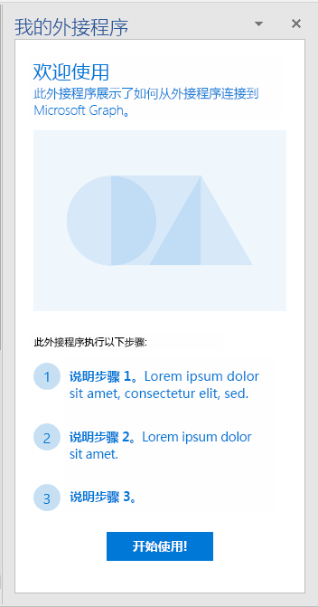</A></td>
<td><A href="https://github.com/OfficeDev/Office-Add-in-UX-Design-Patterns-Code/tree/master/templates/first-run/value-placemat">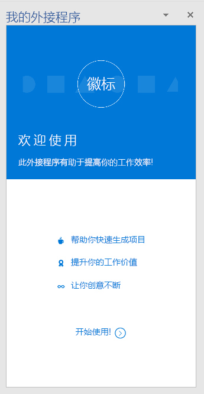</A></td>
<td><A href="https://github.com/OfficeDev/Office-Add-in-UX-Design-Patterns-Code/tree/master/templates/first-run/video-placemat">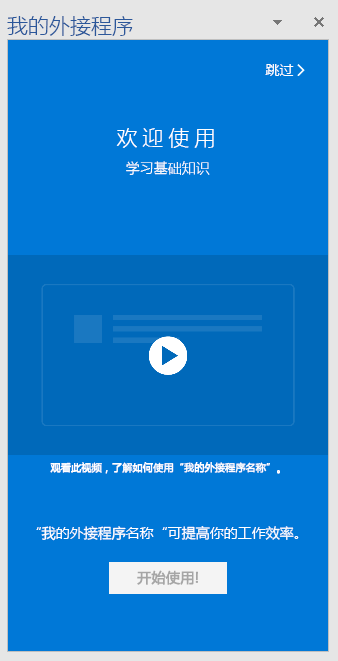</A></td></tr>
 </table>

 <table>
 <tr><th>?????Walkthrough first page</th><th>??Trial</th><th>?????Trial feature</th></tr>
 <tr>
<td><A href="https://github.com/OfficeDev/Office-Add-in-UX-Design-Patterns-Code/tree/master/templates/first-run/walkthrough">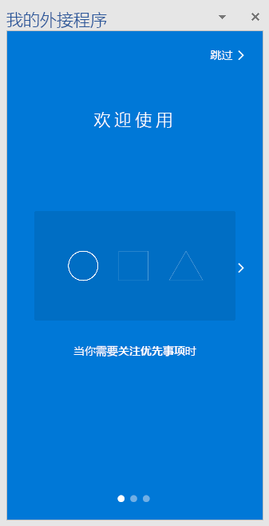</A></td>
<td><A href="https://github.com/OfficeDev/Office-Add-in-UX-Design-Patterns-Code/tree/master/templates/first-run/trial-placemat">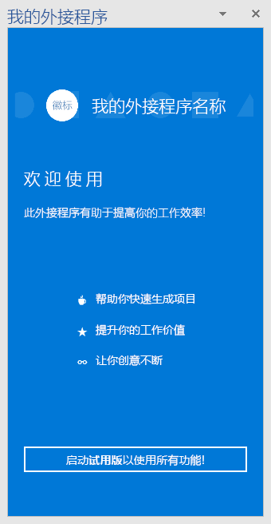</A></td>
<td></td></tr>
 </table> 

### ??Navigation

?????????????????????????????????????????????????Users need to navigate between the different pages of your add-in. The following navigation templates show different options you can use to organize pages and commands in your add-in.

* **????????????** - ??????????????????????????????????????????**Back button and Next page** - Shows a task pane with Back and Next page buttons. Use this pattern to ensure users follow an ordered series of steps.
    * [??????????????Back Button and Next Page specification](https://github.com/OfficeDev/Office-Add-in-UX-Design-Patterns/blob/master/patterns/back-button.md)
    * [??????????????Back Button and Next Page code](https://github.com/OfficeDev/Office-Add-in-UX-Design-Patterns-Code/tree/master/templates/navigation/back-button) 
* **??** - ?????????????????????????????**Navigation** - Shows a menu, commonly referred to as the hamburger menu, with page menu items in a task pane. 
    * [????Navigation specification](https://github.com/OfficeDev/Office-Add-in-UX-Design-Patterns/blob/master/patterns/contextual-menu.md)
    * [????Navigation code](https://github.com/OfficeDev/Office-Add-in-UX-Design-Patterns-Code/tree/master/templates/navigation/navigation) 
* **????????** - ???????????????????????????????????????????????**Navigation with commands** - Shows the hamburger menu with command (or action) buttons in a task pane. Use this pattern when you want to provide navigation and command options together. 
    * [?????????Navigation with commands specification](https://github.com/OfficeDev/Office-Add-in-UX-Design-Patterns/blob/master/patterns/command-bar.md)
    * [??????????Navigation with commands code](https://github.com/OfficeDev/Office-Add-in-UX-Design-Patterns-Code/tree/master/templates/navigation/navigation-commands)
* **??** - ?????????????????????????????????**Pivot** - Shows Pivot navigation inside of a task pane. Use pivot navigation to allow users to navigate between different content.
    * [????Pivot specification](https://github.com/OfficeDev/Office-Add-in-UX-Design-Patterns/blob/master/patterns/pivot.md)
    * [????Pivot code](https://github.com/OfficeDev/Office-Add-in-UX-Design-Patterns-Code/tree/master/templates/navigation/pivot)
* **????** - ??????????????????????????????????????????????????**Tab bar** - Shows navigation using buttons with vertically stacked text and icons. Use the tab bar to provide navigation using tabs with short and descriptive titles.
    * [??????Tab bar specification](https://github.com/OfficeDev/Office-Add-in-UX-Design-Patterns/blob/master/patterns/tab-bar.md)
    * [??????Tab bar code](https://github.com/OfficeDev/Office-Add-in-UX-Design-Patterns-Code/tree/master/templates/navigation/tab-bar) 

<table>
<tr><th>????Back button</th><th>??Navigation</th><th>????????Navigation with commands</th></tr>
<tr>
    <td>
        <A href="https://github.com/OfficeDev/Office-Add-in-UX-Design-Patterns-Code/tree/master/templates/navigation/back-button">
        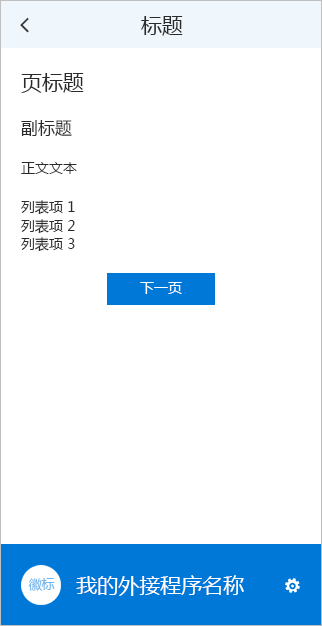</A>
    </td>
    <td>
        
    </td>
    <td>
        
    </td>
</tr>
 </table>

<table>
<tr><th>??Pivot</th><th>????Tab bar</th></tr>
<tr><td></td>
<td><A href="https://github.com/OfficeDev/Office-Add-in-UX-Design-Patterns-Code/tree/master/templates/navigation/tab-bar">
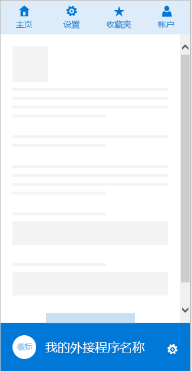</A></td>
</tr>
 </table>

### ??Notifications

??????????????????????????????????????Your add-in can notify users of events, such as errors, or of progress in a variety of ways. The following notification templates are available: 

* **??????** - ???????????????????????????????????????????????????????????????????????????????????**Embedded dialog box** - Shows a dialog box inside the task pane that provides information and, optionally, an interactive experience, using buttons or other controls. Consider using one to prompt a user to confirm an action. Use the Embedded dialog pattern when you want to keep the user experience in the task pane.
    * [????????Embedded dialog box specification](https://github.com/OfficeDev/Office-Add-in-UX-Design-Patterns/blob/master/patterns/embedded-dialog.md)
    * [????????Embedded dialog box code](https://github.com/OfficeDev/Office-Add-in-UX-Design-Patterns-Code/tree/master/templates/notifications/embedded-dialog)
* **????** - ??????????????????????????????????????????????????????????????????????**Inline message** - Indicates error, success, or information, and can appear at a specified location in the task pane. For example, if a user enters an incorrectly formatted email address in a text box, an error message appears just below the text box. 
    * [??????](https://github.com/OfficeDev/Office-Add-in-UX-Design-Patterns/blob/master/assets/archived-patterns/notification_inlineMessage.pdf)??????????????[Inline message specification](https://github.com/OfficeDev/Office-Add-in-UX-Design-Patterns/blob/master/assets/archived-patterns/notification_inlineMessage.pdf) (This UX design pattern has been archived. ???????????????? PDF??As we assess its value, refer to this PDF.)
    * [??????Inline message code](https://github.com/OfficeDev/Office-Add-in-UX-Design-Patterns-Code/tree/master/templates/notifications/inline-message)
* **????** - ????????????????????????????????????????????????????????????**Message banner** - Provides information and, optionally, a simple call to action, in a banner that can be collapsed to a single line, expanded to multiple lines, or dismissed. Use message banners to report a service update or a helpful tip when the add-in starts. 
    * [??????](https://github.com/OfficeDev/Office-Add-in-UX-Design-Patterns/blob/master/assets/archived-patterns/message_bar.pdf)??????????????[Message banner specification](https://github.com/OfficeDev/Office-Add-in-UX-Design-Patterns/blob/master/assets/archived-patterns/message_bar.pdf) (This UX design pattern has been archived. ???????????????? PDF??As we assess its value, refer to this PDF.)
    * [??????Message banner code](https://github.com/OfficeDev/Office-Add-in-UX-Design-Patterns-Code/tree/master/templates/notifications/message-banner)
* **???** - ????????????????????????????????????????????????????????????????????????????????????????????**Progress bar** - Indicates the progress of a long-running, synchronous process, such as a configuration task that must complete before the user can take any further action. It is a separate interstitial page that also reinforces the add-in brand. Use a progress bar when the process can send periodic measures of how far along it is back to the add-in.
    * [?????Progress bar specification](https://github.com/OfficeDev/Office-Add-in-UX-Design-Patterns/blob/master/patterns/progress-indicator.md)
    * [?????Progress bar code](https://github.com/OfficeDev/Office-Add-in-UX-Design-Patterns-Code/tree/master/templates/notifications/progress-bar)
* **???** - ?????????????????????????????????????????????????????????????????????????????**Spinner** - Indicates that a long-running, synchronous process is underway, but provides no indication of how far along it is. It is a separate interstitial page that also reinforces the add-in brand. Use a spinner when the add-in cannot know reliably how far along a process is. 
    * [??????Spinner specification](https://github.com/OfficeDev/Office-Add-in-UX-Design-Patterns/blob/master/patterns/spinner.md)
    * [?????Spinner code](https://github.com/OfficeDev/Office-Add-in-UX-Design-Patterns-Code/tree/master/templates/notifications/spinner)
* **Toast** - ???????????????????????????????toast ??????????????????????????????????????????**Toast** - Provides a brief message that fades away after a few seconds. Because the user might not see the message, use toast only for nonessential information. It is a good choice for notifying users of an event in a remote system, such as the receipt of an email.
    * [Toast ??Toast specification](https://github.com/OfficeDev/Office-Add-in-UX-Design-Patterns/blob/master/patterns/toast.md)
    * [Toast ??Toast code](https://github.com/OfficeDev/Office-Add-in-UX-Design-Patterns-Code/tree/master/templates/notifications/toast)

 <table>
 <tr><th>??????Embedded dialog</th><th>????Inline message</th><th>????Message banner</th></tr>
 <tr><td><A href="https://github.com/OfficeDev/Office-Add-in-UX-Design-Patterns-Code/tree/master/templates/notifications/embedded-dialog">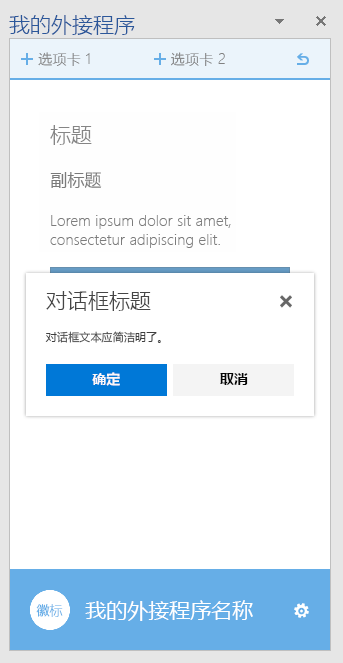</A></td>
<td><A href="https://github.com/OfficeDev/Office-Add-in-UX-Design-Patterns-Code/tree/master/templates/notifications/inline-message">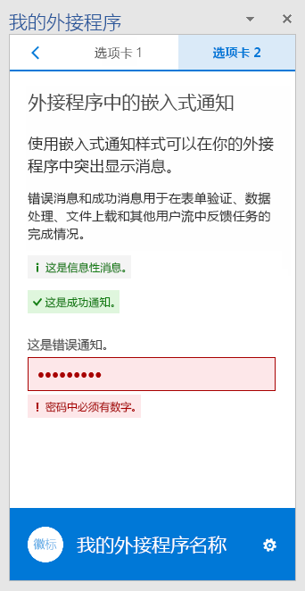</A></td>
<td><A href="https://github.com/OfficeDev/Office-Add-in-UX-Design-Patterns-Code/tree/master/templates/notifications/message-banner">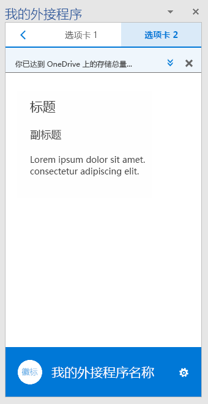</A></td></tr>
 </table>

 <table>
 <tr><th>???Progress bar</th><th>???Spinner</th><th>ToastToast</th></tr>
 <tr><td><A href="https://github.com/OfficeDev/Office-Add-in-UX-Design-Patterns-Code/tree/master/templates/notifications/progress-bar">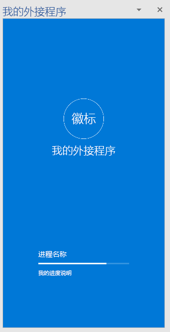</A></td>
<td><A href="https://github.com/OfficeDev/Office-Add-in-UX-Design-Patterns-Code/tree/master/templates/notifications/spinner">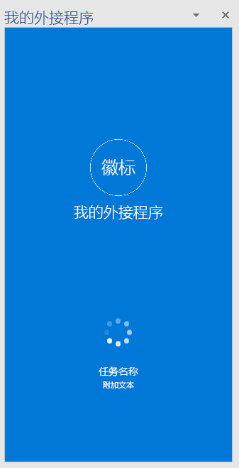</A></td>
<td><A href="https://github.com/OfficeDev/Office-Add-in-UX-Design-Patterns-Code/tree/master/templates/notifications/toast">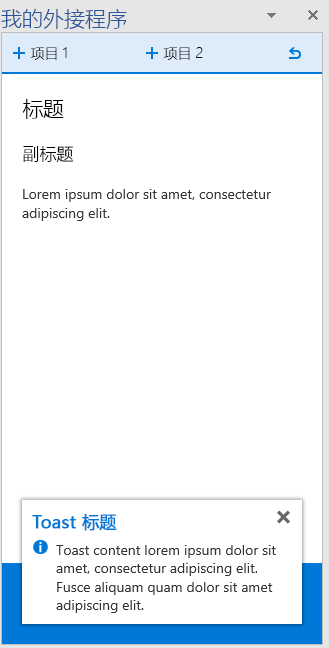</A></td></tr>
 </table>
 

### ????General components

???????????????????????????The following are general components that you can use in your add-ins in a variety of scenarios.  

#### ??????Client dialog boxes

????????????????????????????????????????????Client dialog boxes provide another way for users to work with your add-in outside of a task pane. The following dialog box templates are available:

* **Typeramp ???** - ?????????????Typeramp ????????????????**Typeramp dialog box** - Shows a dialog box with textual content. Use the typeramp dialog to display elaborative information to users. 
    * ?????? [Office ????????](dialog-boxes.md)????? [Office ???????](add-in-design-language.md#typography)???Learn about designing [dialog boxes in Office Add-ins](dialog-boxes.md). Also follow our guidelines for [Typography in Office Add-ins](add-in-design-language.md#typography).
    * [Typeramp ?????Typeramp dialog box code](https://github.com/OfficeDev/Office-Add-in-UX-Design-Patterns-Code/tree/master/templates/dialog/typeramp)
* **?????** - ????????????????????????**Alert dialog box** - Shows an alert box with important information, such as errors or notifications, to users.  
    * [???????](https://github.com/OfficeDev/Office-Add-in-UX-Design-Patterns/blob/master/assets/archived-patterns/notification_alert.pdf)??????????????[Alert dialog box specification](https://github.com/OfficeDev/Office-Add-in-UX-Design-Patterns/blob/master/assets/archived-patterns/notification_alert.pdf) (This UX design pattern has been archived. ???????????????? PDF??As we assess its value, refer to this PDF.)
    * [???????Alert dialog box code](https://github.com/OfficeDev/Office-Add-in-UX-Design-Patterns-Code/tree/master/templates/dialog/alert)
* **?????** - ????????????????????????????????**Navigation dialog box** - Shows a dialog box with navigation. Use the navigation dialog box to allow users to navigate between different content. 
    * ?????? [Office ????????](dialog-boxes.md)?????[??? Office ?????? Office UI Fabric ????](pivot.md)?Learn about designing [dialog boxes in Office Add-ins](dialog-boxes.md). Also learn about using Office UI Fabric [Pivot components in Office Add-ins](pivot.md).
    * [???????Navigation dialog box code](https://github.com/OfficeDev/Office-Add-in-UX-Design-Patterns-Code/tree/master/templates/dialog/navigation)

<table>
 <tr><th>Typeramp ???Typeramp dialog</th><th>?????Alert dialog</th></tr>
<tr>
<td><A href="https://github.com/OfficeDev/Office-Add-in-UX-Design-Patterns-Code/tree/master/templates/dialog/typeramp">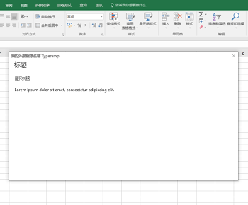</A></td>
<td><A href="https://github.com/OfficeDev/Office-Add-in-UX-Design-Patterns-Code/tree/master/templates/dialog/alert">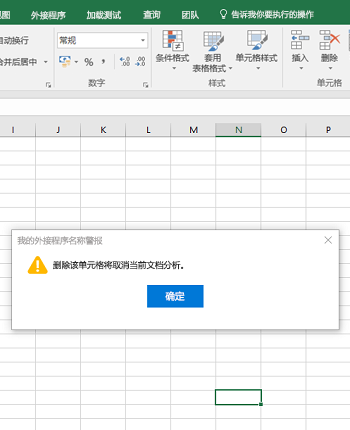</A></td>
</tr></tr>
 </table>
 
 <table>
 <tr><th>?????Navigation dialog</th></tr>
<tr><td><A href="https://github.com/OfficeDev/Office-Add-in-UX-Design-Patterns-Code/tree/master/templates/dialog/navigation">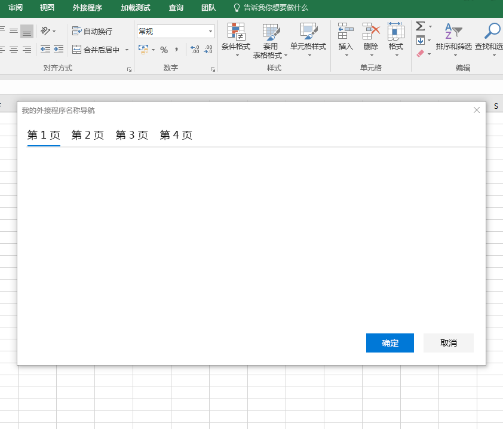</A></td></tr>
</tr>
 </table>

#### ?????Feedback and ratings

??????????????????????? AppSource ??????????????????????????????????????????To improve the visibility and adoption of your add-in, it is helpful to provide users with the ability to rate and review your add-in in AppSource. This pattern shows two methods for presenting feedback and ratings from within the add-in:

- ??????? - ?????????????????????????????**????**????User-initiated feedback - A user chooses to send feedback by using either the navigation menu (for example, using the **Send Feedback** link) or an icon on the footer.
- ??????? - ????????????????????????System-initiated feedback - After the add-in runs three times, the user is prompted to provide feedback via a Message Banner.

???????????????????????? AppSource ???Either method opens a dialog box that contains the AppSource page for the add-in.

* [???????](https://github.com/OfficeDev/Office-Add-in-UX-Design-Patterns/blob/master/assets/archived-patterns/notification_feedback.pdf)??????????????[Feedback and ratings specification](https://github.com/OfficeDev/Office-Add-in-UX-Design-Patterns/blob/master/assets/archived-patterns/notification_feedback.pdf) (This UX design pattern has been archived. ???????????????? PDF??As we assess its value, refer to this PDF.)
* [???????Feedback and ratings code](https://github.com/OfficeDev/Office-Add-in-UX-Design-Patterns-Code/tree/master/templates/feedback/office-store)

> [!IMPORTANT]
> ?????? AppSource ???????? URL ????????? AppSource ?? URL?This pattern currently points to the AppSource home page. Be sure to update this URL to the URL of your add-in's page in AppSource.

 <table>
 <tr><th>?????Feedback and ratings</th></tr>
<tr><td><A href="https://github.com/OfficeDev/Office-Add-in-UX-Design-Patterns-Code/tree/master/templates/feedback/office-store">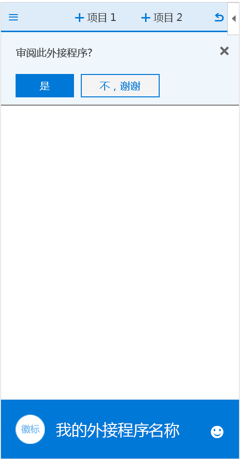</A></td></tr>
</tr>
 </table>

#### ?????Settings and privacy

????????????????????????????????????????????????????????Add-ins may need a Settings page that allows users to configure settings that control the behavior of the add-in. Also, you may want to provide users with the privacy policies your add-in adheres to. 

* **??** - ??????????????????????????????????????**Settings** - Shows a task pane with configuration components that controls the behavior of the add-in. A settings page provides options for the user to choose.
    * [????Settings specification](https://github.com/OfficeDev/Office-Add-in-UX-Design-Patterns/blob/master/patterns/settings.md)
    * [????Settings code](https://github.com/OfficeDev/Office-Add-in-UX-Design-Patterns-Code/tree/master/templates/settings)
* **????** - ????????????????????**Privacy policy** - Shows task pane with important information about privacy policies. 
    * [??????](https://github.com/OfficeDev/Office-Add-in-UX-Design-Patterns/blob/master/assets/archived-patterns/general_multiSection.pdf)??????????????[Privacy Policy specification](https://github.com/OfficeDev/Office-Add-in-UX-Design-Patterns/blob/master/assets/archived-patterns/general_multiSection.pdf) (This UX design pattern has been archived. ???????????????? PDF??As we assess its value, refer to this PDF.)
    * [??????Privacy Policy code](https://github.com/OfficeDev/Office-Add-in-UX-Design-Patterns-Code/tree/master/templates/settings)

<table>
 <tr><th>??Settings</th><th>????Privacy Policy</th></tr>
<tr>
<td></td>
<td><A href="https://github.com/OfficeDev/Office-Add-in-UX-Design-Patterns-Code/tree/master/templates/settings">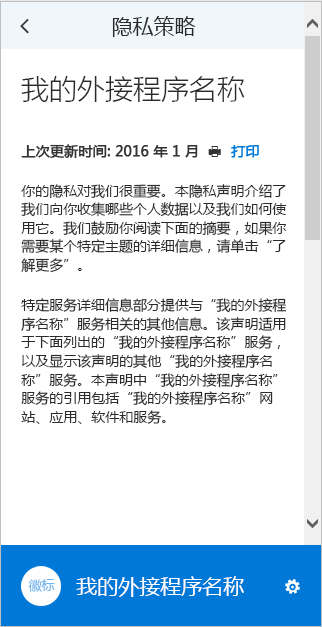</A></td>
</tr></tr>
 </table>

## ????See also

* [Office ?????????Best practices for developing Office Add-ins](../concepts/add-in-development-best-practices.md)
* [Office UI FabricOffice UI Fabric](http://dev.office.com/fabric/)
