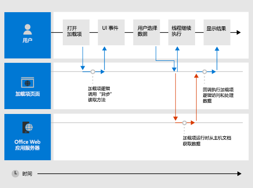

# <a name="asynchronous-programming-in-office-add-ins"></a><span data-ttu-id="1fc88-103">Office 加载项中的异步编程</span><span class="sxs-lookup"><span data-stu-id="1fc88-103">Asynchronous programming in Office Add-ins</span></span>

[!include[information about the common API](../includes/alert-common-api-info.md)]

<span data-ttu-id="1fc88-104">为什么 Office 外接程序 API 使用异步编程？</span><span class="sxs-lookup"><span data-stu-id="1fc88-104">Why does the Office Add-ins API use asynchronous programming?</span></span> <span data-ttu-id="1fc88-105">因为 JavaScript 是单线程语言，如果脚本调用长时间运行的同步进程，则会阻止所有后续脚本执行，直至该进程完成。</span><span class="sxs-lookup"><span data-stu-id="1fc88-105">Because JavaScript is a single-threaded language, if script invokes a long-running synchronous process, all subsequent script execution will be blocked until that process completes.</span></span> <span data-ttu-id="1fc88-106">由于对 Office web 客户端的某些操作 (但富客户端) 也会在同步运行时阻止执行，因此大多数 Office JavaScript Api 都是以异步方式执行的。</span><span class="sxs-lookup"><span data-stu-id="1fc88-106">Because certain operations against Office web clients (but rich clients as well) could block execution if they are run synchronously, most of the Office JavaScript APIs are designed to execute asynchronously.</span></span> <span data-ttu-id="1fc88-107">这可确保 Office 加载项快速响应和快速。</span><span class="sxs-lookup"><span data-stu-id="1fc88-107">This makes sure that Office Add-ins are responsive and fast.</span></span> <span data-ttu-id="1fc88-108">使用这些异步方法时，也通常会要求您编写回调函数。</span><span class="sxs-lookup"><span data-stu-id="1fc88-108">It also frequently requires you to write callback functions when working with these asynchronous methods.</span></span>

<span data-ttu-id="1fc88-109">API end 中所有异步方法的名称，其中包含 "Async"，如 `Document.getSelectedDataAsync` 、 `Binding.getDataAsync` 或 `Item.loadCustomPropertiesAsync` 方法。</span><span class="sxs-lookup"><span data-stu-id="1fc88-109">The names of all asynchronous methods in the API end with "Async", such as the `Document.getSelectedDataAsync`, `Binding.getDataAsync`, or `Item.loadCustomPropertiesAsync` methods.</span></span> <span data-ttu-id="1fc88-110">调用某个“Async”方法时，该方法会立即执行，并且任何后续脚本执行都可以继续。</span><span class="sxs-lookup"><span data-stu-id="1fc88-110">When an "Async" method is called, it executes immediately and any subsequent script execution can continue.</span></span> <span data-ttu-id="1fc88-111">传递给“Async”方法的可选回调函数在数据或请求操作准备就绪后便会立即执行。</span><span class="sxs-lookup"><span data-stu-id="1fc88-111">The optional callback function you pass to an "Async" method executes as soon as the data or requested operation is ready.</span></span> <span data-ttu-id="1fc88-112">虽然是立即执行，但在它返回之前可能会略有延迟。</span><span class="sxs-lookup"><span data-stu-id="1fc88-112">This generally occurs promptly, but there can be a slight delay before it returns.</span></span>

<span data-ttu-id="1fc88-113">下图显示了对 "Async" 方法的调用的执行流，该方法读取用户在基于服务器的 Word 或 Excel 中打开的文档中所选的数据。</span><span class="sxs-lookup"><span data-stu-id="1fc88-113">The following diagram shows the flow of execution for a call to an "Async" method that reads the data the user selected in a document open in the server-based Word or Excel.</span></span> <span data-ttu-id="1fc88-114">在发出 "Async" 调用时，JavaScript 执行线程可以自由执行任何额外的客户端处理 (尽管图表) 中没有显示任何其他处理。</span><span class="sxs-lookup"><span data-stu-id="1fc88-114">At the point when the "Async" call is made, the JavaScript execution thread is free to perform any additional client-side processing (although none are shown in the diagram).</span></span> <span data-ttu-id="1fc88-115">）当“Async”方法返回时，回调在线程上恢复执行，外接程序可以访问数据、处理数据并显示结果。</span><span class="sxs-lookup"><span data-stu-id="1fc88-115">When the "Async" method returns, the callback resumes execution on the thread, and the add-in can the access data, do something with it, and display the result.</span></span> <span data-ttu-id="1fc88-116">使用 Office 富客户端应用程序（如 Word 2013 或 Excel 2013）时，具有相同的异步执行模式。</span><span class="sxs-lookup"><span data-stu-id="1fc88-116">The same asynchronous execution pattern holds when working with the Office rich client applications, such as Word 2013 or Excel 2013.</span></span>

<span data-ttu-id="1fc88-117">*图 1. 异步编程执行流*</span><span class="sxs-lookup"><span data-stu-id="1fc88-117">*Figure 1. Asynchronous programming execution flow*</span></span>



<span data-ttu-id="1fc88-p104">在富客户端和 Web 客户端中支持此异步设计是 Office 加载项开发模型"写入一次，跨平台运行"设计目标的一部分。例如，可以使用将在 Excel 2013 和 Excel 网页版中运行的单一基本代码创建一个内容应用程序或任务窗格加载项。</span><span class="sxs-lookup"><span data-stu-id="1fc88-p104">Support for this asynchronous design in both rich and web clients is part of the "write once-run cross-platform" design goals of the Office Add-ins development model. For example, you can create a content or task pane add-in with a single code base that will run in both Excel 2013 and Excel on the web.</span></span>

## <a name="writing-the-callback-function-for-an-async-method"></a><span data-ttu-id="1fc88-121">编写"Async"方法的回调函数</span><span class="sxs-lookup"><span data-stu-id="1fc88-121">Writing the callback function for an "Async" method</span></span>

<span data-ttu-id="1fc88-122">作为 _callback_ 参数传递给 "Async" 方法的回调函数必须声明一个参数，外接程序运行时将使用该参数在回调函数执行时提供对 [AsyncResult](/javascript/api/office/office.asyncresult) 对象的访问权限。</span><span class="sxs-lookup"><span data-stu-id="1fc88-122">The callback function you pass as the _callback_ argument to an "Async" method must declare a single parameter that the add-in runtime will use to provide access to an [AsyncResult](/javascript/api/office/office.asyncresult) object when the callback function executes.</span></span> <span data-ttu-id="1fc88-123">可以编写：</span><span class="sxs-lookup"><span data-stu-id="1fc88-123">You can write:</span></span>

- <span data-ttu-id="1fc88-124">必须编写并作为 "Async" 方法的 _callback_ 参数与调用一起直接传递给 "async" 方法的匿名函数。</span><span class="sxs-lookup"><span data-stu-id="1fc88-124">An anonymous function that must be written and passed directly in line with the call to the "Async" method as the _callback_ parameter of the "Async" method.</span></span>

- <span data-ttu-id="1fc88-125">一个命名函数，用于将该函数的名称作为 "Async" 方法的 _callback_ 参数进行传递。</span><span class="sxs-lookup"><span data-stu-id="1fc88-125">A named function, passing the name of that function as the _callback_ parameter of an "Async" method.</span></span>

<span data-ttu-id="1fc88-p106">如果您打算只使用一次代码，则可以使用匿名函数，这是因为该函数没有名称，您不能在代码的其他部分引用此代码。如果您打算重复将回调函数用于多个"Async"方法，则可以使用命名函数。</span><span class="sxs-lookup"><span data-stu-id="1fc88-p106">An anonymous function is useful if you are only going to use its code once - because it has no name, you can't reference it in another part of your code. A named function is useful if you want to reuse the callback function for more than one "Async" method.</span></span>

### <a name="writing-an-anonymous-callback-function"></a><span data-ttu-id="1fc88-128">编写匿名回调函数</span><span class="sxs-lookup"><span data-stu-id="1fc88-128">Writing an anonymous callback function</span></span>

<span data-ttu-id="1fc88-129">以下匿名回调函数声明名为的单个参数 `result` ，该参数在回调返回时从 [AsyncResult](/javascript/api/office/office.asyncresult#value) 属性中检索数据。</span><span class="sxs-lookup"><span data-stu-id="1fc88-129">The following anonymous callback function declares a single parameter named `result` that retrieves data from the [AsyncResult.value](/javascript/api/office/office.asyncresult#value) property when the callback returns.</span></span>

```js
function (result) {
        write('Selected data: ' + result.value);
}
```

<span data-ttu-id="1fc88-130">下面的示例演示如何在对方法的完整 "Async" 方法调用的上下文中以行为的方式传递此匿名回调函数 `Document.getSelectedDataAsync` 。</span><span class="sxs-lookup"><span data-stu-id="1fc88-130">The following example shows how to pass this anonymous callback function in line in the context of a full "Async" method call to the `Document.getSelectedDataAsync` method.</span></span>

- <span data-ttu-id="1fc88-131">第一个 _coercionType_ 参数 `Office.CoercionType.Text` 指定将所选数据作为文本字符串返回。</span><span class="sxs-lookup"><span data-stu-id="1fc88-131">The first _coercionType_ argument, `Office.CoercionType.Text`, specifies to return the selected data as a string of text.</span></span>

- <span data-ttu-id="1fc88-132">第二个 _回调_ 参数是以串联方式传递给方法的匿名函数。</span><span class="sxs-lookup"><span data-stu-id="1fc88-132">The second _callback_ argument is the anonymous function passed in-line to the method.</span></span> <span data-ttu-id="1fc88-133">函数执行时，它使用 _result_ 参数访问对象的属性， `value` `AsyncResult` 以显示用户在文档中选择的数据。</span><span class="sxs-lookup"><span data-stu-id="1fc88-133">When the function executes, it uses the _result_ parameter to access the `value` property of the `AsyncResult` object to display the data selected by the user in the document.</span></span>

```js
Office.context.document.getSelectedDataAsync(Office.CoercionType.Text, 
    function (result) {
        write('Selected data: ' + result.value);
    }
});

// Function that writes to a div with id='message' on the page.
function write(message){
    document.getElementById('message').innerText += message; 
}
```

<span data-ttu-id="1fc88-134">您还可以使用回调函数的参数来访问该对象的其他属性 `AsyncResult` 。</span><span class="sxs-lookup"><span data-stu-id="1fc88-134">You can also use the parameter of your callback function to access other properties of the `AsyncResult` object.</span></span> <span data-ttu-id="1fc88-135">可以使用 [AsyncResult.status](/javascript/api/office/office.asyncresult#status) 属性，以确定调用是成功还是失败。</span><span class="sxs-lookup"><span data-stu-id="1fc88-135">Use the [AsyncResult.status](/javascript/api/office/office.asyncresult#status) property to determine if the call succeeded or failed.</span></span> <span data-ttu-id="1fc88-136">如果调用失败，你可以使用 [AsyncResult.error](/javascript/api/office/office.asyncresult#error) 属性访问 [Error](/javascript/api/office/office.error) 对象，以获取错误信息。</span><span class="sxs-lookup"><span data-stu-id="1fc88-136">If your call fails you can use the [AsyncResult.error](/javascript/api/office/office.asyncresult#error) property to access an [Error](/javascript/api/office/office.error) object for error information.</span></span>

<span data-ttu-id="1fc88-137">有关使用方法的详细信息 `getSelectedDataAsync` ，请参阅 [在文档或电子表格的活动选定内容中读取和写入数据](read-and-write-data-to-the-active-selection-in-a-document-or-spreadsheet.md)。</span><span class="sxs-lookup"><span data-stu-id="1fc88-137">For more information about using the `getSelectedDataAsync` method, see [Read and write data to the active selection in a document or spreadsheet](read-and-write-data-to-the-active-selection-in-a-document-or-spreadsheet.md).</span></span> 

### <a name="writing-a-named-callback-function"></a><span data-ttu-id="1fc88-138">编写命名回调函数</span><span class="sxs-lookup"><span data-stu-id="1fc88-138">Writing a named callback function</span></span>

<span data-ttu-id="1fc88-139">或者，也可以编写一个命名的函数并将其名称传递给 "Async" 方法的 _callback_ 参数。</span><span class="sxs-lookup"><span data-stu-id="1fc88-139">Alternatively, you can write a named function and pass its name to the _callback_ parameter of an "Async" method.</span></span> <span data-ttu-id="1fc88-140">例如，可以重写前一个示例，将名为 `writeDataCallback` 的函数作为 _callback_ 参数进行传递，如下所示。</span><span class="sxs-lookup"><span data-stu-id="1fc88-140">For example, the previous example can be rewritten to pass a function named `writeDataCallback` as the _callback_ parameter like this.</span></span>

```js
Office.context.document.getSelectedDataAsync(Office.CoercionType.Text, 
    writeDataCallback);

// Callback to write the selected data to the add-in UI.
function writeDataCallback(result) {
    write('Selected data: ' + result.value);
}

// Function that writes to a div with id='message' on the page.
function write(message){
    document.getElementById('message').innerText += message;
}
```


## <a name="differences-in-whats-returned-to-the-asyncresultvalue-property"></a><span data-ttu-id="1fc88-141">返回 AsyncResult.value 属性的内容的差异</span><span class="sxs-lookup"><span data-stu-id="1fc88-141">Differences in what's returned to the AsyncResult.value property</span></span>

<span data-ttu-id="1fc88-142">`asyncContext`对象的、 `status` 和 `error` 属性将 `AsyncResult` 向传递给所有 "Async" 方法的回调函数返回相同类型的信息。</span><span class="sxs-lookup"><span data-stu-id="1fc88-142">The `asyncContext`, `status`, and `error` properties of the `AsyncResult` object return the same kinds of information to the callback function passed to all "Async" methods.</span></span> <span data-ttu-id="1fc88-143">但是，返回到属性的内容将根据 `AsyncResult.value` "Async" 方法的功能而有所不同。</span><span class="sxs-lookup"><span data-stu-id="1fc88-143">However, what's returned to the `AsyncResult.value` property varies depending on the functionality of the "Async" method.</span></span>

<span data-ttu-id="1fc88-144">例如， `addHandlerAsync` [CustomXmlPart](/javascript/api/office/office.customxmlpart)、 [Document](/javascript/api/office/office.document)、 [RoamingSettings](/javascript/api/outlook/office.roamingsettings)和[Binding](/javascript/api/office/office.binding) [Settings](/javascript/api/office/office.settings)) 对象的方法 (，用于将事件处理程序函数添加到这些对象所表示的项目中。</span><span class="sxs-lookup"><span data-stu-id="1fc88-144">For example, the `addHandlerAsync` methods (of the [Binding](/javascript/api/office/office.binding), [CustomXmlPart](/javascript/api/office/office.customxmlpart), [Document](/javascript/api/office/office.document), [RoamingSettings](/javascript/api/outlook/office.roamingsettings), and [Settings](/javascript/api/office/office.settings) objects) are used to add event handler functions to the items represented by these objects.</span></span> <span data-ttu-id="1fc88-145">您可以 `AsyncResult.value` 从传递给任何方法的回调函数访问该属性 `addHandlerAsync` ，但由于在添加事件处理程序时没有要访问的数据或对象，因此， `value` 如果您尝试访问该属性，该属性将始终返回 **undefined** 。</span><span class="sxs-lookup"><span data-stu-id="1fc88-145">You can access the `AsyncResult.value` property from the callback function you pass to any of the `addHandlerAsync` methods, but since no data or object is being accessed when you add an event handler, the `value` property always returns **undefined** if you attempt to access it.</span></span>

<span data-ttu-id="1fc88-146">另一方面，如果调用 `Document.getSelectedDataAsync` 方法，它会将用户在文档中选择的数据返回到回调中的 `AsyncResult.value` 属性。</span><span class="sxs-lookup"><span data-stu-id="1fc88-146">On the other hand, if you call the `Document.getSelectedDataAsync` method, it returns the data the user selected in the document to the `AsyncResult.value` property in the callback.</span></span> <span data-ttu-id="1fc88-147">或者，如果调用 [getAllAsync](/javascript/api/office/office.bindings#getallasync-options--callback-) 方法，它将返回一个数组，其中的所有 `Binding` 对象都在文档中。</span><span class="sxs-lookup"><span data-stu-id="1fc88-147">Or, if you call the [Bindings.getAllAsync](/javascript/api/office/office.bindings#getallasync-options--callback-) method, it returns an array of all of the `Binding` objects in the document.</span></span> <span data-ttu-id="1fc88-148">如果调用 [getByIdAsync](/javascript/api/office/office.bindings#getbyidasync-id--options--callback-) 方法，则它将返回单个 `Binding` 对象。</span><span class="sxs-lookup"><span data-stu-id="1fc88-148">And, if you call the [Bindings.getByIdAsync](/javascript/api/office/office.bindings#getbyidasync-id--options--callback-) method, it returns a single `Binding` object.</span></span>

<span data-ttu-id="1fc88-149">有关方法的返回属性的说明 `AsyncResult.value` `Async` ，请参阅该方法的参考主题的 "回调值" 部分。</span><span class="sxs-lookup"><span data-stu-id="1fc88-149">For a description of what's returned to the `AsyncResult.value` property for an `Async` method, see the "Callback value" section of that method's reference topic.</span></span> <span data-ttu-id="1fc88-150">有关提供方法的所有对象的摘要 `Async` ，请参阅 [AsyncResult](/javascript/api/office/office.asyncresult) 对象主题底部的表。</span><span class="sxs-lookup"><span data-stu-id="1fc88-150">For a summary of all of the objects that provide `Async` methods, see the table at the bottom of the [AsyncResult](/javascript/api/office/office.asyncresult) object topic.</span></span>

## <a name="asynchronous-programming-patterns"></a><span data-ttu-id="1fc88-151">异步编程模式</span><span class="sxs-lookup"><span data-stu-id="1fc88-151">Asynchronous programming patterns</span></span>

<span data-ttu-id="1fc88-152">Office JavaScript API 支持两种类型的异步编程模式：</span><span class="sxs-lookup"><span data-stu-id="1fc88-152">The Office JavaScript API supports two kinds of asynchronous programming patterns:</span></span>

- <span data-ttu-id="1fc88-153">使用嵌套回调</span><span class="sxs-lookup"><span data-stu-id="1fc88-153">Using nested callbacks</span></span>
- <span data-ttu-id="1fc88-154">使用承诺模式</span><span class="sxs-lookup"><span data-stu-id="1fc88-154">Using the promises pattern</span></span>

<span data-ttu-id="1fc88-p114">使用回调函数的异步编程通常需要您将回调返回的结果嵌套在两个或更多回调中。如果您需要这么做，则可以使用来自 API 的所有"Async"方法的嵌套回调。</span><span class="sxs-lookup"><span data-stu-id="1fc88-p114">Asynchronous programming with callback functions frequently requires you to nest the returned result of one callback within two or more callbacks. If you need to do so, you can use nested callbacks from all "Async" methods of the API.</span></span>

<span data-ttu-id="1fc88-157">使用嵌套回调是大多数 JavaScript 开发人员都熟知的编程模式，但使用了深层嵌套回调的代码难以阅读和理解。</span><span class="sxs-lookup"><span data-stu-id="1fc88-157">Using nested callbacks is a programming pattern familiar to most JavaScript developers, but code with deeply nested callbacks can be difficult to read and understand.</span></span> <span data-ttu-id="1fc88-158">作为嵌套回调的替代方法，Office JavaScript API 还支持实施承诺模式。</span><span class="sxs-lookup"><span data-stu-id="1fc88-158">As an alternative to nested callbacks, the Office JavaScript API also supports an implementation of the promises pattern.</span></span>

> [!NOTE]
> <span data-ttu-id="1fc88-159">在当前版本的 Office JavaScript API 中，承诺模式的 *内置* 支持仅适用于 [Excel 电子表格和 Word 文档中的绑定](bind-to-regions-in-a-document-or-spreadsheet.md)代码。</span><span class="sxs-lookup"><span data-stu-id="1fc88-159">In the current version of the Office JavaScript API, *built-in* support for the promises pattern only works with code for [bindings in Excel spreadsheets and Word documents](bind-to-regions-in-a-document-or-spreadsheet.md).</span></span> <span data-ttu-id="1fc88-160">但是，您可以将具有回调的其他函数封装在自己的自定义承诺返回函数中。</span><span class="sxs-lookup"><span data-stu-id="1fc88-160">However, you can wrap other functions that have callbacks inside your own custom Promise-returning function.</span></span> <span data-ttu-id="1fc88-161">有关详细信息，请参阅 [在承诺返回函数中包装通用 api](#wrap-common-apis-in-promise-returning-functions)。</span><span class="sxs-lookup"><span data-stu-id="1fc88-161">For more information, see [Wrap Common APIs in Promise-returning functions](#wrap-common-apis-in-promise-returning-functions).</span></span>

### <a name="asynchronous-programming-using-nested-callback-functions"></a><span data-ttu-id="1fc88-162">使用嵌套回调函数的异步编程</span><span class="sxs-lookup"><span data-stu-id="1fc88-162">Asynchronous programming using nested callback functions</span></span>

<span data-ttu-id="1fc88-p117">通常，完成一项任务需要执行两个或更多个异步操作。为实现此目的，可在一个调用中嵌套另一个"Async"调用。</span><span class="sxs-lookup"><span data-stu-id="1fc88-p117">Frequently, you need to perform two or more asynchronous operations to complete a task. To accomplish that, you can nest one "Async" call inside another.</span></span>

<span data-ttu-id="1fc88-165">以下代码示例内嵌两个异步调用。</span><span class="sxs-lookup"><span data-stu-id="1fc88-165">The following code example nests two asynchronous calls.</span></span>

- <span data-ttu-id="1fc88-166">首先，调用 [Bindings.getByIdAsync](/javascript/api/office/office.bindings#getbyidasync-id--options--callback-) 方法，以访问名为“MyBinding”的文档中的绑定。</span><span class="sxs-lookup"><span data-stu-id="1fc88-166">First, the [Bindings.getByIdAsync](/javascript/api/office/office.bindings#getbyidasync-id--options--callback-) method is called to access a binding in the document named "MyBinding".</span></span> <span data-ttu-id="1fc88-167">`AsyncResult`返回到该回调的参数的对象提供对该 `result` 属性中指定的 binding 对象的访问权限 `AsyncResult.value` 。</span><span class="sxs-lookup"><span data-stu-id="1fc88-167">The `AsyncResult` object returned to the `result` parameter of that callback provides access to the specified binding object from the `AsyncResult.value` property.</span></span>
- <span data-ttu-id="1fc88-168">然后，使用从第一个参数访问的 binding 对象 `result` 调用 [binding.getdataasync](/javascript/api/office/office.binding#getdataasync-options--callback-) 方法。</span><span class="sxs-lookup"><span data-stu-id="1fc88-168">Then, the binding object accessed from the first `result` parameter is used to call the [Binding.getDataAsync](/javascript/api/office/office.binding#getdataasync-options--callback-) method.</span></span>
- <span data-ttu-id="1fc88-169">最后， `result2` 传递给方法的回调参数 `Binding.getDataAsync` 用于显示绑定中的数据。</span><span class="sxs-lookup"><span data-stu-id="1fc88-169">Finally, the `result2` parameter of the callback passed to the `Binding.getDataAsync` method is used to display the data in the binding.</span></span>

```js
function readData() {
    Office.context.document.bindings.getByIdAsync("MyBinding", function (result) {
        result.value.getDataAsync({ coercionType: 'text' }, function (result2) {
            write(result2.value);
        });
    });
}

// Function that writes to a div with id='message' on the page.
function write(message){
    document.getElementById('message').innerText += message; 
}
```

<span data-ttu-id="1fc88-170">此基本嵌套回调模式可用于 Office JavaScript API 中的所有异步方法。</span><span class="sxs-lookup"><span data-stu-id="1fc88-170">This basic nested callback pattern can be used for all asynchronous methods in the Office JavaScript API.</span></span>

<span data-ttu-id="1fc88-171">以下各节显示如何使用匿名函数或命名函数用于异步方法中的嵌套回调。</span><span class="sxs-lookup"><span data-stu-id="1fc88-171">The following sections show how to use either anonymous or named functions for nested callbacks in asynchronous methods.</span></span>

#### <a name="using-anonymous-functions-for-nested-callbacks"></a><span data-ttu-id="1fc88-172">将匿名函数用于嵌套回调</span><span class="sxs-lookup"><span data-stu-id="1fc88-172">Using anonymous functions for nested callbacks</span></span>

<span data-ttu-id="1fc88-173">在下面的示例中，将内联声明两个匿名函数，并将其 `getByIdAsync` `getDataAsync` 作为嵌套回调传递给和方法。</span><span class="sxs-lookup"><span data-stu-id="1fc88-173">In the following example, two anonymous functions are declared inline and passed into the `getByIdAsync` and `getDataAsync` methods as nested callbacks.</span></span> <span data-ttu-id="1fc88-174">由于这两个函数简单且为内嵌，因此实现的意图很清晰。</span><span class="sxs-lookup"><span data-stu-id="1fc88-174">Because the functions are simple and inline, the intent of the implementation is immediately clear.</span></span>

```js
Office.context.document.bindings.getByIdAsync('myBinding', function (bindingResult) {
    bindingResult.value.getDataAsync(function (getResult) {
        if (getResult.status == Office.AsyncResultStatus.Failed) {
            write('Action failed. Error: ' + asyncResult.error.message);
        } else {
            write('Data has been read successfully.');
        }
    });
});

// Function that writes to a div with id='message' on the page.
function write(message){
    document.getElementById('message').innerText += message;
}
```

#### <a name="using-named-functions-for-nested-callbacks"></a><span data-ttu-id="1fc88-175">将命名函数用于嵌套回调</span><span class="sxs-lookup"><span data-stu-id="1fc88-175">Using named functions for nested callbacks</span></span>

<span data-ttu-id="1fc88-176">在复杂实现中，使用命名函数对于提高代码的可读性、可维护性和可重用性可能会有帮助。</span><span class="sxs-lookup"><span data-stu-id="1fc88-176">In complex implementations, it may be helpful to use named functions to make your code easier to read, maintain, and reuse.</span></span> <span data-ttu-id="1fc88-177">在下面的示例中，前一节的示例中的两个匿名函数已重写为名为 `deleteAllData` 和 `showResult` 的函数。</span><span class="sxs-lookup"><span data-stu-id="1fc88-177">In the following example, the two anonymous functions from the example in the previous section have been rewritten as functions named `deleteAllData` and `showResult`.</span></span> <span data-ttu-id="1fc88-178">然后，通过名称将这些命名的 `getByIdAsync` 函数 `deleteAllDataValuesAsync` 作为回调传递给和方法。</span><span class="sxs-lookup"><span data-stu-id="1fc88-178">These named functions are then passed into the `getByIdAsync` and `deleteAllDataValuesAsync` methods as callbacks by name.</span></span>

```js
Office.context.document.bindings.getByIdAsync('myBinding', deleteAllData);

function deleteAllData(asyncResult) {
    asyncResult.value.deleteAllDataValuesAsync(showResult);
}

function showResult(asyncResult) {
    if (asyncResult.status == Office.AsyncResultStatus.Failed) {
        write('Action failed. Error: ' + asyncResult.error.message);
    } else {
        write('Data has been deleted successfully.');
    }
}

// Function that writes to a div with id='message' on the page.
function write(message){
    document.getElementById('message').innerText += message;
}
```

### <a name="asynchronous-programming-using-the-promises-pattern-to-access-data-in-bindings"></a><span data-ttu-id="1fc88-179">使用承诺模式访问绑定中的数据的异步编程</span><span class="sxs-lookup"><span data-stu-id="1fc88-179">Asynchronous programming using the promises pattern to access data in bindings</span></span>

<span data-ttu-id="1fc88-p121">在继续执行之前，承诺编程模式会立即返回表示其预期结果的承诺对象，而不是传递回调函数并等待函数返回。然而，与真正同步编程不同的是，在 Office 外接程序运行时环境完成请求之前，承诺结果的实现在后台实际上是延迟的。提供 _onError_ 处理程序来覆盖请求无法满足的情况。</span><span class="sxs-lookup"><span data-stu-id="1fc88-p121">Instead of passing a callback function and waiting for the function to return before execution continues, the promises programming pattern immediately returns a promise object that represents its intended result. However, unlike true synchronous programming, under the covers the fulfillment of the promised result is actually deferred until the Office Add-ins runtime environment can complete the request. An _onError_ handler is provided to cover situations when the request can't be fulfilled.</span></span>

<span data-ttu-id="1fc88-183">Office JavaScript API 提供了 [office. select](/javascript/api/office#office-select-expression--callback-) 方法，以支持使用现有绑定对象的承诺模式。</span><span class="sxs-lookup"><span data-stu-id="1fc88-183">The Office JavaScript API provides the [Office.select](/javascript/api/office#office-select-expression--callback-) method to support the promises pattern for working with existing binding objects.</span></span> <span data-ttu-id="1fc88-184">返回到方法的承诺对象 `Office.select` 仅支持您可以直接从 [Binding](/javascript/api/office/office.binding) 对象访问的四个方法： [Binding.getdataasync](/javascript/api/office/office.binding#getdataasync-options--callback-)、 [binding.setdataasync](/javascript/api/office/office.binding#setdataasync-data--options--callback-)、 [addHandlerAsync](/javascript/api/office/office.binding#addhandlerasync-eventtype--handler--options--callback-)和 [removeHandlerAsync](/javascript/api/office/office.binding#removehandlerasync-eventtype--options--callback-)。</span><span class="sxs-lookup"><span data-stu-id="1fc88-184">The promise object returned to the `Office.select` method supports only the four methods that you can access directly from the [Binding](/javascript/api/office/office.binding) object: [getDataAsync](/javascript/api/office/office.binding#getdataasync-options--callback-), [setDataAsync](/javascript/api/office/office.binding#setdataasync-data--options--callback-), [addHandlerAsync](/javascript/api/office/office.binding#addhandlerasync-eventtype--handler--options--callback-), and [removeHandlerAsync](/javascript/api/office/office.binding#removehandlerasync-eventtype--options--callback-).</span></span>

<span data-ttu-id="1fc88-185">与绑定一起使用的承诺模式采用以下形式：</span><span class="sxs-lookup"><span data-stu-id="1fc88-185">The promises pattern for working with bindings takes this form:</span></span>

<span data-ttu-id="1fc88-186">**Office. select (** _selectorExpression_、 _onError_ **) 。**_BindingObjectAsyncMethod_</span><span class="sxs-lookup"><span data-stu-id="1fc88-186">**Office.select(**_selectorExpression_, _onError_**).**_BindingObjectAsyncMethod_</span></span>

<span data-ttu-id="1fc88-187">_SelectorExpression_ 参数采用窗体 `"bindings#bindingId"` ，其中 _bindingId_ 是 `id` 您之前在文档或电子表格中创建的绑定的名称 ()  (使用集合的 "addFrom" 方法之一 `Bindings` ： `addFromNamedItemAsync` 、 `addFromPromptAsync` 或 `addFromSelectionAsync`) 。</span><span class="sxs-lookup"><span data-stu-id="1fc88-187">The _selectorExpression_ parameter takes the form `"bindings#bindingId"`, where _bindingId_ is the name ( `id`) of a binding that you created previously in the document or spreadsheet (using one of the "addFrom" methods of the `Bindings` collection: `addFromNamedItemAsync`, `addFromPromptAsync`, or `addFromSelectionAsync`).</span></span> <span data-ttu-id="1fc88-188">例如，选择器表达式 `bindings#cities` 指定要访问 **id** 为 "城市" 的绑定。</span><span class="sxs-lookup"><span data-stu-id="1fc88-188">For example, the selector expression `bindings#cities` specifies that you want to access the binding with an **id** of 'cities'.</span></span>

<span data-ttu-id="1fc88-189">_OnError_ 参数是一个错误处理函数，它采用 `AsyncResult` 可用于访问对象的单个参数类型 `Error` ，前提是该 `select` 方法无法访问指定的绑定。</span><span class="sxs-lookup"><span data-stu-id="1fc88-189">The _onError_ parameter is an error handling function which takes a single parameter of type `AsyncResult` that can be used to access an `Error` object, if the `select` method fails to access the specified binding.</span></span> <span data-ttu-id="1fc88-190">以下示例显示了一个可传递给 _onError_ 参数的基本错误处理程序函数。</span><span class="sxs-lookup"><span data-stu-id="1fc88-190">The following example shows a basic error handler function that can be passed to the _onError_ parameter.</span></span>

```js
function onError(result){
    var err = result.error;
    write(err.name + ": " + err.message);
}
// Function that writes to a div with id='message' on the page.
function write(message){
    document.getElementById('message').innerText += message; 
}
```

<span data-ttu-id="1fc88-191">将 _BindingObjectAsyncMethod_ 占位符替换为对承诺对象支持的四个对象方法中的任何一个 `Binding` ： `getDataAsync` 、 `setDataAsync` 、 `addHandlerAsync` 或 `removeHandlerAsync` 。</span><span class="sxs-lookup"><span data-stu-id="1fc88-191">Replace the _BindingObjectAsyncMethod_ placeholder with a call to any of the four `Binding` object methods supported by the promise object: `getDataAsync`, `setDataAsync`, `addHandlerAsync`, or `removeHandlerAsync`.</span></span> <span data-ttu-id="1fc88-192">对这些方法的调用不支持其他的承诺。</span><span class="sxs-lookup"><span data-stu-id="1fc88-192">Calls to these methods don't support additional promises.</span></span> <span data-ttu-id="1fc88-193">你必须使用[嵌套回调函数模式](#asynchronous-programming-using-nested-callback-functions)来调用它们。</span><span class="sxs-lookup"><span data-stu-id="1fc88-193">You must call them using the [nested callback function pattern](#asynchronous-programming-using-nested-callback-functions).</span></span>

<span data-ttu-id="1fc88-194">在 `Binding` 满足对象承诺后，可以在连锁方法调用中重用它，就像它是绑定 (外接运行时将不会异步重试满足承诺) 。</span><span class="sxs-lookup"><span data-stu-id="1fc88-194">After a `Binding` object promise is fulfilled, it can be reused in the chained method call as if it were a binding (the add-in runtime won't asynchronously retry fulfilling the promise).</span></span> <span data-ttu-id="1fc88-195">如果 `Binding` 无法满足对象承诺，加载项运行时将在下次调用其异步方法之一时再次尝试访问 binding 对象。</span><span class="sxs-lookup"><span data-stu-id="1fc88-195">If the `Binding` object promise can't be fulfilled, the add-in runtime will try again to access the binding object the next time one of its asynchronous methods is invoked.</span></span>

<span data-ttu-id="1fc88-196">下面的代码示例使用 `select` 方法 `id` 从集合中检索带有 "" 的绑定 `cities` `Bindings` ，然后调用 [AddHandlerAsync](/javascript/api/office/office.binding#addhandlerasync-eventtype--handler--options--callback-) 方法为绑定的 [dataChanged](/javascript/api/office/office.bindingdatachangedeventargs) 事件添加事件处理程序。</span><span class="sxs-lookup"><span data-stu-id="1fc88-196">The following code example uses the `select` method to retrieve a binding with the `id` "`cities`" from the `Bindings` collection, and then calls the [addHandlerAsync](/javascript/api/office/office.binding#addhandlerasync-eventtype--handler--options--callback-) method to add an event handler for the [dataChanged](/javascript/api/office/office.bindingdatachangedeventargs) event of the binding.</span></span>

```js
function addBindingDataChangedEventHandler() {
    Office.select("bindings#cities", function onError(){/* error handling code */}).addHandlerAsync(Office.EventType.BindingDataChanged,
    function (eventArgs) {
        doSomethingWithBinding(eventArgs.binding);
    });
}

```

> [!IMPORTANT]
> <span data-ttu-id="1fc88-197">`Binding`方法返回的对象承诺 `Office.select` 仅提供对该对象的四个方法的访问 `Binding` 。</span><span class="sxs-lookup"><span data-stu-id="1fc88-197">The `Binding` object promise returned by the `Office.select` method provides access to only the four methods of the `Binding` object.</span></span> <span data-ttu-id="1fc88-198">如果需要访问对象的任何其他成员 `Binding` ，则必须使用 `Document.bindings` 属性和 `Bindings.getByIdAsync` 或 `Bindings.getAllAsync` 方法检索该 `Binding` 对象。</span><span class="sxs-lookup"><span data-stu-id="1fc88-198">If you need to access any of the other members of the `Binding` object, instead you must use the `Document.bindings` property and `Bindings.getByIdAsync` or `Bindings.getAllAsync` methods to retrieve the `Binding` object.</span></span> <span data-ttu-id="1fc88-199">例如，如果需要访问对象的任何 `Binding` 属性 () 的、或 `document` `id` `type` 属性，或者需要访问 [MatrixBinding](/javascript/api/office/office.matrixbinding) 或 [TableBinding](/javascript/api/office/office.tablebinding) 对象的属性，则必须使用 `getByIdAsync` 或 `getAllAsync` 方法来检索 `Binding` 对象。</span><span class="sxs-lookup"><span data-stu-id="1fc88-199">For example, if you need to access any of the `Binding` object's properties (the `document`, `id`, or `type` properties), or need to access the properties of the [MatrixBinding](/javascript/api/office/office.matrixbinding) or [TableBinding](/javascript/api/office/office.tablebinding) objects, you must use the `getByIdAsync` or `getAllAsync` methods to retrieve a `Binding` object.</span></span>

## <a name="passing-optional-parameters-to-asynchronous-methods"></a><span data-ttu-id="1fc88-200">向异步方法传递可选参数</span><span class="sxs-lookup"><span data-stu-id="1fc88-200">Passing optional parameters to asynchronous methods</span></span>

<span data-ttu-id="1fc88-201">所有"异步"方法的常用语法都遵循此模式：</span><span class="sxs-lookup"><span data-stu-id="1fc88-201">The common syntax for all "Async" methods follows this pattern:</span></span>

 <span data-ttu-id="1fc88-202">_AsyncMethod_ `(`_RequiredParameters_`, [`_OptionalParameters_`],`_CallbackFunction_`);`</span><span class="sxs-lookup"><span data-stu-id="1fc88-202">_AsyncMethod_ `(` _RequiredParameters_ `, [` _OptionalParameters_ `],` _CallbackFunction_ `);`</span></span>

<span data-ttu-id="1fc88-p128">所有异步方法都支持可选参数，这些可选参数作为包含一个或多个可选参数的 JavaScript 对象表示法 (JSON) 对象传入。包含可选参数的 JSON 对象是键-值对的无序集合，其中用":"字符来分隔键和值。对象中的每对用逗号分隔，整个对集合括在大括号中。键是参数名称，值是要为该参数传递的值。</span><span class="sxs-lookup"><span data-stu-id="1fc88-p128">All asynchronous methods support optional parameters, which are passed in as a JavaScript Object Notation (JSON) object that contains one or more optional parameters. The JSON object containing the optional parameters is an unordered collection of key-value pairs with the ":" character separating the key and the value. Each pair in the object is comma-separated, and the entire set of pairs is enclosed in braces. The key is the parameter name, and value is the value to pass for that parameter.</span></span>

<span data-ttu-id="1fc88-207">您可以创建包含可选参数内嵌的 JSON 对象，或通过创建 `options` 对象并将其作为 _options_ 参数传入。</span><span class="sxs-lookup"><span data-stu-id="1fc88-207">You can create the JSON object that contains optional parameters inline, or by creating an `options` object and passing that in as the _options_ parameter.</span></span>

### <a name="passing-optional-parameters-inline"></a><span data-ttu-id="1fc88-208">传递可选参数内嵌</span><span class="sxs-lookup"><span data-stu-id="1fc88-208">Passing optional parameters inline</span></span>

<span data-ttu-id="1fc88-209">例如，用可选参数内嵌调用 [Document.setSelectedDataAsync](/javascript/api/office/office.document#setselecteddataasync-data--options--callback-) 方法的语法类似如下：</span><span class="sxs-lookup"><span data-stu-id="1fc88-209">For example, the syntax for calling the [Document.setSelectedDataAsync](/javascript/api/office/office.document#setselecteddataasync-data--options--callback-) method with optional parameters inline looks like this:</span></span>

```js
 Office.context.document.setSelectedDataAsync(data, {coercionType: 'coercionType', asyncContext: 'asyncContext'},callback);

```

<span data-ttu-id="1fc88-210">在这种形式的调用语法中，两个可选参数 _coercionType_ 和 _asyncContext_ 定义为括在大括号内的 JSON 对象内联。</span><span class="sxs-lookup"><span data-stu-id="1fc88-210">In this form of the calling syntax, the two optional parameters, _coercionType_ and _asyncContext_, are defined as a JSON object inline enclosed in braces.</span></span>

<span data-ttu-id="1fc88-211">下面的示例演示如何 `Document.setSelectedDataAsync` 通过指定内嵌可选参数来调用方法。</span><span class="sxs-lookup"><span data-stu-id="1fc88-211">The following example shows how to call to the `Document.setSelectedDataAsync` method by specifying optional parameters inline.</span></span>

```js
Office.context.document.setSelectedDataAsync(
    "<html><body>hello world</body></html>",
    {coercionType: "html", asyncContext: 42},
    function(asyncResult) {
        write(asyncResult.status + " " + asyncResult.asyncContext);
    }
)

// Function that writes to a div with id='message' on the page.
function write(message){
    document.getElementById('message').innerText += message; 
}
```

> [!NOTE]
> <span data-ttu-id="1fc88-212">可以任何顺序在 JSON 对象中指定可选参数，只要指定正确的参数名称即可。</span><span class="sxs-lookup"><span data-stu-id="1fc88-212">You can specify optional parameters in any order in the JSON object as long as their names are specified correctly.</span></span>

### <a name="passing-optional-parameters-in-an-options-object"></a><span data-ttu-id="1fc88-213">在 options 对象中传递可选参数</span><span class="sxs-lookup"><span data-stu-id="1fc88-213">Passing optional parameters in an options object</span></span>

<span data-ttu-id="1fc88-214">或者，也可以创建一个名为 `options` 的对象，该对象指定与方法调用分开的可选参数，然后将 `options` 对象作为 _options_ 参数传递。</span><span class="sxs-lookup"><span data-stu-id="1fc88-214">Alternatively, you can create an object named `options` that specifies the optional parameters separately from the method call, and then pass the `options` object as the _options_ argument.</span></span>

<span data-ttu-id="1fc88-215">下面的示例演示创建对象的一种方法 `options` ，其中 `parameter1` 、 `value1` 等是实际参数名称和值的占位符。</span><span class="sxs-lookup"><span data-stu-id="1fc88-215">The following example shows one way of creating the `options` object, where `parameter1`, `value1`, and so on, are placeholders for the actual parameter names and values.</span></span>

```js
var options = {
    parameter1: value1,
    parameter2: value2,
    ...
    parameterN: valueN
};

```

<span data-ttu-id="1fc88-216">用于指定 [ValueFormat](/javascript/api/office/office.valueformat) 和 [FilterType](/javascript/api/office/office.filtertype) 参数时与以下示例类似。</span><span class="sxs-lookup"><span data-stu-id="1fc88-216">Which looks like the following example when used to specify the [ValueFormat](/javascript/api/office/office.valueformat) and [FilterType](/javascript/api/office/office.filtertype) parameters.</span></span>

```js
var options = {
    valueFormat: "unformatted",
    filterType: "all"
};
```

<span data-ttu-id="1fc88-217">此处是创建对象的另一种方法 `options` 。</span><span class="sxs-lookup"><span data-stu-id="1fc88-217">Here's another way of creating the `options` object.</span></span>

```js
var options = {};
options[parameter1] = value1;
options[parameter2] = value2;
...
options[parameterN] = valueN;
```

<span data-ttu-id="1fc88-218">用于指定和参数时与以下示例类似 `ValueFormat` `FilterType` ：</span><span class="sxs-lookup"><span data-stu-id="1fc88-218">Which looks like the following example when used to specify the `ValueFormat` and `FilterType` parameters:</span></span>

```js
var options = {};
options["ValueFormat"] = "unformatted";
options["FilterType"] = "all";
```

> [!NOTE]
> <span data-ttu-id="1fc88-219">使用任一方法创建 `options` 对象时，只要可选参数的名称指定正确，就可以按任意顺序指定这些参数。</span><span class="sxs-lookup"><span data-stu-id="1fc88-219">When using either method of creating the `options` object, you can specify optional parameters in any order as long as their names are specified correctly.</span></span>

<span data-ttu-id="1fc88-220">下面的示例演示如何 `Document.setSelectedDataAsync` 通过在对象中指定可选参数来调用此方法 `options` 。</span><span class="sxs-lookup"><span data-stu-id="1fc88-220">The following example shows how to call to the `Document.setSelectedDataAsync` method by specifying optional parameters in an `options` object.</span></span>

```js
var options = {
   coercionType: "html",
   asyncContext: 42
};

document.setSelectedDataAsync(
    "<html><body>hello world</body></html>",
    options,
    function(asyncResult) {
        write(asyncResult.status + " " + asyncResult.asyncContext);
    }
)

// Function that writes to a div with id='message' on the page.
function write(message){
    document.getElementById('message').innerText += message; 
}
```

<span data-ttu-id="1fc88-221">在这两个可选参数示例中， _回调_ 参数被指定为 (后面的最后一个参数，或后面的 _options_ 参数对象) 。</span><span class="sxs-lookup"><span data-stu-id="1fc88-221">In both optional parameter examples, the _callback_ parameter is specified as the last parameter (following the inline optional parameters, or following the _options_ argument object).</span></span> <span data-ttu-id="1fc88-222">还可以在内嵌 JSON 对象或  对象内指定 `options` 参数。</span><span class="sxs-lookup"><span data-stu-id="1fc88-222">Alternatively, you can specify the _callback_ parameter inside either the inline JSON object, or in the `options` object.</span></span> <span data-ttu-id="1fc88-223">但是，只能在一个位置传递 _callback_ 参数：在 _option_ 对象内（内嵌或在外部创建），或作为最后一个参数，但不能同时在两个位置。</span><span class="sxs-lookup"><span data-stu-id="1fc88-223">However, you can pass the _callback_ parameter in only one location: either in the _options_ object (inline or created externally), or as the last parameter, but not both.</span></span>

## <a name="wrap-common-apis-in-promise-returning-functions"></a><span data-ttu-id="1fc88-224">在承诺返回函数中包装通用 Api</span><span class="sxs-lookup"><span data-stu-id="1fc88-224">Wrap Common APIs in Promise-returning functions</span></span>

<span data-ttu-id="1fc88-225">通用 API (和 Outlook API) 方法不返回 [承诺](https://developer.mozilla.org/docs/Web/JavaScript/Reference/Global_Objects/Promise)。</span><span class="sxs-lookup"><span data-stu-id="1fc88-225">The Common API (and Outlook API) methods do not return [Promises](https://developer.mozilla.org/docs/Web/JavaScript/Reference/Global_Objects/Promise).</span></span> <span data-ttu-id="1fc88-226">因此，在异步操作完成之前，不能使用 [await](https://developer.mozilla.org/docs/Web/JavaScript/Reference/Operators/await) 暂停执行。</span><span class="sxs-lookup"><span data-stu-id="1fc88-226">Therefore, you cannot use [await](https://developer.mozilla.org/docs/Web/JavaScript/Reference/Operators/await) to pause the execution until the asynchronous operation completes.</span></span> <span data-ttu-id="1fc88-227">如果需要 `await` 行为，可以在显式创建的承诺中包装方法调用。</span><span class="sxs-lookup"><span data-stu-id="1fc88-227">If you need `await` behavior, you can wrap the method call in an explicitly created Promise.</span></span> 

<span data-ttu-id="1fc88-228">基本模式是创建一个异步方法，该方法可立即返回一个承诺对象，并在 inner 方法完成时 *解析* 该承诺对象，或在方法失败时 *拒绝* 该对象。</span><span class="sxs-lookup"><span data-stu-id="1fc88-228">The basic pattern is to create an asynchronous method that returns a Promise object immediately and *resolves* that Promise object when the inner method completes, or *rejects* the object if the method fails.</span></span> <span data-ttu-id="1fc88-229">下面是一个简单的示例</span><span class="sxs-lookup"><span data-stu-id="1fc88-229">The following is a simple example</span></span>

```javascript
function getDocumentFilePath() {
    return new OfficeExtension.Promise(function (resolve, reject) {
        try {
            Office.context.document.getFilePropertiesAsync(function (asyncResult) {
                resolve(asyncResult.value.url);
            });
        }
        catch (error) {
            reject(WordMarkdownConversion.errorHandler(error));
        }
    })
}
```

<span data-ttu-id="1fc88-230">当需要等待此方法时，可以使用 `await` 关键字或传递给函数的函数调用它 `then` 。</span><span class="sxs-lookup"><span data-stu-id="1fc88-230">When this method needs to be awaited, it can be called either with the `await` keyword or as the function passed to a `then` function.</span></span>

> [!NOTE]
> <span data-ttu-id="1fc88-231">当您需要 `run` 在某个特定于应用程序的对象模型的方法调用中调用一个通用 api 时，此技术尤其有用。</span><span class="sxs-lookup"><span data-stu-id="1fc88-231">This technique is especially useful when you need to call one of the Common APIs inside a call of the `run` method in one of the application-specific object models.</span></span> <span data-ttu-id="1fc88-232">有关以这种方式使用的函数的示例，请参阅 [ 示例 Word 加载项-MDConversion 中](https://github.com/OfficeDev/Word-Add-in-MarkdownConversion/blob/master/Word-Add-in-JavaScript-MDConversionWeb/Home.js)的文件Home.js。</span><span class="sxs-lookup"><span data-stu-id="1fc88-232">For an example of the function above being used in this way, see the file [Home.js in the sample Word-Add-in-JavaScript-MDConversion](https://github.com/OfficeDev/Word-Add-in-MarkdownConversion/blob/master/Word-Add-in-JavaScript-MDConversionWeb/Home.js).</span></span>

<span data-ttu-id="1fc88-233">以下是使用 TypeScript 的示例。</span><span class="sxs-lookup"><span data-stu-id="1fc88-233">The following is an example using TypeScript.</span></span>

```typescript
readDocumentFileAsync(): Promise<any> {
    return new Promise((resolve, reject) => {
        const chunkSize = 65536;
        const self = this;

        Office.context.document.getFileAsync(Office.FileType.Compressed, { sliceSize: chunkSize }, (asyncResult) => {
            if (asyncResult.status === Office.AsyncResultStatus.Failed) {
                reject(asyncResult.error);
            } else {
                // `getAllSlices` is a Promise-wrapped implementation of File.getSliceAsync.
                self.getAllSlices(asyncResult.value).then(result => {
                    if (result.IsSuccess) {
                        resolve(result.Data);
                    } else {
                        reject(asyncResult.error);
                    }
                });
            }
        });
    });
}
```

## <a name="see-also"></a><span data-ttu-id="1fc88-234">另请参阅</span><span class="sxs-lookup"><span data-stu-id="1fc88-234">See also</span></span>

- [<span data-ttu-id="1fc88-235">了解 Office JavaScript API</span><span class="sxs-lookup"><span data-stu-id="1fc88-235">Understanding the Office JavaScript API</span></span>](understanding-the-javascript-api-for-office.md)
- [<span data-ttu-id="1fc88-236">Office JavaScript API</span><span class="sxs-lookup"><span data-stu-id="1fc88-236">Office JavaScript API</span></span>](../reference/javascript-api-for-office.md)
