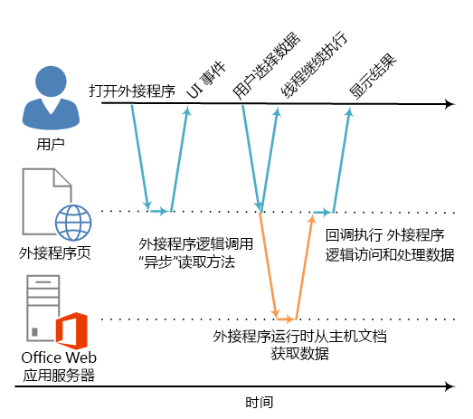

# <a name="asynchronous-programming-in-office-add-ins"></a>Office 加载项中的异步编程

为什么 Office 外接程序 API 使用异步编程？因为 JavaScript 是单线程语言，如果脚本调用长时间运行的同步进程，则会阻止所有后续脚本执行，直至该进程完成。针对 Office Web 客户端（但也包括富客户端）执行的操作在同步运行时会阻止执行，因此适用于 Office 的 JavaScript API 中的大多数方法都适于异步执行。这就确保了 Office 外接程序可以做出响应并且性能很高。使用这些异步方法时，也通常会要求您编写回调函数。

API 中所有这些异步方法的名称均以“Async”结尾，如 [Document.getSelectedDataAsync](https://dev.office.com/reference/add-ins/shared/document.getselecteddataasync)、[Binding.getDataAsync](https://dev.office.com/reference/add-ins/shared/binding.getdataasync) 或 [Item.loadCustomPropertiesAsync](https://dev.office.com/reference/add-ins/outlook/Office.context.mailbox.item) 方法。调用某个“Async”方法时，该方法会立即执行，并且任何后续脚本执行都可以继续。传递给“Async”方法的可选回调函数在数据或请求操作准备就绪后便会立即执行。虽然是立即执行，但在它返回之前可能会略有延迟。

下图显示了一个调用"Async"方法的执行流，该方法可读取用户在基于服务器的 Word Online 或 Excel Online 中打开的文档中选择的数据。"Async"调用开始时，JavaScript 执行线程空闲，可以执行任何额外的客户端处理。（但图中没有显示。）当"Async"方法返回时，回调在线程上恢复执行，外接程序可以访问数据、处理数据并显示结果。当使用 Office 富客户端主机应用程序（如，Word 2013 或 Excel 2013）时，可保持同样的异步执行模式。

*图 1.异步编程执行流*



在富客户端和 Web 客户端中支持此异步设计是 Office 外接程序开发模型"写入一次，跨平台运行"设计目标的一部分。例如，您可以使用将在 Excel 2013 和 Excel Online 中运行的单一基本代码创建一个内容应用程序或任务窗格外接程序。

## <a name="writing-the-callback-function-for-an-async-method"></a>编写"Async"方法的回调函数


作为  _callback_ 参数传递给"Async"方法的回调函数必须声明单个参数，在执行回调函数时，加载项运行时将使用该参数提供对 [AsyncResult](https://dev.office.com/reference/add-ins/shared/asyncresult) 对象的访问。您可以编写以下内容：


- 必须要编写并作为"Async"方法的  _callback_ 参数与调用一起直接传递给"Async"方法的匿名函数。
    
- 将函数名作为"Async"方法的  _callback_ 参数进行传递的命名函数。
    
如果您打算只使用一次代码，则可以使用匿名函数，这是因为该函数没有名称，您不能在代码的其他部分引用此代码。如果您打算重复将回调函数用于多个"Async"方法，则可以使用命名函数。


### <a name="writing-an-anonymous-callback-function"></a>编写匿名回调函数

以下匿名回调函数声明名为 `result` 的单个参数，该参数用于在回调返回时从 [AsyncResult.value](https://dev.office.com/reference/add-ins/shared/asyncresult.status) 属性检索数据。


```js
function (result) {
        write('Selected data: ' + result.value);
}
```

以下示例显示如何将内嵌在完整"Async"方法调用上下文中的匿名回调函数传递给  **Document.getSelectedDataAsync** 方法。


- 第一个  _coercionType_ 参数 `Office.CoercionType.Text` 指定将所选数据作为文本字符串返回。
    
- 第二个  _callback_ 参数是并行传递给该方法的匿名函数。函数执行时，会使用 _result_ 参数来访问 **AsyncResult** 对象的 **value** 属性，以显示用户在文档中所选的数据。
    


```js
Office.context.document.getSelectedDataAsync(Office.CoercionType.Text, 
    function (result) {
        write('Selected data: ' + result.value);
    }
});

// Function that writes to a div with id='message' on the page.
function write(message){
    document.getElementById('message').innerText += message; 
}
```

你也可以使用回调函数的参数访问 **AsyncResult** 对象的其他属性。可以使用 [AsyncResult.status](https://dev.office.com/reference/add-ins/shared/asyncresult.error) 属性，以确定调用是成功还是失败。如果调用失败，你可以使用 [AsyncResult.error](https://dev.office.com/reference/add-ins/shared/asyncresult.context) 属性访问 [Error](https://dev.office.com/reference/add-ins/shared/error) 对象，以获取错误信息。

有关使用  **getSelectedDataAsync** 方法的详细信息，请参阅 [在文档或电子表格的活动选择内容中读取和写入数据](read-and-write-data-to-the-active-selection-in-a-document-or-spreadsheet.md)。 


### <a name="writing-a-named-callback-function"></a>编写命名回调函数

或者，您也可以编写一个命名函数，并将其名称传递给"Async"方法的  _callback_ 参数。例如，可以重写前一个示例，将名为 `writeDataCallback` 的函数作为 _callback_ 参数进行传递，如下所示。


```js
Office.context.document.getSelectedDataAsync(Office.CoercionType.Text, 
    writeDataCallback);

// Callback to write the selected data to the add-in UI.
function writeDataCallback(result) {
    write('Selected data: ' + result.value);
}

// Function that writes to a div with id='message' on the page.
function write(message){
    document.getElementById('message').innerText += message; 
}
```


## <a name="differences-in-whats-returned-to-the-asyncresultvalue-property"></a>返回 AsyncResult.value 属性的内容的差异


**AsyncResult** 对象的 **asyncContext**、**status** 和 **error** 属性将同种类型的信息返回到已传递给所有“Async”方法的回调函数中。但是，返回到 **AsyncResult.value** 属性的内容因“Async”方法的功能不同而不同。

例如，（**Binding**、[CustomXmlPart](https://dev.office.com/reference/add-ins/shared/binding)、[Document](https://dev.office.com/reference/add-ins/shared/customxmlpart.customxmlpart)、[RoamingSettings](https://dev.office.com/reference/add-ins/shared/document) 和 [Settings](https://dev.office.com/reference/add-ins/outlook/RoamingSettings) 对象的）[addHandlerAsync](https://dev.office.com/reference/add-ins/shared/settings) 方法用于将事件处理程序函数添加到这些对象表示的项。你可以从传递给任何 **addHandlerAsync** 方法的回调函数访问 **AsyncResult.value** 属性，但由于添加事件处理程序时没有访问任何数据或对象，如果尝试访问 **value** 属性，它始终会返回 **undefined**。

另一方面，如果您调用  **Document.getSelectedDataAsync** 方法，则它会将用户在文档中所选的数据返回到回调的 **AsyncResult.value** 属性中。或者，如果您调用 [Bindings.getAllAsync](https://dev.office.com/reference/add-ins/shared/bindings.getallasync) 方法，它会返回文档中所有 **Binding** 对象的数组。并且，如果您调用 [Bindings.getByIdAsync](https://dev.office.com/reference/add-ins/shared/bindings.getbyidasync) 方法，则返回单个的 **Binding** 对象。

有关返回到“Async”方法 **AsyncResult.value** 属性的内容的说明，请参阅相关方法参考主题的“回调值”一节。有关所有提供“Async”方法的对象的汇总，请参阅 [AsyncResult](https://dev.office.com/reference/add-ins/shared/asyncresult) 对象主题底部的表格。


## <a name="asynchronous-programming-patterns"></a>异步编程模式


适用于 Office 的 JavaScript API 支持两种异步编程模式：


- 使用嵌套回调
    
- 使用承诺模式
    
使用回调函数的异步编程通常需要您将回调返回的结果嵌套在两个或更多回调中。如果您需要这么做，则可以使用来自 API 的所有"Async"方法的嵌套回调。

使用嵌套回调是大多数 JavaScript 开发人员都熟知的编程模式，但使用了深层嵌套回调的代码难以阅读和理解。作为嵌套回调的替代，适用于 Office 的 JavaScript API 也支持实施承诺模式。但是，在适用于 Office 的 JavaScript API 的当前版本中，承诺模式仅可与 [Excel 电子表格和 Word 文档中的绑定](bind-to-regions-in-a-document-or-spreadsheet.md)的代码一起使用。

<a name="AsyncProgramming_NestedCallbacks" />
### <a name="asynchronous-programming-using-nested-callback-functions"></a>使用嵌套回调函数的异步编程


通常，完成一项任务需要执行两个或更多个异步操作。为实现此目的，可在一个调用中嵌套另一个"Async"调用。 

以下代码示例内嵌两个异步调用。 


- 首先，调用 [Bindings.getByIdAsync](https://dev.office.com/reference/add-ins/shared/bindings.getbyidasync) 方法，以访问名为“MyBinding”的文档中的绑定。返回给该回调的 `result` 参数的 **AsyncResult** 对象会提供对来自 **AsyncResult.value** 属性的指定绑定对象的访问。
    
- 然后，从第一个 `result` 参数访问的绑定对象用于调用 [Binding.getDataAsync](https://dev.office.com/reference/add-ins/shared/binding.getdataasync) 方法。
    
- 最后，传递给  **Binding.getDataAsync** 方法的回调的 `result2` 参数用于显示绑定中的数据。
    


```js
function readData() {
    Office.context.document.bindings.getByIdAsync("MyBinding", function (result) {
        result.value.getDataAsync({ coercionType: 'text' }, function (result2) {
            write(result2.value);
        });
    });
}

// Function that writes to a div with id='message' on the page.
function write(message){
    document.getElementById('message').innerText += message; 
}
```

此基本嵌套回调模式适用于 适用于 Office 的 JavaScript API 中的所有异步方法。

以下各节显示如何使用匿名函数或命名函数用于异步方法中的嵌套回调。


#### <a name="using-anonymous-functions-for-nested-callbacks"></a>将匿名函数用于嵌套回调

在下面的示例中，将两个匿名函数声明为内嵌并将其作为嵌套回调传入  **getByIdAsync** 和 **getDataAsync** 方法。由于这两个函数简单且为内嵌，因此实现的意图很清晰。


```js
Office.context.document.bindings.getByIdAsync('myBinding', function (bindingResult) {
    bindingResult.value.getDataAsync(function (getResult) {
        if (getResult.status == Office.AsyncResultStatus.Failed) {
            write('Action failed. Error: ' + asyncResult.error.message);
        } else {
            write('Data has been read successfully.');
        }
    });
});

// Function that writes to a div with id='message' on the page.
function write(message){
    document.getElementById('message').innerText += message; 
}
```


#### <a name="using-named-functions-for-nested-callbacks"></a>将命名函数用于嵌套回调

在复杂实现中，使用命名函数对于提高代码的可读性、可维护性和可重用性可能会有帮助。在下面的示例中，将上一节的示例中的两个匿名函数重写为名为  `deleteAllData` 和 `showResult` 的函数。然后，将这两个命名函数作为回调按名称传入 **getByIdAsync** 和 **deleteAllDataValuesAsync** 方法。


```js
Office.context.document.bindings.getByIdAsync('myBinding', deleteAllData);

function deleteAllData(asyncResult) {
    asyncResult.value.deleteAllDataValuesAsync(showResult);
}

function showResult(asyncResult) {
    if (asyncResult.status == Office.AsyncResultStatus.Failed) {
        write('Action failed. Error: ' + asyncResult.error.message);
    } else {
        write('Data has been deleted successfully.');
    }
}

// Function that writes to a div with id='message' on the page.
function write(message){
    document.getElementById('message').innerText += message; 
}
```


### <a name="asynchronous-programming-using-the-promises-pattern-to-access-data-in-bindings"></a>使用承诺模式访问绑定中的数据的异步编程


在继续执行之前，承诺编程模式会立即返回表示其预期结果的承诺对象，而不是传递回调函数并等待函数返回。然而，与真正同步编程不同的是，在 Office 外接程序运行时环境完成请求之前，承诺结果的实现在后台实际上是延迟的。提供 _onError_ 处理程序来覆盖请求无法满足的情况。

适用于 Office 的 JavaScript API 提供了一种 [Office.select](https://dev.office.com/reference/add-ins/shared/office.select) 方法，支持承诺模式与现有绑定对象一起使用。返回到 **Office.select** 方法的承诺对象只支持可通过 [Binding](https://dev.office.com/reference/add-ins/shared/binding) 对象直接访问的四种方法：[getDataAsync](https://dev.office.com/reference/add-ins/shared/binding.getdataasync)、[setDataAsync](https://dev.office.com/reference/add-ins/shared/binding.setdataasync)、[addHandlerAsync](https://dev.office.com/reference/add-ins/shared/asyncresult.value) 和 [removeHandlerAsync](https://dev.office.com/reference/add-ins/shared/binding.removehandlerasync)。

与绑定一起使用的承诺模式采用以下形式：

 **Office.select(**_selectorExpression_,  _onError_**).**_BindingObjectAsyncMethod_

_selectorExpression_ 参数采用 `"bindings#bindingId"` 形式，其中，_bindingId_ 是你之前在文档或电子表格创建的绑定的名称 (**id**)（使用 **Bindings** 集合的“addFrom”方法之一：**addFromNamedItemAsync**、**addFromPromptAsync** 或 **addFromSelectionAsync**）。例如，选择器表达式 `bindings#cities` 指定你要访问 **id** 为“cities”的绑定。

_onError_ 参数是一个错误处理函数，该函数采用一个 **AsyncResult** 类型的参数，当 **select** 方法无法访问指定绑定时，可用于访问 **Error** 对象。以下示例显示了一个可传递给 _onError_ 参数的基本错误处理程序函数。


```js
function onError(result){
    var err = result.error;
    write(err.name + ": " + err.message);
}
// Function that writes to a div with id='message' on the page.
function write(message){
    document.getElementById('message').innerText += message; 
}
```

将占位符 _BindingObjectAsyncMethod_ 替换为对由承诺对象支持的四个 **Binding** 对象方法中之一的调用：**getDataAsync**、**setDataAsync**、**addHandlerAsync** 或 **emoveHandlerAsync**。对这些方法的调用不支持其他的承诺。你必须使用[嵌套回调函数模式](#AsyncProgramming_NestedCallbacks)来调用它们。

**Binding** 对象承诺实现后，便可像绑定（加载项运行时不会异步重试实现承诺）那样在链式方法调用中重复使用。如果 **Binding** 对象承诺不能实现，加载项运行时将在下次调用某一异步方法时再次尝试访问绑定对象。

以下代码示例使用 **select** 方法从 **Bindings** 集合检索 **id** 为“`cities`”的绑定，然后调用 [addHandlerAsync](https://dev.office.com/reference/add-ins/shared/asyncresult.value) 方法以便为绑定的 [dataChanged](https://dev.office.com/reference/add-ins/shared/binding.bindingdatachangedevent) 事件添加事件处理程序。


```js
function addBindingDataChangedEventHandler() {
    Office.select("bindings#cities", function onError(){/* error handling code */}).addHandlerAsync(Office.EventType.BindingDataChanged,
    function (eventArgs) {
        doSomethingWithBinding(eventArgs.binding);
    });
}

```


> [!IMPORTANT]
> **Office.select** 方法返回的 **Binding** 对象承诺仅提供对 **Binding** 对象的四个方法的访问权限。如果需要访问 **Binding** 对象的其他任何成员，必须改用 **Document.bindings** 属性和 **Bindings.getByIdAsync** 或 **Bindings.getAllAsync** 方法检索 **Binding** 对象。例如，如果需要访问 **Binding** 对象的任何属性（**document**、**id** 或 **type** 属性），或需要访问 [MatrixBinding](https://dev.office.com/reference/add-ins/shared/binding.matrixbinding) 或 [TableBinding](https://dev.office.com/reference/add-ins/shared/binding.tablebinding) 对象的属性，必须使用 **getByIdAsync** 或 **getAllAsync** 方法检索 **Binding** 对象。


## <a name="passing-optional-parameters-to-asynchronous-methods"></a>向异步方法传递可选参数


所有"异步"方法的常用语法都遵循此模式：

 _AsyncMethod_ `(`_RequiredParameters_`, [`_OptionalParameters_`],`_CallbackFunction_ `);`

所有异步方法都支持可选参数，这些可选参数作为包含一个或多个可选参数的 JavaScript 对象表示法 (JSON) 对象传入。包含可选参数的 JSON 对象是键-值对的无序集合，其中用":"字符来分隔键和值。对象中的每对用逗号分隔，整个对集合括在大括号中。键是参数名称，值是要为该参数传递的值。

可以创建包含可选参数内嵌的 JSON 对象，或通过创建  `options` 对象并将其作为 _options_ 参数传入。


### <a name="passing-optional-parameters-inline"></a>传递可选参数内嵌

例如，用可选参数内嵌调用 [Document.setSelectedDataAsync](https://dev.office.com/reference/add-ins/shared/document.setselecteddataasync) 方法的语法类似如下：

```js
 Office.context.document.setSelectedDataAsync(data, {coercionType: 'coercionType', asyncContext:' asyncContext},callback);

```

在此形式的调用语法中，两个可选参数  _coercionType_ 和 _asyncContext_ 定义为括在大括号内的 JSON 对象内嵌。

下面的示例展示了如何通过指定内联可选参数来调用 **Document.setSelectedDataAsync** 方法。


```js
Office.context.document.setSelectedDataAsync(
    "<html><body>hello world</body></html>",
    {coercionType: "html", asyncContext: 42},
    function(asyncResult) {
        write(asyncResult.status + " " + asyncResult.asyncContext);
    }
)

// Function that writes to a div with id='message' on the page.
function write(message){
    document.getElementById('message').innerText += message; 
}
```


> [!NOTE]
> 可以任何顺序在 JSON 对象中指定可选参数，只要指定正确的参数名称即可。


### <a name="passing-optional-parameters-in-an-options-object"></a>在 options 对象中传递可选参数

或者，也可以创建一个名为  `options` 的对象（它与方法调用分别指定可选形参），然后将 `options` 对象作为 _options_ 实参来传递。

以下示例演示创建  `options` 对象的一种方法，其中 `parameter1`、 `value1` 等是实际参数名称和值的占位符。


```js
var options = {
    parameter1: value1,
    parameter2: value2,
    ...
    parameterN: valueN
};

```

用于指定 [ValueFormat](https://dev.office.com/reference/add-ins/shared/valueformat-enumeration) 和 [FilterType](https://dev.office.com/reference/add-ins/shared/filtertype-enumeration) 参数时与以下示例类似。


```js
var options = {
    valueFormat: "unformatted",
    filterType: "all"
};
```

此处是创建  `options` 对象的另一种方法。


```js
var options = {};
options[parameter1] = value1;
options[parameter2] = value2;
...
options[parameterN] = valueN;
```

用于指定 **ValueFormat** 和 **FilterType** 参数时，与以下示例类似：


```js
var options = {};
options["ValueFormat"] = "unformatted";
options["FilterType"] = "all";
```


> [!NOTE]
> 使用两种方法之一创建 `options` 对象时，可以任何顺序指定可选参数，只要指定正确的参数名称即可。

下面的示例展示了如何通过在 `options` 对象中指定可选参数来调用 **Document.setSelectedDataAsync** 方法。


```js
var options = {
   coercionType: "html",
   asyncContext: 42
};

document.setSelectedDataAsync(
    "<html><body>hello world</body></html>",
    options,
    function(asyncResult) {
        write(asyncResult.status + " " + asyncResult.asyncContext);
    }
)

// Function that writes to a div with id='message' on the page.
function write(message){
    document.getElementById('message').innerText += message; 
}
```


在两个可选形参示例中，_callback_ 形参均指定为最后一个形参（在内嵌的可选形参之后，或在 _options_ 实参对象之后）。还可以在内嵌 JSON 对象或 `options` 对象内指定 _callback_ 参数。但是，只能在一个位置传递 _callback_ 参数：在 _option_ 对象内（内嵌或在外部创建），或作为最后一个参数，但不能同时在两个位置。


## <a name="see-also"></a>另请参阅

- [了解适用于 Office 的 JavaScript API](understanding-the-javascript-api-for-office.md) 
- [适用于 Office 的 JavaScript API](https://dev.office.com/reference/add-ins/javascript-api-for-office)
     
