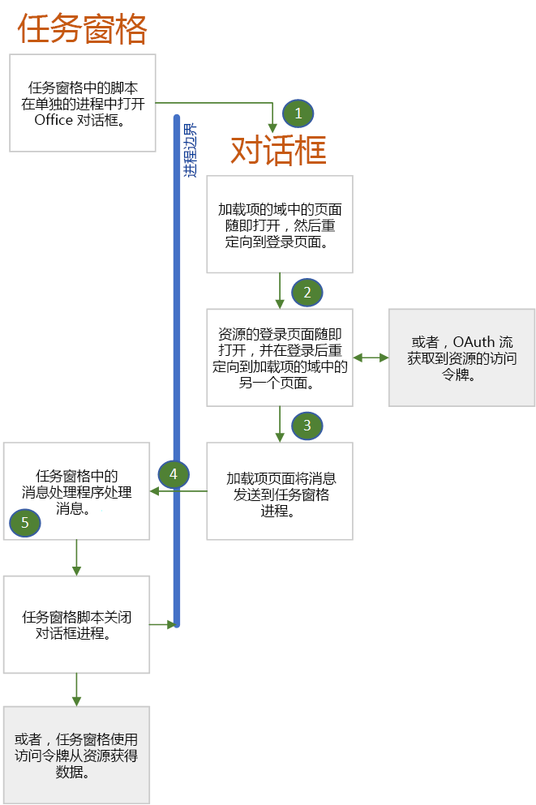

# 使用 Office 对话框 API 进行身份验证和授权Authenticate and authorize with the Office dialog API

许多身份验证机构（也称为安全令牌服务 (STS)）会阻止其登录页面在 iframe 中打开。Many identity authorities, also called Secure Token Services (STS), prevent their login page from opening in an iframe. 这包括 Google、Facebook 以及由 Microsoft 身份平台（以前称为 Azure AD V 2.0）保护的服务，例如 Microsoft 帐户和 Office 365（工作或学校帐户）。These include Google, Facebook, and services protected by Microsoft Identity Platform (formerly Azure AD V 2.0) such as Microsoft Account and Office 365 (Work or School accounts). 这会导致 Office 加载项出现问题，因为当此加载项在 **Office 网页版**上运行时，任务窗格是一个 iframe。This creates a problem for Office Add-ins because when the add-in is running in **Office on the web**, the task pane is an iframe. 如果加载项可以打开完全独立的浏览器实例,则加载项的用户只能登录到其中一个服务。Users of an add-in can only login to one of these services if the add-in can open an entirely separate browser instance. 这就是为什么 Office 提供 [Office 对话框 API](dialog-api-in-office-add-ins.md)（尤其是[displayDialogAsync](/javascript/api/office/office.ui) 方法）的原因。This is why Office provides its [Office dialog API](dialog-api-in-office-add-ins.md), specifically the [displayDialogAsync](/javascript/api/office/office.ui) method.

> [!NOTE]
> 本文假设你熟悉[在 Office 加载项中使用 Office 对话框 API](dialog-api-in-office-add-ins.md)。This article assumes that you are familiar with [Use the Office dialog API in your Office Add-ins](dialog-api-in-office-add-ins.md).

使用此 API 打开的对话框具有以下特征:The dialog box that is opened with this API has the following characteristics:

- 它是[非模态](https://en.wikipedia.org/wiki/Dialog_box)。It is [nonmodal](https://en.wikipedia.org/wiki/Dialog_box).
- 它是完全独立于任务窗格的浏览器实例，这意味着：It is a completely separate browser instance from the task pane, meaning:
  - 它拥有自己的 JavaScript 运行时环境和窗口对象及全局变量。It has its own JavaScript runtime environment and window object and global variables.
  - 没有与任务窗格共享的执行环境。There is no shared execution environment with the task pane.
  - 它不与任务窗格共享同一会话存储。It does not share the same session storage as the task pane.
- 对话框中打开的第一个页面必须与任务窗格位于同一域中，包括协议、子域和端口（如果有）。The first page opened in the dialog box must be hosted in the same domain as the task pane, including protocol, subdomains, and port, if any.
- 该对话框可通过使用 [messageParent](/javascript/api/office/office.ui#messageparent-message-) 方法将信息发送回任务窗格，但此方法只能从与任务窗格位于同一域（包括协议、子域和端口）的页面中调用。The dialog box can send information back to the task pane by using the [messageParent](/javascript/api/office/office.ui#messageparent-message-) method, but this method can be called only from a page that is hosted in the same domain as the task pane, including protocol, subdomains, and port.

如果该对话框不是 iframe（默认值）, 则它可以打开身份提供程序的登录页面。When the dialog box is not an iframe (which is the default), it can open the login page of an identity provider. 如下所示，该 Office 对话框的特征对你如何使用身份验证或授权库（例如 MSAL 和护照）有一定影响。As you'll see below, the characteristics of the Office dialog box have implications for how you use authentication or authorization libraries such as MSAL and Passport.

> [!NOTE]
> 可通过以下方式配置要在浮动 iframe 中打开的对话框：只需在对 `displayDialogAsync` 的调用中传递 `displayInIframe: true` 选项。There is a way to configure the dialog box to open in a floating iframe: you simply pass the `displayInIframe: true` option in the call to `displayDialogAsync`. 使用对话框 API 登录时, 请*不要*这样做。Do *not* do this when you are using the Office dialog API for login.

## 使用 Office 对话框的身份验证流程Authentication flow with the Office dialog box

下面是一个简单的典型身份验证流程。The following is a simple and typical authentication flow. 图示后提供了详细信息。Details are after the diagram.

1. 对话框中打开的第一个页面托管在加载项域（即与任务窗格相同的域）中的一个页面（或其他资源）。The first page that opens in the dialog box is a page (or other resource) that is hosted in the add-in's domain; that is, the same domain as the task pane window. 此页面可以显示简单的 UI，提示用户“请稍候，正在重定向到可以登录 *NAME-OF-PROVIDER* 的页面。”This page can have a simple UI that says "Please wait, we are redirecting you to the page where you can sign in to *NAME-OF-PROVIDER*." 此页面中的代码使用传递给对话框的信息（如[向对话框传递信息](dialog-api-in-office-add-ins.md#pass-information-to-the-dialog-box)中所述）构造身份提供程序的登录页 URL，或者硬编码到加载项的配置文件中，例如 web.config 文件。The code in this page constructs the URL of the identity provider's sign-in page with information that is either passed to the dialog box as described in [Pass information to the dialog box](dialog-api-in-office-add-ins.md#pass-information-to-the-dialog-box) or is hardcoded into a configuration file of the add-in, such as a web.config file.
2. 然后，对话框窗口重定向到登录页。The dialog box window then redirects to the sign-in page. URL 包含一个查询参数，用于告知身份提供程序在用户登录后将对话框窗口重定向到特定页面。The URL includes a query parameter that tells the identity provider to redirect the dialog box window to a specific page after the user signs in. 在本文中，我们将此页面称为 **redirectPage.html**。In this article, we'll call this page **redirectPage.html**. *这必须是主机窗口所在域中的页面*，以便可通过调用 `messageParent` 将登录尝试的结果传递到任务窗格。*This must be a page in the same domain as the host window*, so that the results of the sign-in attempt can be passed to the task pane with a call of `messageParent`.
3. 身份提供程序的服务处理来自对话框窗口的传入 GET 请求。The identity provider's service processes the incoming GET request from the dialog box window. 如果用户已经登录，它会立即将窗口重定向到 **redirectPage.html**，并包括用户数据作为查询参数。If the user is already signed in, it immediately redirects the window to **redirectPage.html** and includes user data as a query parameter. 如果用户尚未登录，提供程序的登录页会显示在窗口中，以便用户登录。If the user is not already signed in, the provider's sign-in page appears in the window, and the user signs in. 对于大多数提供程序，如果用户无法成功登录，提供程序会在对话框窗口中显示错误页面，而不会重定向到 **redirectPage.html**。For most providers, if the user cannot sign in successfully, the provider shows an error page in the dialog box window and does not redirect to **redirectPage.html**. 用户必须通过选择右上角的 **X** 来关闭窗口。The user must close the window by selecting the **X** in the corner. 如果用户成功登录，则对话框窗口会重定向到 **redirectPage.html**，并包括用户数据会作为查询参数。If the user successfully signs in, the dialog box window is redirected to **redirectPage.html** and user data is included as a query parameter.
4. 当 **redirectPage.html** 页面打开时，它会调用 `messageParent` 向任务窗格页报告登录是否成功，而且还会视情况报告用户数据或错误数据。When the **redirectPage.html** page opens, it calls `messageParent` to report the success or failure to the task pane page and optionally also report user data or error data. 其他可能的消息包括传递访问令牌或告知任务窗格信息位于存储中。Other possible messages include passing an access token or telling the task pane that the token is in storage.
5. `DialogMessageReceived` 事件在任务窗格页中触发，其处理程序关闭对话框窗口，并可能对消息进行进一步处理。The `DialogMessageReceived` event fires in the task pane page and its handler closes the dialog box window and may further process of the message.

#### 支持多个标识提供程序Support multiple identity providers

如果外接程序允许用户选择提供程序（如 Microsoft 帐户、Google 或 Facebook），你需要使用本地第一个页面（见前一部分），为用户提供用于选择提供程序的 UI。用户的选择会触发登录 URL 的构建并重定向到该 URL。If your add-in gives the user a choice of providers, such as Microsoft Account, Google, or Facebook, you need a local first page (see preceding section) that provides a UI for the user to select a provider. Selection triggers the construction of the sign-in URL and redirection to it.

#### 在外接程序中授权外部资源Authorization of the add-in to an external resource

在现代网络中，用户和 Web 应用程序是安全主体。In the modern web, users and web applications are security principals. 应用程序拥有自己的身份以及对联机资源（如 Office 365、Google Plus、Facebook 或 LinkedIn）的权限。The application has its own identity and permissions to an online resource such as Office 365, Google Plus, Facebook, or LinkedIn. 在部署前，需要先向资源提供程序注册应用程序。The application is registered with the resource provider before it is deployed. 注册内容包括：The registration includes:

- 应用程序访所需的权限的列表。A list of the permissions that the application needs.
- 当应用访问服务时，资源服务应向其返回访问令牌的 URL。A URL to which the resource service should return an access token when the application accesses the service.  

如果用户在应用中调用访问资源服务中用户数据的函数，系统会先提示用户登录相应服务，再提示用户向应用授予访问用户资源所需的权限。然后，服务将登录窗口重定向到先前注册的 URL，并传递访问令牌。应用使用访问令牌访问用户资源。When a user invokes a function in the application that accesses the user's data in the resource service, they are prompted to sign in to the service and then prompted to grant the application the permissions it needs to the user's resources. The service then redirects the sign-in window to the previously registered URL and passes the access token. The application uses the access token to access the user's resources.

可以使用 Office 对话框 API 来管理此过程，具体方法是使用与用户登录流程类似的流程。You can use the Office dialog API to manage this process by using a flow that is similar to the one described for users to sign in. 唯一区别在于：The only differences are:

- 如果用户先前未向应用程序授予所需的权限，则登录后会在对话框中看到这样做的提示。If the user hasn't previously granted the application the permissions it needs, the user is prompted to do so in the dialog box after signing in.
- 对话框窗口使用 `messageParent` 发送字符串化访问令牌，或将访问令牌存储在主机窗口可以检索到的位置（并使用 `messageParent` 告知主机窗口令牌可用），从而将访问令牌发送到主机窗口。The dialog box window sends the access token to the host window either by using `messageParent` to send the stringified access token or by storing the access token where the host window can retrieve it (and using `messageParent` to tell the host window that the token is available). 令牌具有时间限制，但在持续期间，主机窗口可以使用它直接访问用户资源，而无需进一步提示。The token has a time limit, but while it lasts, the host window can use it to directly access the user's resources without any further prompting.

[示例](#samples)中列出了使用 Office 对话框 API 来实现此目的的一些身份验证示例加载项。Some authentication sample add-ins that use the Office dialog API for this purpose are listed in [Samples](#samples).

## 将身份验证库与对话框结合使用Using authentication libraries with the dialog box

Office 对话框和任务窗格在不同的浏览器、JavaScript 运行时实例中运行意味着你必须使用多个身份验证/授权库，其使用方式必须与在同一窗口中进行身份验证和授权时使用它们的方式不同。The fact that the Office dialog box and the task pane run in different browser, and JavaScript runtime, instances means that you must use many authentication/authorization libraries in the way that is different from how they are used when authentication and authorization can take place in the same window. 以下部分介绍了通常无法使用这些库的主要方式，以及*可以*使用这些库的方式。The following sections describe the main ways that you usually cannot use these libraries and the way that you *can* use them.

### 通常无法使用库的内部缓存来存储令牌You usually cannot use the library's internal cache to store tokens

通常，身份验证相关库提供内存缓存来存储访问令牌。Typically, auth-related libraries provide an in-memory cache to store the access token. 如果对资源提供程序（例如 Google、Microsoft Graph、Facebook 等）进行了后续调用，则库将首先检查以确定其缓存中的令牌是否已过期。If subsequent calls to the resource provider (such as Google, Microsoft Graph, Facebook, etc.) are made, the library will first check to see if the token in its cache is expired. 如果未过期，库将返回缓存的令牌，而不是为新令牌再执行一次到 STS 的往返行程。If it is unexpired, the library returns the cached token rather than making another round-trip to the STS for a new token. 但 Office 加载项中无法使用此模式。由于登录发生在 Office 对话框的浏览器实例中，因此令牌缓存处于该实例中。But this pattern is not usable in Office add-ins. Since the login occurs in the Office dialog box's browser instance, the token cache is in that instance.

与此非常密切相关的是，库通常会同时提供用于获取令牌的交互式和“无提示”方法。Closely related to this is the fact that a library will typically provide both interactive and "silent" methods for getting a token. 如果你既可以进行身份验证，也可以在同一浏览器实例中对资源进行数据调用，则代码会调用无提示方法来获取令牌，然后马上将该令牌添加到数据调用。When you can do both the authentication and the data calls to the resource in the same browser instance, your code calls the silent method to obtain a token just before your code adds the token to the data call. 无提示方法会检查缓存是否有中未过期的令牌，并将其返回（如果有）。The silent method checks for an unexpired token in the cache and returns it, if there is one. 否则，无提示方法将调用重定向到 STS 登录的交互式方法。Otherwise, the silent method calls the interactive method which redirects to the STS's login. 登录完成后，交互式方法将返回令牌，但同时会将其缓存在内存中。After login completes, the interactive method returns the token, but also caches it in memory. 但是，在使用 Office 对话框 API 时，对资源的数据调用（它将调用无提示方法）位于任务窗格的浏览器实例中。But when the Office dialog API is being used, the data calls to the resource, which would call the silent method, are in the task pane's browser instance. 库的令牌缓存在该实例中不存在。The library's token cache does not exist in that instance.

或者，加载项的对话框浏览器实例可以直接调用库的交互式方法。As an alternative, your add-in's dialog box browser instance can directly call the library's interactive method. 该方法返回令牌时，代码必须将令牌显式存储在任务窗格的浏览器可检索到的位置，例如本地存储\*或服务器端数据库。When that method returns a token, your code must explicitly store the token someplace where the task pane's browser instance can retrieve it, such as Local Storage\* or a server-side database. 另一种选择是使用 `messageParent` 方法将令牌传递到任务窗格。Another option is to pass the token to the task pane with the `messageParent` method. 仅当交互式方法将访问令牌存储在代码可以读取的位置时，才可以使用此替代选项。This alternative is only possible if the interactive method stores the access token in a place where your code can read it. 有时，库的交互式方法设计为将令牌存储到代码无法访问的对象的私有属性中。Sometimes a library's interactive method is designed to store the token in a private property of an object that is inaccessible to your code.

> [!NOTE]
> \*有一个 bug 将影响你的令牌处理策略。\* There is a bug that will effect your strategy for token handling. 如果加载项正使用 Safari 或 Microsoft 浏览器在 **Office 网页版**上运行，则对话框和任务窗格不共享同一本地存储，因此该存储无法用于在它们之间通信。If the add-in is running in **Office on the web** in either the Safari or Edge browser, the dialog box and task pane do not share the same Local Storage, so it cannot be used to communicate between them.

### 通常无法使用库的“身份验证上下文”对象You usually cannot use the library's "auth context" object

通常情况下，与身份验证相关的库有一种方法，该方法既能够以交互方式获取令牌，也会创建方法返回的“身份验证上下文”对象。Often, an auth-related library has a method that both obtains a token interactively and also creates an "auth-context" object which the method returns. 令牌是对象的一个属性（可能是私有属性，并且无法直接从代码中访问）。The token is a property of the object (possibly private and inaccessible directly from your code). 该对象具有从资源中获取数据的方法。That object has the methods that get data from the resource. 这些方法将令牌包括在其对资源提供程序（例如 Google、Microsoft Graph、Facebook 等）进行的 HTTP 请求中。These methods include the token in the HTTP Requests that they make to the resource provider (such as Google, Microsoft Graph, Facebook, etc.).

这些身份验证上下文对象和创建它们的方法在 Office 加载项中不可用。由于登录发生在 Office 对话框的浏览器实例中，因此必须在该处创建对象。These auth-context objects, and the methods that create them, are not usable in Office add-ins. Since the login occurs in the Office dialog box's browser instance, the object would have to be created there. 但对资源的数据调用位于任务窗格浏览器实例中，因此无法将对象从一个实例获取到另一个实例。But the data calls to the resource are in the task pane browser instance and there is no way to get the object from one instance to another. 例如，你无法通过 `messageParent` 传递对象，因为 `messageParent` 只能传递字符串或布尔值。For example, you cannot pass the object with `messageParent` because `messageParent` can only pass strings or boolean values. 无法可靠地将包含方法的 JavaScript 对象字符串化。A JavaScript object with methods cannot be reliably stringified.

### 如何将库与 Office 对话框 API 结合使用How you can use libraries with the Office dialog API

大多数库提供了更低抽象级别的 API 作为单一“身份验证相关”对象的补充（或取代这些对象），可让代码创建不太单一的整体帮助程序对象。In addition to, or instead of, monolithic "auth context" objects, most libraries provide APIs at a lower level of abstraction that enable your code to create less monolithic helper objects. 例如，[MSAL.NET](https://github.com/AzureAD/microsoft-authentication-library-for-dotnet/wiki#conceptual-documentation) v.For example, [MSAL.NET](https://github.com/AzureAD/microsoft-authentication-library-for-dotnet/wiki#conceptual-documentation) v. 3. x.x 有一个用于构造登录 URL 的 API，以及另一个用于构造 AuthResult 对象的 API，该对象在代码可访问的属性中包含访问令牌。3.x.x has an API to construct a login URL, and another API that constructs an AuthResult object that contains an access token in a property that is accessible to your code. 有关 Office 加载项中的 MSAL.NET 的示例，请参阅: [Office 加载项 Microsoft Graph ASP.NET](https://github.com/OfficeDev/PnP-OfficeAddins/tree/master/Samples/auth/Office-Add-in-Microsoft-Graph-ASPNET) 和 [Outlook 加载项 Microsoft Graph ASP.NET](https://github.com/OfficeDev/PnP-OfficeAddins/tree/master/Samples/auth/Outlook-Add-in-Microsoft-Graph-ASPNET)。For examples of MSAL.NET in an Office add-in see: [Office Add-in Microsoft Graph ASP.NET](https://github.com/OfficeDev/PnP-OfficeAddins/tree/master/Samples/auth/Office-Add-in-Microsoft-Graph-ASPNET) and [Outlook Add-in Microsoft Graph ASP.NET](https://github.com/OfficeDev/PnP-OfficeAddins/tree/master/Samples/auth/Outlook-Add-in-Microsoft-Graph-ASPNET). 有关在加载项中使用 [msal.js](https://github.com/AzureAD/microsoft-authentication-library-for-js) 的示例，请参阅 [Office 加载项 Microsoft Graph React](https://github.com/OfficeDev/PnP-OfficeAddins/tree/master/Samples/auth/Office-Add-in-Microsoft-Graph-React)。For an example of using [msal.js](https://github.com/AzureAD/microsoft-authentication-library-for-js) in an add-in, see [Office Add-in Microsoft Graph React](https://github.com/OfficeDev/PnP-OfficeAddins/tree/master/Samples/auth/Office-Add-in-Microsoft-Graph-React).

有关身份验证和授权库的详细信息，请参阅 [Microsoft Graph：推荐的库](authorize-to-microsoft-graph-without-sso.md#recommended-libraries-and-samples)和[其他外部服务：库](auth-external-add-ins.md#libraries)。For more information about authentication and authorization libraries, see [Microsoft Graph: Recommended libraries](authorize-to-microsoft-graph-without-sso.md#recommended-libraries-and-samples) and [Other external services: Libraries](auth-external-add-ins.md#libraries).

## 示例Samples

- [Office 加载项 Microsoft Graph ASP.NET](https://github.com/OfficeDev/PnP-OfficeAddins/tree/master/Samples/auth/Office-Add-in-Microsoft-Graph-ASPNET)：一个基于 ASP.NET 的加载项（Excel、Word 或 PowerPoint），它使用 MSAL.NET 库和授权代码流进行登录并获取 Microsoft Graph 数据的访问令牌。[Office Add-in Microsoft Graph ASP.NET](https://github.com/OfficeDev/PnP-OfficeAddins/tree/master/Samples/auth/Office-Add-in-Microsoft-Graph-ASPNET): An ASP.NET based add-in (Excel, Word, or PowerPoint) that uses the MSAL.NET library and the Authorization Code Flow to log in and get an access token for Microsoft Graph data.
- [Outlook 加载项 Microsoft Graph ASP.NET](https://github.com/OfficeDev/PnP-OfficeAddins/tree/master/Samples/auth/Outlook-Add-in-Microsoft-Graph-ASPNET)：与上面的加载项一样，但 Office 应用程序为 Outlook。[Outlook Add-in Microsoft Graph ASP.NET](https://github.com/OfficeDev/PnP-OfficeAddins/tree/master/Samples/auth/Outlook-Add-in-Microsoft-Graph-ASPNET): Just like the one above, but the Office application is Outlook.
- [Office 加载项 Microsoft Graph React](https://github.com/OfficeDev/PnP-OfficeAddins/tree/master/Samples/auth/Office-Add-in-Microsoft-Graph-React)：一个基于 NodeJS 的加载项（Excel、Word 或 PowerPoint），它使用 msal.js 库和隐式流进行登录并获取 Microsoft Graph 数据的访问令牌。[Office Add-in Microsoft Graph React](https://github.com/OfficeDev/PnP-OfficeAddins/tree/master/Samples/auth/Office-Add-in-Microsoft-Graph-React): A NodeJS based add-in (Excel, Word, or PowerPoint) that uses the msal.js library and the Implicit Flow to log in and get an access token for Microsoft Graph data.

有关详细信息，请参阅：For more information, see:
- [在 Office 加载项中授权外部服务Authorize external services in your Office Add-in](auth-external-add-ins.md)
- [在 Office 加载项中使用对话框 APIUse the Office dialog API in your Office Add-ins](dialog-api-in-office-add-ins.md)
