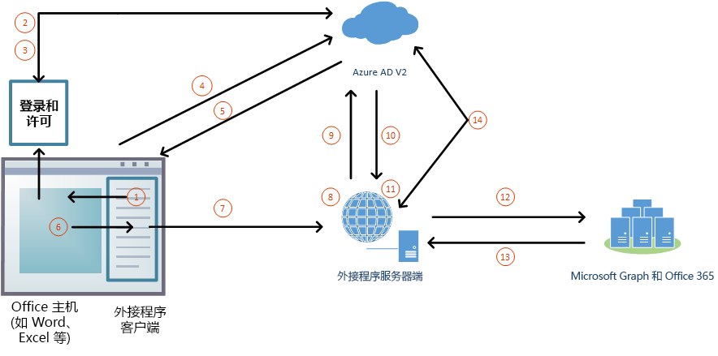

# 使用 SSO 对 Microsoft Graph 授权（预览版）

用户可以使用自己的个人 Microsoft 帐户/工作或学校 (Office 365) 帐户，登录 Office（在线、移动和桌面平台）。 在 Office 加载项中获取对 [Microsoft Graph](https://developer.microsoft.com/graph/docs) 的访问权限的最佳方式是使用用户的 Office 登录凭据。 这使用户能够访问其 Microsoft Graph 数据，而无需再次登录。 

> [!NOTE]
> 目前，Word、Excel、Outlook 和 PowerPoint 预览版支持单一登录 API。 若要详细了解目前支持单一登录 API 的平台，请参阅 [IdentityAPI 要求集](/office/dev/add-ins/reference/requirement-sets/identity-api-requirement-sets)。 如果使用的是 Outlook 加载项，请务必为 Office 365 租赁启用新式验证。 若要了解如何这样做，请参阅 [Exchange Online：如何为租户启用新式验证](https://social.technet.microsoft.com/wiki/contents/articles/32711.exchange-online-how-to-enable-your-tenant-for-modern-authentication.aspx)。

## SSO 和 Microsoft Graph 的加载项体系结构

除了托管 Web 应用程序的页面和 JavaScript 之外，外接程序还必须以相同的[完全限定的域名](/windows/desktop/DNS/f-gly#_dns_fully_qualified_domain_name_fqdn__gly)托管一个或多个 Web API，这些 API 可获取 Microsoft Graph 的访问令牌，并向它发出请求。

外接程序清单包含标记，用于指定外接程序在 Azure Active Directory (Azure AD) v2.0 终结点中的注册方式，并指定外接程序需要的 Microsoft Graph 的任何权限。

### 运行时的工作方式

下图展示了 Microsoft Graph 登录和访问流程的工作原理。

1. 在加载项中，JavaScript 调用新的 Office.js API [getAccessTokenAsync](/office/dev/add-ins/develop/sso-in-office-add-ins#sso-api-reference)。 该操作告诉 Office 主机应用程序获取加载项的访问令牌。 （以下称为**启动访问令牌**，因为在该过程的后期它将会被替换为另一个令牌。 有关已解码启动访问令牌的示例，请参阅[示例访问令牌](sso-in-office-add-ins.md#example-access-token)。）
1. 如果用户未登录，Office 主机应用会打开弹出窗口，以供用户登录。
1. 如果当前用户是首次使用加载项，则会看到同意提示。
1. Office 主机应用程序从当前用户的 Azure AD v2.0 终结点请求获取**启动访问令牌**。
1. Azure AD 将启动令牌发送给 Office 主机应用程序。
1. Office 主机应用程序在 `getAccessTokenAsync` 调用返回的结果对象中，将“**启动访问令牌**”发送给加载项。
1. 加载项中的 JavaScript 向 Web API（与加载项托管在同一完全限定的域中）发出 HTTP 请求，并添加**启动访问令牌**作为授权证明。  
1. 服务器端代码验证传入的**启动访问令牌**。
1. 服务器端代码使用“代表”流（在 [OAuth2 令牌交换](https://tools.ietf.org/html/draft-ietf-oauth-token-exchange-02) 和 [Web API Azure 方案的守护程序或服务器应用程序](/azure/active-directory/develop/active-directory-authentication-scenarios)中定义）获取 Microsoft Graph 的访问令牌来交换启动访问令牌。
1. Azure AD 将 Microsoft Graph 访问令牌（如果加载项请求获取 *offline_access* 权限，则同时返回刷新令牌）返回给加载项。
1. 服务器端代码缓存 Microsoft Graph 访问令牌。
1. 服务器端代码向 Microsoft Graph 发出请求，并添加 Microsoft Graph 访问令牌。
1. Microsoft Graph 将数据返回给加载项，从而将数据传递到加载项 UI。
1. 当 Microsoft Graph 访问令牌过期时，服务器端代码可以使用其刷新令牌获取新的 Microsoft Graph 访问令牌。

## 开发可访问 Microsoft Graph 的 SSO 加载项

开发一个可访问 Microsoft Graph 的加载项，就像可使用 SSO 的任何其他加载项一样。 有关完整的说明，请参阅[为 Office 加载项启用单一登录](/office/dev/add-ins/develop/sso-in-office-add-ins)。区别在于，加载项必须具有服务器端 Web API，并且我们将该文中的访问令牌成为“启动访问令牌”。 

根据所用的语言和框架，可能存在一些库，可简化必须编写的服务器端代码。 代码应执行以下操作：

* 验证从之前创建的令牌处理程序收到的加载项启动访问令牌。 有关详细信息，请参阅[验证访问令牌](sso-in-office-add-ins.md#validate-the-access-token)。 
* 通过调用 Azure AD v2.0 终结点启动“代表”流，该终结点包括启动访问令牌、关于用户的一些元数据以及加载项的凭据（其 ID 和机密）。
* 缓存返回的 Microsoft Graph 访问令牌。 有关此流的详细信息，请参阅 [Azure Active Directory v2.0 和 OAuth 2.0 代表流](/azure/active-directory/develop/active-directory-v2-protocols-oauth-on-behalf-of)。
* 创建一个或多个 Web API 方法，用于通过将缓存的访问令牌传递给 Microsoft Graph 来获取 Microsoft Graph 数据。

> [!NOTE]
> 有关“代表”流获取的 Microsoft Graph 已解码访问令牌的示例，请参阅 [Azure Active Directory v2.0 和 OAuth 2.0 代表流](/azure/active-directory/develop/active-directory-v2-protocols-oauth-on-behalf-of)。

有关详细演练和应用场景的示例，请参阅：

* [创建使用单一登录的 Node.js Office 加载项](create-sso-office-add-ins-nodejs.md)
* [创建使用单一登录的 ASP.NET Office 加载项](create-sso-office-add-ins-aspnet.md)
* [应用场景：为 Outlook 加载项中的服务实现单一登录](/outlook/add-ins/implement-sso-in-outlook-add-in)
