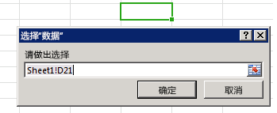

# <a name="bind-to-regions-in-a-document-or-spreadsheet"></a><span data-ttu-id="7c382-102">绑定到文档或电子表格中的区域</span><span class="sxs-lookup"><span data-stu-id="7c382-102">Bind to regions in a document or spreadsheet</span></span>

<span data-ttu-id="7c382-p101">基于绑定的数据访问使内容和任务窗格加载项能够通过与绑定相关联的标识符一致地访问文档或电子表格的特定区域。加载项首先需要通过调用将文档的某一部分与唯一标识符相关联的以下某个方法来建立绑定：[addFromPromptAsync]、[addFromSelectionAsync] 或 [addFromNamedItemAsync]。建立绑定后，加载项可以使用提供的标识符访问文档或电子表格的关联区域中包含的数据。创建绑定可为加载项提供以下值：</span><span class="sxs-lookup"><span data-stu-id="7c382-p101">Binding-based data access enables content and task pane add-ins to consistently access a particular region of a document or spreadsheet through an identifier. The add-in first needs to establish the binding by calling one of the methods that associates a portion of the document with a unique identifier: [addFromPromptAsync], [addFromSelectionAsync], or [addFromNamedItemAsync]. After the binding is established, the add-in can use the provided identifier to access the data contained in the associated region of the document or spreadsheet. Creating bindings provides the following value to your add-in:</span></span>


- <span data-ttu-id="7c382-107">允许访问跨支持的 Office 应用程序的通用数据结构，例如：表、区域或文本（一系列连续字符）。</span><span class="sxs-lookup"><span data-stu-id="7c382-107">Permits access to common data structures across supported Office applications, such as: tables, ranges, or text (a contiguous run of characters).</span></span>

- <span data-ttu-id="7c382-108">允许读/写操作，而不需要用户做出选择。</span><span class="sxs-lookup"><span data-stu-id="7c382-108">Enables read/write operations without requiring the user to make a selection.</span></span>

- <span data-ttu-id="7c382-p102">在加载项和文档中的数据之间建立关系。绑定会保留在文档中，以后可以进行访问。</span><span class="sxs-lookup"><span data-stu-id="7c382-p102">Establishes a relationship between the add-in and the data in the document. Bindings are persisted in the document, and can be accessed at a later time.</span></span>

<span data-ttu-id="7c382-p103">建立绑定还允许您订阅仅限文档或电子表格的特定区域的数据和选择更改事件。这意味着，加载项只会收到绑定区域内发生的更改的通知，而不是收到整个文档或电子表格内的常规更改的通知。</span><span class="sxs-lookup"><span data-stu-id="7c382-p103">Establishing a binding also allows you to subscribe to data and selection change events that are scoped to that particular region of the document or spreadsheet. This means that the add-in is only notified of changes that happen within the bound region as opposed to general changes across the whole document or spreadsheet.</span></span>

<span data-ttu-id="7c382-p104">[Bindings] 对象公开 [getAllAsync] 方法，通过该方法可以访问在文档或电子表格中建立的所有绑定的集合。可使用 Bindings.[getByIdAsync] 或 [Office.select] 方法通过 ID 访问单个绑定。可使用 [Bindings] 对象的以下方法之一建立新绑定和删除现有绑定：[addFromSelectionAsync]、[addFromPromptAsync]、[addFromNamedItemAsync] 或 [releaseByIdAsync]。</span><span class="sxs-lookup"><span data-stu-id="7c382-p104">The [Bindings] object exposes a [getAllAsync] method that gives access to the set of all bindings established on the document or spreadsheet. An individual binding can be accessed by its ID using either the Bindings.[getByIdAsync] or [Office.select] methods. You can establish new bindings as well as remove existing ones by using one of the following methods of the [Bindings] object: [addFromSelectionAsync], [addFromPromptAsync], [addFromNamedItemAsync], or [releaseByIdAsync].</span></span>


## <a name="binding-types"></a><span data-ttu-id="7c382-116">绑定类型</span><span class="sxs-lookup"><span data-stu-id="7c382-116">Binding types</span></span>

<span data-ttu-id="7c382-117">在使用 [addFromSelectionAsync]、[addFromPromptAsync] 或 [addFromNamedItemAsync] 方法创建绑定时，可通过 _bindingType_ 参数指定[三种不同的绑定类型][Office.BindingType]：</span><span class="sxs-lookup"><span data-stu-id="7c382-117">There are [three different types of bindings][Office.BindingType] that you specify with the  _bindingType_ parameter when you create a binding with the [addFromSelectionAsync], [addFromPromptAsync] or [addFromNamedItemAsync] methods:</span></span>

1. <span data-ttu-id="7c382-118">**[文本绑定][TextBinding]** - 绑定到可以文本形式表示的文档区域。</span><span class="sxs-lookup"><span data-stu-id="7c382-118">**[Text Binding][TextBinding]** - Binds to a region of the document that can be represented as text.</span></span>

    <span data-ttu-id="7c382-p105">在 Word 中，大多数连续选区都是有效的，而在 Excel 中，只有单个单元格选区才能作为文本绑定的目标。在 Excel 中，只支持纯文本。在 Word 中，支持以下三种格式：纯文本、HTML 和 Open XML for Office。</span><span class="sxs-lookup"><span data-stu-id="7c382-p105">In Word, most contiguous selections are valid, while in Excel only single cell selections can be the target of a text binding. In Excel, only plain text is supported. In Word, three formats are supported: plain text, HTML, and Open XML for Office.</span></span>

2. <span data-ttu-id="7c382-p106">**[矩阵绑定][MatrixBinding]** - 绑定到包含没有标题的表格数据的文档的某个固定区域。矩阵绑定中的数据作为二维 **Array** 写入和读取（在 JavaScript 中作为数组的数组实现）。例如，两列中的两行 **string** 值可以作为 ` [['a', 'b'], ['c', 'd']]` 写入或读取，而包含三行的单列可以作为 `[['a'], ['b'], ['c']]` 写入或读取。</span><span class="sxs-lookup"><span data-stu-id="7c382-p106">**[Matrix Binding][MatrixBinding]** - Binds to a fixed region of a document that contains tabular data without headers.Data in a matrix binding is written or read as a two dimensional  **Array**, which in JavaScript is implemented as an array of arrays. For example, two rows of  **string** values in two columns can be written or read as ` [['a', 'b'], ['c', 'd']]`, and a single column of three rows can be written or read as  `[['a'], ['b'], ['c']]`.</span></span>

    <span data-ttu-id="7c382-p107">在 Excel 中，任何连续的单元格选区都可用于建立矩阵绑定。在 Word 中，只有表格支持矩阵绑定。</span><span class="sxs-lookup"><span data-stu-id="7c382-p107">In Excel, any contiguous selection of cells can be used to establish a matrix binding. In Word, only tables support matrix binding.</span></span>

3. <span data-ttu-id="7c382-p108">**[表格绑定][TableBinding]** - 绑定到包含带标题的表格的文档区域。表格绑定中的数据作为 [TableData](/javascript/api/office/office.tabledata) 对象写入或读取。`TableData` 对象通过 `headers` 和 `rows` 属性公开数据。</span><span class="sxs-lookup"><span data-stu-id="7c382-p108">**[Table Binding][TableBinding]** - Binds to a region of a document that contains a table with headers.Data in a table binding is written or read as a [TableData](/javascript/api/office/office.tabledata) object. The `TableData` object exposes the data through the `headers` and `rows` properties.</span></span>

    <span data-ttu-id="7c382-p109">任何 Excel 或 Word 表格均可作为表格绑定的基础。建立表格绑定后，用户添加到表格中的每个新行或新列都自动包含在绑定中。</span><span class="sxs-lookup"><span data-stu-id="7c382-p109">Any Excel or Word table can be the basis for a table binding. After you establish a table binding, each new row or column a user adds to the table is automatically included in the binding.</span></span>

<span data-ttu-id="7c382-p110">使用 `Bindings` 对象的三个“addFrom”方法之一创建绑定后，可以通过相应对象的方法处理绑定的数据和属性：[MatrixBinding]、[TableBinding] 或 [TextBinding]。这三个对象全部继承 `Binding` 对象的 [getDataAsync] 和 [setDataAsync] 方法，使你能够与绑定的数据交互。</span><span class="sxs-lookup"><span data-stu-id="7c382-p110">After a binding is created by using one of the three "addFrom" methods of the  `Bindings` object, you can work with the binding's data and properties by using the methods of the corresponding object: [MatrixBinding], [TableBinding], or [TextBinding]. All three of these objects inherit the [getDataAsync] and [setDataAsync] methods of the `Binding` object that enable you to interact with the bound data.</span></span>

> [!NOTE]
> <span data-ttu-id="7c382-p111">**应该何时使用矩阵和表格绑定？** 当使用的表格数据包含一个总计行时，如果外接程序的脚本需要访问总计行中的值，或检测用户的选区是否在总计行中，则必须使用矩阵绑定。如果为包含总计行的表格数据建立了表格绑定，那么 [TableBinding.rowCount] 属性和事件处理程序中 [BindingSelectionChangedEventArgs] 对象的 `rowCount` 和 `startRow` 属性将不会在值中反映总计行。要解决此限制，必须建立矩阵绑定以使用总计行。</span><span class="sxs-lookup"><span data-stu-id="7c382-p111">**When should you use matrix versus table bindings?** When the tabular data you are working with contains a total row, you must use a matrix binding if your add-in's script needs to access values in the total row or detect that the user's selection is in the total row. If you establish a table binding for tabular data that contains a total row, the [TableBinding.rowCount] property and the `rowCount` and `startRow` properties of the [BindingSelectionChangedEventArgs] object in event handlers won't reflect the total row in their values. To work around this limitation, you must use establish a matrix binding to work with the total row.</span></span>

## <a name="add-a-binding-to-the-users-current-selection"></a><span data-ttu-id="7c382-136">向用户当前所选内容中添加绑定</span><span class="sxs-lookup"><span data-stu-id="7c382-136">Add a binding to the user's current selection</span></span>

<span data-ttu-id="7c382-137">以下示例显示如何使用 [addFromSelectionAsync] 方法向文档中的当前所选内容中添加名为 `myBinding` 的文本绑定。</span><span class="sxs-lookup"><span data-stu-id="7c382-137">The following example shows how to add a text binding called  `myBinding` to the current selection in a document by using the [addFromSelectionAsync] method.</span></span>


```js
Office.context.document.bindings.addFromSelectionAsync(Office.BindingType.Text, { id: 'myBinding' }, function (asyncResult) {
    if (asyncResult.status == Office.AsyncResultStatus.Failed) {
        write('Action failed. Error: ' + asyncResult.error.message);
    } else {
        write('Added new binding with type: ' + asyncResult.value.type + ' and id: ' + asyncResult.value.id);
    }
});

// Function that writes to a div with id='message' on the page.
function write(message){
    document.getElementById('message').innerText += message; 
}
```

<span data-ttu-id="7c382-p112">在此示例中，指定的绑定类型为文本。这意味着将为所选内容创建 [TextBinding]。不同的绑定类型会公开不同的数据和操作。[Office.BindingType] 是可用的绑定类型值的枚举。</span><span class="sxs-lookup"><span data-stu-id="7c382-p112">In this example, the specified binding type is text. This means that a [TextBinding] will be created for the selection. Different binding types expose different data and operations. [Office.BindingType] is an enumeration of available binding type values.</span></span>

<span data-ttu-id="7c382-p113">第二个可选参数是一个对象，它指定要创建的新绑定的 ID。如果不指定 ID，则会自动生成一个。</span><span class="sxs-lookup"><span data-stu-id="7c382-p113">The second optional parameter is an object that specifies the ID of the new binding being created. If an ID is not specified, one is generated automatically.</span></span>

<span data-ttu-id="7c382-p114">作为最后一个 _callback_ 参数传入函数的匿名函数会在绑定创建完成时执行。该函数用单个参数 `asyncResult` 来调用，通过该参数可访问提供调用状态的 [AsyncResult] 对象。`AsyncResult.value` 属性包含对 [Binding] 对象的引用，该对象属于为新创建的绑定指定的类型。可以使用此 [Binding] 对象来获取和设置数据。</span><span class="sxs-lookup"><span data-stu-id="7c382-p114">The anonymous function that is passed into the function as the final  _callback_ parameter is executed when the creation of the binding is complete. The function is called with a single parameter, `asyncResult`, which provides access to an [AsyncResult] object that provides the status of the call. The `AsyncResult.value` property contains a reference to a [Binding] object of the type that is specified for the newly created binding. You can use this [Binding] object to get and set data.</span></span>

## <a name="add-a-binding-from-a-prompt"></a><span data-ttu-id="7c382-148">从提示中添加绑定</span><span class="sxs-lookup"><span data-stu-id="7c382-148">Add a binding from a prompt</span></span>

<span data-ttu-id="7c382-p115">以下示例显示如何使用使用 [addFromPromptAsync] 方法添加名为 `myBinding` 的文本绑定。此方法允许用户使用应用程序内置的范围选择提示来指定绑定范围。</span><span class="sxs-lookup"><span data-stu-id="7c382-p115">The following example shows how to add a text binding called  `myBinding` by using the [addFromPromptAsync] method. This method lets the user specify the range for the binding by using the application's built-in range selection prompt.</span></span>


```js
function bindFromPrompt() {
    Office.context.document.bindings.addFromPromptAsync(Office.BindingType.Text, { id: 'myBinding' }, function (asyncResult) {
        if (asyncResult.status == Office.AsyncResultStatus.Failed) {
            write('Action failed. Error: ' + asyncResult.error.message);
        } else {
            write('Added new binding with type: ' + asyncResult.value.type + ' and id: ' + asyncResult.value.id);
        }
    });
}

// Function that writes to a div with id='message' on the page.
function write(message){
    document.getElementById('message').innerText += message;
}
```

<span data-ttu-id="7c382-p116">在此示例中，指定的绑定类型为文本。这意味着，将为用户在提示中指定的所选内容创建 [TextBinding]。</span><span class="sxs-lookup"><span data-stu-id="7c382-p116">In this example, the specified binding type is text. This means that a [TextBinding] will be created for the selection that the user specifies in the prompt.</span></span>

<span data-ttu-id="7c382-p117">第二个参数是一个对象，它包含创建的新绑定的 ID。如果不指定 ID，则会自动生成一个。</span><span class="sxs-lookup"><span data-stu-id="7c382-p117">The second parameter is an object that contains the ID of the new binding being created. If an ID is not specified, one is generated automatically.</span></span>

<span data-ttu-id="7c382-p118">作为第三个  _callback_ 参数传入函数的匿名函数会在绑定创建完成时执行。执行回调函数时， [AsyncResult] 对象包含调用的状态和新创建的绑定。</span><span class="sxs-lookup"><span data-stu-id="7c382-p118">The anonymous function passed into the function as the third  _callback_ parameter is executed when the creation of the binding is complete. When the callback function executes, the [AsyncResult] object contains the status of the call and the newly created binding.</span></span>

<span data-ttu-id="7c382-157">图 1 显示 Excel 中内置的范围选择提示。</span><span class="sxs-lookup"><span data-stu-id="7c382-157">Figure 1 shows the built-in range selection prompt in Excel.</span></span>


<span data-ttu-id="7c382-158">*图 1.Excel 选择数据 UI*</span><span class="sxs-lookup"><span data-stu-id="7c382-158">*Figure 1. Excel Select Data UI*</span></span>




## <a name="add-a-binding-to-a-named-item"></a><span data-ttu-id="7c382-160">向已命名项目添加绑定</span><span class="sxs-lookup"><span data-stu-id="7c382-160">Add a binding to a named item</span></span>


<span data-ttu-id="7c382-161">以下示例显示如何使用 [addFromNamedItemAsync] 方法向已有的名为 `myRange` 的项目添加绑定作为“矩阵”绑定，并将该绑定的 `id` 指定为“myMatrix”。</span><span class="sxs-lookup"><span data-stu-id="7c382-161">The following example shows how to add a binding to the existing  `myRange` named item as a "matrix" binding by using the [addFromNamedItemAsync] method, and assigns the binding's `id` as "myMatrix".</span></span>


```js
function bindNamedItem() {
    Office.context.document.bindings.addFromNamedItemAsync("myRange", "matrix", {id:'myMatrix'}, function (result) {
        if (result.status == 'succeeded'){
            write('Added new binding with type: ' + result.value.type + ' and id: ' + result.value.id);
            }
        else
            write('Error: ' + result.error.message);
    });
}

// Function that writes to a div with id='message' on the page.
function write(message){
    document.getElementById('message').innerText += message; 
}

```

<span data-ttu-id="7c382-p119">**对于 Excel**，[addFromNamedItemAsync] 方法的 `itemName` 参数可以引用一个现有的已命名区域（使用 `A1` 参考样式 `("A1:A3")` 指定的范围）或表。默认情况下，在 Excel 中添加表会为你添加的第一个表分配名称“Table1”，为你添加的第二个表分配名称“Table2”，以此类推。若要在 Excel UI 中为表分配有意义的名称，请使用功能区的“**表格工具 | 设计**”选项卡上的“**表单名称**”属性。</span><span class="sxs-lookup"><span data-stu-id="7c382-p119">**For Excel**, the  `itemName` parameter of the [addFromNamedItemAsync] method can refer to an existing named range, a range specified with the `A1` reference style `("A1:A3")`, or a table. By default, adding a table in Excel assigns the name "Table1" for the first table you add, "Table2" for the second table you add, and so on. To assign a meaningful name for a table in the Excel UI, use the **Table Name** property on the **Table Tools | Design** tab of the ribbon.</span></span>


> [!NOTE]
> <span data-ttu-id="7c382-165">在 Excel 中，将表格指定为命名项时，必须将名称完全限定为，在表格名称中添加工作表名称，格式如下：`"Sheet1!Table1"`</span><span class="sxs-lookup"><span data-stu-id="7c382-165">In Excel, when specifying a table as a named item, you must fully qualify the name to include the worksheet name in the name of the table in this format:  `"Sheet1!Table1"`</span></span>

<span data-ttu-id="7c382-166">以下示例将为 Excel 中 A 列的前三个单元格 (`"A1:A3"`) 创建一个绑定，分配 id `"MyCities"`，然后写入三个城市名称到此绑定。</span><span class="sxs-lookup"><span data-stu-id="7c382-166">The following example creates a binding in Excel to the first three cells in column A ( `"A1:A3"`), assigns the  id `"MyCities"`, and then writes three city names to that binding.</span></span>


```js
 function bindingFromA1Range() {
    Office.context.document.bindings.addFromNamedItemAsync("A1:A3", "matrix", {id: "MyCities" },
        function (asyncResult) {
            if (asyncResult.status == "failed") {
                write('Error: ' + asyncResult.error.message);
            }
            else {
                // Write data to the new binding.
                Office.select("bindings#MyCities").setDataAsync([['Berlin'], ['Munich'], ['Duisburg']], { coercionType: "matrix" },
                    function (asyncResult) {
                        if (asyncResult.status == "failed") {
                            write('Error: ' + asyncResult.error.message);
                        }
                    });
            }
        });
}
// Function that writes to a div with id='message' on the page.
function write(message){
    document.getElementById('message').innerText += message; 
}
```

<span data-ttu-id="7c382-p120">**对于 Word**，[addFromNamedItemAsync] 方法的 `itemName` 参数引用 `Rich Text` 内容控件的 `Title` 属性。（无法绑定除 `Rich Text` 内容控件之外的其他内容控件。）</span><span class="sxs-lookup"><span data-stu-id="7c382-p120">**For Word**, the  `itemName` parameter of the [addFromNamedItemAsync] method refers to the `Title` property of a `Rich Text` content control. (You can't bind to content controls other than the `Rich Text` content control.)</span></span>

<span data-ttu-id="7c382-p121">默认情况下不会向内容控件分配 `Title*` 值。若要在 Word UI 中分配有意义的名称，请从功能区的“**开发人员**”选项卡上的“**控件**”组中插入一个“**格式文本**”内容控件，并使用“**控件**”组中的“**属性**”命令显示“**内容控件属性**”对话框。然后将内容控件的“**标题**”属性设置为需要从代码中引用的名称。</span><span class="sxs-lookup"><span data-stu-id="7c382-p121">By default, a content control has no  `Title*`value assigned. To assign a meaningful name in the Word UI, after inserting a **Rich Text** content control from the **Controls** group on the **Developer** tab of the ribbon, use the **Properties** command in the **Controls** group to display the **Content Control Properties** dialog box. Then set the **Title** property of the content control to the name you want to reference from your code.</span></span>

<span data-ttu-id="7c382-172">以下示例在 Word 中创建了一个用于绑定到名为  `"FirstName"` 的格式文本内容控件的文本绑定，分配了 **id**`"firstName"`，并显示了相关信息。</span><span class="sxs-lookup"><span data-stu-id="7c382-172">The following example creates a text binding in Word to a rich text content control named  `"FirstName"`, assigns the  **id** `"firstName"`, and then displays that information.</span></span>


```js
function bindContentControl() {
    Office.context.document.bindings.addFromNamedItemAsync('FirstName', 
        Office.BindingType.Text, {id:'firstName'},
        function (result) {
            if (result.status === Office.AsyncResultStatus.Succeeded) {
                write('Control bound. Binding.id: '
                    + result.value.id + ' Binding.type: ' + result.value.type);
            } else {
                write('Error:', result.error.message);
            }
    });
}
// Function that writes to a div with id='message' on the page.
function write(message){
    document.getElementById('message').innerText += message; 
}
```

## <a name="get-all-bindings"></a><span data-ttu-id="7c382-173">获取所有绑定</span><span class="sxs-lookup"><span data-stu-id="7c382-173">Get all bindings</span></span>


<span data-ttu-id="7c382-174">以下示例显示如何使用 Bindings.[getAllAsync] 方法获取文档中的所有绑定。</span><span class="sxs-lookup"><span data-stu-id="7c382-174">The following example shows how to get all bindings in a document by using the Bindings.[getAllAsync] method.</span></span>


```js
Office.context.document.bindings.getAllAsync(function (asyncResult) {
    var bindingString = '';
    for (var i in asyncResult.value) {
        bindingString += asyncResult.value[i].id + '\n';
    }
    write('Existing bindings: ' + bindingString);
});

// Function that writes to a div with id='message' on the page.
function write(message){
    document.getElementById('message').innerText += message; 
}
```

<span data-ttu-id="7c382-p122">作为 `callback` 参数传入函数的匿名函数在操作完成时执行。该函数用单个参数 `asyncResult` 来调用，其中包含文档中的大量绑定。通过循环访问该数组可以生成包含绑定 ID 的字符串。然后，会在消息框中显示该字符串。</span><span class="sxs-lookup"><span data-stu-id="7c382-p122">The anonymous function that is passed into the function as the  `callback` parameter is executed when the operation is complete. The function is called with a single parameter, `asyncResult`, which contains an  array of the bindings in the document. The array is iterated to build a string that contains the IDs of the bindings. The string is then displayed in a message box.</span></span>


## <a name="get-a-binding-by-id-using-the-getbyidasync-method-of-the-bindings-object"></a><span data-ttu-id="7c382-179">使用 Bindings 对象的 getByIdAsync 方法按 ID 获取绑定</span><span class="sxs-lookup"><span data-stu-id="7c382-179">Get a binding by ID using the getByIdAsync method of the Bindings object</span></span>


<span data-ttu-id="7c382-p123">以下示例显示如何使用 [getByIdAsync] 方法通过指定绑定的 ID 获取文档中的绑定。此示例假定已使用本主题前面介绍的方法之一将名为 `'myBinding'` 的绑定添加到文档。</span><span class="sxs-lookup"><span data-stu-id="7c382-p123">The following example shows how to use the [getByIdAsync] method to get a binding in a document by specifying its ID. This example assumes that a binding named `'myBinding'` was added to the document using one of the methods described earlier in this topic.</span></span>


```js
Office.context.document.bindings.getByIdAsync('myBinding', function (asyncResult) {
    if (asyncResult.status == Office.AsyncResultStatus.Failed) {
        write('Action failed. Error: ' + asyncResult.error.message);
    } 
    else {
        write('Retrieved binding with type: ' + asyncResult.value.type + ' and id: ' + asyncResult.value.id);
    }
});

// Function that writes to a div with id='message' on the page.
function write(message){
    document.getElementById('message').innerText += message; 
}
```

<span data-ttu-id="7c382-182">在此示例中，第一个 `id` 参数是要检索的绑定的 ID。</span><span class="sxs-lookup"><span data-stu-id="7c382-182">In the example, the first  `id` parameter is the ID of the binding to retrieve.</span></span>

<span data-ttu-id="7c382-p124">作为第二个  _callback_ 参数传入函数的匿名函数在操作完成时执行。该函数用单个参数 _asyncResult_ 来调用，其中包含调用状态和 ID 为"myBinding"的绑定。</span><span class="sxs-lookup"><span data-stu-id="7c382-p124">The anonymous function that is passed into the function as the second  _callback_ parameter is executed when the operation is completed. The function is called with a single parameter, _asyncResult_, which contains the status of the call and the binding with the ID "myBinding".</span></span>


## <a name="get-a-binding-by-id-using-the-select-method-of-the-office-object"></a><span data-ttu-id="7c382-185">使用 Office 对象的 select 方法按 ID 获取绑定</span><span class="sxs-lookup"><span data-stu-id="7c382-185">Get a binding by ID using the select method of the Office object</span></span>


<span data-ttu-id="7c382-p125">以下示例演示如何使用 [Office.select] 方法通过在选择器字符串中指定 [Binding] 对象目标 ID 来获取文档中的该目标。然后，它会调用 Binding.[getDataAsync] 方法，从指定绑定中获取数据。此示例假定已使用本主题前面介绍的方法之一将名为 `'myBinding'` 的绑定添加到文档。</span><span class="sxs-lookup"><span data-stu-id="7c382-p125">The following example shows how to use the [Office.select] method to get a [Binding] object promise in a document by specifying its ID in a selector string. It then calls the Binding.[getDataAsync] method to get data from the specified binding. This example assumes that a binding named `'myBinding'` was added to the document using one of the methods described earlier in this topic.</span></span>


```js
Office.select("bindings#myBinding", function onError(){}).getDataAsync(function (asyncResult) {
    if (asyncResult.status == Office.AsyncResultStatus.Failed) {
        write('Action failed. Error: ' + asyncResult.error.message);
    } else {
        write(asyncResult.value);
    }
});

// Function that writes to a div with id='message' on the page.
function write(message){
    document.getElementById('message').innerText += message; 
}
```


> [!NOTE]
> <span data-ttu-id="7c382-p126">如果 `select` 方法承诺成功返回 [Binding] 对象，此对象只公开其以下四个方法：[getDataAsync]、[setDataAsync]、[addHandlerAsync] 和 [removeHandlerAsync]。如果承诺无法返回 Binding 对象，可以使用 `onError` 回调访问 [asyncResult].error 对象，以获取详细信息。如果需要调用 Binding 对象的成员，而不是 `select` 方法返回的 Binding 对象承诺公开的四个方法，应改用 [getByIdAsync] 方法，具体操作是使用 [Document.bindings] 属性和 Bindings.[getByIdAsync] 方法检索 Binding\*\* 对象。</span><span class="sxs-lookup"><span data-stu-id="7c382-p126">If the  `select` method promise successfully returns a [Binding] object, that object exposes only the following four methods of the object: [getDataAsync], [setDataAsync], [addHandlerAsync], and [removeHandlerAsync]. If the promise cannot return a  Binding object, the `onError` callback can be used to access an [asyncResult].error object to get more information.If you need to call a member of the Binding object other than the four methods exposed by the Binding object promise returned by the `select` method, instead use the [getByIdAsync] method by using the [Document.bindings] property and Bindings.[getByIdAsync] method to retrieve the Binding\*\* object.</span></span>

## <a name="release-a-binding-by-id"></a><span data-ttu-id="7c382-191">按 ID 释放绑定</span><span class="sxs-lookup"><span data-stu-id="7c382-191">Release a binding by ID</span></span>


<span data-ttu-id="7c382-192">以下示例显示如何使用 [releaseByIdAsync] 方法通过指定绑定的 ID 释放文档中的绑定。</span><span class="sxs-lookup"><span data-stu-id="7c382-192">The following example shows how use the [releaseByIdAsync] method to release a binding in a document by specifying its ID.</span></span>

```js
Office.context.document.bindings.releaseByIdAsync('myBinding', function (asyncResult) {
    write('Released myBinding!');
});

// Function that writes to a div with id='message' on the page.
function write(message){
    document.getElementById('message').innerText += message; 
}
```

<span data-ttu-id="7c382-193">在此示例中，第一个 `id` 参数是要释放的绑定的 ID。</span><span class="sxs-lookup"><span data-stu-id="7c382-193">In the example, the first `id` parameter is the ID of the binding to release.</span></span>

<span data-ttu-id="7c382-p127">作为第二个参数传入函数的匿名函数是在操作完成时执行的回调。该函数用单个参数  [asyncResult] 来调用，其中包含调用的状态。</span><span class="sxs-lookup"><span data-stu-id="7c382-p127">The anonymous function that is passed into the function as the second parameter is a callback that is executed when the operation is complete. The function is called with a single parameter,  [asyncResult], which contains the status of the call.</span></span>


## <a name="read-data-from-a-binding"></a><span data-ttu-id="7c382-196">从绑定中读取数据</span><span class="sxs-lookup"><span data-stu-id="7c382-196">Read data from a binding</span></span>


<span data-ttu-id="7c382-197">以下示例显示如何使用 [getDataAsync] 方法从现有绑定中获取数据。</span><span class="sxs-lookup"><span data-stu-id="7c382-197">The following example shows how to use the [getDataAsync] method to get data from an existing binding.</span></span>


```js
myBinding.getDataAsync(function (asyncResult) {
    if (asyncResult.status == Office.AsyncResultStatus.Failed) {
        write('Action failed. Error: ' + asyncResult.error.message);
    } else {
        write(asyncResult.value);
    }
});

// Function that writes to a div with id='message' on the page.
function write(message){
    document.getElementById('message').innerText += message; 
}
```

 <span data-ttu-id="7c382-p128">`myBinding` 是包含文档中的现有文本绑定的变量。也可以使用 [Office.select] 按照其 ID 访问绑定，并启动对 [getDataAsync] 方法的调用，如下所示：</span><span class="sxs-lookup"><span data-stu-id="7c382-p128">`myBinding` is a variable that contains an existing text binding in the document. Alternatively, you could use the [Office.select] to access the binding by its ID, and start your call to the [getDataAsync] method, like this:</span></span> 

```js 
Office.select("bindings#myBindingID").getDataAsync
```


<span data-ttu-id="7c382-p129">传入函数的匿名函数是在操作完成时执行的回调。[AsyncResult].value 属性包含 `myBinding` 中的数据。值的类型取决于绑定类型。此示例中的绑定是文本绑定。因此，该值将包含字符串。有关使用矩阵和表格绑定的其他示例，请参阅 [getDataAsync] 方法主题。</span><span class="sxs-lookup"><span data-stu-id="7c382-p129">The anonymous function that is passed into the function is a callback that is executed when the operation is complete. The [AsyncResult].value property contains the data within `myBinding`. The type of the value depends on the binding type. The binding in this example is a text binding. Therefore, the value will contain a string. For additional examples of working with matrix and table bindings, see the [getDataAsync] method topic.</span></span>


## <a name="write-data-to-a-binding"></a><span data-ttu-id="7c382-206">向绑定中写入数据</span><span class="sxs-lookup"><span data-stu-id="7c382-206">Write data to a binding</span></span>

<span data-ttu-id="7c382-207">以下示例演示如何使用 [setDataAsync] 方法在现有绑定中设置数据。</span><span class="sxs-lookup"><span data-stu-id="7c382-207">The following example shows how to use the [setDataAsync] method to set data in an existing binding.</span></span>

```js
myBinding.setDataAsync('Hello World!', function (asyncResult) { });
```

 <span data-ttu-id="7c382-208">`myBinding` 是包含文档中的现有文本绑定的变量。</span><span class="sxs-lookup"><span data-stu-id="7c382-208">`myBinding` is a variable that contains an existing text binding in the document.</span></span>

<span data-ttu-id="7c382-p130">在此示例中，第一个参数是要在 `myBinding` 中设置的值。由于这是文本绑定，因此值为 `string`。不同绑定类型接受不同类型的数据。</span><span class="sxs-lookup"><span data-stu-id="7c382-p130">In the example, the first parameter is the value to set on  `myBinding`. Because this is a text binding, the value is a `string`. Different binding types accept different types of data.</span></span>

<span data-ttu-id="7c382-p131">传入函数的匿名函数是在操作完成时执行的回调。该函数用单个参数 `asyncResult` 来调用，其中包含结果的状态。</span><span class="sxs-lookup"><span data-stu-id="7c382-p131">The anonymous function that is passed into the function is a callback that is executed when the operation is complete. The function is called with a single parameter,  `asyncResult`, which contains the status of the result.</span></span>

> [!NOTE]
> <span data-ttu-id="7c382-214">自 Excel 2013 SP1 发行版及相应的 Excel 网页版内部版本起，现在可以[在绑定表中写入和更新数据时设置格式](../excel/excel-add-ins-tables.md)。</span><span class="sxs-lookup"><span data-stu-id="7c382-214">Starting with the release of the Excel 2013 SP1 and the corresponding build of Excel on the web, you can now [set formatting when writing and updating data in bound tables](../excel/excel-add-ins-tables.md).</span></span>


## <a name="detect-changes-to-data-or-the-selection-in-a-binding"></a><span data-ttu-id="7c382-215">检测绑定中数据或选择内的更改</span><span class="sxs-lookup"><span data-stu-id="7c382-215">Detect changes to data or the selection in a binding</span></span>


<span data-ttu-id="7c382-216">下面的示例展示了如何向 ID 为“MyBinding”的绑定的 [DataChanged](/javascript/api/office/office.binding) 事件附加事件处理程序。</span><span class="sxs-lookup"><span data-stu-id="7c382-216">The following example shows how to attach an event handler to the [DataChanged](/javascript/api/office/office.binding) event of a binding with an id of "MyBinding".</span></span>


```js
function addHandler() {
Office.select("bindings#MyBinding").addHandlerAsync(
    Office.EventType.BindingDataChanged, dataChanged);
}
function dataChanged(eventArgs) {
    write('Bound data changed in binding: ' + eventArgs.binding.id);
}
// Function that writes to a div with id='message' on the page.
function write(message){
    document.getElementById('message').innerText += message;
}
```

<span data-ttu-id="7c382-217">`myBinding` 是包含文档中现有文本绑定的变量。</span><span class="sxs-lookup"><span data-stu-id="7c382-217">The `myBinding` is a variable that contains an existing text binding in the document.</span></span>

<span data-ttu-id="7c382-p132">[addHandlerAsync] 方法的第一个 `eventType` 参数指定要订阅的事件的名称。[Office.EventType] 是可用事件类型值的枚举。`Office.EventType.BindingDataChanged evaluates to the string `“bindingDataChanged”。</span><span class="sxs-lookup"><span data-stu-id="7c382-p132">The first  `eventType` parameter of the [addHandlerAsync] method specifies the name of the event to subscribe to. [Office.EventType] is an enumeration of available event type values. `Office.EventType.BindingDataChanged evaluates to the string `"bindingDataChanged"\`.</span></span>

<span data-ttu-id="7c382-p133">作为第二个  _handler_ 参数传入函数的 `dataChanged` 函数是在绑定中的数据更改时执行的事件处理程序。该函数用单个参数 _eventArgs_ 来调用，其中包含对绑定的引用。此绑定可用来检索更新的数据。</span><span class="sxs-lookup"><span data-stu-id="7c382-p133">The  `dataChanged` function that is passed into the function as the second _handler_ parameter is an event handler that is executed when the data in the binding is changed. The function is called with a single parameter, _eventArgs_, which contains a reference to the binding. This binding can be used to retrieve the updated data.</span></span>

<span data-ttu-id="7c382-p134">类似地，你可以通过向绑定的 [SelectionChanged] 事件附加事件处理程序来检测用户是否更改绑定中的选择。为此，请将 [addHandlerAsync] 方法的 `eventType` 参数指定为 `Office.EventType.BindingSelectionChanged` 或 `"bindingSelectionChanged"`。</span><span class="sxs-lookup"><span data-stu-id="7c382-p134">Similarly, you can detect when a user changes selection in a binding by attaching an event handler to the [SelectionChanged] event of a binding. To do that, specify the `eventType` parameter of the [addHandlerAsync] method as `Office.EventType.BindingSelectionChanged` or `"bindingSelectionChanged"`.</span></span>

<span data-ttu-id="7c382-p135">可以为给定事件添加多个事件处理程序，方法是再次调用  [addHandlerAsync] 方法，并为 `handler` 参数传入一个其他事件处理程序函数。只要每个事件处理程序函数的名称保持唯一，此方法就有用。</span><span class="sxs-lookup"><span data-stu-id="7c382-p135">You can add multiple event handlers for a given event by calling the [addHandlerAsync] method again and passing in an additional event handler function for the `handler` parameter. This will work correctly as long as the name of each event handler function is unique.</span></span>


### <a name="remove-an-event-handler"></a><span data-ttu-id="7c382-228">删除事件处理程序</span><span class="sxs-lookup"><span data-stu-id="7c382-228">Remove an event handler</span></span>


<span data-ttu-id="7c382-p136">若要删除事件的事件处理程序，请调用 [removeHandlerAsync] 方法将事件类型作为第一个 _eventType_ 参数传入，将要删除的事件处理程序函数的名称作为第二个 _handler_ 参数传入。例如，以下函数将删除在上一节的示例中添加的 `dataChanged` 事件处理程序函数。</span><span class="sxs-lookup"><span data-stu-id="7c382-p136">To remove an event handler for an event, call the [removeHandlerAsync] method passing in the event type as the first _eventType_ parameter, and the name of the event handler function to remove as the second _handler_ parameter. For example, the following function will remove the `dataChanged` event handler function added in the previous section's example.</span></span>


```js
function removeEventHandlerFromBinding() {
    Office.select("bindings#MyBinding").removeHandlerAsync(
        Office.EventType.BindingDataChanged, {handler:dataChanged});
}
```


> [!IMPORTANT]
> <span data-ttu-id="7c382-231">如果调用 [removeHandlerAsync] 方法时省略了可选的 _handler_ 参数，将会删除指定 `eventType` 的所有事件处理程序。</span><span class="sxs-lookup"><span data-stu-id="7c382-231">If the optional  _handler_ parameter is omitted when the [removeHandlerAsync] method is called, all event handlers for the specified `eventType` will be removed.</span></span>


## <a name="see-also"></a><span data-ttu-id="7c382-232">另请参阅</span><span class="sxs-lookup"><span data-stu-id="7c382-232">See also</span></span>

- [<span data-ttu-id="7c382-233">了解适用于 Office 的 JavaScript API</span><span class="sxs-lookup"><span data-stu-id="7c382-233">Understanding the JavaScript API for Office</span></span>](understanding-the-javascript-api-for-office.md) 
- [<span data-ttu-id="7c382-234">Office 外接程序中的异步编程</span><span class="sxs-lookup"><span data-stu-id="7c382-234">Asynchronous programming in Office Add-ins</span></span>](asynchronous-programming-in-office-add-ins.md)
- [<span data-ttu-id="7c382-235">读取数据并将其写入文档或电子表格中的活动选择区</span><span class="sxs-lookup"><span data-stu-id="7c382-235">Read and write data to the active selection in a document or spreadsheet</span></span>](read-and-write-data-to-the-active-selection-in-a-document-or-spreadsheet.md)

[Binding]:               /javascript/api/office/office.binding
[MatrixBinding]:         /javascript/api/office/office.matrixbinding
[TableBinding]:          /javascript/api/office/office.tablebinding
[TextBinding]:           /javascript/api/office/office.textbinding
[getDataAsync]:          /javascript/api/office/Office.Binding#getdataasync-options--callback-
[setDataAsync]:          /javascript/api/office/Office.Binding#setdataasync-data--options--callback-
[SelectionChanged]:      /javascript/api/office/office.bindingselectionchangedeventargs
[addHandlerAsync]:       /javascript/api/office/Office.Binding#addhandlerasync-eventtype--handler--options--callback-
[removeHandlerAsync]:    /javascript/api/office/Office.Binding#removehandlerasync-eventtype--options--callback-

[Bindings]:              /javascript/api/office/office.bindings
[getByIdAsync]:          /javascript/api/office/office.bindings#getbyidasync-id--options--callback- 
[getAllAsync]:           /javascript/api/office/office.bindings#getallasync-options--callback-
[addFromNamedItemAsync]: /javascript/api/office/office.bindings#addfromnameditemasync-itemname--bindingtype--options--callback-
[addFromSelectionAsync]: /javascript/api/office/office.bindings#addfromselectionasync-bindingtype--options--callback-
[addFromPromptAsync]:    /javascript/api/office/office.bindings#addfrompromptasync-bindingtype--options--callback-
[releaseByIdAsync]:      /javascript/api/office/office.bindings#releasebyidasync-id--options--callback-

[AsyncResult]:          /javascript/api/office/office.asyncresult
[Office.BindingType]:   /javascript/api/office/office.bindingtype
[Office.select]:        /javascript/api/office 
[Office.EventType]:     /javascript/api/office/office.eventtype 
[Document.bindings]:    /javascript/api/office/office.document


[TableBinding.rowCount]: /javascript/api/office/office.tablebinding
[BindingSelectionChangedEventArgs]: /javascript/api/office/office.bindingselectionchangedeventargs
