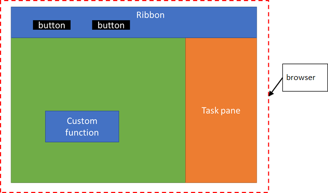

# <a name="configure-your-office-add-in-to-use-a-shared-javascript-runtime"></a>将 Office 加载项配置为使用共享 JavaScript 运行时

[!include[Shared JavaScript runtime requirements](../includes/shared-runtime-requirements-note.md)]

你可以将 Office 加载项配置为在单个共享 JavaScript 运行时（也称为共享运行时）中运行它的所有代码。 这可在加载项中实现更好的协调，并且可从加载项的所有部分访问 DOM 和 CORS。 它还能启用其他功能，例如文档打开时运行代码，或者启用或禁用功能区按钮。 若要将加载项配置为使用共享 JavaScript 运行时，请按照本文中的说明进行操作。

## <a name="create-the-add-in-project"></a>创建加载项项目

如果要启动新项目，请按照以下步骤使用[适用于 Office 加载项的 Yeoman 生成器](https://github.com/OfficeDev/generator-office)创建 Excel 或 PowerPoint 加载项项目。

执行下列操作之一：

- 要生成带自定义函数的 Excel 加载项，请运行命令 `yo office --projectType excel-functions --name 'Excel shared runtime add-in' --host excel --js true`。

    或者

- 要生成 PowerPoint 加载项，请运行命令 `yo office --projectType taskpane --name 'PowerPoint shared runtime add-in' --host powerpoint --js true`。

生成器将创建项目并安装支持的 Node 组件。

## <a name="configure-the-manifest"></a>配置清单

对于新项目或现有项目，请按照以下步骤将其配置为使用共享运行时。 以下步骤能确保你使用[适用于 Office 加载项的 Yeoman 生成器](https://github.com/OfficeDev/generator-office)生成你的项目。

1. 启动 Visual Studio Code 并打开你生成的 Excel 或 PowerPoint 加载项项目。
1. 打开 **manifest.xml** 文件。
1. 如果生成 Excel 加载项，请更新“要求”部分，以使用[共享运行时](../reference/requirement-sets/shared-runtime-requirement-sets.md)，而不是自定义函数运行时。 XML 应该如下所示。

    ```xml
    <Requirements>
    <Sets DefaultMinVersion="1.1">
      <Set Name="SharedRuntime" MinVersion="1.1"/>
    </Sets>
    </Requirements>
    ```

1. 找到 `<VersionOverrides>` 部分并添加 `<Host ...>` 标记内的以下 `<Runtimes>` 部分。 生存期需要 **较长**，以便在关闭任务窗格时加载项代码仍可运行。 `resid` 值是 **Taskpane.Url**，它引用 **manifest.xml** 文件底部附近的 ` <bt:Urls>` 部分中指定的 **taskpane.html** 文件位置。

   ```xml
   <VersionOverrides ...>
     <Hosts>
       <Host ...>
       ...
       <Runtimes>
         <Runtime resid="Taskpane.Url" lifetime="long" />
       </Runtimes>
       ...
   ```

1. 如果你生成带自定义函数的 Excel 加载项，请查找 `<Page>` 元素。 然后将源位置从 **Functions.Page.Url** 更改为 **Taskpane.Url**。

   ```xml
   <AllFormFactors>
   ...
   <Page>
     <SourceLocation resid="Taskpane.Url"/>
   </Page>
   ...
   ```

1. 查找 `<FunctionFile ...>` 标记并将 `resid` 从 **Commands.Url** 更改为  **Taskpane.Url**。 请注意，如果你没有操作命令，则不会有 **FunctionFile** 条目，可跳过此步骤。

    ```xml
    </GetStarted>
    ...
    <FunctionFile resid="Taskpane.Url"/>
    ...
    ```

1. 保存 **manifest.xml** 文件。

## <a name="configure-the-webpackconfigjs-file"></a>配置 webpack.config.js 文件

**webpack.config.js** 将生成多个运行时加载程序。 你需要对其进行修改，以通过 **taskpane.html** 文件仅加载共享 JavaScript 运行时。 

1. 启动 Visual Studio Code 并打开你生成的 Excel 或 PowerPoint 加载项项目。
1. 打开 **webpack.config.js** 文件。
1. 如果你的 **webpack.config.js** 文件有以下 **functions.html** 插件代码，请将其删除。

    ```javascript
    new HtmlWebpackPlugin({
        filename: "functions.html",
        template: "./src/functions/functions.html",
        chunks: ["polyfill", "functions"]
      })
    ```

1. 如果你的 **webpack.config.js** 文件有以下 **commands.html** 插件代码，请将其删除。

    ```javascript
    new HtmlWebpackPlugin({
        filename: "commands.html",
        template: "./src/commands/commands.html",
        chunks: ["polyfill", "commands"]
      })
    ```

1. 如果你的项目使用 **functions** 或 **commands** 区块，请将其添加到如下所示的区块列表中（以下代码适用于你的项目使用上述两种区块时）。

    ```javascript
      new HtmlWebpackPlugin({
        filename: "taskpane.html",
        template: "./src/taskpane/taskpane.html",
        chunks: ["polyfill", "taskpane", "commands", "functions"]
      })
    ```

1. 保存更改并重新生成项目。

   ```command line
   npm run build
   ```

> [!NOTE]
> 如果你的项目有 **functions.html** 文件或 **commands.html** 文件，可将其删除。 **taskpane.html** 将通过你刚才进行的 webpack 更新将 **functions.js** 和 **commands.js** 代码加载到 共享 JavaScript 运行时中。

## <a name="test-your-office-add-in-changes"></a>测试 Office 加载项更改

你可以通过使用以下指令，确认你正在正确使用共享 JavaScript 运行时。

1. 打开 **manifest.xml** 文件。
1. 找到 `<Control xsi:type="Button" id="TaskpaneButton">` 部分并更改以下 `<Action ...>` XML。

    来自：

    ```xml
    <Action xsi:type="ShowTaskpane">
      <TaskpaneId>ButtonId1</TaskpaneId>
      <SourceLocation resid="Taskpane.Url"/>
    </Action>
    ```

    更改为：

    ```xml
    <Action xsi:type="ExecuteFunction">
      <FunctionName>action</FunctionName>
    </Action>
    ```

1. 打开 **./src/commands/commands.js** 文件。
1. 将 **操作** 函数替换成以下代码。 这将更新函数，以打开并修改任务窗格按钮，从而增加一个计数器。 使用一个命令打开并访问任务窗格 DOM 仅适用于共享 JavaScript 运行时。

    ```javascript
    var _count=0;
    
    function action(event) {
      // Your code goes here.
      _count++;
      Office.addin.showAsTaskpane();
      document.getElementById("run").textContent="Go"+_count;
    
      // Be sure to indicate when the add-in command function is complete.
      event.completed();
    }
    ```

1. 保存更改并运行项目。

   ```command line
   npm start
   ```

每次选择加载项按钮，它都会将 **运行** 按钮文本更改为 **转到** ，并在其后增加一个计数器。

## <a name="runtime-lifetime"></a>运行时生存期

添加 `Runtime` 元素时，还需要指定值为 `long` 或 `short` 的生存期。 将此值设置为 `long` 以利用相关功能，例如在文档打开时启动加载项，在关闭任务窗格后继续运行代码，或从自定义函数中使用 CORS 和 DOM。

> [!NOTE]
> 默认生存期值为`short`，但我们建议在 Excel 加载项中使用`long`。如果在此例中将运行时设置为`short`，则当按下某个功能区按钮时，Excel 加载项将启动，但在功能区处理程序运行完毕后，它可能会关闭。 同样，打开任务窗格时，加载项将启动，但关闭任务窗格时，加载项可能会关闭。

```xml
<Runtimes>
  <Runtime resid="ContosoAddin.Url" lifetime="long" />
</Runtimes>
```

> [!NOTE]
> 如果加载启动项包括清单中的 `Runtimes` 元素（共享运行时所需），它将使用 Internet Explorer 11，而不考虑 Windows 或 Microsoft 365 版本。 有关详细信息，请参阅[运行时](../reference/manifest/runtimes.md)。

## <a name="about-the-shared-javascript-runtime"></a>关于共享 JavaScript 运行时

在 Windows 或 Mac 上，加载项将在单独的 JavaScript 运行时环境中运行功能区按钮、自定义函数和任务窗格的代码。 这会产生一些局限性，例如无法轻松共享全局数据，也不能通过自定义函数访问所有 CORS 功能。

但是，你可以将 Office 加载项配置为在同一 JavaScript 运行时（也称为共享运行时）中共享代码。 这可在加载项中实现更好的协调，并且可从加载项的所有部分访问任务窗格 DOM 和 CORS。

配置共享运行时可实现以下方案。

- Office 加载项可使用其他 UI 功能：
  - [将自定义键盘快捷方式添加到 Office 加载项（预览）](../design/keyboard-shortcuts.md)
  - [在 Office 加载项中创建自定义上下文选项卡（预览）](../design/contextual-tabs.md)
  - [启用和禁用加载项命令](../design/disable-add-in-commands.md)
  - [文档打开时在 Office 加载项中运行代码](run-code-on-document-open.md)
  - [显示或隐藏 Office 加载项的任务窗格](show-hide-add-in.md)
- 对于 Excel 加载项：
  - 自定义函数将具有完整的 CORS 支持。
  - 自定义函数可调用 Office.js API 以读取电子表格文档数据。

对于 Windows 版 Office，共享运行时需要 Microsoft Internet Explorer 11 浏览器实例，如 [Office 加载项使用的浏览器](../concepts/browsers-used-by-office-web-add-ins.md)中所述。此外，加载项在功能区上显示的任何按钮都将在同一共享运行时中运行。 下图显示了自定义函数、功能区 UI 和任务窗格代码如何在同一 JavaScript 运行时中运行。



### <a name="debugging"></a>调试

使用共享运行时时，目前不能使用 Visual Studio Code 在 Windows 版 Excel 中调试自定义函数。 你需要改为使用开发人员工具。 有关详细信息，请参阅[使用 Windows 10 上的开发人员工具调试加载项](../testing/debug-add-ins-using-f12-developer-tools-on-windows-10.md)。

### <a name="multiple-task-panes"></a>多个任务窗格

如果计划使用共享运行时，请勿将你的加载项设计为使用多个任务窗格。 共享运行时仅支持使用一个任务窗格。 请注意，不含 `<TaskpaneID>` 的任何任务窗格都被视为不同的任务窗格。

## <a name="give-us-feedback"></a>向我们提供反馈

我们非常乐意听取有关此功能的反馈。 如果你发现此功能存在任何 bug、问题或具有相关请求，请通过在 [office-js repo](https://github.com/OfficeDev/office-js) 中创建 GitHub 问题来告诉我们。

## <a name="see-also"></a>另请参阅

- [从自定义函数中调用 Excel API](../excel/call-excel-apis-from-custom-function.md)
- [将自定义键盘快捷方式添加到 Office 加载项（预览）](../design/keyboard-shortcuts.md)
- [在 Office 加载项中创建自定义上下文选项卡（预览）](../design/contextual-tabs.md)
- [启用和禁用加载项命令](../design/disable-add-in-commands.md)
- [文档打开时在 Office 加载项中运行代码](run-code-on-document-open.md)
- [显示或隐藏 Office 加载项的任务窗格](show-hide-add-in.md)
- [教程：在 Excel 自定义函数和任务窗格之间共享数据和事件](../tutorials/share-data-and-events-between-custom-functions-and-the-task-pane-tutorial.md)
