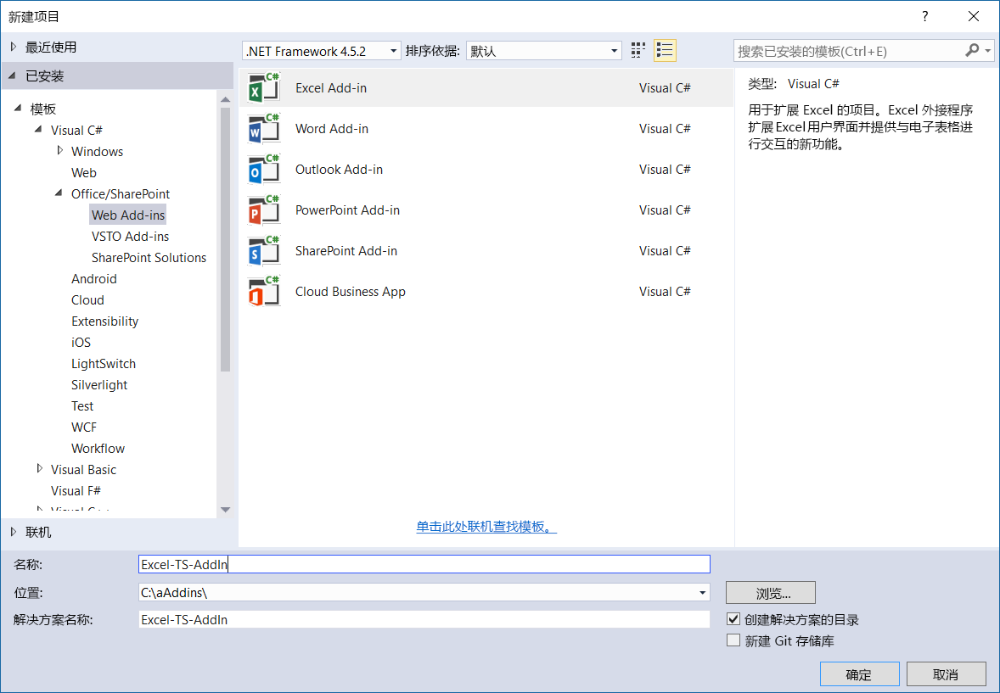
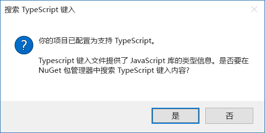
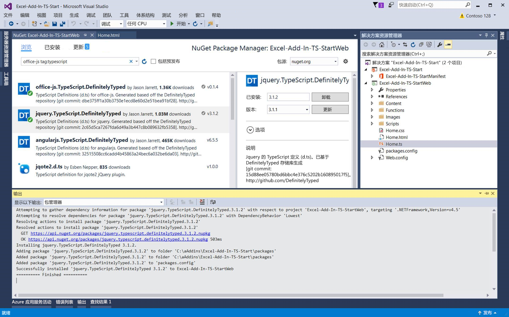

# <a name="convert-an-office-add-in-task-pane-template-in-visual-studio-to-typescript"></a>将 Visual Studio 中的 Office 外接程序任务窗格模板转换成 TypeScript


可以使用 Visual Studio 中的 Office 外接程序 JavaScript 模板来创建 TypeScript 外接程序。在 Visual Studio 中新建外接程序后，可以将项目转换成 TypeScript。这样，便不必从头开始创建 Office 外接程序 TypeScript 项目。  

   > **注意：**若要了解如何在不使用 Visual Studio 的情况下创建 Office 加载项 TypeScript 项目，请参阅[使用任意编辑器创建 Office 加载项](../get-started/create-an-office-add-in-using-any-editor.md)。

在 TypeScript 项目中，可以混合使用 TypeScript 和 JavaScript 文件，项目都可以进行编译。这是因为 TypeScript 是键入的 JavaScript 超集，可以编译 JavaScript。 

本文介绍了如何将 Visual Studio 中的 Excel 外接程序任务窗格模板从 JavaScript 转换成 TypeScript。可以重复同样的步骤，将其他 Office 外接程序 JavaScript 模板转换成 TypeScript。

若要查看或下载本文依据的代码示例，请参阅 GitHub 上的 [Excel-Add-In-TS-Start](https://github.com/officedev/Excel-Add-In-TS-Start)。

## <a name="prerequisites"></a>先决条件

请确保已安装以下组件：

* [Visual Studio 2015 或更高版本](https://www.visualstudio.com/downloads/)
* [Visual Studio 的 Office 开发人员工具](https://www.visualstudio.com/zh-CN/features/office-tools-vs.aspx)
* [Microsoft Visual Studio 2015 Update 3 累积服务版本 (KB3165756)](https://msdn.microsoft.com/zh-CN/library/mt752379.aspx)
* Excel 2016
* [Visual Studio 2015 的 TypeScript 2.1](http://download.microsoft.com/download/6/D/8/6D8381B0-03C1-4BD2-AE65-30FF0A4C62DA/TS2.1-dev14update3-20161206.2/TypeScript_Dev14Full.exe)（安装 Visual Studio 2015 Update 3 后）。

    > **注意：**若要详细了解如何安装 TypeScript 2.1，请参阅[宣布推出 TypeScript 2.1](https://blogs.msdn.microsoft.com/typescript/2016/12/07/announcing-typescript-2-1/)。

## <a name="create-new-add-in-project"></a>新建外接程序项目

1.  打开 Visual Studio，再依次转到“文件”**** > “新建”**** > “项目”****。 
2.  在“Office/SharePoint”****下，依次选择“Excel 外接程序”****和“确定”****。

    

3.  在应用创建向导中，依次选择“将新功能添加到 Excel”****和“完成”****。
4.  按 F5 或绿色的“开始”****按钮，启动新建的 Excel 外接程序，从而快速测试此外接程序。 此外接程序将本地托管在 IIS 上，Excel 将在外接程序加载时打开。

## <a name="convert-the-add-in-project-to-typescript"></a>将外接程序项目转换成 TypeScript

1. 在“解决方案资源管理器”****中，将 Home.js 文件更改为 Home.ts。
2. 当系统询问是否确定要更改文件扩展名时，请选择“是”****。  
3. 当系统询问是否要在 nuget 上搜索 TypeScript 键入时，请选择“是”****，如下面的屏幕截图所示。 此时，“Nuget 包管理器”****会打开。

    

4. 选择“Nuget 包管理器”****中的“浏览”****。  
5. 在搜索框中，键入“office-js tag:typescript”****。
6. 安装“office.js.TypeScript.DefinitelyTyped”****和“jquery.TypeScript.DefinitelyTyped”****，如下面的屏幕截图所示。

    

7. 打开 Home.ts（前身为 Home.js）。从 Home.ts 文件顶部删除以下引用：

    ```///<reference path="/Scripts/FabricUI/MessageBanner.js" />```

8. 在 Home.ts 文件顶部添加以下声明：

    ```declare var fabric: any;```

9. 将 **‘1.1’** 更改为 **1.1**；也就是说，从 Home.ts 文件的以下行中删除引号：

    ```if (!Office.context.requirements.isSetSupported('ExcelApi', 1.1)) {```
 
## <a name="run-the-converted-add-in-project"></a>运行转换后的外接程序项目

1. 按 F5 或绿色的“开始”****按钮，启动此外接程序。 
2. 在 Excel 启动后，按“开始”****功能区上的“显示任务窗格”****按钮。
3. 选择所有含数字的单元格。
4. 按任务窗格上的“突出显示”****按钮。 

## <a name="homets-code-file"></a>Home.ts 代码文件

下面是 Home.ts 文件中的代码，以供参考。此文件包括外接程序运行至少所需的更改。

>**注意：**有关已转换成 TypeScript 的 JavaScript 文件的完整示例，请参阅 [Excel-Add-In-TS-StartWeb/Home.ts](https://github.com/officedev/Excel-Add-In-TS-Start/blob/master/Excel-Add-In-TS-StartWeb/Home.ts)。 

```
declare var fabric: any;

(function () {
    "use strict";

    var cellToHighlight;
    var messageBanner;

    // The initialize function must be run each time a new page is loaded.
    Office.initialize = function (reason) {
        $(document).ready(function () {
            // Initialize the FabricUI notification mechanism and hide it
            var element = document.querySelector('.ms-MessageBanner');
            messageBanner = new fabric.MessageBanner(element);
            messageBanner.hideBanner();
            
            // If not using Excel 2016, use fallback logic.
            if (!Office.context.requirements.isSetSupported('ExcelApi', 1.1)) {
                $("#template-description").text("This sample will display the value of the cells you have selected in the spreadsheet.");
                $('#button-text').text("Display!");
                $('#button-desc').text("Display the selection");

                $('#highlight-button').click(
                    displaySelectedCells);
                return;
            }

            $("#template-description").text("This sample highlights the highest value from the cells you have selected in the spreadsheet.");
            $('#button-text').text("Highlight!");
            $('#button-desc').text("Highlights the largest number.");
                
            loadSampleData();

            // Add a click event handler for the highlight button.
            $('#highlight-button').click(
                hightlightHighestValue);
        });
    }

    function loadSampleData() {

        var values = [
                        [Math.floor(Math.random() * 1000), Math.floor(Math.random() * 1000), Math.floor(Math.random() * 1000)],
                        [Math.floor(Math.random() * 1000), Math.floor(Math.random() * 1000), Math.floor(Math.random() * 1000)],
                        [Math.floor(Math.random() * 1000), Math.floor(Math.random() * 1000), Math.floor(Math.random() * 1000)]
        ];

        // Run a batch operation against the Excel object model.
        Excel.run(function (ctx) {
            // Create a proxy object for the active sheet
            var sheet = ctx.workbook.worksheets.getActiveWorksheet();
            // Queue a command to write the sample data to the worksheet
            sheet.getRange("B3:D5").values = values;

            // Run the queued-up commands, and return a promise to indicate task completion
            return ctx.sync();
        })
        .catch(errorHandler);
    }

    function hightlightHighestValue() {

        // Run a batch operation against the Excel object model.
        Excel.run(function (ctx) {

            // Create a proxy object for the selected range and load its address and values properties.
            var sourceRange = ctx.workbook.getSelectedRange().load("values, address, rowIndex, columnIndex, rowCount, columnCount");

            // Run the queued-up command, and return a promise to indicate task completion
            return ctx.sync().
                .then(function () {
                    var highestRow = 0;
                    var highestCol = 0;
                    var highestValue = sourceRange.values[0][0];

                    // Find the cell to highlight
                    for (var i = 0; i < sourceRange.rowCount; i++) {
                        for (var j = 0; j < sourceRange.columnCount; j++) {
                            if (!isNaN(sourceRange.values[i][j]) && sourceRange.values[i][j] > highestValue) {
                                highestRow = i;
                                highestCol = j;
                                highestValue = sourceRange.values[i][j];
                            }
                        }
                    }

                    cellToHighlight = sourceRange.getCell(highestRow, highestCol);
                    sourceRange.worksheet.getUsedRange().format.fill.clear();
                    sourceRange.worksheet.getUsedRange().format.font.bold = false;

                    cellToHighlight.load("values");
                })
                   // Run the queued-up commands.
                .then(ctx.sync)
                .then(function () {
                    // Highlight the cell
                    cellToHighlight.format.fill.color = "orange";
                    cellToHighlight.format.font.bold = true;
                })
                .then(ctx.sync)
        })
        .catch(errorHandler);
    }

    function displaySelectedCells() {
        Office.context.document.getSelectedDataAsync(Office.CoercionType.Text,
            function (result) {
                if (result.status === Office.AsyncResultStatus.Succeeded) {
                    showNotification('The selected text is:', '"' + result.value + '"');
                } else {
                    showNotification('Error', result.error.message);
                }
            });
    }

    // Helper function for treating errors.
    function errorHandler(error) {
        // Always be sure to catch any accumulated errors that bubble up from the Excel.run execution
        showNotification("Error", error);
        console.log("Error: " + error);
        if (error instanceof OfficeExtension.Error) {
            console.log("Debug info: " + JSON.stringify(error.debugInfo));
        }
    }

    // Helper function for displaying notifications
    function showNotification(header, content) {
        $("#notificationHeader").text(header);
        $("#notificationBody").text(content);
        messageBanner.showBanner();
        messageBanner.toggleExpansion();
    }
})();

```

## <a name="additional-resources"></a>其他资源

* [StackOverflow 上有关 Promise 实现代码的讨论](https://stackoverflow.com/questions/44461312/office-addins-file-in-its-typescript-version-doesnt-work)
* [GitHub 上的 Office 外接程序示例](https://github.com/officedev)
