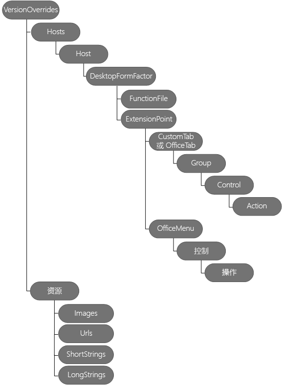

# <a name="create-add-in-commands-in-your-manifest-for-excel-word-and-powerpoint"></a><span data-ttu-id="6058f-104">在清单中创建 Excel、Word 和 PowerPoint 加载项命令</span><span class="sxs-lookup"><span data-stu-id="6058f-104">Create add-in commands in your manifest for Excel, Word, and PowerPoint</span></span>


<span data-ttu-id="6058f-105">在清单中使用 **[VersionOverrides](https://docs.microsoft.com/javascript/office/manifest/versionoverrides?view=office-js)** 定义 Excel、Word 和 PowerPoint 加载项命令。</span><span class="sxs-lookup"><span data-stu-id="6058f-105">Use **[VersionOverrides](https://docs.microsoft.com/javascript/office/manifest/versionoverrides?view=office-js)** in your manifest to define add-in commands for Excel, Word, and PowerPoint.</span></span> <span data-ttu-id="6058f-106">加载项命令提供了使用执行操作的特定 UI 元素来自定义默认的 Office 用户界面 (UI) 的简单方法。</span><span class="sxs-lookup"><span data-stu-id="6058f-106">Add-in commands provide an easy way to customize the default Office user interface (UI) with specified UI elements that perform actions.</span></span> <span data-ttu-id="6058f-107">可以使用加载项命令执行以下操作：</span><span class="sxs-lookup"><span data-stu-id="6058f-107">You can use add-in commands to:</span></span>
- <span data-ttu-id="6058f-108">创建 UI 元素或入口点，以便能够更易于使用你的外接程序功能。</span><span class="sxs-lookup"><span data-stu-id="6058f-108">Create UI elements or entry points that make your add-in's functionality easier to use.</span></span>  
  
- <span data-ttu-id="6058f-109">向功能区中添加按钮或下拉列表按钮。</span><span class="sxs-lookup"><span data-stu-id="6058f-109">Add buttons or a drop-down list of buttons to the ribbon.</span></span>    
  
- <span data-ttu-id="6058f-110">将单个菜单项（每一个都包含可选的子菜单）添加到特定上下文（快捷方式）菜单中。</span><span class="sxs-lookup"><span data-stu-id="6058f-110">Add individual menu items — each containing optional submenus — to specific context (shortcut) menus.</span></span>    
  
- <span data-ttu-id="6058f-p103">在选择你的外接程序命令时执行操作。可以：</span><span class="sxs-lookup"><span data-stu-id="6058f-p103">Perform actions when your add-in command is chosen. You can:</span></span>
    
  - <span data-ttu-id="6058f-p104">显示一个或多个任务窗格外接程序，让用户与其进行交互。在任务窗格外接程序内，可以显示使用 Office UI 结构创建自定义 UI 的 HTML。</span><span class="sxs-lookup"><span data-stu-id="6058f-p104">Show one or more task pane add-ins for users to interact with. Inside your task pane add-in, you can display HTML that uses Office UI Fabric to create a custom UI.</span></span>
    
     <span data-ttu-id="6058f-115">*或者*</span><span class="sxs-lookup"><span data-stu-id="6058f-115">*or*</span></span> 
      
  - <span data-ttu-id="6058f-116">运行 JavaScript 代码，该代码通常在不显示任何 UI 的情况下运行。</span><span class="sxs-lookup"><span data-stu-id="6058f-116">Run JavaScript code, which normally runs without displaying any UI.</span></span>
      
<span data-ttu-id="6058f-p105">本文介绍如何编辑您的清单来定义外接程序命令。下图显示了用来定义外接程序命令的元素的层次结构。本文将具体介绍这些元素。</span><span class="sxs-lookup"><span data-stu-id="6058f-p105">This article describes how to edit your manifest to define add-in commands. The following diagram shows the hierarchy of elements used to define add-in commands. These elements are described in more detail in this article.</span></span> 
      
<span data-ttu-id="6058f-120">下图是对清单中的加载项命令元素的概述。</span><span class="sxs-lookup"><span data-stu-id="6058f-120">The following image is an overview of add-in commands elements in the manifest.</span></span> 
<span data-ttu-id="6058f-121"></span><span class="sxs-lookup"><span data-stu-id="6058f-121"></span></span>
 
## <a name="step-1-start-from-a-sample"></a><span data-ttu-id="6058f-122">第 1 步：从示例入手</span><span class="sxs-lookup"><span data-stu-id="6058f-122">Step 1: Start from a sample</span></span>

<span data-ttu-id="6058f-p107">强烈建议从 [Office 加载项命令示例](https://github.com/OfficeDev/Office-Add-in-Command-Sample)中的示例之一入手。也可以按照本指南中的步骤操作，创建自己的清单。可以使用“Office 加载项命令示例”网站中的 XSD 文件来验证清单。使用加载项命令前，请确保已阅读 [Excel、Word 和 PowerPoint 加载项命令](../design/add-in-commands.md)。</span><span class="sxs-lookup"><span data-stu-id="6058f-p107">We strongly recommend that you start from one of the samples we provide in  [Office Add-in Commands Samples](https://github.com/OfficeDev/Office-Add-in-Command-Sample). Optionally, you can create your own manifest by following the steps in this guide. You can validate your manifest using the XSD file in the Office Add-in Commands Samples site. Ensure that you have read  [Add-in commands for Excel, Word and PowerPoint](../design/add-in-commands.md) before using add-in commands.</span></span>

## <a name="step-2-create-a-task-pane-add-in"></a><span data-ttu-id="6058f-127">第 2 步：创建任务窗格加载项</span><span class="sxs-lookup"><span data-stu-id="6058f-127">Step 2: Create a task pane add-in</span></span>

<span data-ttu-id="6058f-p108">若要开始使用加载项命令，必须先创建任务窗格加载项，再按照本文所述来修改加载项清单。无法对内容加载项使用加载项命令。若要更新现有清单，必须将相应 **XML 命名空间**和 **VersionOverrides** 元素添加到清单中（如[第 3 步：添加 VersionOverrides 元素](#step-3-add-versionoverrides-element)所述）。</span><span class="sxs-lookup"><span data-stu-id="6058f-p108">To start using add-in commands, you must first create a task pane add-in, and then modify the add-in's manifest as described in this article. You can't use add-in commands with content add-ins. If you're updating an existing manifest, you must add the appropiate **XML namespaces** as well as add the **VersionOverrides** element to the manifest as described in [Step 3: Add VersionOverrides element](#step-3-add-versionoverrides-element).</span></span>
   
<span data-ttu-id="6058f-p109">以下示例显示了 Office 2013 外接程序的清单。此清单中没有任何外接程序命令，因为没有 **VersionOverrides** 元素。Office 2013 不支持外接程序命令，但是通过将 **VersionOverrides** 添加到此清单，外接程序可同时在 Office 2013 和 Office 2016 中运行。在 Office 2013 中，外接程序不会显示外接程序命令，并且使用 **SourceLocation** 的值运行外接程序作为单一任务窗格外接程序。在 Office 2016 中，如果未包含 **VersionOverrides** 元素，则使用 **SourceLocation** 运行外接程序。但是，如果包含了 **VersionOverrides**，外接程序将只显示外接程序命令，并且不会将外接程序显示为单一任务窗格外接程序。</span><span class="sxs-lookup"><span data-stu-id="6058f-p109">The following example shows an Office 2013 add-in's manifest. There are no add-in commands in this manifest because there is no **VersionOverrides** element. Office 2013 doesn't support add-in commands, but by adding **VersionOverrides** to this manifest, your add-in will run in both Office 2013 and Office 2016. In Office 2013, your add-in won't display add-in commands, and uses the value of **SourceLocation** to run your add-in as a single task pane add-in. In Office 2016, if no **VersionOverrides** element is included, **SourceLocation** is used to run your add-in. If you include **VersionOverrides**, however, your add-in displays the add-in commands only, and doesn't display your add-in as a single task pane add-in.</span></span>
  
```xml
<OfficeApp xmlns="http://schemas.microsoft.com/office/appforoffice/1.1" xmlns:xsi="https://www.w3.org/2001/XMLSchema-instance" xmlns:bt="http://schemas.microsoft.com/office/officeappbasictypes/1.0" xmlns:ov="http://schemas.microsoft.com/office/taskpaneappversionoverrides" xsi:type="TaskPaneApp">
  <Id>657a32a9-ab8a-4579-ac9f-df1a11a64e52</Id>
  <Version>1.0.0.0</Version>
  <ProviderName>Contoso</ProviderName>
  <DefaultLocale>en-US</DefaultLocale>
  <DisplayName DefaultValue="Contoso Add-in Commands" />
  <Description DefaultValue="Contoso Add-in Commands"/>
  <IconUrl DefaultValue="~remoteAppUrl/Images/Icon_32.png" />
 
  <AppDomains>
    <AppDomain>AppDomain1</AppDomain>
    <AppDomain>AppDomain2</AppDomain>
    <AppDomain>AppDomain3</AppDomain>
  </AppDomains>
  <Hosts>
    <Host Name="Workbook" />
  </Hosts>
  <DefaultSettings>
    <SourceLocation DefaultValue="https://www.contoso.com/Pages/Home.aspx" />
  </DefaultSettings>
  <Permissions>ReadWriteDocument</Permissions>

 <!-- The VersionOverrides element is inserted at this location in the manifest. -->

</OfficeApp>
```

## <a name="step-3-add-versionoverrides-element"></a><span data-ttu-id="6058f-136">步骤 3：添加 VersionOverrides 元素</span><span class="sxs-lookup"><span data-stu-id="6058f-136">Step 3: Add VersionOverrides element</span></span>
<span data-ttu-id="6058f-p110">**VersionOverrides** 元素是包含外接程序命令定义的根元素。**VersionOverrides** 是清单中 **OfficeApp** 元素的子元素。下表列出了 **VersionOverrides** 元素的属性。</span><span class="sxs-lookup"><span data-stu-id="6058f-p110">The **VersionOverrides** element is the root element that contains the definition of your add-in command. **VersionOverrides** is a child element of the **OfficeApp** element in the manifest. The following table lists the attributes of the **VersionOverrides** element.</span></span>

|<span data-ttu-id="6058f-140">**属性**</span><span class="sxs-lookup"><span data-stu-id="6058f-140">**Attribute**</span></span>|<span data-ttu-id="6058f-141">**说明**</span><span class="sxs-lookup"><span data-stu-id="6058f-141">**Description**</span></span>|
|:-----|:-----|
|<span data-ttu-id="6058f-142">**xmlns**</span><span class="sxs-lookup"><span data-stu-id="6058f-142">**xmlns**</span></span> <br/> | <span data-ttu-id="6058f-p111">必需。架构位置，必须是“http://schemas.microsoft.com/office/taskpaneappversionoverrides”。</span><span class="sxs-lookup"><span data-stu-id="6058f-p111">Required. The schema location, which must be "http://schemas.microsoft.com/office/taskpaneappversionoverrides".</span></span> <br/> |
|<span data-ttu-id="6058f-145">**xsi:type**</span><span class="sxs-lookup"><span data-stu-id="6058f-145">**xsi:type**</span></span> <br/> |<span data-ttu-id="6058f-p112">必需。架构版本。本文中所述的版本为"VersionOverridesV1_0"。</span><span class="sxs-lookup"><span data-stu-id="6058f-p112">Required. The schema version. The version described in this article is "VersionOverridesV1_0".</span></span>  <br/> |
   
<span data-ttu-id="6058f-149">下表标识了 **VersionOverrides** 的子元素。</span><span class="sxs-lookup"><span data-stu-id="6058f-149">The following table identifies the child elements of **VersionOverrides**.</span></span>
  
|<span data-ttu-id="6058f-150">**元素**</span><span class="sxs-lookup"><span data-stu-id="6058f-150">**Element**</span></span>|<span data-ttu-id="6058f-151">**说明**</span><span class="sxs-lookup"><span data-stu-id="6058f-151">**Description**</span></span>|
|:-----|:-----|
|<span data-ttu-id="6058f-152">**说明**</span><span class="sxs-lookup"><span data-stu-id="6058f-152">**Description**</span></span> <br/> |<span data-ttu-id="6058f-p113">可选。描述外接程序。此子级 **Description** 元素替代清单中父级部分中的旧 **Description** 元素。此 **Description** 元素的 **resid** 属性将设置为 **String** 元素的 **id**。**String** 元素包含 **Description** 的文本。 </span><span class="sxs-lookup"><span data-stu-id="6058f-p113">Optional. Describes the add-in. This child **Description** element overrides a previous **Description** element in the parent portion of the manifest. The **resid** attribute for this **Description** element is set to the **id** of a **String** element. The **String** element contains the text for **Description**. </span></span><br/> |
|<span data-ttu-id="6058f-158">**Requirements**</span><span class="sxs-lookup"><span data-stu-id="6058f-158">**Requirements**</span></span> <br/> |<span data-ttu-id="6058f-p114">可选。指定外接程序要求的最低要求集和 Office.js 的版本。此子级 **Requirements** 元素替代清单中父级部分中的 **Requirements** 元素。有关详细信息，请参阅[指定 Office 主机和 API 要求](../develop/specify-office-hosts-and-api-requirements.md)。  </span><span class="sxs-lookup"><span data-stu-id="6058f-p114">Optional. Specifies the minimum requirement set and version of Office.js that the add-in requires. This child **Requirements** element overrides the **Requirements** element in the parent portion of the manifest. For more information, see [Specify Office hosts and API requirements](../develop/specify-office-hosts-and-api-requirements.md).  </span></span><br/> |
|<span data-ttu-id="6058f-163">**Hosts**</span><span class="sxs-lookup"><span data-stu-id="6058f-163">**Hosts**</span></span> <br/> |<span data-ttu-id="6058f-p115">必需。指定 Office 主机的集合。子级 **Hosts** 元素替代清单中父级部分中的 **Hosts** 元素。必须包含已设置为“Workbook”或“Document”的 **xsi:type** 属性 </span><span class="sxs-lookup"><span data-stu-id="6058f-p115">Required. Specifies a collection of Office hosts. The child **Hosts** element overrides the **Hosts** element in the parent portion of the manifest. You must include a **xsi:type** attribute set to "Workbook" or "Document". </span></span><br/> |
|<span data-ttu-id="6058f-168">**Resources**</span><span class="sxs-lookup"><span data-stu-id="6058f-168">**Resources**</span></span> <br/> |<span data-ttu-id="6058f-p116">定义其他清单元素引用的资源集合（字符串、URL 和图像）。例如，**Description** 元素的值引用了 **Resources** 中的子元素。**Resources** 元素将在本文后续部分中的[步骤 7：添加 Resources 元素](#step-7-add-the-resources-element)中进行介绍。 </span><span class="sxs-lookup"><span data-stu-id="6058f-p116">Defines a collection of resources (strings, URLs, and images) that other manifest elements reference. For example, the **Description** element's value refers to a child element in **Resources**. The **Resources** element is described in [Step 7: Add the Resources element](#step-7-add-the-resources-element) later in this article. </span></span><br/> |
   
<span data-ttu-id="6058f-172">下面的示例演示如何使用 **VersionOverrides** 元素及其子元素。</span><span class="sxs-lookup"><span data-stu-id="6058f-172">The following example shows how to use the **VersionOverrides** element and its child elements.</span></span>

```xml
<OfficeApp>
...
  <VersionOverrides xmlns="http://schemas.microsoft.com/office/taskpaneappversionoverrides" xsi:type="VersionOverridesV1_0">
    <Description resid="residDescription" />
    <Requirements>
      <!-- add information about requirement sets -->
    </Requirements>
    <Hosts>
      <Host xsi:type="Workbook">
        <!-- add information about form factors -->
      </Host>
      <Host xsi:type="Document">
        <!-- add information about form factors -->
      </Host>
    </Hosts>
    <Resources> 
      <!-- add information about resources -->
    </Resources>
  </VersionOverrides>
...
</OfficeApp>
```

## <a name="step-4-add-hosts-host-and-desktopformfactor-elements"></a><span data-ttu-id="6058f-173">步骤 4：添加 Hosts、Host 和 DesktopFormFactor 元素</span><span class="sxs-lookup"><span data-stu-id="6058f-173">Step 4: Add Hosts, Host, and DesktopFormFactor elements</span></span>

<span data-ttu-id="6058f-p117">**Hosts** 元素包含一个或多个 **Host** 元素。一个 **Host** 元素指定一个特定的 Office 主机。**Host** 元素包含子元素，这些子元素用于指定在对应的 Office 主机安装外接程序后要显示的外接程序命令。若要在两个或更多个不同的 Office 主机中显示相同的外接程序命令，必须在每个 **Host** 中使用相同的子元素。</span><span class="sxs-lookup"><span data-stu-id="6058f-p117">The **Hosts** element contains one or more **Host** elements. A **Host** element specifies a particular Office host. The **Host** element contains child elements that specify the add-in commands to display after your add-in is installed in that Office host. To show the same add-in commands in two or more different Office hosts, you must duplicate the child elements in each **Host**.</span></span>
       
<span data-ttu-id="6058f-178">**DesktopFormFactor** 元素指定运行在 Windows 桌面的 Office 上和运行在 Office Online（在浏览器中）中的外接程序的相关设置。</span><span class="sxs-lookup"><span data-stu-id="6058f-178">The **DesktopFormFactor** element specifies the settings for an add-in that runs in Office on Windows desktop, and Office Online (in browser).</span></span>
      
<span data-ttu-id="6058f-179">以下是一个包含 **Hosts**、**Host** 和 **DesktopFormFactor** 元素的示例。</span><span class="sxs-lookup"><span data-stu-id="6058f-179">The following is an example of **Hosts**, **Host**, and **DesktopFormFactor** elements.</span></span>

```xml
<OfficeApp>
...
  <VersionOverrides xmlns="http://schemas.microsoft.com/office/taskpaneappversionoverrides" xsi:type="VersionOverridesV1_0">
  ...
    <Hosts>
      <Host xsi:type="Workbook">
        <DesktopFormFactor>

              <!-- information about FunctionFile and ExtensionPoint -->

        </DesktopFormFactor>
      </Host>
    </Hosts>
  ...
  </VersionOverrides>
...
</OfficeApp>
```

## <a name="step-5-add-the-functionfile-element"></a><span data-ttu-id="6058f-180">步骤 5：添加 FunctionFile 元素</span><span class="sxs-lookup"><span data-stu-id="6058f-180">Step 5: Add the FunctionFile element</span></span>

<span data-ttu-id="6058f-p118">"FunctionFile"元素指定了一个文件，其中包含当外接程序命令使用"ExecuteFunction"操作时要运行的 JavaScript 代码（请参阅 按钮控件了解相关说明）。将"FunctionFile"元素的"resid"属性设置为包括外接程序命令需要的所有 JavaScript 文件的 HTML 文件。不能只链接到 JavaScript 文件。将文件名称指定为"Resources"元素中的"Url"元素。\*\*\*\*\*\*\*\*[](https://docs.microsoft.com/javascript/office/manifest/control?view=office-js#Button-control)\*\*\*\*\*\*\*\*\*\*\*\*\*\*\*\*</span><span class="sxs-lookup"><span data-stu-id="6058f-p118">The **FunctionFile** element specifies a file that contains JavaScript code to run when an add-in command uses the **ExecuteFunction** action (see [Button controls](https://docs.microsoft.com/javascript/office/manifest/control?view=office-js#Button-control) for a description). The **FunctionFile** element's **resid** attribute is set to a HTML file that includes all the JavaScript files your add-in commands require. You can't link directly to a JavaScript file. You can only link to an HTML file. The file name is specified as a **Url** element in the **Resources** element.</span></span>
        
<span data-ttu-id="6058f-186">下面的示例展示了 **FunctionFile** 元素。</span><span class="sxs-lookup"><span data-stu-id="6058f-186">The following is an example of the **FunctionFile** element.</span></span>
  
```xml
<DesktopFormFactor>
    <FunctionFile resid="residDesktopFuncUrl" />
    <ExtensionPoint xsi:type="PrimaryCommandSurface">
      <!-- information about this extension point -->
    </ExtensionPoint> 

    <!-- You can define more than one ExtensionPoint element as needed -->
</DesktopFormFactor>
```

> [!IMPORTANT]
> <span data-ttu-id="6058f-187">请确保 JavaScript 代码调用了 `Office.initialize`。</span><span class="sxs-lookup"><span data-stu-id="6058f-187">Make sure your JavaScript code calls  `Office.initialize`.</span></span> 
   
<span data-ttu-id="6058f-p119">**FunctionFile** 元素引用的 HTML 文件中的 JavaScript 必须调用 `Office.initialize`。**FunctionName** 元素（请参阅[按钮控件](https://docs.microsoft.com/javascript/office/manifest/control?view=office-js#Button-control)查看相关说明）使用 **FunctionFile** 中的函数。</span><span class="sxs-lookup"><span data-stu-id="6058f-p119">The JavaScript in the HTML file referenced by the **FunctionFile** element must call `Office.initialize`. The **FunctionName** element (see [Button controls](https://docs.microsoft.com/javascript/office/manifest/control?view=office-js#Button-control) for a description) uses the functions in **FunctionFile**.</span></span>
     
<span data-ttu-id="6058f-190">下面的代码展示了如何实现 **FunctionName** 使用的函数。</span><span class="sxs-lookup"><span data-stu-id="6058f-190">The following code shows how to implement the function used by **FunctionName**.</span></span>

```javascript

<script>
    // The initialize function must be run each time a new page is loaded.
    (function () {
        Office.initialize = function (reason) {
            // If you need to initialize something you can do so here. 
        };
    })();

    // Your function must be in the global namespace.
    function writeText(event) {

        // Implement your custom code here. The following code is a simple example.  
        Office.context.document.setSelectedDataAsync("ExecuteFunction works. Button ID=" + event.source.id,
            function (asyncResult) {
                var error = asyncResult.error;
                if (asyncResult.status === "failed") {
                    // Show error message. 
                }
                else {
                    // Show success message.
                }
            });
        
        // Calling event.completed is required. event.completed lets the platform know that processing has completed. 
        event.completed();
    }
</script>
```

> [!IMPORTANT]
> <span data-ttu-id="6058f-p120">调用 **event.completed** 表示已成功处理事件。如果函数获得多次调用（如多次单击同一加载项命令），所有事件都会自动排入队列。首个事件会自动运行，而其他事件则继续留在队列中。如果函数调用 **event.completed**，将运行此函数在队列中的下一个调用。必须实现 **event.completed**，否则函数不会运行。</span><span class="sxs-lookup"><span data-stu-id="6058f-p120">The call to **event.completed** signals that you have successfully handled the event. When a function is called multiple times, such as multiple clicks on the same add-in command, all events are automatically queued. The first event runs automatically, while the other events remain on the queue. When your function calls **event.completed**, the next queued call to that function runs. You must implement **event.completed**, otherwise your function will not run.</span></span>
 
## <a name="step-6-add-extensionpoint-elements"></a><span data-ttu-id="6058f-196">第 6 步：添加 ExtensionPoint 元素</span><span class="sxs-lookup"><span data-stu-id="6058f-196">Step 6: Add ExtensionPoint elements</span></span>

<span data-ttu-id="6058f-p121">**ExtensionPoint** 元素定义外接程序命令应在 Office UI 中的哪个位置出现。可以使用以下 **xsi:type** 值定义 **ExtensionPoint** 元素：</span><span class="sxs-lookup"><span data-stu-id="6058f-p121">The **ExtensionPoint** element defines where add-in commands should appear in the Office UI. You can define **ExtensionPoint** elements with these **xsi:type** values:</span></span>
   
- <span data-ttu-id="6058f-199">**PrimaryCommandSurface**，它是指 Office 中的功能区。</span><span class="sxs-lookup"><span data-stu-id="6058f-199">**PrimaryCommandSurface**, which refers to the ribbon in Office.</span></span>
     
- <span data-ttu-id="6058f-200">**ContextMenu**，它是当你在 Office UI 中右键单击时出现的快捷菜单。</span><span class="sxs-lookup"><span data-stu-id="6058f-200">**ContextMenu**, which is the shortcut menu that appears when you right-click in the Office UI.</span></span>
    
<span data-ttu-id="6058f-201">下面的示例演示如何将 **ExtensionPoint** 元素与 **PrimaryCommandSurface** 和 **ContextMenu** 属性值配合使用，以及应彼此配合使用的子元素。</span><span class="sxs-lookup"><span data-stu-id="6058f-201">The following examples show how to use the **ExtensionPoint** element with **PrimaryCommandSurface** and **ContextMenu** attribute values, and the child elements that should be used with each.</span></span>
    
> [!IMPORTANT]
> <span data-ttu-id="6058f-p122">对于包含 ID 属性的元素，请务必提供唯一 ID。建议将公司名称与 ID 结合使用。例如，请使用以下格式：`<CustomTab id="mycompanyname.mygroupname">`。</span><span class="sxs-lookup"><span data-stu-id="6058f-p122">For elements that contain an ID attribute, make sure you provide a unique ID. We recommend that you use your company's name along with your ID. For example, use the following format: `<CustomTab id="mycompanyname.mygroupname">`.</span></span> 
  
```xml
<ExtensionPoint xsi:type="PrimaryCommandSurface">
  <CustomTab id="Contoso Tab">
  <!-- If you want to use a default tab that comes with Office, remove the above CustomTab element, and then uncomment the following OfficeTab element -->
  <!-- <OfficeTab id="TabData"> -->
    <Label resid="residLabel4" />
    <Group id="Group1Id12">
      <Label resid="residLabel4" />
      <Icon>
        <bt:Image size="16" resid="icon1_32x32" />
        <bt:Image size="32" resid="icon1_32x32" />
        <bt:Image size="80" resid="icon1_32x32" />
      </Icon>
      <Tooltip resid="residToolTip" />
      <Control xsi:type="Button" id="Button1Id1">
        
        <!-- information about the control -->
      </Control>   
      <!-- other controls, as needed -->                                    
    </Group>
  </CustomTab>
</ExtensionPoint>
<ExtensionPoint xsi:type="ContextMenu">
  <OfficeMenu id="ContextMenuCell">
    <Control xsi:type="Menu" id="ContextMenu2">
            <!-- information about the control -->
    </Control>   
    <!-- other controls, as needed -->         
  </OfficeMenu>
</ExtensionPoint>
```

|<span data-ttu-id="6058f-205">**元素**</span><span class="sxs-lookup"><span data-stu-id="6058f-205">**Element**</span></span>|<span data-ttu-id="6058f-206">**说明**</span><span class="sxs-lookup"><span data-stu-id="6058f-206">**Description**</span></span>|
|:-----|:-----|
|<span data-ttu-id="6058f-207">**CustomTab**</span><span class="sxs-lookup"><span data-stu-id="6058f-207">**CustomTab**</span></span> <br/> |<span data-ttu-id="6058f-p123">如果想要（使用 **PrimaryCommandSurface**）向功能区添加自定义选项卡，则为必需项。如果使用 **CustomTab** 元素，则不能使用 **OfficeTab** 元素。**id** 属性是必需的。 </span><span class="sxs-lookup"><span data-stu-id="6058f-p123">Required if you want to add a custom tab to the ribbon (using **PrimaryCommandSurface**). If you use the **CustomTab** element, you can't use the **OfficeTab** element. The **id** attribute is required. </span></span><br/> |
|<span data-ttu-id="6058f-211">**OfficeTab**</span><span class="sxs-lookup"><span data-stu-id="6058f-211">**OfficeTab**</span></span> <br/> |<span data-ttu-id="6058f-p124">如果想要（使用 **PrimaryCommandSurface**）扩展默认 Office 功能区选项卡，则为必需项。如果使用 **OfficeTab** 元素，则不能使用 **CustomTab** 元素。 </span><span class="sxs-lookup"><span data-stu-id="6058f-p124">Required if you want to extend a default Office ribbon tab (using **PrimaryCommandSurface**). If you use the **OfficeTab** element, you can't use the **CustomTab** element. </span></span><br/> <span data-ttu-id="6058f-214">对于与 **id** 属性一起使用的多个 tab 值，请参阅[默认 Office 功能区选项卡的 Tab 值](https://docs.microsoft.com/javascript/office/manifest/officetab?view=office-js)。</span><span class="sxs-lookup"><span data-stu-id="6058f-214">For more tab values to use with the **id** attribute, see [Tab values for default Office ribbon tabs](https://docs.microsoft.com/javascript/office/manifest/officetab?view=office-js).</span></span>  <br/> |
|<span data-ttu-id="6058f-215">**OfficeMenu**</span><span class="sxs-lookup"><span data-stu-id="6058f-215">**OfficeMenu**</span></span> <br/> | <span data-ttu-id="6058f-p125">如果要（使用 **ContextMenu**）将外接程序命令添加到默认上下文菜单中，则为必需项。**id** 属性必须设置为： </span><span class="sxs-lookup"><span data-stu-id="6058f-p125">Required if you're adding add-in commands to a default context menu (using **ContextMenu**). The **id** attribute must be set to: </span></span><br/> <span data-ttu-id="6058f-p126">当用户选定文本，然后右键单击所选文本时，适用于 Excel 或 Word 的 **ContextMenuText**显示上下文菜单上的项。 </span><span class="sxs-lookup"><span data-stu-id="6058f-p126">**ContextMenuText** for Excel or Word. Displays the item on the context menu when text is selected and then the user right-clicks on the selected text. </span></span><br/> <span data-ttu-id="6058f-p127">适用于 Excel 的 **ContextMenuCell**。当用户右键单击电子表格中的某个单元格时显示上下文菜单上的项。 </span><span class="sxs-lookup"><span data-stu-id="6058f-p127">**ContextMenuCell** for Excel. Displays the item on the context menu when the user right-clicks on a cell on the spreadsheet. </span></span><br/> |
|<span data-ttu-id="6058f-222">**Group**</span><span class="sxs-lookup"><span data-stu-id="6058f-222">**Group**</span></span> <br/> |<span data-ttu-id="6058f-p128">选项卡上的一组用户界面扩展点。一组可以有多达六个控件。**id** 属性是必需的。它是一个最多为 125 个字符的字符串。 </span><span class="sxs-lookup"><span data-stu-id="6058f-p128">A group of user interface extension points on a tab. A group can have up to six controls. The **id** attribute is required. It's a string with a maximum of 125 characters. </span></span><br/> |
|<span data-ttu-id="6058f-226">**Label**</span><span class="sxs-lookup"><span data-stu-id="6058f-226">**Label**</span></span> <br/> |<span data-ttu-id="6058f-p129">必需。组标签。**resid** 属性必须设置为 **String** 元素的 **id** 属性的值。**String** 元素是 **ShortStrings** 元素的子元素，而 ShortStrings 元素是 **Resources** 元素的子元素。 </span><span class="sxs-lookup"><span data-stu-id="6058f-p129">Required. The label of the group. The **resid** attribute must be set to the value of the **id** attribute of a **String** element. The **String** element is a child element of the **ShortStrings** element, which is a child element of the **Resources** element. </span></span><br/> |
|<span data-ttu-id="6058f-231">**Icon**</span><span class="sxs-lookup"><span data-stu-id="6058f-231">**Icon**</span></span> <br/> |<span data-ttu-id="6058f-p130">必需。指定将在小型设备上使用或在显示过多按钮的情况下使用的组图标。**resid** 属性必须设置为 **Image** 元素的 **id** 属性的值。**Image** 元素是 **Images** 元素的子元素，而 Images 元素是 **Resources** 元素的子元素。**size** 属性给出图像的大小（以像素为单位）。要求三种图像大小：16、32 和 80。也同样支持五种可选大小：20、24、40、48 和 64。 </span><span class="sxs-lookup"><span data-stu-id="6058f-p130">Required. Specifies the group's icon to be used on small form factor devices, or when too many buttons are displayed. The **resid** attribute must be set to the value of the **id** attribute of an **Image** element. The **Image** element is a child element of the **Images** element, which is a child element of the **Resources** element. The **size** attribute gives the size, in pixels, of the image. Three image sizes are required: 16, 32, and 80. Five optional sizes are also supported: 20, 24, 40, 48, and 64. </span></span><br/> |
|<span data-ttu-id="6058f-239">**Tooltip**</span><span class="sxs-lookup"><span data-stu-id="6058f-239">**Tooltip**</span></span> <br/> |<span data-ttu-id="6058f-p131">可选。组的工具提示**resid** 属性必须设置为 **String** 元素的 **id** 属性的值。**String** 元素是 **LongStrings** 元素的子元素，而 LongStrings 元素是 **Resources** 元素的子元素。 </span><span class="sxs-lookup"><span data-stu-id="6058f-p131">Optional. The tooltip of the group. The **resid** attribute must be set to the value of the **id** attribute of a **String** element. The **String** element is a child element of the **LongStrings** element, which is a child element of the **Resources** element. </span></span><br/> |
|<span data-ttu-id="6058f-244">**Control**</span><span class="sxs-lookup"><span data-stu-id="6058f-244">**Control**</span></span> <br/> |<span data-ttu-id="6058f-p132">每个组都要求至少有一个控件。**Control** 元素可以是 **Button**，也可以是 **Menu**。使用 **Menu** 可指定按钮控件的下拉列表。目前仅支持按钮和菜单。请参阅[按钮控件](https://docs.microsoft.com/javascript/office/manifest/control?view=office-js#Button-control)和[菜单控件](https://docs.microsoft.com/javascript/office/manifest/control?view=office-js#menu-dropdown-button-controls)部分，了解详细信息。 </span><span class="sxs-lookup"><span data-stu-id="6058f-p132">Each group requires at least one control. A **Control** element can be either a **Button** or a **Menu**. Use **Menu** to specify a drop-down list of button controls. Currently, only buttons and menus are supported. See the  [Button controls](https://docs.microsoft.com/javascript/office/manifest/control?view=office-js#Button-control) and [Menu controls](https://docs.microsoft.com/javascript/office/manifest/control?view=office-js#menu-dropdown-button-controls) sections for more information. </span></span><br/><span data-ttu-id="6058f-250">**注意：** 建议一次添加一个 **Control** 元素及相关 **Resources** 子元素，以便于进行故障排除。</span><span class="sxs-lookup"><span data-stu-id="6058f-250">**Note:** To make troubleshooting easier, we recommend that you add a **Control** element and the related **Resources** child elements one at a time.</span></span>          |
   

### <a name="button-controls"></a><span data-ttu-id="6058f-251">按钮控件</span><span class="sxs-lookup"><span data-stu-id="6058f-251">Button controls</span></span>
<span data-ttu-id="6058f-p133">当用户选择某个按钮时，将执行一个操作。它可以执行 JavaScript 函数或显示任务窗格。以下示例演示了如何定义两种按钮。第一个按钮在不显示 UI 的情况下运行 JavaScript 函数，第二个按钮显示任务窗格。在 **Control** 元素中：</span><span class="sxs-lookup"><span data-stu-id="6058f-p133">A button performs a single action when the user selects it. It can either execute a JavaScript function or show a task pane. The following example shows how to define two buttons. The first button runs a JavaScript function without showing a UI, and the second button shows a task pane. In the **Control** element:</span></span>        

- <span data-ttu-id="6058f-257">**type** 属性是必需的，并且必须设置为 **Button**。</span><span class="sxs-lookup"><span data-stu-id="6058f-257">The **type** attribute is required, and must be set to **Button**.</span></span>
    
- <span data-ttu-id="6058f-258">**Control** 元素的 **id** 属性是一个最多为 125 个字符的字符串。</span><span class="sxs-lookup"><span data-stu-id="6058f-258">The **id** attribute of the **Control** element is a string with a maximum of 125 characters.</span></span>
    
```xml
<!-- Define a control that calls a JavaScript function. -->
<Control xsi:type="Button" id="Button1Id1">
  <Label resid="residLabel" />
  <Tooltip resid="residToolTip" />
  <Supertip>
    <Title resid="residLabel" />
    <Description resid="residToolTip" />
  </Supertip>
  <Icon>
    <bt:Image size="16" resid="icon1_32x32" />
    <bt:Image size="32" resid="icon1_32x32" />
    <bt:Image size="80" resid="icon1_32x32" />
  </Icon>
  <Action xsi:type="ExecuteFunction">
    <FunctionName>getData</FunctionName>
  </Action>
</Control>

<!-- Define a control that shows a task pane. -->
<Control xsi:type="Button" id="Button2Id1">
  <Label resid="residLabel2" />
  <Tooltip resid="residToolTip" />
  <Supertip>
    <Title resid="residLabel" />
    <Description resid="residToolTip" />
  </Supertip>
  <Icon>
    <bt:Image size="16" resid="icon2_32x32" />
    <bt:Image size="32" resid="icon2_32x32" />
    <bt:Image size="80" resid="icon2_32x32" />
  </Icon>
  <Action xsi:type="ShowTaskpane">
    <SourceLocation resid="residUnitConverterUrl" />
  </Action>
</Control>
```

|<span data-ttu-id="6058f-259">**元素**</span><span class="sxs-lookup"><span data-stu-id="6058f-259">**Elements**</span></span>|<span data-ttu-id="6058f-260">**说明**</span><span class="sxs-lookup"><span data-stu-id="6058f-260">**Description**</span></span>|
|:-----|:-----|
|<span data-ttu-id="6058f-261">**Label**</span><span class="sxs-lookup"><span data-stu-id="6058f-261">**Label**</span></span> <br/> |<span data-ttu-id="6058f-p134">必需。按钮文本。**resid** 属性必须设置为 **String** 元素的 **id** 属性的值。**String** 元素是 **ShortStrings** 元素的子元素，而 ShortStrings 元素是 **Resources** 元素的子元素。 </span><span class="sxs-lookup"><span data-stu-id="6058f-p134">Required. The text for the button. The **resid** attribute must be set to the value of the **id** attribute of a **String** element. The **String** element is a child element of the **ShortStrings** element, which is a child element of the **Resources** element. </span></span><br/> |
|<span data-ttu-id="6058f-266">**Tooltip**</span><span class="sxs-lookup"><span data-stu-id="6058f-266">**Tooltip**</span></span> <br/> |<span data-ttu-id="6058f-p135">可选。按钮的工具提示。**resid** 属性必须设置为 **String** 元素的 **id** 属性的值。**String** 元素是 **LongStrings** 元素的子元素，而 LongStrings 元素是 **Resources** 元素的子元素。 </span><span class="sxs-lookup"><span data-stu-id="6058f-p135">Optional. The tooltip for the button. The **resid** attribute must be set to the value of the **id** attribute of a **String** element. The **String** element is a child element of the **LongStrings** element, which is a child element of the **Resources** element. </span></span><br/> |
|<span data-ttu-id="6058f-271">**Supertip**</span><span class="sxs-lookup"><span data-stu-id="6058f-271">**Supertip**</span></span> <br/> | <span data-ttu-id="6058f-p136">必需。此按钮的 SuperTip，定义如下： </span><span class="sxs-lookup"><span data-stu-id="6058f-p136">Required. The supertip for this button, which is defined by the following: </span></span><br/> <span data-ttu-id="6058f-274">**标题**</span><span class="sxs-lookup"><span data-stu-id="6058f-274">**Title**</span></span> <br/>  <span data-ttu-id="6058f-p137">必需。supertip 的文本。必须将“resid”属性设置为 String 元素的 id 属性值。String 元素是 ShortStrings 元素的子元素，而  元素是“Resources”元素的子元素。 \*\*\*\*\*\*\*\*\*\*\*\*\*\*\*\*\*\*\*\*\*\*\*\*</span><span class="sxs-lookup"><span data-stu-id="6058f-p137">Required. The text for the supertip. The **resid** attribute must be set to the value of the **id** attribute of a **String** element. The **String** element is a child element of the **ShortStrings** element, which is a child element of the **Resources** element. </span></span><br/> <span data-ttu-id="6058f-279">**说明**</span><span class="sxs-lookup"><span data-stu-id="6058f-279">**Description**</span></span> <br/>  <span data-ttu-id="6058f-p138">必需。supertip 的说明。必须将“resid”属性设置为 String 元素的 id 属性值。String 元素是 LongStrings 元素的子元素，而  元素是“Resources”元素的子元素。 \*\*\*\*\*\*\*\*\*\*\*\*\*\*\*\*\*\*\*\*\*\*\*\*</span><span class="sxs-lookup"><span data-stu-id="6058f-p138">Required. The description for the supertip. The **resid** attribute must be set to the value of the **id** attribute of a **String** element. The **String** element is a child element of the **LongStrings** element, which is a child element of the **Resources** element. </span></span><br/> |
|<span data-ttu-id="6058f-284">**Icon**</span><span class="sxs-lookup"><span data-stu-id="6058f-284">**Icon**</span></span> <br/> | <span data-ttu-id="6058f-p139">必需。包含按钮的 **Image** 元素。图像文件必须为 .png 格式。 </span><span class="sxs-lookup"><span data-stu-id="6058f-p139">Required. Contains the **Image** elements for the button. Image files must be .png format. </span></span><br/> <span data-ttu-id="6058f-288">**Image**</span><span class="sxs-lookup"><span data-stu-id="6058f-288">**Image**</span></span> <br/>  <span data-ttu-id="6058f-p140">定义按钮上要显示的图像。**resid** 属性必须设置为 **Image** 元素的 **id** 属性的值。**Image** 元素是 **Images** 元素的子元素，而 Images 元素是 **Resources** 元素的子元素。**size** 属性指示图像的大小（以像素为单位）。要求三种图像大小：16、32 和 80。也同样支持五种可选大小：20、24、40、48 和 64。 </span><span class="sxs-lookup"><span data-stu-id="6058f-p140">Defines an image to display on the button. The **resid** attribute must be set to the value of the **id** attribute of an **Image** element. The **Image** element is a child element of the **Images** element, which is a child element of the **Resources** element. The **size** attribute indicates the size, in pixels, of the image. Three image sizes are required: 16, 32, and 80. Five optional sizes are also supported: 20, 24, 40, 48, and 64. </span></span><br/> |
|<span data-ttu-id="6058f-295">**操作**</span><span class="sxs-lookup"><span data-stu-id="6058f-295">**Action**</span></span> <br/> | <span data-ttu-id="6058f-p141">必需。指定用户选择按钮时将执行的操作。可以为 **xsi:type** 属性指定下列任意值之一： </span><span class="sxs-lookup"><span data-stu-id="6058f-p141">Required. Specifies the action to perform when the user selects the button. You can specify one of the following values for the **xsi:type** attribute: </span></span><br/> <span data-ttu-id="6058f-p142">**ExecuteFunction**，它运行位于 **FunctionFile** 引用的文件中的 JavaScript 函数。**ExecuteFunction** 不显示 UI。**FunctionName** 子元素指定要执行的函数的名称。 </span><span class="sxs-lookup"><span data-stu-id="6058f-p142">**ExecuteFunction**, which runs a JavaScript function located in the file referenced by **FunctionFile**. **ExecuteFunction** does not display a UI. The **FunctionName** child element specifies the name of the function to execute. </span></span><br/> <span data-ttu-id="6058f-p143">**ShowTaskPane**，它显示任务窗格外接程序。**SourceLocation** 子元素指定要显示的任务窗格外接程序的源文件位置。**resid** 属性必须设置为 **Resources** 元素的 **Urls** 元素中 **Url** 元素的 **id** 属性的值。 </span><span class="sxs-lookup"><span data-stu-id="6058f-p143">**ShowTaskPane**, which shows a task pane add-in. The **SourceLocation** child element specifies the source file location of the task pane add-in to display. The **resid** attribute must be set to the value of the **id** attribute of a **Url** element in the **Urls** element in the **Resources** element. </span></span><br/> |
   

### <a name="menu-controls"></a><span data-ttu-id="6058f-305">菜单控件</span><span class="sxs-lookup"><span data-stu-id="6058f-305">Menu controls</span></span>
<span data-ttu-id="6058f-306">**Menu** 控件可与 **PrimaryCommandSurface** 或 **ContextMenu** 结合使用，并定义：</span><span class="sxs-lookup"><span data-stu-id="6058f-306">A **Menu** control can be used with either **PrimaryCommandSurface** or **ContextMenu**, and defines:</span></span>
  
- <span data-ttu-id="6058f-307">根级别菜单项。</span><span class="sxs-lookup"><span data-stu-id="6058f-307">A root-level menu item.</span></span>
   
- <span data-ttu-id="6058f-308">子菜单项的列表。</span><span class="sxs-lookup"><span data-stu-id="6058f-308">A list of submenu items.</span></span>
 
<span data-ttu-id="6058f-p144">与 **PrimaryCommandSurface** 结合使用时，根菜单项显示为功能区上的一个按钮。选择此按钮时，子菜单显示为下拉列表。与 **ContextMenu** 结合使用时，将在上下文菜单上插入包含子菜单的菜单项。在这两种情况中，单个子菜单项均可以执行 JavaScript 函数或显示任务窗格。目前只支持一种子菜单级别。</span><span class="sxs-lookup"><span data-stu-id="6058f-p144">When used with **PrimaryCommandSurface**, the root menu item displays as a button on the ribbon. When the button is selected, the submenu displays as a drop-down list. When used with **ContextMenu**, a menu item with a submenu is inserted on the context menu. In both cases, individual submenu items can either execute a JavaScript function or show a task pane. Only one level of submenus is supported at this time.</span></span>
       
<span data-ttu-id="6058f-p145">下面的示例演示如何定义具有两个子菜单项的菜单项。第一个子菜单项显示任务窗格，而第二个子菜单项运行 JavaScript 函数。在 **Control** 元素中：</span><span class="sxs-lookup"><span data-stu-id="6058f-p145">The following example shows how to define a menu item with two submenu items. The first submenu item shows a task pane, and the second submenu item runs a JavaScript function. In the **Control** element:</span></span>
    
- <span data-ttu-id="6058f-317">**xsi:type** 属性是必需的，并且必须设置为 **Menu**。</span><span class="sxs-lookup"><span data-stu-id="6058f-317">The **xsi:type** attribute is required, and must be set to **Menu**.</span></span>
  
- <span data-ttu-id="6058f-318">**id** 属性是一个最多为 125 个字符的字符串。</span><span class="sxs-lookup"><span data-stu-id="6058f-318">The **id** attribute is a string with a maximum of 125 characters.</span></span>
    
```xml

<Control xsi:type="Menu" id="TestMenu2">
  <Label resid="residLabel3" />
  <Tooltip resid="residToolTip" />
  <Supertip>
    <Title resid="residLabel" />
    <Description resid="residToolTip" />
  </Supertip>
  <Icon>
    <bt:Image size="16" resid="icon1_32x32" />
    <bt:Image size="32" resid="icon1_32x32" />
    <bt:Image size="80" resid="icon1_32x32" />
  </Icon>
  <Items>
    <Item id="showGallery2">
      <Label resid="residLabel3"/>
      <Supertip>
        <Title resid="residLabel" />
        <Description resid="residToolTip" />
      </Supertip>
      <Icon>
        <bt:Image size="16" resid="icon1_32x32" />
        <bt:Image size="32" resid="icon1_32x32" />
        <bt:Image size="80" resid="icon1_32x32" />
      </Icon>
      <Action xsi:type="ShowTaskpane">
        <TaskpaneId>MyTaskPaneID1</TaskpaneId>
        <SourceLocation resid="residUnitConverterUrl" />
      </Action>
    </Item>
    <Item id="showGallery3">
      <Label resid="residLabel5"/>
      <Supertip>
        <Title resid="residLabel" />
        <Description resid="residToolTip" />
      </Supertip>
      <Icon>
        <bt:Image size="16" resid="icon4_32x32" />
        <bt:Image size="32" resid="icon4_32x32" />
        <bt:Image size="80" resid="icon4_32x32" />
      </Icon>
      <Action xsi:type="ExecuteFunction">
        <FunctionName>getButton</FunctionName>
      </Action>
    </Item>
  </Items>
</Control>
```

|<span data-ttu-id="6058f-319">**元素**</span><span class="sxs-lookup"><span data-stu-id="6058f-319">**Elements**</span></span>|<span data-ttu-id="6058f-320">**说明**</span><span class="sxs-lookup"><span data-stu-id="6058f-320">**Description**</span></span>|
|:-----|:-----|
|<span data-ttu-id="6058f-321">**Label**</span><span class="sxs-lookup"><span data-stu-id="6058f-321">**Label**</span></span> <br/> |<span data-ttu-id="6058f-p146">必需。根菜单项的文本。**resid** 属性必须设置为 **String** 元素的 **id** 属性的值。**String** 元素是 **ShortStrings** 元素的子元素，而 ShortStrings 元素是 **Resources** 元素的子元素。 </span><span class="sxs-lookup"><span data-stu-id="6058f-p146">Required. The text of the root menu item. The **resid** attribute must be set to the value of the **id** attribute of a **String** element. The **String** element is a child element of the **ShortStrings** element, which is a child element of the **Resources** element. </span></span><br/> |
|<span data-ttu-id="6058f-326">**Tooltip**</span><span class="sxs-lookup"><span data-stu-id="6058f-326">**Tooltip**</span></span> <br/> |<span data-ttu-id="6058f-p147">可选。菜单的工具提示。**resid** 属性必须设置为 **String** 元素的 **id** 属性的值。**String** 元素是 **LongStrings** 元素的子元素，而 LongStrings 元素是 **Resources** 元素的子元素。 </span><span class="sxs-lookup"><span data-stu-id="6058f-p147">Optional. The tooltip for the menu. The **resid** attribute must be set to the value of the **id** attribute of a **String** element. The **String** element is a child element of the **LongStrings** element, which is a child element of the **Resources** element. </span></span><br/> |
|<span data-ttu-id="6058f-331">**SuperTip**</span><span class="sxs-lookup"><span data-stu-id="6058f-331">**SuperTip**</span></span> <br/> | <span data-ttu-id="6058f-p148">必需。菜单的 SuperTip，定义如下： </span><span class="sxs-lookup"><span data-stu-id="6058f-p148">Required. The supertip for the menu, which is defined by the following: </span></span><br/> <span data-ttu-id="6058f-334">**标题**</span><span class="sxs-lookup"><span data-stu-id="6058f-334">**Title**</span></span> <br/>  <span data-ttu-id="6058f-p149">必需。supertip 的文本。必须将“resid”属性设置为 String 元素的 id 属性值。String 元素是 ShortStrings 元素的子元素，而  元素是“Resources”元素的子元素。 \*\*\*\*\*\*\*\*\*\*\*\*\*\*\*\*\*\*\*\*\*\*\*\*</span><span class="sxs-lookup"><span data-stu-id="6058f-p149">Required. The text of the supertip. The **resid** attribute must be set to the value of the **id** attribute of a **String** element. The **String** element is a child element of the **ShortStrings** element, which is a child element of the **Resources** element. </span></span><br/> <span data-ttu-id="6058f-339">**说明**</span><span class="sxs-lookup"><span data-stu-id="6058f-339">**Description**</span></span> <br/>  <span data-ttu-id="6058f-p150">必需。supertip 的说明。必须将“resid”属性设置为 String 元素的 id 属性值。String 元素是 LongStrings 元素的子元素，而  元素是“Resources”元素的子元素。 \*\*\*\*\*\*\*\*\*\*\*\*\*\*\*\*\*\*\*\*\*\*\*\*</span><span class="sxs-lookup"><span data-stu-id="6058f-p150">Required. The description for the supertip. The **resid** attribute must be set to the value of the **id** attribute of a **String** element. The **String** element is a child element of the **LongStrings** element, which is a child element of the **Resources** element. </span></span><br/> |
|<span data-ttu-id="6058f-344">**Icon**</span><span class="sxs-lookup"><span data-stu-id="6058f-344">**Icon**</span></span> <br/> | <span data-ttu-id="6058f-p151">必需。包含菜单的 **Image** 元素。图像文件必须为 .png 格式。 </span><span class="sxs-lookup"><span data-stu-id="6058f-p151">Required. Contains the **Image** elements for the menu. Image files must be .png format. </span></span><br/> <span data-ttu-id="6058f-348">**Image**</span><span class="sxs-lookup"><span data-stu-id="6058f-348">**Image**</span></span> <br/>  <span data-ttu-id="6058f-p152">菜单的图像。**resid** 属性必须设置为 **Image** 元素的 **id** 属性的值。**Image** 元素是 **Images** 元素的子元素，而 Images 元素是 **Resources** 元素的子元素。**size** 属性指示图像的大小（以像素为单位）。要求三种图像大小（以像素为单位）：16、32 和 80。也同样支持五种可选大小（以像素为单位）：20、24、40、48 和 64。 </span><span class="sxs-lookup"><span data-stu-id="6058f-p152">An image for the menu. The **resid** attribute must be set to the value of the **id** attribute of an **Image** element. The **Image** element is a child element of the **Images** element, which is a child element of the **Resources** element. The **size** attribute indicates the size in pixels of the image. Three image sizes, in pixels, are required: 16, 32, and 80. Five optional sizes, in pixels, are also supported: 20, 24, 40, 48, and 64. </span></span><br/> |
|<span data-ttu-id="6058f-355">**Items**</span><span class="sxs-lookup"><span data-stu-id="6058f-355">**Items**</span></span> <br/> |<span data-ttu-id="6058f-p153">必需。包含每个子菜单项的 **Item** 元素。每个 **Item** 元素包含的子元素均与[按钮控件](https://docs.microsoft.com/javascript/office/manifest/control?view=office-js#Button-control)相同。  </span><span class="sxs-lookup"><span data-stu-id="6058f-p153">Required. Contains the **Item** elements for each submenu item. Each **Item** element contains the same child elements as [Button controls](https://docs.microsoft.com/javascript/office/manifest/control?view=office-js#Button-control).  </span></span><br/> |
   
## <a name="step-7-add-the-resources-element"></a><span data-ttu-id="6058f-359">步骤 7：添加 Resources 元素</span><span class="sxs-lookup"><span data-stu-id="6058f-359">Step 7: Add the Resources element</span></span>

<span data-ttu-id="6058f-p154">**Resources** 元素包含 **VersionOverrides** 元素的不同子元素所使用的资源。这些资源包括图标、字符串和 URL。清单中的元素可以通过引用资源的 **id** 来使用此资源。使用 **id** 有助于使清单保持有序状态，尤其是当多个区域设置拥有不同的资源版本时。一个 **id** 最多可包含 32 个字符。</span><span class="sxs-lookup"><span data-stu-id="6058f-p154">The **Resources** element contains resources used by the different child elements of the **VersionOverrides** element. Resources include icons, strings, and URLs. An element in the manifest can use a resource by referencing the **id** of the resource. Using the **id** helps organize the manifest, especially when there are different versions of the resource for different locales. An **id** has a maximum of 32 characters.</span></span>
  
    
    
<span data-ttu-id="6058f-p155">以下示例演示了如何使用 **Resources** 元素。每个资源可以具有一个或多个 **Override** 子元素以定义特定区域设置的不同资源。</span><span class="sxs-lookup"><span data-stu-id="6058f-p155">The following shows an example of how to use the **Resources** element. Each resource can have one or more **Override** child elements to define a different resource for a specific locale.</span></span>


```xml
<Resources>
  <bt:Images>
    <bt:Image id="icon1_16x16" DefaultValue="https://www.contoso.com/Images/icon_default.png">
      <bt:Override Locale="ja-jp" Value="https://www.contoso.com/Images/ja-jp16-icon_default.png" />
    </bt:Image>
    <bt:Image id="icon1_32x32" DefaultValue="https://www.contoso.com/Images/icon_default.png">
      <bt:Override Locale="ja-jp" Value="https://www.contoso.com/Images/ja-jp32-icon_default.png" />
    </bt:Image>
    <bt:Image id="icon1_80x80" DefaultValue="https://www.contoso.com/Images/icon_default.png">
      <bt:Override Locale="ja-jp" Value="https://www.contoso.com/Images/ja-jp80-icon_default.png" />
    </bt:Image>        
  </bt:Images>
  <bt:Urls>
    <bt:Url id="residDesktopFuncUrl" DefaultValue="https://www.contoso.com/Pages/Home.aspx">
      <bt:Override Locale="ja-jp" Value="https://www.contoso.com/Pages/Home.aspx" />
    </bt:Url>        
  </bt:Urls>
  <bt:ShortStrings>
    <bt:String id="residLabel" DefaultValue="GetData">
      <bt:Override Locale="ja-jp" Value="JA-JP-GetData" />
    </bt:String>      
  </bt:ShortStrings>
  <bt:LongStrings>
    <bt:String id="residToolTip" DefaultValue="Get data for your document.">
      <bt:Override Locale="ja-jp" Value="JA-JP - Get data for your document." />
    </bt:String>
  </bt:LongStrings>
</Resources>
```

|<span data-ttu-id="6058f-367">**Resource**</span><span class="sxs-lookup"><span data-stu-id="6058f-367">**Resource**</span></span>|<span data-ttu-id="6058f-368">**说明**</span><span class="sxs-lookup"><span data-stu-id="6058f-368">**Description**</span></span>|
|:-----|:-----|
|<span data-ttu-id="6058f-369">**Images**/ **Image**</span><span class="sxs-lookup"><span data-stu-id="6058f-369">**Images**/ **Image**</span></span> <br/> | <span data-ttu-id="6058f-p156">提供图像文件的 HTTPS URL。每个图像必须定义三个必需的图像大小：</span><span class="sxs-lookup"><span data-stu-id="6058f-p156">Provides the HTTPS URL to an image file. Each image must define the three required image sizes:</span></span> <br/>  <span data-ttu-id="6058f-372">16×16</span><span class="sxs-lookup"><span data-stu-id="6058f-372">16×16</span></span> <br/>  <span data-ttu-id="6058f-373">32×32</span><span class="sxs-lookup"><span data-stu-id="6058f-373">32×32</span></span> <br/>  <span data-ttu-id="6058f-374">80×80</span><span class="sxs-lookup"><span data-stu-id="6058f-374">80×80</span></span> <br/>  <span data-ttu-id="6058f-375">也支持下面的图像大小，但不是必需：</span><span class="sxs-lookup"><span data-stu-id="6058f-375">The following image sizes are also supported, but not required:</span></span> <br/>  <span data-ttu-id="6058f-376">20×20</span><span class="sxs-lookup"><span data-stu-id="6058f-376">20×20</span></span> <br/>  <span data-ttu-id="6058f-377">24×24</span><span class="sxs-lookup"><span data-stu-id="6058f-377">24×24</span></span> <br/>  <span data-ttu-id="6058f-378">40×40</span><span class="sxs-lookup"><span data-stu-id="6058f-378">40×40</span></span> <br/>  <span data-ttu-id="6058f-379">48×48</span><span class="sxs-lookup"><span data-stu-id="6058f-379">48×48</span></span> <br/>  <span data-ttu-id="6058f-380">64×64</span><span class="sxs-lookup"><span data-stu-id="6058f-380">64×64</span></span> <br/> |
|<span data-ttu-id="6058f-381">**Urls**/ **Url**</span><span class="sxs-lookup"><span data-stu-id="6058f-381">**Urls**/ **Url**</span></span> <br/> |<span data-ttu-id="6058f-p157">提供 HTTPS URL 位置。URL 最多可为 2048 个字符。</span><span class="sxs-lookup"><span data-stu-id="6058f-p157">Provides an HTTPS URL location. A URL can be a maximum of 2048 characters.</span></span>  <br/> |
|<span data-ttu-id="6058f-384">**ShortStrings**/ **String**</span><span class="sxs-lookup"><span data-stu-id="6058f-384">**ShortStrings**/ **String**</span></span> <br/> |<span data-ttu-id="6058f-p158">**Label** 和 **Title** 元素的文本。每个 **String** 最多可包含 125 个字符。 </span><span class="sxs-lookup"><span data-stu-id="6058f-p158">The text for **Label** and **Title** elements. Each **String** contains a maximum of 125 characters. </span></span><br/> |
|<span data-ttu-id="6058f-387">**LongStrings**/ **String**</span><span class="sxs-lookup"><span data-stu-id="6058f-387">**LongStrings**/ **String**</span></span> <br/> |<span data-ttu-id="6058f-p159">**Tooltip** 和 **Description** 元素的文本。每个 **String** 最多可包含 250 个字符。 </span><span class="sxs-lookup"><span data-stu-id="6058f-p159">The text for **Tooltip** and **Description** elements. Each **String** contains a maximum of 250 characters. </span></span><br/> |
   
> [!NOTE] 
> <span data-ttu-id="6058f-390">必须对 **Image** 和 **Url** 元素中的所有 URL 使用安全套接字层 (SSL)。</span><span class="sxs-lookup"><span data-stu-id="6058f-390">You must use Secure Sockets Layer (SSL) for all URLs in the **Image** and **Url** elements.</span></span>

### <a name="tab-values-for-default-office-ribbon-tabs"></a><span data-ttu-id="6058f-391">默认 Office 功能区选项卡的 tab 值</span><span class="sxs-lookup"><span data-stu-id="6058f-391">Tab values for default Office ribbon tabs</span></span>
<span data-ttu-id="6058f-p160">在 Excel 和 Word 中，可以使用默认 Office UI 选项卡，在功能区上添加加载项命令。下表列出了可用于 **OfficeTab** 元素的 **id** 属性的值。这些 Tab 值区分大小写。</span><span class="sxs-lookup"><span data-stu-id="6058f-p160">In Excel and Word, you can add your add-in commands to the ribbon by using the default Office UI tabs. The following table lists the values that you can use for the **id** attribute of the **OfficeTab** element. The tab values are case sensitive.</span></span>

|<span data-ttu-id="6058f-395">**Office 主机应用**</span><span class="sxs-lookup"><span data-stu-id="6058f-395">**Office host application**</span></span>|<span data-ttu-id="6058f-396">**Tab 值**</span><span class="sxs-lookup"><span data-stu-id="6058f-396">**Tab values**</span></span>|
|:-----|:-----|
|<span data-ttu-id="6058f-397">Excel</span><span class="sxs-lookup"><span data-stu-id="6058f-397">Excel</span></span>  <br/> |<span data-ttu-id="6058f-398">**TabHome**         **TabInsert**         **TabPageLayoutExcel**         **TabFormulas**         **TabData**         **TabReview**         **TabView**         **TabDeveloper**         **TabAddIns**         **TabPrintPreview**         **TabBackgroundRemoval**</span><span class="sxs-lookup"><span data-stu-id="6058f-398">**TabHome**         **TabInsert**         **TabPageLayoutExcel**         **TabFormulas**         **TabData**         **TabReview**         **TabView**         **TabDeveloper**         **TabAddIns**         **TabPrintPreview**         **TabBackgroundRemoval**</span></span> <br/> |
|<span data-ttu-id="6058f-399">Word</span><span class="sxs-lookup"><span data-stu-id="6058f-399">Word</span></span>  <br/> |<span data-ttu-id="6058f-400">**TabHome**         **TabInsert**         **TabWordDesign**         **TabPageLayoutWord**         **TabReferences**         **TabMailings**         **TabReviewWord**         **TabView**         **TabDeveloper**         **TabAddIns**         **TabBlogPost**         **TabBlogInsert**         **TabPrintPreview**         **TabOutlining**         **TabConflicts**         **TabBackgroundRemoval**         **TabBroadcastPresentation**</span><span class="sxs-lookup"><span data-stu-id="6058f-400">**TabHome**         **TabInsert**         **TabWordDesign**         **TabPageLayoutWord**         **TabReferences**         **TabMailings**         **TabReviewWord**         **TabView**         **TabDeveloper**         **TabAddIns**         **TabBlogPost**         **TabBlogInsert**         **TabPrintPreview**         **TabOutlining**         **TabConflicts**         **TabBackgroundRemoval**         **TabBroadcastPresentation**</span></span> <br/> |
|<span data-ttu-id="6058f-401">PowerPoint</span><span class="sxs-lookup"><span data-stu-id="6058f-401">PowerPoint</span></span>  <br/> |<span data-ttu-id="6058f-402">**TabHome**         **TabInsert**         **TabDesign**         **TabTransitions**         **TabAnimations**         **TabSlideShow**         **TabReview**         **TabView**         **TabDeveloper**         **TabAddIns**         **TabPrintPreview**         **TabMerge**         **TabGrayscale**         **TabBlackAndWhite**         **TabBroadcastPresentation**         **TabSlideMaster**         **TabHandoutMaster**         **TabNotesMaster**         **TabBackgroundRemoval**         **TabSlideMasterHome**</span><span class="sxs-lookup"><span data-stu-id="6058f-402">**TabHome**         **TabInsert**         **TabDesign**         **TabTransitions**         **TabAnimations**         **TabSlideShow**         **TabReview**         **TabView**         **TabDeveloper**         **TabAddIns**         **TabPrintPreview**         **TabMerge**         **TabGrayscale**         **TabBlackAndWhite**         **TabBroadcastPresentation**         **TabSlideMaster**         **TabHandoutMaster**         **TabNotesMaster**         **TabBackgroundRemoval**         **TabSlideMasterHome**</span></span>          <br/> |
   
## <a name="see-also"></a><span data-ttu-id="6058f-403">另请参阅</span><span class="sxs-lookup"><span data-stu-id="6058f-403">See also</span></span>

-  [<span data-ttu-id="6058f-404">Excel、Word 和 PowerPoint 加载项命令</span><span class="sxs-lookup"><span data-stu-id="6058f-404">Add-in commands for Excel, Word and PowerPoint</span></span>](../design/add-in-commands.md)      
