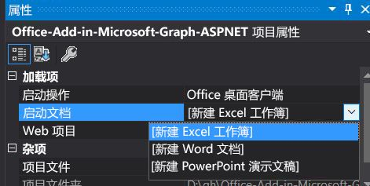

# <a name="create-an-aspnet-office-add-in-that-uses-single-sign-on-preview"></a><span data-ttu-id="52ea2-102">创建使用单一登录的 ASP.NET Office 加载项（预览）</span><span class="sxs-lookup"><span data-stu-id="52ea2-102">Create an ASP.NET Office Add-in that uses single sign-on (preview)</span></span>

<span data-ttu-id="52ea2-103">如果用户已登录 Office，加载项可以使用相同的凭据，这样用户无需重新登录，即可访问多个应用程序。</span><span class="sxs-lookup"><span data-stu-id="52ea2-103">When users are signed in to Office, your add-in can use the same credentials to permit users to access multiple applications without requiring them to sign in a second time.</span></span> <span data-ttu-id="52ea2-104">有关概述，请参阅[在 Office 加载项中启用 SSO](sso-in-office-add-ins.md)。</span><span class="sxs-lookup"><span data-stu-id="52ea2-104">For an overview, see [Enable SSO in an Office Add-in](sso-in-office-add-ins.md).</span></span>
<span data-ttu-id="52ea2-105">本文将逐步介绍如何在使用 Node.js 和 Express 生成的加载项中启用单一登录 (SSO) 。</span><span class="sxs-lookup"><span data-stu-id="52ea2-105">This article walks you through the process of enabling single sign-on (SSO) in an add-in that is built with Node.js and Express.</span></span>

> [!NOTE]
> <span data-ttu-id="52ea2-106">有关基于 ASP.NET 的加载项的类似文章，请参阅[创建使用单一登录的 Node.js Office 加载项](create-sso-office-add-ins-nodejs.md)。</span><span class="sxs-lookup"><span data-stu-id="52ea2-106">For a similar article about an ASP.NET-based add-in, see [Create a Node.js Office Add-in that uses single sign-on](create-sso-office-add-ins-nodejs.md).</span></span>

## <a name="prerequisites"></a><span data-ttu-id="52ea2-107">先决条件</span><span class="sxs-lookup"><span data-stu-id="52ea2-107">Prerequisites</span></span>

* <span data-ttu-id="52ea2-108">Visual Studio 2019 或更高版本。</span><span class="sxs-lookup"><span data-stu-id="52ea2-108">Visual Studio 2019 or later.</span></span>

* [<span data-ttu-id="52ea2-109">Office 开发人员工具</span><span class="sxs-lookup"><span data-stu-id="52ea2-109">Office Developer Tools</span></span>](https://www.visualstudio.com/features/office-tools-vs.aspx)

[!include[additional prerequisites](../includes/sso-tutorial-prereqs.md)]

* <span data-ttu-id="52ea2-110">Office 365 订阅中的 OneDrive for Business 上至少存储了一些文件和文件夹。</span><span class="sxs-lookup"><span data-stu-id="52ea2-110">At least a few files and folders stored on OneDrive for Business in your Office 365 subscription.</span></span>

* <span data-ttu-id="52ea2-111">一个 Microsoft Azure 订阅。</span><span class="sxs-lookup"><span data-stu-id="52ea2-111">A Microsoft Azure subscription.</span></span> <span data-ttu-id="52ea2-112">此加载项需要 Azure Active Directory (AD)。</span><span class="sxs-lookup"><span data-stu-id="52ea2-112">This add-in requires Azure Active Directory (AD).</span></span> <span data-ttu-id="52ea2-113">Azure AD 为应用程序提供了用于进行身份验证和授权的标识服务。</span><span class="sxs-lookup"><span data-stu-id="52ea2-113">Azure AD provides identity services that applications use for authentication and authorization.</span></span> <span data-ttu-id="52ea2-114">你还可在 [Microsoft Azure](https://account.windowsazure.com/SignUp) 获得试用订阅。</span><span class="sxs-lookup"><span data-stu-id="52ea2-114">A trial subscription can be acquired at [Microsoft Azure](https://account.windowsazure.com/SignUp).</span></span>

## <a name="set-up-the-starter-project"></a><span data-ttu-id="52ea2-115">设置初学者项目</span><span class="sxs-lookup"><span data-stu-id="52ea2-115">Set up the starter project</span></span>

<span data-ttu-id="52ea2-116">在 [Office Add-in ASPNET SSO](https://github.com/officedev/office-add-in-aspnet-sso) 处克隆或下载存储库。</span><span class="sxs-lookup"><span data-stu-id="52ea2-116">Clone or download the repo at [Office Add-in ASPNET SSO](https://github.com/officedev/office-add-in-aspnet-sso).</span></span>

> [!NOTE]
> <span data-ttu-id="52ea2-117">示例项目有两个版本：</span><span class="sxs-lookup"><span data-stu-id="52ea2-117">There are two versions of the sample:</span></span>
>
> * <span data-ttu-id="52ea2-p103">**Before** 文件夹是初学者项目。未直接连接到 SSO 或授权的外接程序的 UI 和其他方面已经完成。本文后续章节将引导你完成此过程。</span><span class="sxs-lookup"><span data-stu-id="52ea2-p103">The **Before** folder is a starter project. The UI and other aspects of the add-in that are not directly connected to SSO or authorization are already done. Later sections of this article walk you through the process of completing it.</span></span>
> * <span data-ttu-id="52ea2-121">如果完成了本文中的过程，该示例的**已完成**版本会与所生成的加载项类似，只不过完成的项目具有对本文文本冗余的代码注释。</span><span class="sxs-lookup"><span data-stu-id="52ea2-121">The **Complete** version of the sample is just like the add-in that you would have if you completed the procedures of this article, except that the completed project has code comments that would be redundant with the text of this article.</span></span> <span data-ttu-id="52ea2-122">若要使用已完成的版本，请按照本文中的说明进行操作即可，但需要将“Before”替换为“Complete”，并跳过**编写客户端代码**和**编写服务器端代码**部分。</span><span class="sxs-lookup"><span data-stu-id="52ea2-122">To use the completed version, just follow the instructions in this article, but replace "Before" with "Complete" and skip the sections **Code the client side** and **Code the server side**.</span></span>


## <a name="register-the-add-in-with-azure-ad-v20-endpoint"></a><span data-ttu-id="52ea2-123">向 Azure AD v2.0 终结点注册加载项。</span><span class="sxs-lookup"><span data-stu-id="52ea2-123">Register the add-in with Azure AD v2.0 endpoint</span></span>

1. <span data-ttu-id="52ea2-124">导航到“Azure 门户 - 应用注册”[](https://go.microsoft.com/fwlink/?linkid=2083908)页面以注册你的应用。</span><span class="sxs-lookup"><span data-stu-id="52ea2-124">Navigate to the [Azure portal - App registrations](https://go.microsoft.com/fwlink/?linkid=2083908) page to register your app.</span></span>

1. <span data-ttu-id="52ea2-125">使用***管理员***凭据登录 Office 365 租户。</span><span class="sxs-lookup"><span data-stu-id="52ea2-125">Sign in with the ***admin*** credentials to your Office 365 tenancy.</span></span> <span data-ttu-id="52ea2-126">例如，MyName@contoso.onmicrosoft.com。</span><span class="sxs-lookup"><span data-stu-id="52ea2-126">For example, MyName@contoso.onmicrosoft.com.</span></span>

1. <span data-ttu-id="52ea2-127">选择“新注册”\*\*\*\*。</span><span class="sxs-lookup"><span data-stu-id="52ea2-127">Select **New registration**.</span></span> <span data-ttu-id="52ea2-128">在“注册应用”\*\*\*\* 页上，按如下方式设置值。</span><span class="sxs-lookup"><span data-stu-id="52ea2-128">On the **Register an application** page, set the values as follows.</span></span>

    * <span data-ttu-id="52ea2-129">将“名称”\*\*\*\* 设置为“`Office-Add-in-ASPNET-SSO`”。</span><span class="sxs-lookup"><span data-stu-id="52ea2-129">Set **Name** to `Office-Add-in-ASPNET-SSO`.</span></span>
    * <span data-ttu-id="52ea2-130">将“**受支持的帐户类型**”设置为“**任何组织目录中的帐户和个人 Microsoft 帐户(任何 Azure AD 目录 - 多租户)**”（例如，Skype、Xbox）。</span><span class="sxs-lookup"><span data-stu-id="52ea2-130">Set **Supported account types** to **Accounts in any organizational directory (Any Azure AD directory - Multitenant) and personal Microsoft accounts (e.g. Skype, Xbox)**.</span></span> <span data-ttu-id="52ea2-131">（如果希望加载项仅可供注册该加载项的租户中的用户使用，则可以选择“**仅限此组织目录中的帐户...**”，但需要执行一些额外的设置步骤。</span><span class="sxs-lookup"><span data-stu-id="52ea2-131">(If you want the add-in to be usable only by users in the tenancy where you are registering it, you can choose **Accounts in this organizational directory only ...** instead, but you will need to go through some additional setup steps.</span></span> <span data-ttu-id="52ea2-132">请参阅下面的**单租户设置**。）</span><span class="sxs-lookup"><span data-stu-id="52ea2-132">See **Setup for single-tenant** below.)</span></span>
    * <span data-ttu-id="52ea2-133">在“**重定向 URI**”部分，确保在下拉列表中选择“**Web**”，然后将 URI 设置为 ` https://localhost:44355/AzureADAuth/Authorize`。</span><span class="sxs-lookup"><span data-stu-id="52ea2-133">In the **Redirect URI** section, ensure that **Web** is selected in the drop down and then set the URI to` https://localhost:44355/AzureADAuth/Authorize`.</span></span>
    * <span data-ttu-id="52ea2-134">选择“**注册**”。</span><span class="sxs-lookup"><span data-stu-id="52ea2-134">Choose **Register**.</span></span>

1. <span data-ttu-id="52ea2-135">在 **Office-Add-in-NodeJS-SSO** 页面上，复制并保存“**应用程序（客户端）ID**”和“**目录（租户）ID**”的值。</span><span class="sxs-lookup"><span data-stu-id="52ea2-135">On the **Office-Add-in-NodeJS-SSO** page, copy and save the values for the **Application (client) ID** and the **Directory (tenant) ID**.</span></span> <span data-ttu-id="52ea2-136">你将在后面的过程中使用它们。</span><span class="sxs-lookup"><span data-stu-id="52ea2-136">You'll use both of them in later procedures.</span></span>

    > [!NOTE]
    > <span data-ttu-id="52ea2-137">当其他应用程序（例如 PowerPoint、Word、Excel 等 Office 主机应用程序）寻求对应用程序的授权访问权限时，此 ID 是“受众”值。</span><span class="sxs-lookup"><span data-stu-id="52ea2-137">This ID is the "audience" value when other applications, such as the Office host application (e.g., PowerPoint, Word, Excel), seek authorized access to the application.</span></span> <span data-ttu-id="52ea2-138">当它反过来寻求 Microsoft Graph 的授权访问权限时，它同时也是应用程序的“客户端 ID”。</span><span class="sxs-lookup"><span data-stu-id="52ea2-138">It is also the "client ID" of the application when it, in turn, seeks authorized access to Microsoft Graph.</span></span>

1. <span data-ttu-id="52ea2-139">在“**管理**”下，选择“**证书和密码**”。</span><span class="sxs-lookup"><span data-stu-id="52ea2-139">Under **Manage**, select **Certificates & secrets**.</span></span> <span data-ttu-id="52ea2-140">选择“**新客户端密码**”按钮。</span><span class="sxs-lookup"><span data-stu-id="52ea2-140">Select the **New client secret** button.</span></span> <span data-ttu-id="52ea2-141">输入“**描述**”的值，然后选择适当的“**到期**”选项，并选择“**添加**”。</span><span class="sxs-lookup"><span data-stu-id="52ea2-141">Enter a value for **Description**, then select an appropriate option for **Expires** and choose **Add**.</span></span> <span data-ttu-id="52ea2-142">在继续操作前，*立即复制客户端密码值并使用应用程序 ID 保存它*，因为在后面的过程中，将需要用到它。</span><span class="sxs-lookup"><span data-stu-id="52ea2-142">*Copy the client secret value immediately and save it with the application ID* before proceeding as you'll need it in a later procedure.</span></span>

1. <span data-ttu-id="52ea2-143">在“**管理**”下，选择“**公开 API**”。</span><span class="sxs-lookup"><span data-stu-id="52ea2-143">Under **Manage**, select **Expose an API**.</span></span> <span data-ttu-id="52ea2-144">选择“**设置**”链接以在窗体“api://$App ID GUID$”中生成应用 ID URI，其中 $App ID GUID$ 是**应用程序（客户端）ID**。</span><span class="sxs-lookup"><span data-stu-id="52ea2-144">Select the **Set** link to generate the Application ID URI in the form "api://$App ID GUID$", where $App ID GUID$ is the **Application (client) ID**.</span></span> <span data-ttu-id="52ea2-145">在 `//` 后面和 GUID 前面插入 `localhost:44355/`（请注意结尾附加的正斜杠“/”）。</span><span class="sxs-lookup"><span data-stu-id="52ea2-145">Insert `localhost:44355/` (note the forward slash "/" appended to the end) after the `//` and before the GUID.</span></span> <span data-ttu-id="52ea2-146">整个 ID 的格式应为 `api://localhost:44355/$App ID GUID$`；例如 `api://localhost:44355/c6c1f32b-5e55-4997-881a-753cc1d563b7`。</span><span class="sxs-lookup"><span data-stu-id="52ea2-146">The entire ID should have the form `api://localhost:44355/$App ID GUID$`; for example `api://localhost:44355/c6c1f32b-5e55-4997-881a-753cc1d563b7`.</span></span>

1. <span data-ttu-id="52ea2-147">在对话框中选择“**保存**”。</span><span class="sxs-lookup"><span data-stu-id="52ea2-147">Select **Save** on the dialog.</span></span>

1. <span data-ttu-id="52ea2-148">选择“**添加一个作用域**”按钮。</span><span class="sxs-lookup"><span data-stu-id="52ea2-148">Select the **Add a scope** button.</span></span> <span data-ttu-id="52ea2-149">在打开的面板中，输入 `access_as_user` 作为**作用域**名称。</span><span class="sxs-lookup"><span data-stu-id="52ea2-149">In the panel that opens, enter `access_as_user` as the **Scope** name.</span></span>

1. <span data-ttu-id="52ea2-150">将“谁能同意?”\*\*\*\* 设置为“管理员和用户”\*\*\*\*。</span><span class="sxs-lookup"><span data-stu-id="52ea2-150">Set **Who can consent?** to **Admins and users**.</span></span>

1. <span data-ttu-id="52ea2-151">使用适合 `access_as_user` 作用域的值填写用于配置管理员和用户同意提示的字段，使 Office 主机应用能够借助与当前用户具有相同权限使用加载项 Web API。</span><span class="sxs-lookup"><span data-stu-id="52ea2-151">Fill in the fields for configuring the admin and user consent prompts with values that are appropriate for the `access_as_user` scope which enables the Office host application to use your add-in's web APIs with the same rights as the current user.</span></span> <span data-ttu-id="52ea2-152">建议：</span><span class="sxs-lookup"><span data-stu-id="52ea2-152">Suggestions:</span></span>

    - <span data-ttu-id="52ea2-153">**管理员许可标题**：Office 可以充当用户。</span><span class="sxs-lookup"><span data-stu-id="52ea2-153">**Admin consent title**: Office can act as the user.</span></span>
    - <span data-ttu-id="52ea2-154">**管理员许可描述**：使 Office 能够借助与当前用户相同的权限调用加载项的 Web API。</span><span class="sxs-lookup"><span data-stu-id="52ea2-154">**Admin consent description**: Enable Office to call the add-in's web APIs with the same rights as the current user.</span></span>
    - <span data-ttu-id="52ea2-155">**用户许可标题**：Office 可以充当你。</span><span class="sxs-lookup"><span data-stu-id="52ea2-155">**User consent title**: Office can act as you.</span></span>
    - <span data-ttu-id="52ea2-156">**管理员许可描述**：使 Office 能够借助与你相同的权限调用加载项的 Web API。</span><span class="sxs-lookup"><span data-stu-id="52ea2-156">**Admin consent description**: Enable Office to call the add-in's web APIs with the same rights that you have.</span></span>

1. <span data-ttu-id="52ea2-157">确保将“**状态**”设置为“**已启用**”。</span><span class="sxs-lookup"><span data-stu-id="52ea2-157">Ensure that **State** is set to **Enabled**.</span></span>

1. <span data-ttu-id="52ea2-158">选择“**添加作用域**”。</span><span class="sxs-lookup"><span data-stu-id="52ea2-158">Select **Add scope** .</span></span>

    > [!NOTE]
    > <span data-ttu-id="52ea2-159">显示在文本字段正下方的**作用域**名称的域部分应自动与你先前设置的“应用 ID URI”匹配，并将 `/access_as_user` 附加到末尾；例如，`api://localhost:6789/c6c1f32b-5e55-4997-881a-753cc1d563b7/access_as_user`。</span><span class="sxs-lookup"><span data-stu-id="52ea2-159">The domain part of the **Scope** name displayed just below the text field should automatically match the Application ID URI that you set earlier, with `/access_as_user` appended to the end; for example, `api://localhost:6789/c6c1f32b-5e55-4997-881a-753cc1d563b7/access_as_user`.</span></span>

1. <span data-ttu-id="52ea2-160">在“授权客户端应用程序”\*\*\*\* 部分中，确定要授权给加载项 Web 应用程序的应用程序。</span><span class="sxs-lookup"><span data-stu-id="52ea2-160">In the **Authorized client applications** section, you identify the applications that you want to authorize to your add-in's web application.</span></span> <span data-ttu-id="52ea2-161">下面每个 ID 都需要进行预授权。</span><span class="sxs-lookup"><span data-stu-id="52ea2-161">Each of the following IDs needs to be pre-authorized.</span></span>

    - <span data-ttu-id="52ea2-162">`d3590ed6-52b3-4102-aeff-aad2292ab01c` (Microsoft Office)</span><span class="sxs-lookup"><span data-stu-id="52ea2-162">`d3590ed6-52b3-4102-aeff-aad2292ab01c` (Microsoft Office)</span></span>
    - <span data-ttu-id="52ea2-163">`ea5a67f6-b6f3-4338-b240-c655ddc3cc8e` (Microsoft Office)</span><span class="sxs-lookup"><span data-stu-id="52ea2-163">`ea5a67f6-b6f3-4338-b240-c655ddc3cc8e` (Microsoft Office)</span></span>
    - <span data-ttu-id="52ea2-164">`57fb890c-0dab-4253-a5e0-7188c88b2bb4`（Office 网页版）</span><span class="sxs-lookup"><span data-stu-id="52ea2-164">`57fb890c-0dab-4253-a5e0-7188c88b2bb4` (Office on the web)</span></span>
    - <span data-ttu-id="52ea2-165">`bc59ab01-8403-45c6-8796-ac3ef710b3e3`（Outlook 网页版）</span><span class="sxs-lookup"><span data-stu-id="52ea2-165">`bc59ab01-8403-45c6-8796-ac3ef710b3e3` (Outlook on the web)</span></span>

    <span data-ttu-id="52ea2-166">对于每个 ID，执行以下步骤：</span><span class="sxs-lookup"><span data-stu-id="52ea2-166">For each ID, take these steps:</span></span>

    <span data-ttu-id="52ea2-167">a.</span><span class="sxs-lookup"><span data-stu-id="52ea2-167">a.</span></span> <span data-ttu-id="52ea2-168">选择“**添加客户端应用程序**”按钮，然后在打开的面板中，将“客户端 ID”设置为相应的 GUID 并勾选 `api://localhost:44355/$App ID GUID$/access_as_user` 框。</span><span class="sxs-lookup"><span data-stu-id="52ea2-168">Select **Add a client application** button and then, in the panel that opens, set the Client ID to the respective GUID and check the box for `api://localhost:44355/$App ID GUID$/access_as_user`.</span></span>

    <span data-ttu-id="52ea2-169">b.</span><span class="sxs-lookup"><span data-stu-id="52ea2-169">b.</span></span> <span data-ttu-id="52ea2-170">选择“添加应用程序”\*\*\*\*。</span><span class="sxs-lookup"><span data-stu-id="52ea2-170">Select **Add application**.</span></span>

1. <span data-ttu-id="52ea2-171">在“**管理**”下，选择“**API 权限**”，然后选择“**添加权限**”。</span><span class="sxs-lookup"><span data-stu-id="52ea2-171">Under **Manage**, select **API permissions** and then select **Add a permission**.</span></span> <span data-ttu-id="52ea2-172">在打开的面板上，选择 **Microsoft Graph**，然后选择“委派权限”\*\*\*\*。</span><span class="sxs-lookup"><span data-stu-id="52ea2-172">On the panel that opens, choose **Microsoft Graph** and then choose **Delegated permissions**.</span></span>

1. <span data-ttu-id="52ea2-173">使用“选择权限”\*\*\*\* 搜索框来搜索加载项需要的权限。</span><span class="sxs-lookup"><span data-stu-id="52ea2-173">Use the **Select permissions** search box to search for the permissions your add-in needs.</span></span> <span data-ttu-id="52ea2-174">选择以下选项。</span><span class="sxs-lookup"><span data-stu-id="52ea2-174">Select the following.</span></span> <span data-ttu-id="52ea2-175">外接程序本身真正需要的只是第一项权限，但 Office 主机必须有 `profile` 权限，才能获取访问外接程序 Web 应用程序的令牌。</span><span class="sxs-lookup"><span data-stu-id="52ea2-175">Only the first is really required by your add-in itself; but the `profile` permission is required for the Office host to get a token to your add-in web application.</span></span> <span data-ttu-id="52ea2-176">（该加载项实际上仅需要 Files.Read.All 和 profile。</span><span class="sxs-lookup"><span data-stu-id="52ea2-176">(Only Files.Read.All and profile are actually needed by the add-in.</span></span> <span data-ttu-id="52ea2-177">但必须请求其他两个，因为 MSAL.NET 库需要它们。）</span><span class="sxs-lookup"><span data-stu-id="52ea2-177">You must request the other two because the MSAL.NET library requires them.)</span></span>

    * <span data-ttu-id="52ea2-178">Files.Read.All</span><span class="sxs-lookup"><span data-stu-id="52ea2-178">Files.Read.All</span></span>
    * <span data-ttu-id="52ea2-179">offline_access</span><span class="sxs-lookup"><span data-stu-id="52ea2-179">offline_access</span></span>
    * <span data-ttu-id="52ea2-180">openid</span><span class="sxs-lookup"><span data-stu-id="52ea2-180">openid</span></span>
    * <span data-ttu-id="52ea2-181">profile</span><span class="sxs-lookup"><span data-stu-id="52ea2-181">profile</span></span>

    > [!NOTE]
    > <span data-ttu-id="52ea2-182">`User.Read` 权限可能已默认列出。</span><span class="sxs-lookup"><span data-stu-id="52ea2-182">The `User.Read` permission may already be listed by default.</span></span> <span data-ttu-id="52ea2-183">根据最佳做法，最好不要请求授予不需要的权限，因此，如果加载项实际上不需要此权限，我们建议取消选中此权限对应的框。</span><span class="sxs-lookup"><span data-stu-id="52ea2-183">It is a good practice not to ask for permissions that are not needed, so we recommend that you uncheck the box for this permission if your add-in does not actually need it.</span></span>

1. <span data-ttu-id="52ea2-184">选择所显示的每个权限的复选框。</span><span class="sxs-lookup"><span data-stu-id="52ea2-184">Select the check box for each permission as it appears.</span></span> <span data-ttu-id="52ea2-185">选择加载项需要的权限后，选择面板底部的“**添加权限**”按钮。</span><span class="sxs-lookup"><span data-stu-id="52ea2-185">After selecting the permissions that your add-in needs, select the **Add permissions** button at the bottom of the panel.</span></span>

1. <span data-ttu-id="52ea2-186">在同一页面上，选择“**为[租户名称]授予管理员许可**”按钮，然后在显示的确认中选择“**接受**”。</span><span class="sxs-lookup"><span data-stu-id="52ea2-186">On the same page, choose the **Grant admin consent for [tenant name]** button, and then select **Accept** for the confirmation that appears.</span></span>

    > [!NOTE]
    > <span data-ttu-id="52ea2-187">选择“**为[租户名称]授予管理员许可**后，可能会看到一条横幅消息，要求你在几分钟后再次尝试，以便能够构建许可提示。</span><span class="sxs-lookup"><span data-stu-id="52ea2-187">After choosing **Grant admin consent for [tenant name]**, you may see a banner message asking you to try again in a few minutes so that the consent prompt can be constructed.</span></span> <span data-ttu-id="52ea2-188">如果是这样，你可以开始下一节中的工作，***但不要忘记返回门户，然后按此按钮***！</span><span class="sxs-lookup"><span data-stu-id="52ea2-188">If so, you can start work on the next section, ***but don't forget to come back to the portal and press this button***!</span></span>

## <a name="configure-the-solution"></a><span data-ttu-id="52ea2-189">配置解决方案</span><span class="sxs-lookup"><span data-stu-id="52ea2-189">Configure the solution</span></span>

1. <span data-ttu-id="52ea2-190">在 **Before** 文件夹的根部，打开 **Visual Studio** 中的解决方案 (.sln) 文件。</span><span class="sxs-lookup"><span data-stu-id="52ea2-190">In the root of the **Before** folder, open the solution (.sln) file in **Visual Studio**.</span></span> <span data-ttu-id="52ea2-191">右键单击“**解决方案资源管理器**”最上面的节点（即“解决方案”节点，而非任何项目节点），然后选择“**设置启动项目**”。</span><span class="sxs-lookup"><span data-stu-id="52ea2-191">Right-click the top node in **Solution Explorer** (the Solution node, not either of the project nodes), and then select **Set startup projects**.</span></span>

1. <span data-ttu-id="52ea2-192">在“**通用属性**”下，选择“**启动项目**”，然后选择“**多个启动项目**”。</span><span class="sxs-lookup"><span data-stu-id="52ea2-192">Under **Common Properties**, select **Startup Project**, and then **Multiple startup projects**.</span></span> <span data-ttu-id="52ea2-193">确保两个项目的“**操作**”均设置为“**启动**”，并且以“...WebAPI”结尾的项目排在前面。</span><span class="sxs-lookup"><span data-stu-id="52ea2-193">Ensure that the **Action** for both projects is set to **Start**, and that the project that ends in "...WebAPI" is listed first.</span></span> <span data-ttu-id="52ea2-194">关闭该对话框。</span><span class="sxs-lookup"><span data-stu-id="52ea2-194">Close the dialog.</span></span>

1. <span data-ttu-id="52ea2-195">返回到“**解决方案资源管理器**”中，选择（不要右键单击）“**Office-Add-in-Microsoft-Graph-ASPNETWebAPI**”项目。</span><span class="sxs-lookup"><span data-stu-id="52ea2-195">Back in **Solution Explorer**, select (don't right-click) the **Office-Add-in-Microsoft-Graph-ASPNETWebAPI** project.</span></span> <span data-ttu-id="52ea2-196">随后将打开“**属性**”窗格。</span><span class="sxs-lookup"><span data-stu-id="52ea2-196">The **Properties** pane opens.</span></span> <span data-ttu-id="52ea2-197">确保“**已启用 SSL**”为“**True**”。</span><span class="sxs-lookup"><span data-stu-id="52ea2-197">Ensure that **SSL Enabled** is **True**.</span></span> <span data-ttu-id="52ea2-198">验证“**SSL URL**”是否为 `http://localhost:44355/`。</span><span class="sxs-lookup"><span data-stu-id="52ea2-198">Verify that the **SSL URL** is `http://localhost:44355/`.</span></span>

1. <span data-ttu-id="52ea2-199">在“Web.config”中，使用先前复制的值。</span><span class="sxs-lookup"><span data-stu-id="52ea2-199">In "Web.config", use the values that you copied in earlier.</span></span> <span data-ttu-id="52ea2-200">将“**ida:ClientID**”和“**ida:Audience**”均设置为“**应用程序(客户端) ID**”，并将“**ida:Password**”设置为客户端密码。</span><span class="sxs-lookup"><span data-stu-id="52ea2-200">Set both the **ida:ClientID** and the **ida:Audience** to your **Application (client) ID**, and set **ida:Password** to your client secret.</span></span>

    > [!NOTE]
    > <span data-ttu-id="52ea2-201">当其他应用程序（例如 PowerPoint、Word、Excel 等 Office 主机应用程序）寻求对应用程序的授权访问权限时，“**应用程序(客户端) ID**”是“受众”值。</span><span class="sxs-lookup"><span data-stu-id="52ea2-201">The **Application (client) ID** is the "audience" value when other applications, such as the Office host application (e.g., PowerPoint, Word, Excel), seek authorized access to the application.</span></span> <span data-ttu-id="52ea2-202">当它反过来寻求 Microsoft Graph 的授权访问权限时，它同时也是应用程序的“客户端 ID”。</span><span class="sxs-lookup"><span data-stu-id="52ea2-202">It is also the "client ID" of the application when it, in turn, seeks authorized access to Microsoft Graph.</span></span>

1. <span data-ttu-id="52ea2-203">如果在注册该加载项时，“**受支持的帐户类型**”未选择“仅限此组织目录中的帐户”，请保存并关闭 web.config。否则，请保存，但将其保持打开状态。</span><span class="sxs-lookup"><span data-stu-id="52ea2-203">If you didn't choose "Accounts in this organizational directory only" for **SUPPORTED ACCOUNT TYPES** when you registered the add-in, save and close the web.config. Otherwise, save but leave it open.</span></span>

1. <span data-ttu-id="52ea2-204">仍然在“**解决方案资源管理器**”中，选择“**Office-Add-in-Microsoft-Graph-ASPNET**”项目，打开加载项清单文件“Office-Add-in-ASPNET-SSO.xml”，然后滚动到文件底部。</span><span class="sxs-lookup"><span data-stu-id="52ea2-204">Still in **Solution Explorer**, choose the **Office-Add-in-Microsoft-Graph-ASPNET** project and open the add-in manifest file “Office-Add-in-ASPNET-SSO.xml” and then scroll to the bottom of the file.</span></span> <span data-ttu-id="52ea2-205">在结尾的 `</VersionOverrides>` 标记的正上方有以下标记：</span><span class="sxs-lookup"><span data-stu-id="52ea2-205">Just above the end `</VersionOverrides>` tag, you'll find the following markup:</span></span>

    ```xml
    <WebApplicationInfo>
      <Id>$application_GUID here$</Id>
      <Resource>api://localhost:44355/$application_GUID here$</Resource>
      <Scopes>
          <Scope>Files.Read.All</Scope>
          <Scope>offline_access</Scope>
          <Scope>openid</Scope>
          <Scope>profile</Scope>
      </Scopes>
    </WebApplicationInfo>
    ```

1. <span data-ttu-id="52ea2-206">将标记中的*两处*占位符“$application_GUID here$”均替换为在注册加载项时复制的应用程序 ID。</span><span class="sxs-lookup"><span data-stu-id="52ea2-206">Replace the placeholder “$application_GUID here$” *in both places* in the markup with the Application ID that you copied when you registered your add-in.</span></span> <span data-ttu-id="52ea2-207">由于 ID 并不包含“$”符号，因此请勿添加它们。</span><span class="sxs-lookup"><span data-stu-id="52ea2-207">The "$" signs are not part of the ID, so do not include them.</span></span> <span data-ttu-id="52ea2-208">这与在 web.config 中对 ClientID 和 Audience 所使用的 ID 相同。</span><span class="sxs-lookup"><span data-stu-id="52ea2-208">This is the same ID you used in for the ClientID and Audience in the web.config.</span></span>

  > [!NOTE]
  > <span data-ttu-id="52ea2-209">**资源**值是注册加载项时设置的**应用程序 ID URI**。</span><span class="sxs-lookup"><span data-stu-id="52ea2-209">The **Resource** value is the **Application ID URI** you set when you registered the add-in.</span></span> <span data-ttu-id="52ea2-210">仅在通过 AppSource 销售加载项时，才使用**作用域**部分生成许可对话框。</span><span class="sxs-lookup"><span data-stu-id="52ea2-210">The **Scopes** section is used only to generate a consent dialog box if the add-in is sold through AppSource.</span></span>

1. <span data-ttu-id="52ea2-211">保存并关闭此文件。</span><span class="sxs-lookup"><span data-stu-id="52ea2-211">Save and close the file.</span></span>

### <a name="setup-for-single-tenant"></a><span data-ttu-id="52ea2-212">单租户设置</span><span class="sxs-lookup"><span data-stu-id="52ea2-212">Setup for single-tenant</span></span>

<span data-ttu-id="52ea2-213">如果在注册该加载项时，“**受支持的帐户类型**”选择了“仅限此组织目录中的帐户”，则需要执行以下额外的设置步骤：</span><span class="sxs-lookup"><span data-stu-id="52ea2-213">If you chose "Accounts in this organizational directory only" for **SUPPORTED ACCOUNT TYPES** when you registered the add-in, you need to take these additional setup steps:</span></span>

1. <span data-ttu-id="52ea2-214">返回 Azure 门户，并打开加载项注册界面的“**概述**”边栏选项卡。</span><span class="sxs-lookup"><span data-stu-id="52ea2-214">Go back to the Azure Portal and open the **Overview** blade of the add-in's registration.</span></span> <span data-ttu-id="52ea2-215">复制“**目录(租户) ID**”。</span><span class="sxs-lookup"><span data-stu-id="52ea2-215">Copy the **Directory (tenant) ID**.</span></span>

1. <span data-ttu-id="52ea2-216">在 web.config 中，将“**ida:Authority**”的值中的“common”替换为上一步复制的 GUID。</span><span class="sxs-lookup"><span data-stu-id="52ea2-216">In the web.config, replace the "common" in the value of **ida:Authority** with the GUID you copied in the preceding step.</span></span> <span data-ttu-id="52ea2-217">完成后，值应如下所示：`<add key="ida:Authority" value="https://login.microsoftonline.com/12345678-91ab-cdef-0123-456789abcdef/oauth2/v2.0" />`。</span><span class="sxs-lookup"><span data-stu-id="52ea2-217">When you are finished the value should look similar to this: `<add key="ida:Authority" value="https://login.microsoftonline.com/12345678-91ab-cdef-0123-456789abcdef/oauth2/v2.0" />`.</span></span>

1. <span data-ttu-id="52ea2-218">保存并关闭 web.config。</span><span class="sxs-lookup"><span data-stu-id="52ea2-218">Save and close the web.config.</span></span>

## <a name="code-the-client-side"></a><span data-ttu-id="52ea2-219">编写客户端代码</span><span class="sxs-lookup"><span data-stu-id="52ea2-219">Code the client side</span></span>

1. <span data-ttu-id="52ea2-220">打开 **Scripts** 文件夹中的 HomeES6.js 文件。</span><span class="sxs-lookup"><span data-stu-id="52ea2-220">Open the HomeES6.js file in the **Scripts** folder.</span></span> <span data-ttu-id="52ea2-221">其中已存在一些代码：</span><span class="sxs-lookup"><span data-stu-id="52ea2-221">It already has some code in it:</span></span>

    * <span data-ttu-id="52ea2-222">有一些填充代码用于向全局窗口对象分配 Office.Promise 对象，以便在 Office 为 UI 使用 Internet Explorer 时可运行该加载项。</span><span class="sxs-lookup"><span data-stu-id="52ea2-222">A polyfill that assigns the Office.Promise object to the global window object so that the add-in can run when Office is using Internet Explorer for the UI.</span></span> <span data-ttu-id="52ea2-223">（有关详细信息，请参阅 [Office 加载项使用的浏览器](../concepts/browsers-used-by-office-web-add-ins.md)。）</span><span class="sxs-lookup"><span data-stu-id="52ea2-223">(For more information, see [Browsers used by Office Add-ins](../concepts/browsers-used-by-office-web-add-ins.md).)</span></span>
    * <span data-ttu-id="52ea2-224">针对 `Office.initialize` 方法的分配，反过来又将一个处理程序分配给 `getGraphAccessTokenButton` 按钮的 Click 事件。</span><span class="sxs-lookup"><span data-stu-id="52ea2-224">An assignment to the `Office.initialize` method that, in turn, assigns a handler to the `getGraphAccessTokenButton` button click event.</span></span>
    * <span data-ttu-id="52ea2-225">`showResult` 方法，用于在任务窗格底部显示从 Microsoft Graph 返回的数据（或错误消息）。</span><span class="sxs-lookup"><span data-stu-id="52ea2-225">A `showResult` method that will display data returned from Microsoft Graph (or an error message) at the bottom of the task pane.</span></span>
    * <span data-ttu-id="52ea2-226">`logErrors` 方法，用于记录最终用户不应看到的控制台错误。</span><span class="sxs-lookup"><span data-stu-id="52ea2-226">A `logErrors` method that will log to console errors that are not intended for the end user.</span></span>
    * <span data-ttu-id="52ea2-227">一些代码实现了加载项在 SSO 不受支持或有错误的情况下使用的回退授权系统。</span><span class="sxs-lookup"><span data-stu-id="52ea2-227">Code that implements the fallback authorization system that the add-in will use in scenarios where SSO is not supported or has errored.</span></span>

1. <span data-ttu-id="52ea2-228">在针对 `Office.initialize` 的分配下面，添加下面的代码。</span><span class="sxs-lookup"><span data-stu-id="52ea2-228">Below the assignment to `Office.initialize`, add the code below.</span></span> <span data-ttu-id="52ea2-229">关于此代码，请注意以下几点：</span><span class="sxs-lookup"><span data-stu-id="52ea2-229">Note the following about this code:</span></span>

    * <span data-ttu-id="52ea2-230">加载项中的错误处理有时会自动尝试使用一组不同的选项，重新获取访问令牌。</span><span class="sxs-lookup"><span data-stu-id="52ea2-230">The error-handling in the add-in will sometimes automatically attempt a second time to get an access token, using a different set of options.</span></span> <span data-ttu-id="52ea2-231">计数器变量 `retryGetAccessToken` 用于确保用户不会重复循环失败的尝试来获取令牌。</span><span class="sxs-lookup"><span data-stu-id="52ea2-231">The counter variable `retryGetAccessToken` is used to ensure that the user isn't cycled repeatedly through failed attempts to get a token.</span></span>
    * <span data-ttu-id="52ea2-232">`getGraphData` 函数通过 ES6 `async` 关键字进行定义。</span><span class="sxs-lookup"><span data-stu-id="52ea2-232">The `getGraphData` function is defined with the ES6 `async` keyword.</span></span> <span data-ttu-id="52ea2-233">使用 ES6 语法可以使 Office 加载项中的 SSO API 更易于使用。</span><span class="sxs-lookup"><span data-stu-id="52ea2-233">Using ES6 syntax makes the SSO API in Office Add-ins much easier to to use.</span></span> <span data-ttu-id="52ea2-234">此文件是该解决方案中唯一会使用 Internet Explorer 不支持的语法的文件。</span><span class="sxs-lookup"><span data-stu-id="52ea2-234">This is the only file in the solution that will use syntax that is not supported by Internet Explorer.</span></span> <span data-ttu-id="52ea2-235">我们在文件名中放入“ES6”作为提醒用途。</span><span class="sxs-lookup"><span data-stu-id="52ea2-235">We put 'ES6' in the filename as a reminder.</span></span> <span data-ttu-id="52ea2-236">该解决方案使用 tsc 转译器将此文件转译为 ES5，以便在 Office 为 UI 使用 Internet Explorer 时可运行加载项。</span><span class="sxs-lookup"><span data-stu-id="52ea2-236">The solution uses the tsc transpiler to transpile this file to ES5, so that the add-in can run when Office is using Internet Explorer for the UI.</span></span> <span data-ttu-id="52ea2-237">（请查看项目根目录中的 tsconfig.json 文件。）</span><span class="sxs-lookup"><span data-stu-id="52ea2-237">(See the tsconfig.json file in the root of the project.)</span></span>

    ```javascript
    var retryGetAccessToken = 0;

    async function getGraphData() {
        await getDataWithToken({ allowSignInPrompt: true, forMSGraphAccess: true });
    }
    ```

1. <span data-ttu-id="52ea2-238">在 `getGraphData` 函数下方，添加下列函数。</span><span class="sxs-lookup"><span data-stu-id="52ea2-238">Below the `getGraphData` function add the following function.</span></span> <span data-ttu-id="52ea2-239">请注意，你将在稍后的步骤中创建 `handleClientSideErrors` 函数。</span><span class="sxs-lookup"><span data-stu-id="52ea2-239">Note that you create the `handleClientSideErrors` function in a later step.</span></span>

    ```javascript
    async function getDataWithToken() {
        try {

            // TODO 1: Get the bootstrap token and send it to the server to exchange
            //         for an access token to Microsoft Graphn and then get the data
            //         from Microsoft Graph.

        }
        catch (exception) {
            if (exception.code) {
                handleClientSideErrors(exception);
            }
            else {
                showResult(["EXCEPTION: " + JSON.stringify(exception)]);
            }
        }
    }
    ```

1. <span data-ttu-id="52ea2-240">将 `TODO 1` 替换为以下代码。</span><span class="sxs-lookup"><span data-stu-id="52ea2-240">Replace `TODO 1` with the following.</span></span> <span data-ttu-id="52ea2-241">关于此代码，请注意以下几点：</span><span class="sxs-lookup"><span data-stu-id="52ea2-241">About this code, note:</span></span>

    * <span data-ttu-id="52ea2-242">`getAccessToken` 告知 Office 从 Azure AD 获取启动令牌并返回给加载项。</span><span class="sxs-lookup"><span data-stu-id="52ea2-242">`getAccessToken` tells Office to get a bootstrap token from Azure AD and return to the add-in.</span></span>
    * <span data-ttu-id="52ea2-243">`allowSignInPrompt` 在用户尚未登录 Office 的情况下告知 Office 提示用户进行登录。</span><span class="sxs-lookup"><span data-stu-id="52ea2-243">`allowSignInPrompt` tells Office to prompt the user to sign in if the user isn't already signed into Office.</span></span>
    * <span data-ttu-id="52ea2-244">`forMSGraphAccess` 告知 Office 该加载项打算使用启动令牌来换取 Microsoft Graph 的访问令牌（而不是仅将启动令牌用作用户 ID 令牌）。</span><span class="sxs-lookup"><span data-stu-id="52ea2-244">`forMSGraphAccess` tells Office that the add-in intends to swap the bootstrap token for an access token to Microsoft Graph (instead of just using the bootstrap token as a user ID token).</span></span> <span data-ttu-id="52ea2-245">通过设置此选项，如果用户的租户管理员尚未向加载项授予许可，则 Office 有机会取消获取启动令牌的过程（并返回错误代码 13012）。</span><span class="sxs-lookup"><span data-stu-id="52ea2-245">Setting this option gives Office a chance to cancel the process of getting a bootstrap token (and return error code 13012) if the user's tenant administrator has not granted consent to the add-in.</span></span> <span data-ttu-id="52ea2-246">加载项的客户端代码可以通过分支到回退授权系统来响应 13012。</span><span class="sxs-lookup"><span data-stu-id="52ea2-246">The add-in's client-side code can respond to the 13012 by branching to a fallback authorization system.</span></span> <span data-ttu-id="52ea2-247">如果未使用 `forMSGraphAccess`，并且管理员尚未授予许可，则将返回启动令牌，但尝试将其与代理流交换将会导致错误。</span><span class="sxs-lookup"><span data-stu-id="52ea2-247">If the `forMSGraphAccess` is not used, and the admin has not granted consent, the bootstrap token is returned, but the attempt to exhange it with the on-behalf-of flow would result in an error.</span></span> <span data-ttu-id="52ea2-248">因此，通过 `forMSGraphAccess` 选项可以快速将加载项分支到回退系统。</span><span class="sxs-lookup"><span data-stu-id="52ea2-248">Thus, the `forMSGraphAccess` option enables the add-in to branch to the fallback system quickly.</span></span>
    * <span data-ttu-id="52ea2-249">你将在稍后的步骤中创建 `getData` 函数。</span><span class="sxs-lookup"><span data-stu-id="52ea2-249">You create the `getData` function in a later step.</span></span>
    * <span data-ttu-id="52ea2-250">`/api/values` 参数是服务器端控制器的 URL，它将进行令牌交换并使用它返回的访问令牌来对 Microsoft Graph 执行调用。</span><span class="sxs-lookup"><span data-stu-id="52ea2-250">The `/api/values` parameter is the URL of a server-side controller that will make the token exchange and use the access token it gets back to make the call to Microsoft Graph.</span></span>

    ```javascript
    let bootstrapToken = await OfficeRuntime.auth.getAccessToken({
        allowSignInPrompt: true,
        forMSGraphAccess: true });

    getData("/api/values", bootstrapToken);
    ```

1. <span data-ttu-id="52ea2-251">在 `getGraphData` 函数下方，添加以下内容。</span><span class="sxs-lookup"><span data-stu-id="52ea2-251">Below the `getGraphData` function, add the following.</span></span> <span data-ttu-id="52ea2-252">关于此代码，请注意以下几点：</span><span class="sxs-lookup"><span data-stu-id="52ea2-252">About this code, note:</span></span>

    * <span data-ttu-id="52ea2-253">SSO 和回退授权系统均会使用它。</span><span class="sxs-lookup"><span data-stu-id="52ea2-253">It is used by both the SSO and the fallback authorization systems.</span></span>
    * <span data-ttu-id="52ea2-254">`relativeUrl` 参数是服务器端控制器。</span><span class="sxs-lookup"><span data-stu-id="52ea2-254">The `relativeUrl` parameter is a server-side controller.</span></span>
    * <span data-ttu-id="52ea2-255">`accessToken` 参数可以是启动令牌或完全访问令牌。</span><span class="sxs-lookup"><span data-stu-id="52ea2-255">The `accessToken` parameter can be a bootstrap token or a full access token.</span></span>
    * <span data-ttu-id="52ea2-256">`writeFileNamesToOfficeDocument` 已是项目的一部分。</span><span class="sxs-lookup"><span data-stu-id="52ea2-256">The `writeFileNamesToOfficeDocument` is already part of the project.</span></span>
    * <span data-ttu-id="52ea2-257">你将在稍后的步骤中创建 `handleServerSideErrors` 函数。</span><span class="sxs-lookup"><span data-stu-id="52ea2-257">You create the `handleServerSideErrors` function in a later step.</span></span>

    ```javascript
    function getData(relativeUrl, accessToken) {

        $.ajax({
            url: relativeUrl,
            headers: { "Authorization": "Bearer " + accessToken },
            type: "GET"
        })
            .done(function (result) {
                writeFileNamesToOfficeDocument(result)
                    .then(function () {
                        showResult(["Your data has been added to the document."]);
                    })
                    .catch(function (error) {
                        showResult([JSON.stringify(error)]);
                    });
            })
            .fail(function (result) {
                handleServerSideErrors(result);
            });
    }
    ```

### <a name="handle-client-side-errors"></a><span data-ttu-id="52ea2-258">处理客户端错误</span><span class="sxs-lookup"><span data-stu-id="52ea2-258">Handle client-side errors</span></span>

1. <span data-ttu-id="52ea2-259">在 `getData` 函数下方，添加下列函数。</span><span class="sxs-lookup"><span data-stu-id="52ea2-259">Below the `getData` function, add the following function.</span></span> <span data-ttu-id="52ea2-260">请注意，`error.code` 是一个数字，通常处于 13xxx 范围内。</span><span class="sxs-lookup"><span data-stu-id="52ea2-260">Note that `error.code` is a number, usually in the range 13xxx.</span></span>

    ```javascript
    function handleClientSideErrors(error) {
        switch (error.code) {

            // TODO 2: Handle errors where the add-in should NOT invoke
            //         the alternative system of authorization.

            // TODO 3: Handle errors where the add-in should invoke
            //         the alternative system of authorization.

        }
    }
    ```

1. <span data-ttu-id="52ea2-261">将 `TODO 2` 替换为下面的代码。</span><span class="sxs-lookup"><span data-stu-id="52ea2-261">Replace `TODO 2` with the following code.</span></span> <span data-ttu-id="52ea2-262">有关这些错误的详细信息，请参阅[对 Office 加载项中的 SSO 进行故障排除](troubleshoot-sso-in-office-add-ins.md)。</span><span class="sxs-lookup"><span data-stu-id="52ea2-262">For more information about these errors, see [Troubleshoot SSO in Office Add-ins](troubleshoot-sso-in-office-add-ins.md).</span></span>

    ```javascript
    case 13001:
        // No one is signed into Office. If the add-in cannot be effectively used when no one
        // is logged into Office, then the first call of getAccessToken should pass the
        // `allowSignInPrompt: true` option.
        showResult(["No one is signed into Office. But you can use many of the add-ins functions anyway. If you want to log in, press the Get OneDrive File Names button again."]);
        break;
    case 13002:
        // The user aborted the consent prompt. If the add-in cannot be effectively used when consent
        // has not been granted, then the first call of getAccessToken should pass the `allowConsentPrompt: true` option.
        showResult(["You can use many of the add-ins functions even though you have not granted consent. If you want to grant consent, press the Get OneDrive File Names button again."]);
        break;
    case 13006:
        // Only seen in Office on the Web.
        showResult(["Office on the Web is experiencing a problem. Please sign out of Office, close the browser, and then start again."]);
        break;
    case 13008:
        // Only seen in Office on the Web.
        showResult(["Office is still working on the last operation. When it completes, try this operation again."]);
        break;
    case 13010:
        // Only seen in Office on the Web.
        showResult(["Follow the instructions to change your browser's zone configuration."]);
        break;
    ```

1. <span data-ttu-id="52ea2-263">将 `TODO 3` 替换为下面的代码。</span><span class="sxs-lookup"><span data-stu-id="52ea2-263">Replace `TODO 3` with the following code.</span></span> <span data-ttu-id="52ea2-264">对于所有其他错误，加载项会分支到回退授权系统。</span><span class="sxs-lookup"><span data-stu-id="52ea2-264">For all other errors, the add-in branches to the fallback authorization system.</span></span> <span data-ttu-id="52ea2-265">有关这些错误的详细信息，请参阅[对 Office 加载项中的 SSO 进行故障排除](troubleshoot-sso-in-office-add-ins.md)。在此加载项中，回退系统将打开一个对话框，它要求用户登录（即使用户已登录），并使用 msal.js 和隐式流来获取 Microsoft Graph 访问令牌。</span><span class="sxs-lookup"><span data-stu-id="52ea2-265">For more information about these errors, see [Troubleshoot SSO in Office Add-ins](troubleshoot-sso-in-office-add-ins.md). In this add-in, the fallback system opens a dialog which requires the user to sign in, even if the user already is, and uses msal.js and the Implicit Flow to get an access token to Microsoft Graph.</span></span>

    ```javascript
    default:
        dialogFallback();
        break;
    ```

### <a name="handle-server-side-errors"></a><span data-ttu-id="52ea2-266">处理服务器端错误</span><span class="sxs-lookup"><span data-stu-id="52ea2-266">Handle server-side errors</span></span>

1. <span data-ttu-id="52ea2-267">在 `handleClientSideErrors` 函数下方，添加下列函数。</span><span class="sxs-lookup"><span data-stu-id="52ea2-267">Below the `handleClientSideErrors` function, add the following function.</span></span>

    ```javascript
    function handleServerSideErrors(result) {

    // TODO 4: Parse the JSON response.

    // TODO 5: Handle case where Microsoft Graph requires an additional form
    //         of authentication.

    // TODO 6: Handle other Azure AD errors

    }
    ```

1. <span data-ttu-id="52ea2-268">将 `TODO 4` 替换为以下代码。</span><span class="sxs-lookup"><span data-stu-id="52ea2-268">Replace `TODO 4` with the following.</span></span> <span data-ttu-id="52ea2-269">关于此代码，请注意，ASP.NET 错误类是在有类似于 MFA 的功能之前创建的。</span><span class="sxs-lookup"><span data-stu-id="52ea2-269">About this code, note that ASP.NET error classes were created before there was such a thing as MFA.</span></span> <span data-ttu-id="52ea2-270">服务器端逻辑处理针对第二种身份验证因素的请求时有一个副作用，即发送到客户端的服务器端错误有 **Message** 属性，但没有 **ExceptionMessage** 属性。</span><span class="sxs-lookup"><span data-stu-id="52ea2-270">As a side-effect of how our server-side logic handles the requests for a second authentication factor, the server-side error sent to the client has a **Message** property but no **ExceptionMessage** property.</span></span> <span data-ttu-id="52ea2-271">但是，所有其他错误都有 **ExceptionMessage** 属性，因此客户端代码必须分析这两者的响应。</span><span class="sxs-lookup"><span data-stu-id="52ea2-271">But all other errors will have a **ExceptionMessage** property, so the client-side code has to parse the response for both.</span></span> <span data-ttu-id="52ea2-272">一个或另一个变量将是未定义的。</span><span class="sxs-lookup"><span data-stu-id="52ea2-272">Either one or the other variable will be undefined.</span></span>

    ```javascript
    var message = JSON.parse(result.responseText).Message;
    var exceptionMessage = JSON.parse(result.responseText).ExceptionMessage;
    ```

1. <span data-ttu-id="52ea2-273">将 `TODO 5` 替换为以下代码。</span><span class="sxs-lookup"><span data-stu-id="52ea2-273">Replace `TODO 5` with the following.</span></span> <span data-ttu-id="52ea2-274">Microsoft Graph 要求进行其他形式的身份验证时，将发送错误 AADSTS50076。</span><span class="sxs-lookup"><span data-stu-id="52ea2-274">When Microsoft Graph requires an additional form of authentication, it sends error AADSTS50076.</span></span> <span data-ttu-id="52ea2-275">其中包括 **Message.Claims** 属性中的附加要求的相关信息。</span><span class="sxs-lookup"><span data-stu-id="52ea2-275">It includes information about the additional requirement in the **Message.Claims** property.</span></span> <span data-ttu-id="52ea2-276">为处理这种情况，该代码会再次尝试获取启动令牌，但这一次还包括请求额外的因素作为 `authChallenge` 选项的值，这会告诉 Azure AD 提示用户输入所有必需的身份验证形式。</span><span class="sxs-lookup"><span data-stu-id="52ea2-276">To handle this, the code makes a second attempt to get the bootstrap token, but this time it includes the request for an additional factor as the value of the `authChallenge` option, which tells Azure AD to prompt the user for all required forms of authentication.</span></span>

    ```javascript
    if (message) {
        if (message.indexOf("AADSTS50076") !== -1) {
            var claims = JSON.parse(message).Claims;
            var claimsAsString = JSON.stringify(claims);
            getDataWithToken({ authChallenge: claimsAsString });
            return;
        }
    }
    ```

1. <span data-ttu-id="52ea2-277">将 `TODO 6` 替换为以下代码。</span><span class="sxs-lookup"><span data-stu-id="52ea2-277">Replace `TODO 6` with the following.</span></span>

    ```javascript
    if (exceptionMessage) {

        // TODO 7: Handle case where bootstrap token has expired.

        // TODO 8: Handle all other Azure AD errors.
    }
    ```

1. <span data-ttu-id="52ea2-278">将 `TODO 7` 替换为以下代码。</span><span class="sxs-lookup"><span data-stu-id="52ea2-278">Replace `TODO 7` with the following.</span></span> <span data-ttu-id="52ea2-279">请注意，在极少数情况下，启动令牌在由 Office 验证时未过期，但是会在发动到 Azure AD 进行交换时过期。</span><span class="sxs-lookup"><span data-stu-id="52ea2-279">Note that on rare occasions the bootstrap token is unexpired when Office validates it, but expires by the time it is sent to Azure AD for exchange.</span></span> <span data-ttu-id="52ea2-280">Azure AD 将以错误 AADSTS500133 做出响应。</span><span class="sxs-lookup"><span data-stu-id="52ea2-280">Azure AD will respond with error AADSTS500133.</span></span> <span data-ttu-id="52ea2-281">发生这种情况时，代码会回调 SSO API（但不超过一次）。</span><span class="sxs-lookup"><span data-stu-id="52ea2-281">When this happens, the code  recalls the SSO API (but no more than once).</span></span> <span data-ttu-id="52ea2-282">这次，Office 将返回新的未过期的启动令牌。</span><span class="sxs-lookup"><span data-stu-id="52ea2-282">This time Office returns a new unexpired bootstrap token.</span></span>

    ```javascript
    if ((exceptionMessage.indexOf("AADSTS500133") !== -1)
        && (retryGetAccessToken <= 0)) {

        retryGetAccessToken++;
        getGraphData();
    }
    ```

1. <span data-ttu-id="52ea2-283">将 `TODO 8` 替换为以下代码。</span><span class="sxs-lookup"><span data-stu-id="52ea2-283">Replace `TODO 8` with the following.</span></span>

    ```javascript
    else {
        dialogFallback();
    }
    ```

1. <span data-ttu-id="52ea2-284">保存文件。</span><span class="sxs-lookup"><span data-stu-id="52ea2-284">Save the file.</span></span>

## <a name="code-the-server-side"></a><span data-ttu-id="52ea2-285">编写服务器端代码</span><span class="sxs-lookup"><span data-stu-id="52ea2-285">Code the server side</span></span>

### <a name="configure-the-owin-middleware"></a><span data-ttu-id="52ea2-286">配置 OWIN 中间件</span><span class="sxs-lookup"><span data-stu-id="52ea2-286">Configure the OWIN middleware</span></span>

1. <span data-ttu-id="52ea2-287">在 **Office-Add-in-ASPNET-SSO-WebAPI** 项目的根目录中打开 Startup.cs 文件，并将以下方法添加到 **Startup** 类。</span><span class="sxs-lookup"><span data-stu-id="52ea2-287">Open the Startup.cs file in the root of the **Office-Add-in-ASPNET-SSO-WebAPI** project and add the following method to the **Startup** class.</span></span> <span data-ttu-id="52ea2-288">请注意，你将在稍后的步骤中创建 `ConfigureAuth` 方法。</span><span class="sxs-lookup"><span data-stu-id="52ea2-288">Note that you create the `ConfigureAuth` method in a later step.</span></span>

    ```csharp
    public void Configuration(IAppBuilder app)
    {
        ConfigureAuth(app);
    }
    ```

1. <span data-ttu-id="52ea2-289">保存并关闭此文件。</span><span class="sxs-lookup"><span data-stu-id="52ea2-289">Save and close the file.</span></span>

1. <span data-ttu-id="52ea2-290">右键单击“App_Start”\*\*\*\* 文件夹，并依次选择“添加”>“类”\*\*\*\*。</span><span class="sxs-lookup"><span data-stu-id="52ea2-290">Right-click the **App_Start** folder and select **Add > Class**.</span></span>

1. <span data-ttu-id="52ea2-291">在“添加新项”\*\*\*\* 对话框中，命名文件“Startup.Auth.cs”\*\*\*\*，再单击“添加”\*\*\*\*。</span><span class="sxs-lookup"><span data-stu-id="52ea2-291">In the **Add new item** dialog name the file **Startup.Auth.cs** and then click **Add**.</span></span>

1. <span data-ttu-id="52ea2-292">将新文件中的命名空间名称缩短为 `Office_Add_in_ASPNET_SSO_WebAPI`。</span><span class="sxs-lookup"><span data-stu-id="52ea2-292">Shorten the namespace name in the new file to `Office_Add_in_ASPNET_SSO_WebAPI`.</span></span>

1. <span data-ttu-id="52ea2-293">确保下列所有 `using` 语句都位于文件的顶部。</span><span class="sxs-lookup"><span data-stu-id="52ea2-293">Ensure that all of the following `using` statements are at the top of the file.</span></span>

    ```csharp
    using Owin;
    using Microsoft.IdentityModel.Tokens;
    using System.Configuration;
    using Microsoft.Owin.Security.OAuth;
    using Microsoft.Owin.Security.Jwt;
    using Office_Add_in_ASPNET_SSO_WebAPI.App_Start;
    ```

1. <span data-ttu-id="52ea2-p148">将关键字 `partial` 添加到 `Startup` 类（如果其中尚不存在该关键字）的声明。具体应如下所示：</span><span class="sxs-lookup"><span data-stu-id="52ea2-p148">Add the keyword `partial` to the declaration of the `Startup` class, if it is not already there. It should look like this:</span></span>

    `public partial class Startup`

1. <span data-ttu-id="52ea2-p149">将下列方法添加到 `Startup` 类。该方法指定 OWIN 中间件如何验证从客户端 Home.js 文件的 `getData` 方法传递给它的访问令牌。每次调用使用 `[Authorize]` 属性修饰的 Web API 终结点时都会触发授权过程。</span><span class="sxs-lookup"><span data-stu-id="52ea2-p149">Add the following method to the `Startup` class. This method specifies how the OWIN middleware will validate the access tokens that are passed to it from the `getData` method in the client-side Home.js file. The authorization process is triggered whenever a Web API endpoint that is decorated with the `[Authorize]` attribute is called.</span></span>

    ```csharp
    public void ConfigureAuth(IAppBuilder app)
    {
        // TODO 1: Configure the validation settings

        // TODO 2: Specify the type of authorization and the discovery endpoint
        //        of the secure token service.
    }
    ```

1. <span data-ttu-id="52ea2-299">将 `TODO 1` 替换为以下代码。</span><span class="sxs-lookup"><span data-stu-id="52ea2-299">Replace the `TODO 1` with the following.</span></span> <span data-ttu-id="52ea2-300">关于此代码，请注意以下几点：</span><span class="sxs-lookup"><span data-stu-id="52ea2-300">Note about this code:</span></span>

    * <span data-ttu-id="52ea2-301">此代码指示 OWIN 确保在来自 Office 主机的启动令牌中指定的受众必须与 web.config 中指定的值相匹配。</span><span class="sxs-lookup"><span data-stu-id="52ea2-301">The code instructs OWIN to ensure that the audience specified in the bootstrap token that comes from the Office host must match the value specified in the web.config.</span></span>
    * <span data-ttu-id="52ea2-302">Microsoft 帐户具有与任何组织租户 GUID 均不相同的颁发者 GUID，因此为了支持这两种类型的帐户，我们不会验证颁发者。</span><span class="sxs-lookup"><span data-stu-id="52ea2-302">Microsoft Accounts have an issuer GUID that is different from any organizational tenant GUID, so to support both kinds of accounts, we do not validate the issuer.</span></span>
    * <span data-ttu-id="52ea2-303">将 `SaveSigninToken` 设置为 `true` 将导致 OWIN 保存来自 Office 主机的原始启动令牌。</span><span class="sxs-lookup"><span data-stu-id="52ea2-303">Setting `SaveSigninToken` to `true` causes OWIN to save the raw bootstrap token from the Office host.</span></span> <span data-ttu-id="52ea2-304">加载项需要该令牌来获取具有代理流的 Microsoft Graph 访问令牌。</span><span class="sxs-lookup"><span data-stu-id="52ea2-304">The add-in needs it to obtain an access token to Microsoft Graph with the on-behalf-of flow.</span></span>
    * <span data-ttu-id="52ea2-305">OWIN 中间件不验证作用域。</span><span class="sxs-lookup"><span data-stu-id="52ea2-305">Scopes are not validated by the OWIN middleware.</span></span> <span data-ttu-id="52ea2-306">启动令牌作用域应包括 `access_as_user`，在控制器中加以验证。</span><span class="sxs-lookup"><span data-stu-id="52ea2-306">The scopes of the bootstrap token, which should include `access_as_user`, is validated in the controller.</span></span>

    ```csharp
    TokenValidationParameters tvps = new TokenValidationParameters
    {
        ValidAudience = ConfigurationManager.AppSettings["ida:Audience"],
        ValidateIssuer = false,
        SaveSigninToken = true
    };
    ```

1. <span data-ttu-id="52ea2-307">将 `TODO 2` 替换为以下代码。</span><span class="sxs-lookup"><span data-stu-id="52ea2-307">Replace `TODO 2` with the following.</span></span> <span data-ttu-id="52ea2-308">关于此代码，请注意以下几点：</span><span class="sxs-lookup"><span data-stu-id="52ea2-308">Note about this code:</span></span>

    * <span data-ttu-id="52ea2-309">调用的是方法 `UseOAuthBearerAuthentication`，而不是更常见的 `UseWindowsAzureActiveDirectoryBearerAuthentication`，因为后者与 Azure AD V2 终结点不兼容。</span><span class="sxs-lookup"><span data-stu-id="52ea2-309">The method `UseOAuthBearerAuthentication` is called instead of the more common `UseWindowsAzureActiveDirectoryBearerAuthentication` because the latter is not compatible with the Azure AD V2 endpoint.</span></span>
    * <span data-ttu-id="52ea2-310">从传递给该方法的 URL 中，OWIN 中间件可以获得关于获取所需密钥（用于验证从 Office 主机接收到的启动令牌上的签名）的说明。</span><span class="sxs-lookup"><span data-stu-id="52ea2-310">The URL that is passed to the method is where the OWIN middleware obtains instructions for getting the key it needs to verify the signature on the bootstrap token received from the Office host.</span></span> <span data-ttu-id="52ea2-311">此 URL 的 Authority 区段来自 web.config。它可能是“common”字符串，而对于单租户加载项，则是一个 GUID。</span><span class="sxs-lookup"><span data-stu-id="52ea2-311">The Authority segment of the URL comes from the web.config. It is either the string "common" or, for a single-tenant add-in, a GUID.</span></span>

    ```csharp
    string[] endAuthoritySegments = { "oauth2/v2.0" };
    string[] parsedAuthority = ConfigurationManager.AppSettings["ida:Authority"].Split(endAuthoritySegments, System.StringSplitOptions.None);
    string wellKnownURL = parsedAuthority[0] + "v2.0/.well-known/openid-configuration";

    app.UseOAuthBearerAuthentication(new OAuthBearerAuthenticationOptions
    {
        AccessTokenFormat = new JwtFormat(tvps, new OpenIdConnectCachingSecurityTokenProvider(wellKnownURL))
    });
    ```

1. <span data-ttu-id="52ea2-312">保存并关闭此文件。</span><span class="sxs-lookup"><span data-stu-id="52ea2-312">Save and close the file.</span></span>

### <a name="create-the-apivalues-controller"></a><span data-ttu-id="52ea2-313">创建 /api/values 控制器</span><span class="sxs-lookup"><span data-stu-id="52ea2-313">Create the /api/values controller</span></span>

1. <span data-ttu-id="52ea2-314">打开文件 **Controllers\ValueController.cs**。</span><span class="sxs-lookup"><span data-stu-id="52ea2-314">Open the file **Controllers\ValueController.cs**.</span></span> <span data-ttu-id="52ea2-315">SSO 系统成功获得启动令牌后，将使用此控制器。</span><span class="sxs-lookup"><span data-stu-id="52ea2-315">This controller is used when the SSO system has successfully obtained a bootstrap token.</span></span> <span data-ttu-id="52ea2-316">此控制器不用作回退授权系统的一部分。</span><span class="sxs-lookup"><span data-stu-id="52ea2-316">It is not used as part of the fallback authorization system.</span></span> <span data-ttu-id="52ea2-317">该系统使用的是已为你创建的 AzureADAuthController。</span><span class="sxs-lookup"><span data-stu-id="52ea2-317">That system used the AzureADAuthController, which has been created for you.</span></span>

1. <span data-ttu-id="52ea2-318">请确保下列 `using` 语句位于文件顶部。</span><span class="sxs-lookup"><span data-stu-id="52ea2-318">Ensure that the following `using` statements are at the top of the file.</span></span>

    ```csharp
    using Microsoft.Identity.Client;
    using System.Configuration;
    using System.Linq;
    using System.Security.Claims;
    using System.Threading.Tasks;
    using System.Web.Http;
    using System;
    using System.Net;
    using System.Net.Http;
    using Office_Add_in_ASPNET_SSO_WebAPI.Helpers;
    ```

1. <span data-ttu-id="52ea2-p156">在声明 `ValuesController` 的代码行的正上方，添加属性 `[Authorize]`。这可确保只要调用控制器方法时，加载项就会运行在上一过程中配置的授权过程。只有拥有对加载项的有效访问令牌，调用方才能调用控制器的方法。</span><span class="sxs-lookup"><span data-stu-id="52ea2-p156">Just above the line that declares the `ValuesController`, add the `[Authorize]` attribute. This ensures that your add-in will run the authorization process that you configured in the last procedure whenever a controller method is called. Only callers with a valid access token to your add-in can invoke the methods of the controller.</span></span>

1. <span data-ttu-id="52ea2-322">将下列方法添加到 `ValuesController`。</span><span class="sxs-lookup"><span data-stu-id="52ea2-322">Add the following method to the `ValuesController`.</span></span> <span data-ttu-id="52ea2-323">请注意，返回值是 `Task<HttpResponseMessage>`（而不是 `Task<IEnumerable<string>>`），这对于 `GET api/values` 方法而言更为常见。</span><span class="sxs-lookup"><span data-stu-id="52ea2-323">Note that the return value is `Task<HttpResponseMessage>` instead of `Task<IEnumerable<string>>` as would be more common for a `GET api/values` method.</span></span> <span data-ttu-id="52ea2-324">由于 OAuth 授权逻辑必须在控制器中，而不是 ASP.NET 筛选器中，所以这是一种副作用。</span><span class="sxs-lookup"><span data-stu-id="52ea2-324">This is a side effect of that fact that the OAuth  authorization logic must be in the controller, instead of in an ASP.NET filter.</span></span> <span data-ttu-id="52ea2-325">该逻辑中的一些错误条件要求将 HTTP 响应对象发送到加载项的客户端。</span><span class="sxs-lookup"><span data-stu-id="52ea2-325">Some error conditions in that logic require that an HTTP Response object be sent to the add-in's client.</span></span>

    ```csharp
    // GET api/values
    public async Task<HttpResponseMessage> Get()
    {
        // TODO 1: Validate the scopes of the bootstrap token.

        // TODO 2: Assemble all the information that is needed to get a
        //        token for Microsoft Graph using the on-behalf-of flow.

        // TODO 3: Get the access token for Microsoft Graph.

        // TODO 4: Use the token to call Microsoft Graph.
    }
    ```

1. <span data-ttu-id="52ea2-326">将 `TODO1` 替换为以下代码，以验证令牌中指定的作用域是否包括 `access_as_user`。</span><span class="sxs-lookup"><span data-stu-id="52ea2-326">Replace `TODO1` with the following code to validate that the scopes that are specified in the token include `access_as_user`.</span></span> <span data-ttu-id="52ea2-327">请注意，`SendErrorToClient` 方法的第二个参数是 **Exception** 对象。</span><span class="sxs-lookup"><span data-stu-id="52ea2-327">Note that the second parameter of the `SendErrorToClient` method is an **Exception** object.</span></span> <span data-ttu-id="52ea2-328">在此示例中，代码传递 `null`，因为添加 **Exception** 对象会阻止在生成的 HTTP Response 中添加 **Message** 属性。</span><span class="sxs-lookup"><span data-stu-id="52ea2-328">In this case, the code passes `null` because including the **Exception** object blocks the inclusion of the **Message** property in the HTTP Response that is generated.</span></span>


    ```csharp
    string[] addinScopes = ClaimsPrincipal.Current.FindFirst("http://schemas.microsoft.com/identity/claims/scope").Value.Split(' ');
    if (!(addinScopes.Contains("access_as_user")))
    {
        return HttpErrorHelper.SendErrorToClient(HttpStatusCode.Unauthorized, null, "Missing access_as_user.");
    }
    ```

1. <span data-ttu-id="52ea2-329">将 `TODO 2` 替换为以下代码，以便整合在使用代理流来获取 Microsoft Graph 的令牌时所需的所有信息。</span><span class="sxs-lookup"><span data-stu-id="52ea2-329">Replace `TODO 2` with the following code to assemble all the information that is needed to get a token for Microsoft Graph using the "on behalf of" flow.</span></span> <span data-ttu-id="52ea2-330">关于此代码，请注意以下几点：</span><span class="sxs-lookup"><span data-stu-id="52ea2-330">About this code, note:</span></span>

    * <span data-ttu-id="52ea2-p160">外接程序不再扮演 Office 主机和用户需要访问的资源（或受众）的角色。现在它本身就是一个需要访问 Microsoft Graph 的客户端。`ConfidentialClientApplication` 是 MSAL“客户端上下文”对象。</span><span class="sxs-lookup"><span data-stu-id="52ea2-p160">Your add-in is no longer playing the role of a resource (or audience) to which the Office host and user need access. Now it is itself a client that needs access to Microsoft Graph. `ConfidentialClientApplication` is the MSAL “client context” object.</span></span>
    * <span data-ttu-id="52ea2-334">从 MSAL.NET 3.x.x 开始，`bootstrapContext` 仅仅是启动令牌本身。</span><span class="sxs-lookup"><span data-stu-id="52ea2-334">Beginning with MSAL.NET 3.x.x, the `bootstrapContext` is just the bootstrap token itself.</span></span>
    * <span data-ttu-id="52ea2-335">Authority 来自 web.config。它可能是“common”字符串，而对于单租户加载项，则是一个 GUID。</span><span class="sxs-lookup"><span data-stu-id="52ea2-335">The Authority comes from the web.config. It is either the string "common" or, for a single-tenant add-in, a GUID.</span></span>
    * <span data-ttu-id="52ea2-p161">MSAL 要求 `openid`、`offline_access` 作用域能够发挥作用，但如果代码过多地发出请求，则会抛出错误。 如果代码请求获取 `profile`，也会抛出错误，这真正仅适用于 Office 主机应用程序获取对加载项 Web 应用程序的令牌时。 因此，只会显式请求获取 `Files.Read.All`。</span><span class="sxs-lookup"><span data-stu-id="52ea2-p161">MSAL requires the `openid` and `offline_access` scopes to function, but it throws an error if your code redundantly requests them. It will also throw an error if your code requests `profile`, which is really only used when the Office host application gets the token to your add-in's web application. So only `Files.Read.All` is explicitly requested.</span></span>

    ```csharp
    string bootstrapContext = ClaimsPrincipal.Current.Identities.First().BootstrapContext.ToString();
    UserAssertion userAssertion = new UserAssertion(bootstrapContext);

    var cca = ConfidentialClientApplicationBuilder.Create(ConfigurationManager.AppSettings["ida:ClientID"])
                                                    .WithRedirectUri("https://localhost:44355")
                                                    .WithClientSecret(ConfigurationManager.AppSettings["ida:Password"])
                                                    .WithAuthority(ConfigurationManager.AppSettings["ida:Authority"])
                                                    .Build();

    string[] graphScopes = { "https://graph.microsoft.com/Files.Read.All" };
    ```

1. <span data-ttu-id="52ea2-p162">将 `TODO 3` 替换为下列代码。关于此代码，请注意以下几点：</span><span class="sxs-lookup"><span data-stu-id="52ea2-p162">Replace `TODO 3` with the following code. Note about this code:</span></span>

    * <span data-ttu-id="52ea2-341">`ConfidentialClientApplication.AcquireTokenOnBehalfOfAsync` 方法将首先查找内存中的 MSAL 缓存，获取匹配的访问令牌。</span><span class="sxs-lookup"><span data-stu-id="52ea2-341">The `ConfidentialClientApplication.AcquireTokenOnBehalfOfAsync` method will first look in the MSAL cache, which is in memory, for a matching access token.</span></span> <span data-ttu-id="52ea2-342">仅当不存在任何令牌时，该方法才会通过 Azure AD V2 终结点启动代理流。</span><span class="sxs-lookup"><span data-stu-id="52ea2-342">Only if there isn't one, does it initiate the on-behalf-of flow with the Azure AD V2 endpoint.</span></span>
    * <span data-ttu-id="52ea2-343">任何不属于类型 `MsalServiceException` 的异常都是有意不捕获的，这样才能作为 `500 Server Error` 消息传播到客户端。</span><span class="sxs-lookup"><span data-stu-id="52ea2-343">Any exceptions that are not of type `MsalServiceException` are intentionally not caught, so they will propagate to the client as `500 Server Error` messages.</span></span>

    ```csharp
    AcquireTokenOnBehalfOfParameterBuilder parameterBuilder = null;
    AuthenticationResult authResult = null;
    try
    {
        parameterBuilder = cca.AcquireTokenOnBehalfOf(graphScopes, userAssertion);
        authResult = await parameterBuilder.ExecuteAsync();
    }
    catch (MsalServiceException e)
    {
        // TODO 3a: Handle request for multi-factor authentication.

        // TODO 3b: Handle lack of consent and invalid scope (permission).

        // TODO 3c: Handle all other MsalServiceExceptions.
    }
    ```

1. <span data-ttu-id="52ea2-344">将 `TODO 3a` 替换为下面的代码。</span><span class="sxs-lookup"><span data-stu-id="52ea2-344">Replace `TODO 3a` with the following code.</span></span> <span data-ttu-id="52ea2-345">关于此代码，请注意以下几点：</span><span class="sxs-lookup"><span data-stu-id="52ea2-345">About this code, note:</span></span>

    * <span data-ttu-id="52ea2-346">如果 Microsoft Graph 资源要求进行多重身份验证，但用户尚未提供，则 Azure AD 会返回“400 错误请求”以及错误 `AADSTS50076` 和 **Claims** 属性。</span><span class="sxs-lookup"><span data-stu-id="52ea2-346">If multi-factor authentication is required by the Microsoft Graph resource and the user has not yet provided it, Azure AD will return "400 Bad Request" with error `AADSTS50076` and a **Claims** property.</span></span> <span data-ttu-id="52ea2-347">MSAL 抛出包含此信息的 **MsalUiRequiredException**（继承自 **MsalServiceException**）。</span><span class="sxs-lookup"><span data-stu-id="52ea2-347">MSAL throws a **MsalUiRequiredException** (which inherits from **MsalServiceException**) with this information.</span></span>
    * <span data-ttu-id="52ea2-348">必须将 **Claims** 属性值传递到客户端，接着客户端应将它传递到 Office 主机，然后主机会将它添加到新启动令牌的请求中。</span><span class="sxs-lookup"><span data-stu-id="52ea2-348">The **Claims** property value must be passed to the client which should pass it to the Office host, which then includes it in a request for a new bootstrap token.</span></span> <span data-ttu-id="52ea2-349">Azure AD 会提示用户进行所有必需形式的身份验证。</span><span class="sxs-lookup"><span data-stu-id="52ea2-349">Azure AD will prompt the user for all required forms of authentication.</span></span>
    * <span data-ttu-id="52ea2-p167">由于创建异常 HTTP Response 的 API 并不知道 **Claims** 属性，因此它们不会在 Response 对象中添加这个属性。 必须手动创建消息来添加它。 不过，自定义 **Message** 属性会阻止创建 **ExceptionMessage** 属性，因此向客户端发送错误 ID `AADSTS50076` 的唯一方法是，将它添加到自定义 **Message** 中。 客户端中的 JavaScript 需要发现响应是否包含 **Message** 或 **ExceptionMessage**，这样才能了解要读取的内容。</span><span class="sxs-lookup"><span data-stu-id="52ea2-p167">The APIs that create HTTP Responses from exceptions don't know about the **Claims** property, so they don't include it in the response object. We have to manually create a message that includes it. A custom **Message** property, however, blocks the creation of an **ExceptionMessage** property, so the only way to get the error ID `AADSTS50076` to the client is to add it to the custom **Message**. JavaScript in the client will need to discover if a response has a **Message** or **ExceptionMessage**, so it knows which to read.</span></span>
    * <span data-ttu-id="52ea2-354">自定义消息被格式化为 JSON，以便客户端 JavaScript 能够使用已知的 JavaScript `JSON` 对象方法分析它。</span><span class="sxs-lookup"><span data-stu-id="52ea2-354">The custom message is formatted as JSON so that the client-side JavaScript can parse it with well-known JavaScript `JSON` object methods.</span></span>

    ```csharp
    if (e.Message.StartsWith("AADSTS50076"))
    {
        string responseMessage = String.Format("{{\"AADError\":\"AADSTS50076\",\"Claims\":{0}}}", e.Claims);
        return HttpErrorHelper.SendErrorToClient(HttpStatusCode.Forbidden, null, responseMessage);
    }
    ```

1. <span data-ttu-id="52ea2-355">将 `TODO 3b` 替换为下面的代码。</span><span class="sxs-lookup"><span data-stu-id="52ea2-355">Replace `TODO 3b` with the following code.</span></span> <span data-ttu-id="52ea2-356">关于此代码，请注意以下几点：</span><span class="sxs-lookup"><span data-stu-id="52ea2-356">About this code, note:</span></span>

    * <span data-ttu-id="52ea2-357">如果 Azure AD 调用包含至少一个作用域（权限）未获得用户和租户管理员的许可（或许可被撤消），则 Azure AD 将返回“400 错误请求”和错误 `AADSTS65001`。</span><span class="sxs-lookup"><span data-stu-id="52ea2-357">If the call to Azure AD contained at least one scope (permission) for which neither the user nor a tenant administrator has consented (or consent was revoked), Azure AD will return "400 Bad Request" with error `AADSTS65001`.</span></span> <span data-ttu-id="52ea2-358">MSAL 抛出包含此信息的 **MsalUiRequiredException**。</span><span class="sxs-lookup"><span data-stu-id="52ea2-358">MSAL throws a **MsalUiRequiredException** with this information.</span></span>
    *  <span data-ttu-id="52ea2-359">如果 Azure AD 调用包含至少一个 Azure AD 无法识别的作用域，则 AAD 将返回“400 错误请求”和错误 `AADSTS70011`。</span><span class="sxs-lookup"><span data-stu-id="52ea2-359">If the call to Azure AD contained at least one scope that Azure AD does not recognize, AAD returns "400 Bad Request" with error `AADSTS70011`.</span></span> <span data-ttu-id="52ea2-360">MSAL 抛出包含此信息的 **MsalUiRequiredException**。</span><span class="sxs-lookup"><span data-stu-id="52ea2-360">MSAL throws a **MsalUiRequiredException** with this information.</span></span>
    *  <span data-ttu-id="52ea2-361">其中包含完整说明，因为 70011 也会在其他情况下返回，只有在它表示存在无效范围时，才需要在此加载项中处理它。</span><span class="sxs-lookup"><span data-stu-id="52ea2-361">The entire description is included because 70011 is returned in other conditions and it should only be handled in this add-in when it means that there is an invalid scope.</span></span>
    *  <span data-ttu-id="52ea2-p171">**MsalUiRequiredException** 对象传递给 `SendErrorToClient`。这样可确保 HTTP 响应中有包含错误消息的 **ExceptionMessage** 属性。</span><span class="sxs-lookup"><span data-stu-id="52ea2-p171">The **MsalUiRequiredException** object is passed to `SendErrorToClient`. This ensures that an **ExceptionMessage** property that contains the error information is included in the HTTP Response.</span></span>

    ```csharp
    if ((e.Message.StartsWith("AADSTS65001")) || (e.Message.StartsWith("AADSTS70011: The provided value for the input parameter 'scope' is not valid.")))
    {
        return HttpErrorHelper.SendErrorToClient(HttpStatusCode.Forbidden, e, null);
    }
    ```

1. <span data-ttu-id="52ea2-364">将 `TODO 3c` 替换为以下代码，以处理所有其他 **MsalServiceException**。</span><span class="sxs-lookup"><span data-stu-id="52ea2-364">Replace `TODO 3c` with the following code to handle all other **MsalServiceException**s.</span></span> <span data-ttu-id="52ea2-365">正如前文所述，</span><span class="sxs-lookup"><span data-stu-id="52ea2-365">As noted earlier,</span></span>

    ```csharp
    else
    {
        throw e;
    }
    ```

1. <span data-ttu-id="52ea2-366">将 `TODO 4` 替换为以下代码。</span><span class="sxs-lookup"><span data-stu-id="52ea2-366">Replace `TODO 4` with the following code.</span></span> <span data-ttu-id="52ea2-367">事先为你创建的 `GraphApiHelper.GetOneDriveFileNames` 方法将向 Microsoft Graph 请求数据并包含访问令牌。</span><span class="sxs-lookup"><span data-stu-id="52ea2-367">The `GraphApiHelper.GetOneDriveFileNames` method, which has been created for you, makes the request for data to Microsoft Graph and includes the access token.</span></span>

    ```csharp
    return await GraphApiHelper.GetOneDriveFileNames(authResult.AccessToken);
    ```

1. <span data-ttu-id="52ea2-368">保存并关闭文件。</span><span class="sxs-lookup"><span data-stu-id="52ea2-368">Save and close the file.</span></span>

## <a name="run-the-solution"></a><span data-ttu-id="52ea2-369">运行解决方案</span><span class="sxs-lookup"><span data-stu-id="52ea2-369">Run the solution</span></span>

1. <span data-ttu-id="52ea2-370">打开 Visual Studio 解决方案文件。</span><span class="sxs-lookup"><span data-stu-id="52ea2-370">Open the Visual Studio solution file.</span></span>
1. <span data-ttu-id="52ea2-371">在“**生成**”菜单上，选择“**清理解决方案**”。</span><span class="sxs-lookup"><span data-stu-id="52ea2-371">On the **Build** menu, select **Clean Solution**.</span></span> <span data-ttu-id="52ea2-372">完成后，再次打开“**生成**”菜单，并选择“**生成解决方案**”。</span><span class="sxs-lookup"><span data-stu-id="52ea2-372">When it finishes, open the **Build** menu again and select **Build Solution**.</span></span>
1. <span data-ttu-id="52ea2-373">在“**解决方案资源管理器**”中，选择“**Office-Add-in-ASPNET-SSO**”项目节点（而不是顶部的解决方案节点，也不是名称以“WebAPI”结尾的项目）。</span><span class="sxs-lookup"><span data-stu-id="52ea2-373">In **Solution Explorer**, select the **Office-Add-in-ASPNET-SSO** project node (not the top solution node and not the project whose name ends in "WebAPI").</span></span>
1. <span data-ttu-id="52ea2-374">在“**属性**”窗格中，打开“**启动文档**”下拉列表，然后选择三个选项之一（“Excel”、“Word”或“PowerPoint”）。</span><span class="sxs-lookup"><span data-stu-id="52ea2-374">In the **Properties** pane, open the **Start Document** drop down and choose one of the three options (Excel, Word, or PowerPoint).</span></span>

    

1. <span data-ttu-id="52ea2-376">按 F5。</span><span class="sxs-lookup"><span data-stu-id="52ea2-376">Press F5.</span></span>
1. <span data-ttu-id="52ea2-377">在 Office 应用程序的“**主页**”功能区上，选择“**SSO ASP.NET**”组中的“**显示加载项**”以打开任务窗格加载项。</span><span class="sxs-lookup"><span data-stu-id="52ea2-377">In the Office application, on the **Home** ribbon, select the **Show Add-in** in the **SSO ASP.NET** group to open the task pane add-in.</span></span>
1. <span data-ttu-id="52ea2-378">单击“**获取 OneDrive 文件名**”按钮。</span><span class="sxs-lookup"><span data-stu-id="52ea2-378">Click the **Get OneDrive File Names** button.</span></span> <span data-ttu-id="52ea2-379">如果你使用工作或学校 (Office 365) 帐户或 Microsoft 帐户登录 Office，并且 SSO 工作正常，则 OneDrive for Business 中的前 10 个文件和文件夹名称将显示在任务窗格上。</span><span class="sxs-lookup"><span data-stu-id="52ea2-379">If you are logged into Office with either a Work or School (Office 365) account or Microsoft Account, and SSO is working as expected, the first 10 file and folder names in your OneDrive for Business are displayed on the task pane.</span></span> <span data-ttu-id="52ea2-380">如果你未登录，或者处于不支持 SSO 的情形中，或者 SSO 出于任何原因无法正常工作，则系统将提示你登录。</span><span class="sxs-lookup"><span data-stu-id="52ea2-380">If you are not logged in, or you are in a scenario that does not support SSO, or SSO is not working for any reason, you will be prompted to log in.</span></span> <span data-ttu-id="52ea2-381">登录后，将显示文件和文件夹名称。</span><span class="sxs-lookup"><span data-stu-id="52ea2-381">After you log in, the file and folder names appear.</span></span>
