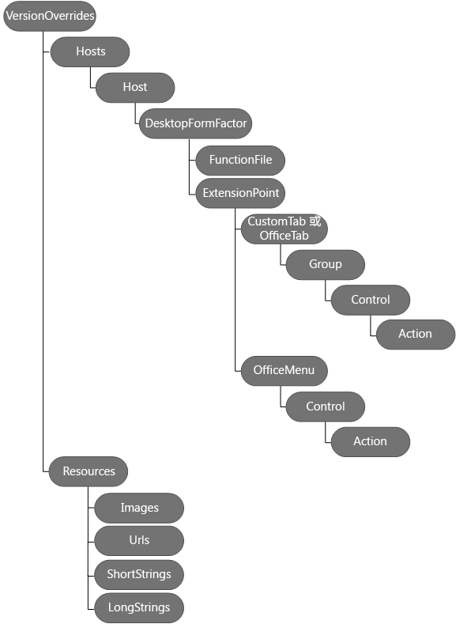

# 在清单中定义外接程序命令

外接程序命令提供了一种简单方法可以使用执行操作的 UI 元素来自定义默认的 Office UI。例如，可以在功能区上添加自定义按钮。若要创建命令，可以向现有清单添加 **[VersionOverrides](../../reference/manifest/versionoverrides.md)** 节点。 

当清单中包含 **VersionOverrides** 元素时，支持外接程序命令的 Word、Excel、Outlook 和 PowerPoint 版本将使用该元素内的信息加载外接程序。不支持外接程序命令的早期版本的 Office 产品将忽略此元素。

当客户端应用程序识别“**VersionOverrides**”节点时，外接程序名称会出现在功能区中，而不是在任务窗格或读取/撰写窗格中。外接程序不会显示在这两个位置中。
 
## VersionOverrides

[VersionOverrides](../../reference/manifest/versionoverrides.md) 元素是包含由外接程序实施的外接程序命令信息的根元素。它在清单架构 v1.1 和更高版本中受到支持。

**VersionOverrides** 架构有两个版本。

| 架构版本 | 说明 |
|----------------|-------------|
| 1.0 | 支持 Office 应用的桌面版本的外接程序命令。 | 
| 1.1 | 添加对[可固定的任务窗格](https://docs.microsoft.com/outlook/add-ins/pinnable-taskpane)和移动外接程序的支持。**注意：**当前仅受 Outlook 2016 for Windows 和 Outlook for iOS 的支持 |

外接程序可支持多个版本的 **VersionOverrides** 架构，具体方法是将较新的版本嵌套到以前版本内部。这使客户端能够在支持较新版本以利用新功能的同时允许较旧客户端加载较旧的版本。有关详细信息，请参阅[实现多个版本](../../reference/manifest/versionoverrides.md#implementing-multiple-versions)。

**VersionOverrides** 元素包括以下子元素：

- [说明](../../reference/manifest/description.md)
- [Requirements](../../reference/manifest/requirements.md)
- [Hosts](../../reference/manifest/hosts.md)
- [资源](../../reference/manifest/resources.md)
- [VersionOverrides](../../reference/manifest/versionoverrides.md)

下图显示了用于定义外接程序命令的元素的层次结构。 

## 示例清单

有关实施 Word、Excel 和 PowerPoint 的外接程序命令的示例清单，请参阅 [简单的外接程序命令示例](https://github.com/OfficeDev/Office-Add-in-Commands-Samples/tree/master/Simple)。

有关实施 Outlook 的外接程序命令的示例清单，请参阅 [Outlook 外接程序的示例清单文件](https://github.com/OfficeDev/outlook-add-in-command-demo/blob/master/command-demo-manifest.xml)。

## 其他资源

- [适用于 Outlook 的外接程序命令](https://docs.microsoft.com/outlook/add-ins/add-in-commands-for-outlook)
    
- [Outlook 外接程序清单](https://docs.microsoft.com/outlook/add-ins/manifests)
    
- [Outlook 外接程序命令演示示例](https://github.com/OfficeDev/outlook-add-in-command-demo)
