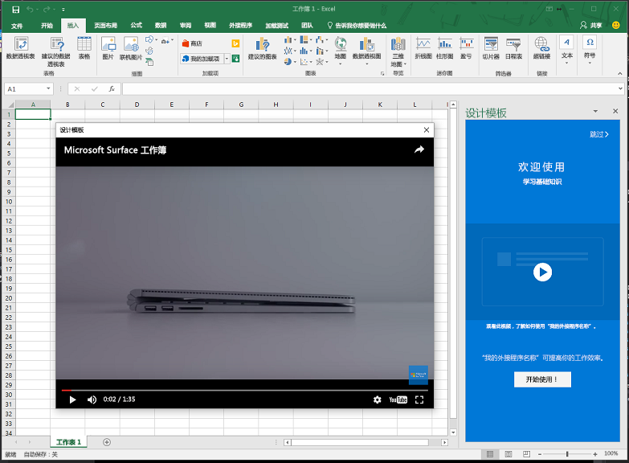

# <a name="use-the-dialog-api-in-your-office-add-ins"></a>在 Office 加载项中使用对话框 API

可以在 Office 外接程序中使用[对话框 API](/javascript/api/office/office.ui) 打开对话框。本文提供了有关如何在 Office 外接程序中使用对话框 API 的指南。

> [!NOTE]
> 若要了解对话框 API 目前的受支持情况，请参阅[对话框 API 要求集](/office/dev/add-ins/reference/requirement-sets/dialog-api-requirement-sets)。目前，Word、Excel、PowerPoint 和 Outlook 支持对话框 API。

对话框 API 的主要应用场景是为 Google、Facebook 或 Microsoft Graph 等资源启用身份验证。 有关详细信息，请在熟悉本文*之后*，参阅[使用 Office 对话框 API 进行身份验证](auth-with-office-dialog-api.md)。

不妨通过任务窗格/内容加载项/[加载项命令](../design/add-in-commands.md)打开对话框，以便执行下列操作：

- 显示无法直接在任务窗格中打开的登录页。
- 为加载项中的某些任务提供更多屏幕空间，或甚至整个屏幕。
- 托管在任务窗格中显得太小的视频。

> [!NOTE]
> 由于不赞成重叠 UI 元素，因此除非应用场景需要，否则请勿从任务窗格打开对话框。考虑如何使用任务窗格的区域时，请注意任务窗格可以是选项卡式。有关示例，请参阅 [Excel 加载项 JavaScript SalesTracker](https://github.com/OfficeDev/Excel-Add-in-JavaScript-SalesTracker) 示例。

下图展示了对话框示例。


请注意，对话框总是在屏幕中央打开。用户可以移动它，并重设大小。对话框是*非模式*窗口。也就是说，用户可以继续与主机 Office 应用中的文档，以及与任务窗格中的主机页（若有）进行交互。

## <a name="dialog-api-scenarios"></a>对话框 API 应用场景

Office JavaScript API 支持以下应用场景，其在 [Office.context.ui 命名空间](/javascript/api/office/office.ui)中使用 [Dialog](/javascript/api/office/office.dialog) 对象和两个函数。

### <a name="open-a-dialog-box"></a>打开对话框

为了打开对话框，任务窗格中的代码调用 [displayDialogAsync](/javascript/api/office/office.ui) 方法，并将要打开的资源 URL 传递到此方法。这通常是页面，但也可以是 MVC 应用中的控制器方法、路由、Web 服务方法或其他任何资源。在本文中，“页面”或“网站”是指对话框中的资源。下面的代码就是一个简单示例：

```js
Office.context.ui.displayDialogAsync('https://myAddinDomain/myDialog.html');
```

> [!NOTE]
> - URL 使用 **HTTPS** 协议。对话框中加载的所有页面都必须遵循此要求，而不仅仅是加载的第一个页面。
> - 对话框资源域与宿主页的域相同，宿主页可以是任务窗格中的页面，也可以是加载项命令的[函数文件](/office/dev/add-ins/reference/manifest/functionfile)。 这要求：传递到 `displayDialogAsync` 方法的页面、控制器方法或其他资源必须与主机页位于相同的域。

> [!IMPORTANT]
> 宿主页面和对话框资源必须具有相同的完整域。 如果尝试传递 `displayDialogAsync` 加载项域的子域，则不会起作用。 完整域（包括任何子域）必须匹配。

在第一个页面（或其他资源）加载后，用户可以转到使用 HTTPS 的任意网站（或其他资源）。还可以将第一个页面设计为直接重定向到另一个站点。

默认情况下，对话框的高度和宽度占设备屏幕的 80%。不过，也可以设置不同的百分比，只需将配置对象传递给方法即可，如以下示例所示：

```js
Office.context.ui.displayDialogAsync('https://myDomain/myDialog.html', {height: 30, width: 20});
```

有关实现这一点的样本加载项，请参阅 [Office 加载项 Dialog API 示例](https://github.com/OfficeDev/Office-Add-in-Dialog-API-Simple-Example)。

将两个值均设置为 100% 可有效提供全屏体验。（有效最大值为 99.5%，窗口仍可移动和调整大小。）

> [!NOTE]
> 只能从主机窗口打开一个对话框。如果尝试再打开一个对话框，就会生成错误。比方说，如果用户从任务窗格打开一个对话框，她就无法再从任务窗格中的其他页面打开第二个对话框。不过，如果对话框是通过[加载项命令](../design/add-in-commands.md)打开，那么只要选择此命令，就会打开新 HTML 文件（但不可见）。这会新建（不可见的）主机窗口，所以每个这样的窗口都可以启动自己的对话框。有关详细信息，请参阅 [displayDialogAsync 返回的错误](#errors-from-displaydialogasync)。

### <a name="take-advantage-of-a-performance-option-in-office-on-the-web"></a>利用 Office 网页版中的性能选项

`displayInIframe` 属性是配置对象中另一个可以传递到 `displayDialogAsync` 的属性。 如果将此属性设置为 `true`，且加载项在 Office 网页版打开的文档中运行，对话框就会以浮动 iframe（而不是独立窗口）的形式打开，从而加快对话框的打开速度。 示例如下：

```js
Office.context.ui.displayDialogAsync('https://myDomain/myDialog.html', {height: 30, width: 20, displayInIframe: true});
```

默认值为 `false`，与完全省略此属性时相同。 如果加载项没有在 Office 网页版中运行，`displayInIframe` 将被忽略。

> [!NOTE]
> 如果对话框始终重定向到无法在 iframe 中打开的页面，**不**得使用 `displayInIframe: true`。例如，许多热门 Web 服务（如 Google 和 Microsoft 帐户）的登录页都无法在 iframe 中打开。

### <a name="handling-pop-up-blockers-with-office-on-the-web"></a>使用 Office 网页版处理弹出窗口阻止程序

如果尝试在使用 Office 网页版时显示对话框，可能会导致浏览器的弹出窗口阻止程序阻止对话框。 如果加载项用户先同意加载项发出的提示，可以避开浏览器的弹出窗口阻止程序。 `displayDialogAsync` 的 [DialogOptions](/javascript/api/office/office.dialogoptions) 包含可触发此类弹出窗口的 `promptBeforeOpen` 属性。 `promptBeforeOpen` 是提供以下行为的布尔值：

 - `true` - 框架显示用于触发导航的弹出窗口，并避开浏览器的弹出窗口阻止程序。 
 - `false` - 对话框不会显示，开发人员必须处理弹出窗口（通过提供用户界面项目来触发导航）。 
 
弹出窗口如以下屏幕截图中所示：


 
### <a name="send-information-from-the-dialog-box-to-the-host-page"></a>将信息从对话框发送到主机页

对话框无法与任务窗格中的主机页进行通信，除非：

- 对话框中的当前页面与主机页在同一个域中。
- Office JavaScript 库已在页面中加载。（与使用 Office JavaScript 库的所有页面一样，页面脚本必须为 `Office.initialize` 属性分配方法，尽管方法可以是空的。有关详细信息，请参阅[初始化外接程序](understanding-the-javascript-api-for-office.md#initializing-your-add-in)。）

对话框页中的代码使用 `messageParent` 函数，向主机页发送布尔值或字符串消息。字符串可以是字词、句子、XML blob、字符串化 JSON 或其他任何能够串行化为字符串的内容。示例如下：

```js
if (loginSuccess) {
    Office.context.ui.messageParent(true);
}
```

> [!NOTE]
> - `messageParent` 函数是*唯一*可以在对话框中调用的两个 Office API 之一。另一个是 `Office.context.requirements.isSetSupported`。有关详细信息，请参阅[指定 Office 主机和 API 要求](specify-office-hosts-and-api-requirements.md)。
> - `messageParent` 函数只能在与主机页位于同一域（包括协议和端口）的页面上调用。

在下一个示例中，`googleProfile` 是用户 Google 配置文件的字符串化版本。

```js
if (loginSuccess) {
    Office.context.ui.messageParent(googleProfile);
}
```

必须将主机页配置为接收消息。为此，可以向 `displayDialogAsync` 的原始调用添加回调参数。回调向 `DialogMessageReceived` 事件分配处理程序。示例如下：

```js
var dialog;
Office.context.ui.displayDialogAsync('https://myDomain/myDialog.html', {height: 30, width: 20},
    function (asyncResult) {
        dialog = asyncResult.value;
        dialog.addEventHandler(Office.EventType.DialogMessageReceived, processMessage);
    }
);
```

> [!NOTE]
> - Office 将 [AsyncResult](/javascript/api/office/office.asyncresult) 对象传递给回调。它表示尝试打开对话框的结果，不表示对话框中任何事件的结果。若要详细了解此区别，请参阅[处理错误和事件](#handle-errors-and-events)部分。
> - `asyncResult` 的 `value` 属性设置为 [Dialog](/javascript/api/office/office.dialog) 对象，此对象位于主机页（而不是对话框的执行上下文）中。
> - `processMessage` 是用于处理事件的函数。可以根据需要任意命名。
> - `dialog` 变量的声明范围比回调更广，因为 `processMessage` 中也会引用此变量。

下面展示了 `DialogMessageReceived` 事件处理程序的简单示例：

```js
function processMessage(arg) {
    var messageFromDialog = JSON.parse(arg.message);
    showUserName(messageFromDialog.name);
}
```

> [!NOTE]
> - Office 将 `arg` 对象传递给处理程序。它的 `message` 属性是对话框中的 `messageParent` 调用发送的布尔值或字符串。在此示例中，它是 Microsoft 帐户或 Google 等服务的用户配置文件的字符串化表示。因此，使用 `JSON.parse` 将其反序列化回对象。
> - 未显示 `showUserName` 实现。它可能在任务窗格上显示定制的欢迎消息。

在用户完成与对话框的交互后，消息处理程序应关闭对话框，如下面的示例所示。

```js
function processMessage(arg) {
    dialog.close();
    // message processing code goes here;
}
```

> [!NOTE]
> - `dialog` 对象必须是 `displayDialogAsync` 调用返回的对象。
> - `dialog.close` 调用指示 Office 立即关闭对话框。

有关使用这些技术的示例加载项，请参阅 [Office 加载项对话框 API 示例](https://github.com/OfficeDev/Office-Add-in-Dialog-API-Simple-Example)。

如果加载项在收到消息后需要打开任务窗格的其他页面，可以使用 `window.location.replace` 方法（或 `window.location.href`）作为处理程序的最后一行。示例如下：

```js
function processMessage(arg) {
    // message processing code goes here;
    window.location.replace("/newPage.html");
    // Alternatively ...
    // window.location.href = "/newPage.html";
}
```

有关具有此用途的加载项示例，请参阅[Insert Excel charts using Microsoft Graph in a PowerPoint add-in](https://github.com/OfficeDev/PowerPoint-Add-in-Microsoft-Graph-ASPNET-InsertChart)（在 PowerPoint 加载项中使用 Microsoft Graph 插入 Excel 图表）示例。

#### <a name="conditional-messaging"></a>条件消息

由于可以从对话框发送多个 `messageParent` 调用，但在主机页中只有一个 `DialogMessageReceived` 事件处理程序，因此处理程序必须使用条件逻辑来区分不同的消息。比方说，如果对话框提示用户登录标识提供程序（如 Microsoft 帐户或 Google），则会以消息形式发送用户配置文件。如果身份验证失败，对话框会将错误消息发送到主机页，如下面的示例所示：

```js
if (loginSuccess) {
    var userProfile = getProfile();
    var messageObject = {messageType: "signinSuccess", profile: userProfile};
    var jsonMessage = JSON.stringify(messageObject);
    Office.context.ui.messageParent(jsonMessage);
} else {
    var errorDetails = getError();
    var messageObject = {messageType: "signinFailure", error: errorDetails};
    var jsonMessage = JSON.stringify(messageObject);
    Office.context.ui.messageParent(jsonMessage);
}
```

> [!NOTE]
> - `loginSuccess` 变量通过读取标识提供程序返回的 HTTP 响应进行初始化。
> - 未显示 `getProfile` 和 `getError` 函数的实现。这两个函数均从查询参数或 HTTP 响应的正文获取数据。
> - 根据登录是否成功，发送不同类型的匿名对象。两者都有 `messageType` 属性。不同之处在于，一个有 `profile` 属性，另一个有 `error` 属性。

主机页中的处理程序代码使用 `messageType` 属性的值设置分支，如下面的示例所示。请注意，`showUserName` 函数的用法与之前的示例相同，`showNotification` 函数在主机页的 UI 中显示错误。

```js
function processMessage(arg) {
    var messageFromDialog = JSON.parse(arg.message);
    if (messageFromDialog.messageType === "signinSuccess") {
        dialog.close();
        showUserName(messageFromDialog.profile.name);
        window.location.replace("/newPage.html");
    } else {
        dialog.close();
        showNotification("Unable to authenticate user: " + messageFromDialog.error);
    }
}
```

> [!NOTE]
> `showNotification` 实施未在本文提供的示例代码中显示。 有关如何在外接程序中实施此函数的示例，请参阅 [Office 外接程序对话框 API 示例](https://github.com/OfficeDev/Office-Add-in-Dialog-API-Simple-Example)。

### <a name="closing-the-dialog-box"></a>关闭对话框

可以在对话框中实现对话框关闭按钮。为此，关闭按钮的单击事件处理程序应使用 `messageParent` 通知主机页，关闭按钮已获单击。示例如下：

```js
function closeButtonClick() {
    var messageObject = {messageType: "dialogClosed"};
    var jsonMessage = JSON.stringify(messageObject);
    Office.context.ui.messageParent(jsonMessage);
}
```

`DialogMessageReceived` 的主机页处理程序会调用 `dialog.close`，如下面的示例所示。（请参阅之前的示例，其中展示了对话框对象的初始化方式。）


```js
function processMessage(arg) {
    var messageFromDialog = JSON.parse(arg.message);
    if (messageFromDialog.messageType === "dialogClosed") {
       dialog.close();
    }
}
```

即使你没有自己的关闭对话框 UI，最终用户也可以通过选择右上角的 **X** 关闭对话框。此操作将触发 `DialogEventReceived` 事件。如果主机窗格需要知道此事件何时发生，应为此事件声明一个处理程序。有关详细信息，请参阅[对话框窗口中的错误和事件](#errors-and-events-in-the-dialog-window)部分。

## <a name="handle-errors-and-events"></a>处理错误和事件

代码应处理两类事件：

- `displayDialogAsync` 调用返回的错误，因为无法创建对话框。
- 对话框窗口中的错误和其他事件。

### <a name="errors-from-displaydialogasync"></a>DisplayDialogAsync 返回的错误

除常规的平台和系统错误外，调用 `displayDialogAsync` 会返回以下三个特定错误。

|代码编号|含义|
|:-----|:-----|
|12004|传递给 `displayDialogAsync` 的 URL 的域不受信任。此域必须与主机页的域相同（包括协议和端口号）。|
|12005|传递给 `displayDialogAsync` 的 URL 使用 HTTP 协议。需要使用 HTTPS。（在 Office 的某些版本中，返回 12005 的错误消息与返回 12004 错误消息是相同的。）|
|<span id="12007">12007</span>|已从此主机窗口打开了一个对话框。主机窗口（如任务窗格）一次只能打开一个对话框。|
|12009|用户已选择忽略对话框。 联机版本的 Office 中可能会发生此错误，用户可能会选择不允许加载项显示对话框。|

调用 `displayDialogAsync` 时，总是将 [AsyncResult](/javascript/api/office/office.asyncresult) 对象传递给它的回调函数。 如果调用成功（即对话框窗口已打开），`AsyncResult` 对象的 `value` 属性是 [Dialog](/javascript/api/office/office.dialog) 对象。 有关示例，请参阅[将信息从对话框发送到宿主页](#send-information-from-the-dialog-box-to-the-host-page)部分。 如果调用 `displayDialogAsync` 失败，不会创建窗口，`AsyncResult` 对象的 `status` 属性设置为 `Office.AsyncResultStatus.Failed`，并且会填充对象的 `error` 属性。 应始终有用于测试 `status` 并在出错时进行响应的回调。 有关仅报告错误消息（无论代码编号是什么）的示例，请参阅下面的代码：

```js
var dialog;
Office.context.ui.displayDialogAsync('https://myDomain/myDialog.html',
function (asyncResult) {
    if (asyncResult.status === Office.AsyncResultStatus.Failed) {
        showNotification(asyncResult.error.code = ": " + asyncResult.error.message);
    } else {
        dialog = asyncResult.value;
        dialog.addEventHandler(Office.EventType.DialogMessageReceived, processMessage);
    }
});
```

### <a name="errors-and-events-in-the-dialog-window"></a>对话框窗口中的错误和事件

对话框中的三个错误和事件（具有代码编码）会在主机页中触发 `DialogEventReceived` 事件。

|代码编号|含义|
|:-----|:-----|
|12002|下列一种含义：<br> - 传递给 `displayDialogAsync` 的 URL 没有对应的页面。<br> - 传递给 `displayDialogAsync` 的页面已加载，但对话框定向到找不到或无法加载的页面，或者已定向到使用无效语法的 URL。|
|12003|对话框定向到使用 HTTP 协议的 URL。必须使用 HTTPS。|
|12006|对话框已关闭，通常是因为用户选择了 **X** 按钮。|

代码可以在调用 `displayDialogAsync` 时分配 `DialogEventReceived` 事件处理程序。下面展示了一个简单示例：

```js
var dialog;
Office.context.ui.displayDialogAsync('https://myDomain/myDialog.html',
    function (result) {
        dialog = result.value;
        dialog.addEventHandler(Office.EventType.DialogEventReceived, processDialogEvent);
    }
);
```

有关为每个错误代码创建自定义错误消息的 `DialogEventReceived` 事件处理程序示例，请参阅下面的示例：

```js
function processDialogEvent(arg) {
    switch (arg.error) {
        case 12002:
            showNotification("The dialog box has been directed to a page that it cannot find or load, or the URL syntax is invalid.");
            break;
        case 12003:
            showNotification("The dialog box has been directed to a URL with the HTTP protocol. HTTPS is required.");            break;
        case 12006:
            showNotification("Dialog closed.");
            break;
        default:
            showNotification("Unknown error in dialog box.");
            break;
    }
}
```

有关这样处理错误的样本加载项，请参阅 [Office 加载项 Dialog API 示例](https://github.com/OfficeDev/Office-Add-in-Dialog-API-Simple-Example)。


## <a name="pass-information-to-the-dialog-box"></a>向对话框传递信息

有时，主机页需要向对话框传递信息。完成此操作的方式主要分为两种：

- 向传递给 `displayDialogAsync` 的 URL 添加查询参数。
- 将信息存储在主机窗口和对话框都可访问的位置。这两个窗口不共享通用会话存储，但*如果它们具有相同的域*（包括端口号，若有），则共享通用[本地存储](https://www.w3schools.com/html/html5_webstorage.asp)。

### <a name="use-local-storage"></a>使用本地存储

为了使用本地存储，代码会先在主机页中调用 `window.localStorage` 对象的 `setItem` 方法，然后再调用 `displayDialogAsync`，如以下示例所示：

```js
localStorage.setItem("clientID", "15963ac5-314f-4d9b-b5a1-ccb2f1aea248");
```

对话框窗口中的代码会在需要时读取项，如以下示例所示：

```js
var clientID = localStorage.getItem("clientID");
// You can also use property syntax:
// var clientID = localStorage.clientID;
```

### <a name="use-query-parameters"></a>使用查询参数

下面的示例展示了如何使用查询参数传递数据：

```js
Office.context.ui.displayDialogAsync('https://myAddinDomain/myDialog.html?clientID=15963ac5-314f-4d9b-b5a1-ccb2f1aea248');
```

有关使用此技术的示例，请参阅[Insert Excel charts using Microsoft Graph in a PowerPoint add-in](https://github.com/OfficeDev/PowerPoint-Add-in-Microsoft-Graph-ASPNET-InsertChart)（在 PowerPoint 加载项中使用 Microsoft Graph 插入 Excel 图表）。

对话框窗口中的代码可以分析 URL，并读取参数值。

> [!NOTE]
> Office 会自动向传递给 `displayDialogAsync` 的 URL 添加查询参数 `_host_info`。（附加在自定义查询参数（若有）后面，不会附加到对话框导航到的任何后续 URL。）Microsoft 可能会更改此值的内容，或者将来会将其全部删除，因此代码不得读取此值。相同的值会被添加到对话框的会话存储中。同样，*代码不得对此值执行读取和写入操作*。

## <a name="use-the-dialog-apis-to-show-a-video"></a>使用对话框 API 显示视频

若要在对话框中显示视频，请执行以下操作：

1.  创建内容仅有 iframe 的页面。iframe 的 `src` 属性指向联机视频。视频 URL 必须使用 HTTP**S** 协议。本文将此页面称为“video.dialogbox.html”。下面展示了标记示例：

    ```HTML
    <iframe class="ms-firstrun-video__player"  width="640" height="360"
        src="https://www.youtube.com/embed/XVfOe5mFbAE?rel=0&autoplay=1"
        frameborder="0" allowfullscreen>
    </iframe>
    ```

2.  video.dialogbox.html 页面必须与主机页位于同一域中。
3.  在主机页中调用 `displayDialogAsync`，打开 video.dialogbox.html。
4.  如果外接程序需要知道用户何时关闭对话框，请为 `DialogEventReceived` 事件注册处理程序，并处理 12006 事件。有关详细信息，请参阅[对话框窗口中的错误和事件](#errors-and-events-in-the-dialog-window)部分。

有关在对话框中显示视频的示例，请参阅[视频展示位置设计模式](/office/dev/add-ins/design/first-run-experience-patterns#video-placemat)。



## <a name="use-the-dialog-apis-in-an-authentication-flow"></a>在身份验证流中使用对话框 API

请参阅[使用 Office 对话框 API 进行身份验证](auth-with-office-dialog-api.md)。

## <a name="using-the-office-dialog-api-with-single-page-applications-and-client-side-routing"></a>将 Office 对话框 API 与单页应用程序和客户端路由结合使用

如果加载项使用客户端路由（单页应用程序 (SPA) 通常这样做），则可以选择将路由 URL 传递给 [ displayDialogAsync ](/javascript/api/office/office.ui) 方法（*不建议这样做*），而不是传递各个完整 HTML 页面的 URL。

对话框位于有自己执行上下文的新窗口中。 如果你传递路由，则基本页及其所有初始化和引导代码会在这个新的上下文中再次运行，且所有变量都会在对话框中设置为各自的初始值。 因此，此技术将在对话窗口中加载和启动另一个应用程序实例，这将部分破坏 SPA 的作用。 此外，更改对话框窗口中变量的代码不会更改任务窗格版本的相同变量。 同样，对话框窗口有其自己的会话存储，任务窗格中的代码无法访问此类存储。

因此，如果将路由传递给 `displayDialogAsync` 方法，则你并非真正拥有 SPA；你拥有的是相同 SPA 的两个实例。 此外，任务窗格实例中的大部分代码将永远不会用于该实例中，并且对话框实例中的大部分代码也永远不会用于该实例中。 这相当于相同捆绑包中拥有两个 SPA。 如果想要在对话框中运行的代码非常复杂，则可能想要显式执行此操作；也就是说，在相同域的不同文件夹中包含两个 SPA。 但是在大多数情况下，对话框中只需要一个简单的逻辑。 在这种情况下，只需将嵌入式或引用的 JavaScript 的简单 HTML 页面托管到 SPA 域中即可显著简化你的项目。 将页面的 URL 传递给 `displayDialogAsync` 方法。 这可能意味着，你将偏移单页应用程序的本意；但正如上面所提到的，在使用对话框时，你并没有真正拥有单个 SPA 实例。
