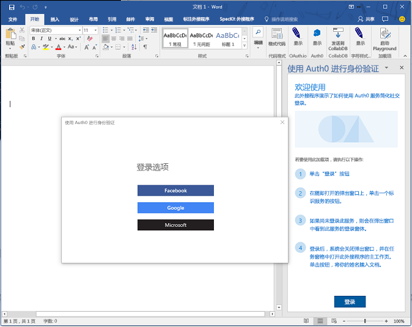

# <a name="use-the-office-dialog-api-in-office-add-ins"></a><span data-ttu-id="e169f-103">在 Office 加载项中使用 Office 对话框 API</span><span class="sxs-lookup"><span data-stu-id="e169f-103">Use the Office dialog API in Office Add-ins</span></span>

<span data-ttu-id="e169f-104">可以在 Office 加载项中使用 [Office 对话框 API](/javascript/api/office/office.ui) 打开对话框。</span><span class="sxs-lookup"><span data-stu-id="e169f-104">You can use the [Office dialog API](/javascript/api/office/office.ui) to open dialog boxes in your Office Add-in.</span></span> <span data-ttu-id="e169f-105">本文提供了有关如何在 Office 加载项中使用对话框 API 的指南。</span><span class="sxs-lookup"><span data-stu-id="e169f-105">This article provides guidance for using the dialog API in your Office Add-in.</span></span>

> [!NOTE]
> <span data-ttu-id="e169f-106">若要了解对话框 API 目前的受支持情况，请参阅[对话框 API 要求集](../reference/requirement-sets/dialog-api-requirement-sets.md)。</span><span class="sxs-lookup"><span data-stu-id="e169f-106">For information about where the Dialog API is currently supported, see [Dialog API requirement sets](../reference/requirement-sets/dialog-api-requirement-sets.md).</span></span> <span data-ttu-id="e169f-107">Excel、PowerPoint 和 Word 目前支持对话框 API。</span><span class="sxs-lookup"><span data-stu-id="e169f-107">The Dialog API is currently supported for Excel, PowerPoint, and Word.</span></span> <span data-ttu-id="e169f-108">有关各种邮箱要求集的 Outlook 支持包括 &mdash; ：有关更多详细信息，请参阅 API 参考。</span><span class="sxs-lookup"><span data-stu-id="e169f-108">Outlook support is included across various Mailbox requirement sets&mdash;see the API reference for more details.</span></span>

<span data-ttu-id="e169f-109">对话框 API 的主要应用场景是为 Google、Facebook 或 Microsoft Graph 等资源启用身份验证。</span><span class="sxs-lookup"><span data-stu-id="e169f-109">A primary scenario for the Dialog API is to enable authentication with a resource such as Google, Facebook, or Microsoft Graph.</span></span> <span data-ttu-id="e169f-110">有关详细信息，请在熟悉本文 *之后*，参阅 [使用 Office 对话框 API 进行身份验证](auth-with-office-dialog-api.md)。</span><span class="sxs-lookup"><span data-stu-id="e169f-110">For more information, see [Authenticate with the Office dialog API](auth-with-office-dialog-api.md) *after* you are familiar with this article.</span></span>

<span data-ttu-id="e169f-111">不妨通过任务窗格/内容加载项/[加载项命令](../design/add-in-commands.md)打开对话框，以便执行下列操作：</span><span class="sxs-lookup"><span data-stu-id="e169f-111">Consider opening a dialog box from a task pane or content add-in or [add-in command](../design/add-in-commands.md) to do the following:</span></span>

- <span data-ttu-id="e169f-112">显示无法直接在任务窗格中打开的登录页。</span><span class="sxs-lookup"><span data-stu-id="e169f-112">Display sign in pages that cannot be opened directly in a task pane.</span></span>
- <span data-ttu-id="e169f-113">为加载项中的某些任务提供更多屏幕空间，或甚至整个屏幕。</span><span class="sxs-lookup"><span data-stu-id="e169f-113">Provide more screen space, or even a full screen, for some tasks in your add-in.</span></span>
- <span data-ttu-id="e169f-114">托管在任务窗格中显得太小的视频。</span><span class="sxs-lookup"><span data-stu-id="e169f-114">Host a video that would be too small if confined to a task pane.</span></span>

> [!NOTE]
> <span data-ttu-id="e169f-115">由于不赞成重叠 UI 元素，因此除非应用场景需要，否则请勿从任务窗格打开对话框。</span><span class="sxs-lookup"><span data-stu-id="e169f-115">Because overlapping UI elements are discouraged, avoid opening a dialog box from a task pane unless your scenario requires it.</span></span> <span data-ttu-id="e169f-116">考虑如何使用任务窗格区域时，请注意任务窗格中可以有选项卡。</span><span class="sxs-lookup"><span data-stu-id="e169f-116">When you consider how to use the surface area of a task pane, note that task panes can be tabbed.</span></span> <span data-ttu-id="e169f-117">有关示例，请参阅 [Excel 加载项 JavaScript SalesTracker](https://github.com/OfficeDev/Excel-Add-in-JavaScript-SalesTracker) 样本。</span><span class="sxs-lookup"><span data-stu-id="e169f-117">For an example, see the [Excel Add-in JavaScript SalesTracker](https://github.com/OfficeDev/Excel-Add-in-JavaScript-SalesTracker) sample.</span></span>

<span data-ttu-id="e169f-118">下图展示了对话框示例。</span><span class="sxs-lookup"><span data-stu-id="e169f-118">The following image shows an example of a dialog box.</span></span>



<span data-ttu-id="e169f-120">请注意，对话框总是在屏幕的中心打开。</span><span class="sxs-lookup"><span data-stu-id="e169f-120">Note that the dialog box always opens in the center of the screen.</span></span> <span data-ttu-id="e169f-121">用户可以移动并重设对话框的大小。</span><span class="sxs-lookup"><span data-stu-id="e169f-121">The user can move and resize it.</span></span> <span data-ttu-id="e169f-122">窗口为 *是非*--用户可以继续与 Office 应用程序中的文档和任务窗格中的页面进行交互（如果有的话）。</span><span class="sxs-lookup"><span data-stu-id="e169f-122">The window is *nonmodal*--a user can continue to interact with both the document in the Office application and with the page in the task pane, if there is one.</span></span>

## <a name="open-a-dialog-box-from-a-host-page"></a><span data-ttu-id="e169f-123">从主机页面打开对话框</span><span class="sxs-lookup"><span data-stu-id="e169f-123">Open a dialog box from a host page</span></span>

<span data-ttu-id="e169f-124">Office JavaScript API 在 [Office.context.ui 命名空间](/javascript/api/office/office.ui)中包含一个 [Dialog](/javascript/api/office/office.dialog) 对象和两个函数。</span><span class="sxs-lookup"><span data-stu-id="e169f-124">The Office JavaScript APIs include a [Dialog](/javascript/api/office/office.dialog) object and two functions in the [Office.context.ui namespace](/javascript/api/office/office.ui).</span></span>

<span data-ttu-id="e169f-125">为了打开对话框，代码（通常是任务窗格中的一页）调用 [displayDialogAsync](/javascript/api/office/office.ui) 方法，并将要打开的资源 URL 传递到此方法。</span><span class="sxs-lookup"><span data-stu-id="e169f-125">To open a dialog box, your code, typically a page in a task pane, calls the [displayDialogAsync](/javascript/api/office/office.ui) method and passes to it the URL of the resource that you want to open.</span></span> <span data-ttu-id="e169f-126">调用方法的页面称为“主机页”。</span><span class="sxs-lookup"><span data-stu-id="e169f-126">The page on which this method is called is known as the "host page".</span></span> <span data-ttu-id="e169f-127">例如在任务窗格中的 index.html 页面上使用脚本调用此方法，随后 index.html 是打开此方法对话框的主机页。</span><span class="sxs-lookup"><span data-stu-id="e169f-127">For example, if you call this method in script on index.html in a task pane, then index.html is the host page of the dialog box that the method opens.</span></span>

<span data-ttu-id="e169f-128">对话框中打开的资源通常是页面，，但也可以是 MVC 应用中的控制器方法、路由、Web 服务方法或其他任何资源。</span><span class="sxs-lookup"><span data-stu-id="e169f-128">The resource that is opened in the dialog box is usually a page, but it can be a controller method in an MVC application, a route, a web service method, or any other resource.</span></span> <span data-ttu-id="e169f-129">在本文中，“页面”或“网站”是指对话框中的资源。</span><span class="sxs-lookup"><span data-stu-id="e169f-129">In this article, 'page' or 'website' refers to the resource in the dialog box.</span></span> <span data-ttu-id="e169f-130">下面的代码就是一个非常简单的示例：</span><span class="sxs-lookup"><span data-stu-id="e169f-130">The following code is a simple example:</span></span>

```js
Office.context.ui.displayDialogAsync('https://myAddinDomain/myDialog.html');
```

> [!NOTE]
> - <span data-ttu-id="e169f-131">URL 使用 HTTP **S** 协议。</span><span class="sxs-lookup"><span data-stu-id="e169f-131">The URL uses the HTTP **S** protocol.</span></span> <span data-ttu-id="e169f-132">对话框中加载的所有页面都必须要遵循此要求，而不仅仅是加载的第一个页面。</span><span class="sxs-lookup"><span data-stu-id="e169f-132">This is mandatory for all pages loaded in a dialog box, not just the first page loaded.</span></span>
> - <span data-ttu-id="e169f-133">对话框域与宿主页的域相同，宿主页可以是任务窗格中的页面，也可以是加载项命令的[函数文件](../reference/manifest/functionfile.md)。</span><span class="sxs-lookup"><span data-stu-id="e169f-133">The dialog box's domain is the same as the domain of the host page, which can be the page in a task pane or the [function file](../reference/manifest/functionfile.md) of an add-in command.</span></span> <span data-ttu-id="e169f-134">这要求：传递到 `displayDialogAsync` 方法的页面、控制器方法或其他资源必须与主机页位于相同的域。</span><span class="sxs-lookup"><span data-stu-id="e169f-134">This is required: the page, controller method, or other resource that is passed to the `displayDialogAsync` method must be in the same domain as the host page.</span></span>

> [!IMPORTANT]
> <span data-ttu-id="e169f-135">对话框中打开的主机页面和资源必须具有相同的完整域。</span><span class="sxs-lookup"><span data-stu-id="e169f-135">The host page and the resource that opens in the dialog box must have the same full domain.</span></span> <span data-ttu-id="e169f-136">如果尝试传递 `displayDialogAsync` 加载项域的子域，则不会起作用。</span><span class="sxs-lookup"><span data-stu-id="e169f-136">If you attempt to pass `displayDialogAsync` a subdomain of the add-in's domain, it will not work.</span></span> <span data-ttu-id="e169f-137">完整域（包括任何子域）必须匹配。</span><span class="sxs-lookup"><span data-stu-id="e169f-137">The full domain, including any subdomain, must match.</span></span>

<span data-ttu-id="e169f-138">加载第一个页面（或其它资源）后，用户可使用链接或其它用户界面来导航至任何使用 HTTPS 的网站（或其他资源）。</span><span class="sxs-lookup"><span data-stu-id="e169f-138">After the first page (or other resource) is loaded, a user can use links or other UI to navigate to any website (or other resource) that uses HTTPS.</span></span> <span data-ttu-id="e169f-139">还可以将第一个页面设计为直接重定向到另一个站点。</span><span class="sxs-lookup"><span data-stu-id="e169f-139">You can also design the first page to immediately redirect to another site.</span></span>

<span data-ttu-id="e169f-140">默认情况下，对话框的高度和宽度占设备屏幕的 80%。不过，也可以设置不同的百分比，只需将配置对象传递给方法即可，如以下示例所示：</span><span class="sxs-lookup"><span data-stu-id="e169f-140">By default, the dialog box will occupy 80% of the height and width of the device screen, but you can set different percentages by passing a configuration object to the method, as shown in the following example:</span></span>

```js
Office.context.ui.displayDialogAsync('https://myDomain/myDialog.html', {height: 30, width: 20});
```

<span data-ttu-id="e169f-141">有关实现这一点的样本加载项，请参阅 [Office 加载项 Dialog API 示例](https://github.com/OfficeDev/Office-Add-in-Dialog-API-Simple-Example)。</span><span class="sxs-lookup"><span data-stu-id="e169f-141">For a sample add-in that does this, see [Office Add-in Dialog API Example](https://github.com/OfficeDev/Office-Add-in-Dialog-API-Simple-Example).</span></span>

<span data-ttu-id="e169f-p112">将两个值均设置为 100% 可有效提供全屏体验。（有效最大值为 99.5%，窗口仍可移动和调整大小。）</span><span class="sxs-lookup"><span data-stu-id="e169f-p112">Set both values to 100% to get what is effectively a full screen experience. (The effective maximum is 99.5%, and the window is still moveable and resizable.)</span></span>

> [!NOTE]
> <span data-ttu-id="e169f-p113">只能从主机窗口打开一个对话框。如果尝试再打开一个对话框，就会生成错误。比方说，如果用户从任务窗格打开一个对话框，她就无法再从任务窗格中的其他页面打开第二个对话框。不过，如果对话框是通过[加载项命令](../design/add-in-commands.md)打开，那么只要选择此命令，就会打开新 HTML 文件（但不可见）。这会新建（不可见的）主机窗口，所以每个这样的窗口都可以启动自己的对话框。有关详细信息，请参阅 [displayDialogAsync 返回的错误](dialog-handle-errors-events.md#errors-from-displaydialogasync)。</span><span class="sxs-lookup"><span data-stu-id="e169f-p113">You can open only one dialog box from a host window. An attempt to open another dialog box generates an error. For example, if a user opens a dialog box from a task pane, she cannot open a second dialog box, from a different page in the task pane. However, when a dialog box is opened from an [add-in command](../design/add-in-commands.md), the command opens a new (but unseen) HTML file each time it is selected. This creates a new (unseen) host window, so each such window can launch its own dialog box. For more information, see [Errors from displayDialogAsync](dialog-handle-errors-events.md#errors-from-displaydialogasync).</span></span>

### <a name="take-advantage-of-a-performance-option-in-office-on-the-web"></a><span data-ttu-id="e169f-150">利用 Office 网页版中的性能选项</span><span class="sxs-lookup"><span data-stu-id="e169f-150">Take advantage of a performance option in Office on the web</span></span>

<span data-ttu-id="e169f-151">`displayInIframe` 属性是配置对象中另一个可以传递到 `displayDialogAsync` 的属性。</span><span class="sxs-lookup"><span data-stu-id="e169f-151">The `displayInIframe` property is an additional property in the configuration object that you can pass to `displayDialogAsync`.</span></span> <span data-ttu-id="e169f-152">如果将此属性设置为 `true`，且加载项在 Office 网页版打开的文档中运行，对话框就会以浮动 iframe（而不是独立窗口）的形式打开，从而加快对话框的打开速度。</span><span class="sxs-lookup"><span data-stu-id="e169f-152">When this property is set to `true`, and the add-in is running in a document opened in Office on the web, the dialog box will open as a floating iframe rather than an independent window, which makes it open faster.</span></span> <span data-ttu-id="e169f-153">示例如下：</span><span class="sxs-lookup"><span data-stu-id="e169f-153">The following is an example:</span></span>

```js
Office.context.ui.displayDialogAsync('https://myDomain/myDialog.html', {height: 30, width: 20, displayInIframe: true});
```

<span data-ttu-id="e169f-154">默认值为 `false`，与完全省略此属性时相同。</span><span class="sxs-lookup"><span data-stu-id="e169f-154">The default value is `false`, which is the same as omitting the property entirely.</span></span> <span data-ttu-id="e169f-155">如果加载项没有在 Office 网页版中运行，`displayInIframe` 将被忽略。</span><span class="sxs-lookup"><span data-stu-id="e169f-155">If the add-in is not running in Office on the web, the `displayInIframe` is ignored.</span></span>

> [!NOTE]
> <span data-ttu-id="e169f-156">如果对话框始终重定向到无法在 iframe 中打开的页面，**不** 得使用 `displayInIframe: true`。</span><span class="sxs-lookup"><span data-stu-id="e169f-156">You should **not** use `displayInIframe: true` if the dialog box will at any point redirect to a page that cannot be opened in an iframe.</span></span> <span data-ttu-id="e169f-157">例如，不能在 iframe 中打开许多常用 web 服务（如 Google 和 Microsoft 帐户）的 "登录" 页面。</span><span class="sxs-lookup"><span data-stu-id="e169f-157">For example, the sign in pages of many popular web services, such as Google and Microsoft account, cannot be opened in an iframe.</span></span>

## <a name="send-information-from-the-dialog-box-to-the-host-page"></a><span data-ttu-id="e169f-158">将信息从对话框发送到主机页</span><span class="sxs-lookup"><span data-stu-id="e169f-158">Send information from the dialog box to the host page</span></span>

<span data-ttu-id="e169f-159">对话框无法与任务窗格中的主机页进行通信，除非：</span><span class="sxs-lookup"><span data-stu-id="e169f-159">The dialog box cannot communicate with the host page in the task pane unless:</span></span>

- <span data-ttu-id="e169f-160">对话框中的当前页面与主机页在同一个域中。</span><span class="sxs-lookup"><span data-stu-id="e169f-160">The current page in the dialog box is in the same domain as the host page.</span></span>
- <span data-ttu-id="e169f-161">在页面中加载 Office JavaScript API 库。</span><span class="sxs-lookup"><span data-stu-id="e169f-161">The Office JavaScript API library is loaded in the page.</span></span> <span data-ttu-id="e169f-162"> (与使用 Office JavaScript API 库的任何页面一样，页面的脚本必须为属性分配方法 `Office.initialize` ，尽管它可以是空方法。</span><span class="sxs-lookup"><span data-stu-id="e169f-162">(Like any page that uses the Office JavaScript API library, script for the page must assign a method to the `Office.initialize` property, although it can be an empty method.</span></span> <span data-ttu-id="e169f-163">有关详细信息，请参阅 [初始化 Office 外接程序](initialize-add-in.md)。 ) </span><span class="sxs-lookup"><span data-stu-id="e169f-163">For details, see [Initialize your Office Add-in](initialize-add-in.md).)</span></span>

<span data-ttu-id="e169f-164">对话框中的代码使用 [messageParent](/javascript/api/office/office.ui#messageparent-message-) 函数，向主机页发送布尔值或字符串消息。</span><span class="sxs-lookup"><span data-stu-id="e169f-164">Code in the dialog box uses the [messageParent](/javascript/api/office/office.ui#messageparent-message-) function to send either a Boolean value or a string message to the host page.</span></span> <span data-ttu-id="e169f-165">字符串可以是单词、句子、XML blob、字符串化 JSON 或其他任何能够序列化成字符串的内容。</span><span class="sxs-lookup"><span data-stu-id="e169f-165">The string can be a word, sentence, XML blob, stringified JSON, or anything else that can be serialized to a string.</span></span> <span data-ttu-id="e169f-166">示例如下：</span><span class="sxs-lookup"><span data-stu-id="e169f-166">The following is an example:</span></span>

```js
if (loginSuccess) {
    Office.context.ui.messageParent(true);
}
```

> [!IMPORTANT]
> - <span data-ttu-id="e169f-167">`messageParent` 函数只能在与主机页位于同一域（包括协议和端口）的页面上调用。</span><span class="sxs-lookup"><span data-stu-id="e169f-167">The `messageParent` function can only be called on a page with the same domain (including protocol and port) as the host page.</span></span>
> - <span data-ttu-id="e169f-168">`messageParent`函数 *只* 是可在对话框中调用的两个 Office JS api 之一。</span><span class="sxs-lookup"><span data-stu-id="e169f-168">The `messageParent` function is one of *only* two Office JS APIs that can be called in the dialog box.</span></span>
> - <span data-ttu-id="e169f-169">可以在对话框中调用的其他 JS API 为 `Office.context.requirements.isSetSupported` 。</span><span class="sxs-lookup"><span data-stu-id="e169f-169">The other JS API that can be called in the dialog box is `Office.context.requirements.isSetSupported`.</span></span> <span data-ttu-id="e169f-170">有关它的信息，请参阅 [指定 Office 应用程序和 API 要求](specify-office-hosts-and-api-requirements.md)。</span><span class="sxs-lookup"><span data-stu-id="e169f-170">For information about it, see [Specify Office applications and API requirements](specify-office-hosts-and-api-requirements.md).</span></span> <span data-ttu-id="e169f-171">但是，在该对话框中，Outlook 2016 1-time purchase (中不支持此 API，即 MSI 版本) 。</span><span class="sxs-lookup"><span data-stu-id="e169f-171">However, in the dialog box, this API isn't supported in Outlook 2016 one-time purchase (that is, the MSI version).</span></span>

<span data-ttu-id="e169f-172">在下一个示例中，`googleProfile` 是用户 Google 配置文件的字符串化版本。</span><span class="sxs-lookup"><span data-stu-id="e169f-172">In the next example, `googleProfile` is a stringified version of the user's Google profile.</span></span>

```js
if (loginSuccess) {
    Office.context.ui.messageParent(googleProfile);
}
```

<span data-ttu-id="e169f-p120">必须将主机页配置为接收消息。为此，可以向 `displayDialogAsync` 的原始调用添加回调参数。回调向 `DialogMessageReceived` 事件分配处理程序。示例如下：</span><span class="sxs-lookup"><span data-stu-id="e169f-p120">The host page must be configured to receive the message. You do this by adding a callback parameter to the original call of `displayDialogAsync`. The callback assigns a handler to the `DialogMessageReceived` event. The following is an example:</span></span>

```js
var dialog;
Office.context.ui.displayDialogAsync('https://myDomain/myDialog.html', {height: 30, width: 20},
    function (asyncResult) {
        dialog = asyncResult.value;
        dialog.addEventHandler(Office.EventType.DialogMessageReceived, processMessage);
    }
);
```

> [!NOTE]
> - <span data-ttu-id="e169f-177">Office 将 [AsyncResult ](/javascript/api/office/office.asyncresult) 对象传递给回叫。</span><span class="sxs-lookup"><span data-stu-id="e169f-177">Office passes an [AsyncResult](/javascript/api/office/office.asyncresult) object to the callback.</span></span> <span data-ttu-id="e169f-178">表示尝试打开对话框的结果，</span><span class="sxs-lookup"><span data-stu-id="e169f-178">It represents the result of the attempt to open the dialog box.</span></span> <span data-ttu-id="e169f-179">不表示对话框中任何事件的结果。</span><span class="sxs-lookup"><span data-stu-id="e169f-179">It does not represent the outcome of any events in the dialog box.</span></span> <span data-ttu-id="e169f-180">若要详细了解此区别，请参阅[处理错误和事件](dialog-handle-errors-events.md)。</span><span class="sxs-lookup"><span data-stu-id="e169f-180">For more on this distinction, see [Handle errors and events](dialog-handle-errors-events.md).</span></span>
> - <span data-ttu-id="e169f-181">`asyncResult` 的 `value` 属性设置为 [Dialog](/javascript/api/office/office.dialog) 对象，此对象位于主机页（而不是对话框的执行上下文）中。</span><span class="sxs-lookup"><span data-stu-id="e169f-181">The `value` property of the `asyncResult` is set to a [Dialog](/javascript/api/office/office.dialog) object, which exists in the host page, not in the dialog box's execution context.</span></span>
> - <span data-ttu-id="e169f-p122">`processMessage` 是用于处理事件的函数。可以根据需要任意命名。</span><span class="sxs-lookup"><span data-stu-id="e169f-p122">The `processMessage` is the function that handles the event. You can give it any name you want.</span></span>
> - <span data-ttu-id="e169f-184">`dialog` 变量的声明范围比回调更广，因为 `processMessage` 中也会引用此变量。</span><span class="sxs-lookup"><span data-stu-id="e169f-184">The `dialog` variable is declared at a wider scope than the callback because it is also referenced in `processMessage`.</span></span>

<span data-ttu-id="e169f-185">下面展示了 `DialogMessageReceived` 事件处理程序的简单示例：</span><span class="sxs-lookup"><span data-stu-id="e169f-185">The following is a simple example of a handler for the `DialogMessageReceived` event:</span></span>

```js
function processMessage(arg) {
    var messageFromDialog = JSON.parse(arg.message);
    showUserName(messageFromDialog.name);
}
```

> [!NOTE]
> - <span data-ttu-id="e169f-186">Office 将 `arg` 对象传递给处理程序。</span><span class="sxs-lookup"><span data-stu-id="e169f-186">Office passes the `arg` object to the handler.</span></span> <span data-ttu-id="e169f-187">它的 `message` 属性是对话框中的 `messageParent` 调用发送的布尔值或字符串。</span><span class="sxs-lookup"><span data-stu-id="e169f-187">Its `message` property is the Boolean or string sent by the call of `messageParent` in the dialog box.</span></span> <span data-ttu-id="e169f-188">在此示例中，它是用户配置文件从 Microsoft 帐户或 Google 等服务的字符串化表示形式，因此它将被反序列化为使用的对象 `JSON.parse` 。</span><span class="sxs-lookup"><span data-stu-id="e169f-188">In this example, it is a stringified representation of a user's profile from a service such as Microsoft account or Google, so it is deserialized back to an object with `JSON.parse`.</span></span>
> - <span data-ttu-id="e169f-p124">未显示 `showUserName` 实现。它可能在任务窗格上显示定制的欢迎消息。</span><span class="sxs-lookup"><span data-stu-id="e169f-p124">The `showUserName` implementation is not shown. It might display a personalized welcome message on the task pane.</span></span>

<span data-ttu-id="e169f-191">在用户完成与对话框的交互后，消息处理程序应关闭对话框，如下面的示例所示。</span><span class="sxs-lookup"><span data-stu-id="e169f-191">When the user interaction with the dialog box is completed, your message handler should close the dialog box, as shown in this example.</span></span>

```js
function processMessage(arg) {
    dialog.close();
    // message processing code goes here;
}
```

> [!NOTE]
> - <span data-ttu-id="e169f-192">`dialog` 对象必须是 `displayDialogAsync` 调用返回的对象。</span><span class="sxs-lookup"><span data-stu-id="e169f-192">The `dialog` object must be the same one that is returned by the call of `displayDialogAsync`.</span></span>
> - <span data-ttu-id="e169f-193">`dialog.close` 调用指示 Office 立即关闭对话框。</span><span class="sxs-lookup"><span data-stu-id="e169f-193">The call of `dialog.close` tells Office to immediately close the dialog box.</span></span>

<span data-ttu-id="e169f-194">有关使用这些技术的示例加载项，请参阅 [Office 加载项对话框 API 示例](https://github.com/OfficeDev/Office-Add-in-Dialog-API-Simple-Example)。</span><span class="sxs-lookup"><span data-stu-id="e169f-194">For a sample add-in that uses these techniques, see [Office Add-in Dialog API Example](https://github.com/OfficeDev/Office-Add-in-Dialog-API-Simple-Example).</span></span>

<span data-ttu-id="e169f-p125">如果加载项在收到消息后需要打开任务窗格的其他页面，可以使用 `window.location.replace` 方法（或 `window.location.href`）作为处理程序的最后一行。示例如下：</span><span class="sxs-lookup"><span data-stu-id="e169f-p125">If the add-in needs to open a different page of the task pane after receiving the message, you can use the `window.location.replace` method (or `window.location.href`) as the last line of the handler. The following is an example:</span></span>

```js
function processMessage(arg) {
    // message processing code goes here;
    window.location.replace("/newPage.html");
    // Alternatively ...
    // window.location.href = "/newPage.html";
}
```

<span data-ttu-id="e169f-197">有关具有此用途的加载项示例，请参阅[Insert Excel charts using Microsoft Graph in a PowerPoint add-in](https://github.com/OfficeDev/PowerPoint-Add-in-Microsoft-Graph-ASPNET-InsertChart)（在 PowerPoint 加载项中使用 Microsoft Graph 插入 Excel 图表）示例。</span><span class="sxs-lookup"><span data-stu-id="e169f-197">For an example of an add-in that does this, see the [Insert Excel charts using Microsoft Graph in a PowerPoint add-in](https://github.com/OfficeDev/PowerPoint-Add-in-Microsoft-Graph-ASPNET-InsertChart) sample.</span></span>

### <a name="conditional-messaging"></a><span data-ttu-id="e169f-198">条件消息</span><span class="sxs-lookup"><span data-stu-id="e169f-198">Conditional messaging</span></span>

<span data-ttu-id="e169f-199">由于可以从对话框发送多个 `messageParent` 调用，但在主机页中只有一个 `DialogMessageReceived` 事件处理程序，因此处理程序必须使用条件逻辑来区分不同的消息。</span><span class="sxs-lookup"><span data-stu-id="e169f-199">Because you can send multiple `messageParent` calls from the dialog box, but you have only one handler in the host page for the `DialogMessageReceived` event, the handler must use conditional logic to distinguish different messages.</span></span> <span data-ttu-id="e169f-200">例如，如果对话框提示用户登录到标识提供程序（如 Microsoft 帐户或 Google），则它会将用户的配置文件作为邮件发送。</span><span class="sxs-lookup"><span data-stu-id="e169f-200">For example, if the dialog box prompts a user to sign in to an identity provider such as Microsoft account or Google, it sends the user's profile as a message.</span></span> <span data-ttu-id="e169f-201">如果身份验证失败，对话框会将错误消息发送到主机页，如下面的示例所示：</span><span class="sxs-lookup"><span data-stu-id="e169f-201">If authentication fails, the dialog box sends error information to the host page, as in the following example:</span></span>

```js
if (loginSuccess) {
    var userProfile = getProfile();
    var messageObject = {messageType: "signinSuccess", profile: userProfile};
    var jsonMessage = JSON.stringify(messageObject);
    Office.context.ui.messageParent(jsonMessage);
} else {
    var errorDetails = getError();
    var messageObject = {messageType: "signinFailure", error: errorDetails};
    var jsonMessage = JSON.stringify(messageObject);
    Office.context.ui.messageParent(jsonMessage);
}
```

> [!NOTE]
> - <span data-ttu-id="e169f-202">`loginSuccess` 变量通过读取标识提供程序返回的 HTTP 响应进行初始化。</span><span class="sxs-lookup"><span data-stu-id="e169f-202">The `loginSuccess` variable would be initialized by reading the HTTP response from the identity provider.</span></span>
> - <span data-ttu-id="e169f-p127">未显示 `getProfile` 和 `getError` 函数的实现。这两个函数均从查询参数或 HTTP 响应的正文获取数据。</span><span class="sxs-lookup"><span data-stu-id="e169f-p127">The the implementation of the `getProfile` and `getError` functions are not not shown. They each get data from a query parameter or from the body of the HTTP response.</span></span>
> - <span data-ttu-id="e169f-p128">根据登录是否成功，发送不同类型的匿名对象。两者都有 `messageType` 属性。不同之处在于，一个有 `profile` 属性，另一个有 `error` 属性。</span><span class="sxs-lookup"><span data-stu-id="e169f-p128">Anonymous objects of different types are sent depending on whether the sign in was successful. Both have a `messageType` property, but one has a `profile` property and the other has an `error` property.</span></span>

<span data-ttu-id="e169f-p129">主机页中的处理程序代码使用 `messageType` 属性的值设置分支，如下面的示例所示。请注意，`showUserName` 函数的用法与之前的示例相同，`showNotification` 函数在主机页的 UI 中显示错误。</span><span class="sxs-lookup"><span data-stu-id="e169f-p129">The handler code in the host page uses the value of the `messageType` property to branch as shown in the following example. Note that the `showUserName` function is the same as in the previous example and `showNotification` function displays the error in the host page's UI.</span></span>

```js
function processMessage(arg) {
    var messageFromDialog = JSON.parse(arg.message);
    if (messageFromDialog.messageType === "signinSuccess") {
        dialog.close();
        showUserName(messageFromDialog.profile.name);
        window.location.replace("/newPage.html");
    } else {
        dialog.close();
        showNotification("Unable to authenticate user: " + messageFromDialog.error);
    }
}
```

> [!NOTE]
> <span data-ttu-id="e169f-209">`showNotification` 实施未在本文提供的示例代码中显示。</span><span class="sxs-lookup"><span data-stu-id="e169f-209">The `showNotification` implementation is not shown in the sample code provided by this article.</span></span> <span data-ttu-id="e169f-210">有关如何在外接程序中实施此函数的示例，请参阅 [Office 外接程序对话框 API 示例](https://github.com/OfficeDev/Office-Add-in-Dialog-API-Simple-Example)。</span><span class="sxs-lookup"><span data-stu-id="e169f-210">For an example of how you might implement this function within your add-in, see [Office Add-in Dialog API Example](https://github.com/OfficeDev/Office-Add-in-Dialog-API-Simple-Example).</span></span>

## <a name="pass-information-to-the-dialog-box"></a><span data-ttu-id="e169f-211">向对话框传递信息</span><span class="sxs-lookup"><span data-stu-id="e169f-211">Pass information to the dialog box</span></span>

<span data-ttu-id="e169f-212">您的外接程序可以使用[messageChild](/javascript/api/office/office.dialog#messagechild-message-)将邮件从[主机页面](dialog-api-in-office-add-ins.md#open-a-dialog-box-from-a-host-page)发送到对话框。</span><span class="sxs-lookup"><span data-stu-id="e169f-212">Your add-in can send messages from the [host page](dialog-api-in-office-add-ins.md#open-a-dialog-box-from-a-host-page) to a dialog box using [Dialog.messageChild](/javascript/api/office/office.dialog#messagechild-message-).</span></span>

### <a name="use-messagechild-from-the-host-page"></a><span data-ttu-id="e169f-213">`messageChild()`从主机页使用</span><span class="sxs-lookup"><span data-stu-id="e169f-213">Use `messageChild()` from the host page</span></span>

<span data-ttu-id="e169f-214">调用 Office 对话框 API 打开对话框时，将返回 [dialog](/javascript/api/office/office.dialog) 对象。</span><span class="sxs-lookup"><span data-stu-id="e169f-214">When you call the Office dialog API to open a dialog box, a [Dialog](/javascript/api/office/office.dialog) object is returned.</span></span> <span data-ttu-id="e169f-215">应将其分配给具有大于 [displayDialogAsync](/javascript/api/office/office.ui#displaydialogasync-startaddress--callback-) 方法的作用域的变量，因为该对象将被其他方法引用。</span><span class="sxs-lookup"><span data-stu-id="e169f-215">It should be assigned to a variable that has greater scope than the [displayDialogAsync](/javascript/api/office/office.ui#displaydialogasync-startaddress--callback-) method because the object will be referenced by other methods.</span></span> <span data-ttu-id="e169f-216">示例如下：</span><span class="sxs-lookup"><span data-stu-id="e169f-216">The following is an example:</span></span>

```javascript
var dialog;
Office.context.ui.displayDialogAsync('https://myDomain/myDialog.html',
    function (asyncResult) {
        dialog = asyncResult.value;
        dialog.addEventHandler(Office.EventType.DialogMessageReceived, processMessage);
    }
);

function processMessage(arg) {
    dialog.close();

  // message processing code goes here;

}
```

<span data-ttu-id="e169f-217">此 `Dialog` 对象具有一个 [messageChild](/javascript/api/office/office.dialog#messagechild-message-) 方法，该方法将任何字符串（包括字符串化数据）发送到对话框。</span><span class="sxs-lookup"><span data-stu-id="e169f-217">This `Dialog` object has a [messageChild](/javascript/api/office/office.dialog#messagechild-message-) method that sends any string, including stringified data, to the dialog box.</span></span> <span data-ttu-id="e169f-218">这 `DialogParentMessageReceived` 将在对话框中引发事件。</span><span class="sxs-lookup"><span data-stu-id="e169f-218">This raises a `DialogParentMessageReceived` event in the dialog box.</span></span> <span data-ttu-id="e169f-219">您的代码应处理此事件，如下一节中所示。</span><span class="sxs-lookup"><span data-stu-id="e169f-219">Your code should handle this event, as shown in the next section.</span></span>

<span data-ttu-id="e169f-220">假设对话框的 UI 与当前活动的工作表相关，并且该工作表相对于其他工作表的位置。</span><span class="sxs-lookup"><span data-stu-id="e169f-220">Consider a scenario in which the UI of the dialog is related to the currently active worksheet and that worksheet's position relative to the other worksheets.</span></span> <span data-ttu-id="e169f-221">在下面的示例中， `sheetPropertiesChanged` 将 Excel 工作表属性发送到对话框。</span><span class="sxs-lookup"><span data-stu-id="e169f-221">In the following example, `sheetPropertiesChanged` sends Excel worksheet properties to the dialog box.</span></span> <span data-ttu-id="e169f-222">在这种情况下，当前工作表名为 "我的工作表"，并且它是工作簿中的第二个工作表。</span><span class="sxs-lookup"><span data-stu-id="e169f-222">In this case, the current worksheet is named "My Sheet" and it's the second sheet in the workbook.</span></span> <span data-ttu-id="e169f-223">数据封装在对象和字符串化中，以便可以将其传递给 `messageChild` 。</span><span class="sxs-lookup"><span data-stu-id="e169f-223">The data is encapsulated in an object and stringified so that it can be passed to `messageChild`.</span></span>

```javascript
function sheetPropertiesChanged() {
    var messageToDialog = JSON.stringify({
                               name: "My Sheet",
                               position: 2
                           });

    dialog.messageChild(messageToDialog);
}
```

### <a name="handle-dialogparentmessagereceived-in-the-dialog-box"></a><span data-ttu-id="e169f-224">在对话框中处理 DialogParentMessageReceived</span><span class="sxs-lookup"><span data-stu-id="e169f-224">Handle DialogParentMessageReceived in the dialog box</span></span>

<span data-ttu-id="e169f-225">在对话框的 JavaScript 中， `DialogParentMessageReceived` 使用 [addHandlerAsync](/javascript/api/office/office.ui#addhandlerasync-eventtype--handler--options--callback-) 方法为事件注册处理程序。</span><span class="sxs-lookup"><span data-stu-id="e169f-225">In the dialog box's JavaScript, register a handler for the `DialogParentMessageReceived` event with the [UI.addHandlerAsync](/javascript/api/office/office.ui#addhandlerasync-eventtype--handler--options--callback-) method.</span></span> <span data-ttu-id="e169f-226">通常在 [onReady 或 Office.initialize 方法](initialize-add-in.md)中执行此操作，如下所示。</span><span class="sxs-lookup"><span data-stu-id="e169f-226">This is typically done in the [Office.onReady or Office.initialize methods](initialize-add-in.md), as shown in the following.</span></span> <span data-ttu-id="e169f-227"> (更强健的示例如下所示。 ) </span><span class="sxs-lookup"><span data-stu-id="e169f-227">(A more robust example is below.)</span></span>

```javascript
Office.onReady()
    .then(function() {
        Office.context.ui.addHandlerAsync(
            Office.EventType.DialogParentMessageReceived,
            onMessageFromParent);
    });
```

<span data-ttu-id="e169f-228">然后，定义该 `onMessageFromParent` 处理程序。</span><span class="sxs-lookup"><span data-stu-id="e169f-228">Then, define the `onMessageFromParent` handler.</span></span> <span data-ttu-id="e169f-229">下面的代码将继续上一节中的示例。</span><span class="sxs-lookup"><span data-stu-id="e169f-229">The following code continues the example from the preceding section.</span></span> <span data-ttu-id="e169f-230">请注意，Office 会将参数传递给处理程序，并确保 `message` argument 对象的属性包含主机页中的字符串。</span><span class="sxs-lookup"><span data-stu-id="e169f-230">Note that Office passes an argument to the handler and that the `message` property of the argument object contains the string from the host page.</span></span> <span data-ttu-id="e169f-231">在此示例中，邮件被 reconverted 到对象，jQuery 用于将对话框的顶部标题设置为与新工作表名称相匹配。</span><span class="sxs-lookup"><span data-stu-id="e169f-231">In this example, the message is reconverted to an object and jQuery is used to set the top heading of the dialog to match the new worksheet name.</span></span>

```javascript
function onMessageFromParent(event) {
    var messageFromParent = JSON.parse(event.message);
    $('h1').text(messageFromParent.name);
}
```

<span data-ttu-id="e169f-232">最佳做法是验证是否正确注册了处理程序。</span><span class="sxs-lookup"><span data-stu-id="e169f-232">It is a best practice to verify that your handler is properly registered.</span></span> <span data-ttu-id="e169f-233">为此，可以将回调传递给 `addHandlerAsync` 方法。</span><span class="sxs-lookup"><span data-stu-id="e169f-233">You can do this by passing a callback to the `addHandlerAsync` method.</span></span> <span data-ttu-id="e169f-234">注册处理程序的尝试完成时，将运行此过程。</span><span class="sxs-lookup"><span data-stu-id="e169f-234">This runs when the attempt to register the handler completes.</span></span> <span data-ttu-id="e169f-235">如果未成功注册处理程序，请使用该处理程序记录或显示错误。</span><span class="sxs-lookup"><span data-stu-id="e169f-235">Use the handler to log or show an error if the handler was not successfully registered.</span></span> <span data-ttu-id="e169f-236">示例如下。</span><span class="sxs-lookup"><span data-stu-id="e169f-236">The following is an example.</span></span> <span data-ttu-id="e169f-237">请注意，这 `reportError` 是未在此处定义的函数，它会记录或显示错误。</span><span class="sxs-lookup"><span data-stu-id="e169f-237">Note that `reportError` is a function, not defined here, that logs or displays the error.</span></span>

```javascript
Office.onReady()
    .then(function() {
        Office.context.ui.addHandlerAsync(
            Office.EventType.DialogParentMessageReceived,
            onMessageFromParent,
            onRegisterMessageComplete);
    });

function onRegisterMessageComplete(asyncResult) {
    if (asyncResult.status !== Office.AsyncResultStatus.Succeeded) {
        reportError(asyncResult.error.message);
    }
}
```

### <a name="conditional-messaging-from-parent-page-to-dialog-box"></a><span data-ttu-id="e169f-238">"将父页的条件消息传递到" 对话框</span><span class="sxs-lookup"><span data-stu-id="e169f-238">Conditional messaging from parent page to dialog box</span></span>

<span data-ttu-id="e169f-239">由于可以 `messageChild` 从主机页进行多次调用，但在该事件的对话框中只有一个处理程序 `DialogParentMessageReceived` ，因此处理程序必须使用条件逻辑来区分不同的消息。</span><span class="sxs-lookup"><span data-stu-id="e169f-239">Because you can make multiple `messageChild` calls from the host page, but you have only one handler in the dialog box for the `DialogParentMessageReceived` event, the handler must use conditional logic to distinguish different messages.</span></span> <span data-ttu-id="e169f-240">您可以按照与 [条件消息](#conditional-messaging)中所述的方式将消息发送到主机页时，精确地与构造条件消息传递的方式完全并行。</span><span class="sxs-lookup"><span data-stu-id="e169f-240">You can do this in a way that is precisely parallel to how you would structure conditional messaging when the dialog box is sending a message to the host page as described in [Conditional messaging](#conditional-messaging).</span></span>

> [!NOTE]
> <span data-ttu-id="e169f-241">在某些情况下， `messageChild` 可能不支持作为 [DialogApi 1.2 要求集](../reference/requirement-sets/dialog-api-requirement-sets.md)的一部分的 API。</span><span class="sxs-lookup"><span data-stu-id="e169f-241">In some situations, the `messageChild` API, which is a part of the [DialogApi 1.2 requirement set](../reference/requirement-sets/dialog-api-requirement-sets.md),  may not be supported.</span></span> <span data-ttu-id="e169f-242">以 [其他方式将邮件从其主机页传递到对话框，以其他方式](parent-to-dialog.md)对 "父对话" 对话消息进行描述。</span><span class="sxs-lookup"><span data-stu-id="e169f-242">Some alternative ways for parent-to-dialog-box messaging are described in [Alternative ways of passing messages to a dialog box from its host page](parent-to-dialog.md).</span></span>

> [!IMPORTANT]
> <span data-ttu-id="e169f-243">不能在外接程序清单的部分中指定 [DialogApi 1.2 要求集](../reference/requirement-sets/dialog-api-requirement-sets.md) `<Requirements>` 。</span><span class="sxs-lookup"><span data-stu-id="e169f-243">The [DialogApi 1.2 requirement set](../reference/requirement-sets/dialog-api-requirement-sets.md) cannot be specified in the `<Requirements>` section of an add-in manifest.</span></span> <span data-ttu-id="e169f-244">您必须在运行时使用 [isSetSupported](specify-office-hosts-and-api-requirements.md#use-runtime-checks-in-your-javascript-code) 方法检查是否支持 DialogApi 1.2。</span><span class="sxs-lookup"><span data-stu-id="e169f-244">You will have to check for support for DialogApi 1.2 at runtime using the [isSetSupported](specify-office-hosts-and-api-requirements.md#use-runtime-checks-in-your-javascript-code) method.</span></span> <span data-ttu-id="e169f-245">对清单要求的支持正在开发中。</span><span class="sxs-lookup"><span data-stu-id="e169f-245">Support for manifest requirements is under development.</span></span>

## <a name="closing-the-dialog-box"></a><span data-ttu-id="e169f-246">关闭对话框</span><span class="sxs-lookup"><span data-stu-id="e169f-246">Closing the dialog box</span></span>

<span data-ttu-id="e169f-p140">可以在对话框中实现对话框关闭按钮。为此，关闭按钮的单击事件处理程序应使用 `messageParent` 通知主机页，关闭按钮已获单击。示例如下：</span><span class="sxs-lookup"><span data-stu-id="e169f-p140">You can implement a button in the dialog box that will close it. To do this, the click event handler for the button should use `messageParent` to tell the host page that the button has been clicked. The following is an example:</span></span>

```js
function closeButtonClick() {
    var messageObject = {messageType: "dialogClosed"};
    var jsonMessage = JSON.stringify(messageObject);
    Office.context.ui.messageParent(jsonMessage);
}
```

<span data-ttu-id="e169f-250">`DialogMessageReceived` 的主机页处理程序将调用 `dialog.close`，如以下示例所示。</span><span class="sxs-lookup"><span data-stu-id="e169f-250">The host page handler for `DialogMessageReceived` would call `dialog.close`, as in this example.</span></span> <span data-ttu-id="e169f-251">（请参阅前面的示例，其中展示了 `dialog` 对象的初始化方式。）</span><span class="sxs-lookup"><span data-stu-id="e169f-251">(See previous examples that show how the `dialog` object is initialized.)</span></span>

```js
function processMessage(arg) {
    var messageFromDialog = JSON.parse(arg.message);
    if (messageFromDialog.messageType === "dialogClosed") {
       dialog.close();
    }
}
```

<span data-ttu-id="e169f-252">即使你没有自己的关闭对话框 UI，最终用户也可以通过选择右上角的 **X** 关闭对话框。</span><span class="sxs-lookup"><span data-stu-id="e169f-252">Even when you don't have your own close-dialog UI, an end user can close the dialog box by choosing the **X** in the upper-right corner.</span></span> <span data-ttu-id="e169f-253">此操作将触发 `DialogEventReceived` 事件。</span><span class="sxs-lookup"><span data-stu-id="e169f-253">This action triggers the `DialogEventReceived` event.</span></span> <span data-ttu-id="e169f-254">如果主机窗格需要知道此事件何时发生，应为此事件声明一个处理程序。</span><span class="sxs-lookup"><span data-stu-id="e169f-254">If your host pane needs to know when this happens, it should declare a handler for this event.</span></span> <span data-ttu-id="e169f-255">有关详细信息，请参阅[对话框中的错误和事件](dialog-handle-errors-events.md#errors-and-events-in-the-dialog-box)部分。</span><span class="sxs-lookup"><span data-stu-id="e169f-255">See the section [Errors and events in the dialog box](dialog-handle-errors-events.md#errors-and-events-in-the-dialog-box) for details.</span></span>

## <a name="advanced-topics-and-special-scenarios"></a><span data-ttu-id="e169f-256">高级主题和特殊情景</span><span class="sxs-lookup"><span data-stu-id="e169f-256">Advanced topics and special scenarios</span></span>

### <a name="use-the-dialog-api-to-show-a-video"></a><span data-ttu-id="e169f-257">使用对话框 API 显示视频</span><span class="sxs-lookup"><span data-stu-id="e169f-257">Use the Dialog API to show a video</span></span>

<span data-ttu-id="e169f-258">参见“[使用 Office 对话框显示视频](dialog-video.md)”。</span><span class="sxs-lookup"><span data-stu-id="e169f-258">See [Use the Office dialog box to show a video](dialog-video.md).</span></span>

### <a name="use-the-dialog-apis-in-an-authentication-flow"></a><span data-ttu-id="e169f-259">在身份验证流中使用对话框 API</span><span class="sxs-lookup"><span data-stu-id="e169f-259">Use the Dialog APIs in an authentication flow</span></span>

<span data-ttu-id="e169f-260">请参阅[使用 Office 对话框 API 进行身份验证](auth-with-office-dialog-api.md)。</span><span class="sxs-lookup"><span data-stu-id="e169f-260">See [Authenticate with the Office dialog API](auth-with-office-dialog-api.md).</span></span>

### <a name="using-the-office-dialog-api-with-single-page-applications-and-client-side-routing"></a><span data-ttu-id="e169f-261">将 Office 对话框 API 与单页应用程序和客户端路由结合使用</span><span class="sxs-lookup"><span data-stu-id="e169f-261">Using the Office dialog API with single-page applications and client-side routing</span></span>

<span data-ttu-id="e169f-262">使用 Office 对话框 API 时，需要小心处理 SPA 和客户端路由。</span><span class="sxs-lookup"><span data-stu-id="e169f-262">SPAs and client-side routing need to be handled with care when you are using the Office dialog API.</span></span> <span data-ttu-id="e169f-263">请参阅“[在 SPA 中使用 Office 对话框 API 的最佳做法](dialog-best-practices.md#best-practices-for-using-the-office-dialog-api-in-an-spa)”。</span><span class="sxs-lookup"><span data-stu-id="e169f-263">Please see [Best practices for using the Office dialog API in an SPA](dialog-best-practices.md#best-practices-for-using-the-office-dialog-api-in-an-spa).</span></span>

### <a name="error-and-event-handling"></a><span data-ttu-id="e169f-264">错误和事件处理</span><span class="sxs-lookup"><span data-stu-id="e169f-264">Error and event handling</span></span>

<span data-ttu-id="e169f-265">参见“[处理 Office 对话框中的错误和事件](dialog-handle-errors-events.md)。</span><span class="sxs-lookup"><span data-stu-id="e169f-265">See [Handling errors and events in the Office dialog box](dialog-handle-errors-events.md).</span></span>

## <a name="next-steps"></a><span data-ttu-id="e169f-266">后续步骤</span><span class="sxs-lookup"><span data-stu-id="e169f-266">Next steps</span></span>

<span data-ttu-id="e169f-267">在“[Office 对话框 API 最佳做法和规则](dialog-best-practices.md)”中了解 Office 对话框 API 的陷阱和最佳做法。</span><span class="sxs-lookup"><span data-stu-id="e169f-267">Learn about gotchas and best practices for the Office dialog API in [Best practices and rules for the Office dialog API](dialog-best-practices.md).</span></span>
