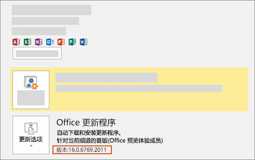

# 安装最新版本 Office

新开发人员功能（包括仍处于预览阶段的功能）会先向选择获取最新版 Office 的订阅者提供。

## 选择获取最新版Office

- 如果你是预览体验成员Microsoft 365 家庭版个人或大学订阅者，请参阅成为预览体验Office[会员](https://insider.office.com)。
- 如果你是客户，请参阅Microsoft 365 商业应用版[客户安装首次发布Microsoft 365 商业应用版版本](https://support.office.com/article/4dd8ba40-73c0-4468-b778-c7b744d03ead)。
- 如果在 Mac 上运行 Office：
  - 启动 Office 应用程序。
  - 选择“帮助”菜单上的“检查更新”。
  - 选中“Microsoft 自动更新”框，以加入 Office 预览体验成员计划。

## 获取最新版Office

1. 下载 [Office 部署工具](https://www.microsoft.com/download/details.aspx?id=49117)。
2. 运行该工具。这会提取以下两个文件：Setup.exe 和 configuration.xml。
3. 将 configuration.xml 文件替换为[首次发布配置文件](https://raw.githubusercontent.com/OfficeDev/Office-Add-in-Commands-Samples/master/Tools/FirstReleaseConfig/configuration.xml)。
4. 以管理员身份运行下面的命令：`setup.exe /configure configuration.xml`

> [!NOTE]
> 此命令可能需要运行很长时间才能完成，而且不会显示进度。

在安装进程完成后，你已安装最新的 Office 应用程序。 要验证你是否拥有最新版本，请从任何 Office 应用程序转到“文件” > “帐户”。 在“Office 更新”下，你将看到版本号上面的 (Office Insiders) 标签。

## Office JavaScript API 要求集对应的最低 Office 内部版本

- [Excel JavaScript API 要求集](../reference/requirement-sets/excel-api-requirement-sets.md)
- [OneNote JavaScript API 要求集](../reference/requirement-sets/onenote-api-requirement-sets.md)
- [Outlook JavaScript API 要求集](../reference/requirement-sets/outlook-api-requirement-sets.md)
- [PowerPoint JavaScript API 要求集](../reference/requirement-sets/powerpoint-api-requirement-sets.md)
- [Word JavaScript API 要求集](../reference/requirement-sets/word-api-requirement-sets.md)
- [对话框 API 要求集](../reference/requirement-sets/dialog-api-requirement-sets.md)
- [Office 通用 API 要求集](../reference/requirement-sets/office-add-in-requirement-sets.md)
